# 架构总览

[← 文档索引](README.md)

### 定位

Investment 是 **量化研究与模拟交易系统**（CLI + Web + 研究台），融合 **AI** 做意图理解、工具编排与结果解释：核心是信号评分、策略规则、回测与**模拟账户**；大模型不替代领域计算。  
**不是**持牌投资顾问产品；**现行定位 = 策略验证**（研究台 + 模拟账户），**不涉及真实账户交易、不代客下单**；模拟盈亏**不保证收益**。待策略验证成熟后再评估实盘（N6）。产品边界见 [design-spine · 产品边界](design-spine.md#产品边界现行)。

**产品核心设计主轴**（现行逻辑链 + **[产品北极星](design-spine.md#产品北极星)** + [能力地图](design-spine.md#能力地图六大模块)）见 **[design-spine.md](design-spine.md)**。下文控制论与工程分层是实现结构；产品叙事以设计主轴为准。运行时选型见 **[技术栈](#技术栈)**。

### 设计原则

1. **事实与结论分离**：价格、评分、财务字段只来自 Skill / `core` JSON；LLM 在事实之上组织解释与编排，不得编造数字。  
2. **工具即边界**：每个能力对应一个 `skills/<name>/` + `tool_config.json`，由 Function Calling 暴露。  
3. **可组合**：复杂问题靠多轮/多工具串联（如 `quote + kline + signal`），话术须与工具事实一致。  
4. **可降级**：日线失败时 `quote_fallback` / `depth=intraday_proxy`，且须在回复中标明「日线不完整」；港股基本面尽量给 PE/市值，失败则写清缺口。  
5. **深度分析模式**：问「分析 / 能否买入」时 prompts 要求多层结构（K 线/动能/相对强弱/基本面资讯/情景），篇幅放宽至约 700～1100 字。买入依据详见下文 **「判断是否买入的依据是什么」**。  
6. **风险披露**：提示词要求附带风险声明 + Agent 自动补 `DISCLAIMER`；禁止保证收益与代客下单。

### 控制论视角：感知–决策–执行–反馈闭环

剥离业务细节后，本系统可抽象为 **Agent 闭环**：感知外部状态 → 推理决策 → 调用工具执行 → 用结果反馈改进。  
工程上的「接入 / 编排 / Skill / 领域」分层是**实现结构**；下图是**控制论结构**——两者对照，不互相替代。

**抽象回路**

```text
Input (State) → Policy (Model) → Action (Tool) → Reward (Feedback) → Update (Learning)
```

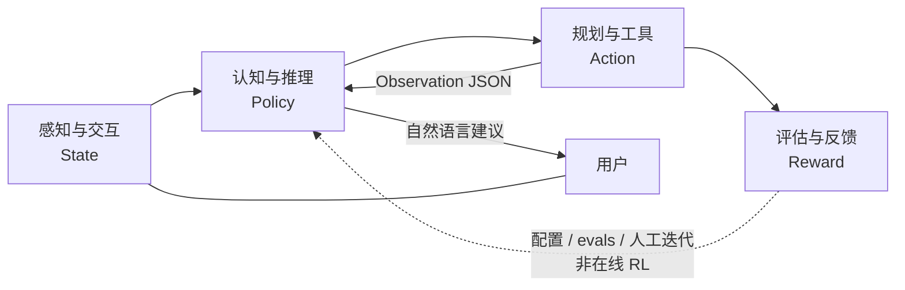

| 逻辑层 | 职责（抽象） | 本仓库落点 | 成熟度 |
|--------|--------------|------------|--------|
| **感知与交互** | 降低信息熵：自然语言 → 意图；行情/财报/资讯 → 可计算结构 | Web/CLI 接入；`skills/quote|fundamentals|news|…`；会话与右侧结果面板 | **强**：异构接入 + Skill JSON 标准化。弱：完整知识图谱、真多模态 |
| **认知与推理** | 高维模式映射：上下文、拆解子任务、解释策略与回测结果 | `agent/agent.py` · `prompts.py` · `llm_client.py` · 多轮 Function Calling | **强**：意图与编排。弱：显式长短期记忆库、可审计因果图 |
| **规划与工具** | 能力原子化：高层目标 → Skill 调用链 | `agent/registry` · `skills/*/tool_config.json` · Handler → `core/` / engine | **最扎实**：与原则「工具即边界」一致 |
| **评估与反馈** | 用结果校正策略：回测指标、仿真、回归校验 | `core/backtest` · 纸面账户 · `evals/` 黄金用例 · 量化报告 | **半闭环**：有仿真与 checklist；**不是**在线 RL 自动调权 |

**与工程分层的对照**

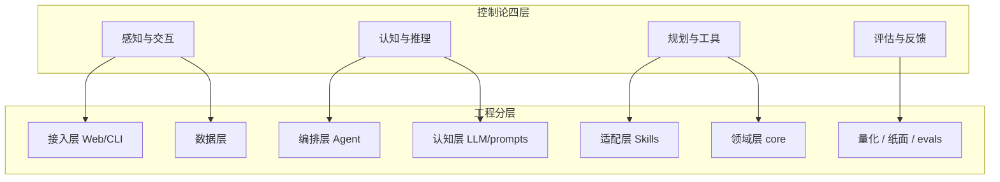

**本仓库特有的硬边界（迁移到其它垂直域时也应保留）**

1. **事实与建议分离**：价格、评分、财务等数字只来自 Skill / `core` JSON；LLM 只在事实之上组织建议，不得编造。  
2. **执行不含实盘下单**：Action 止于查询、规则建议、回测与纸面仿真；Reward 用于研究与产品迭代，不驱动自动成交。  
3. **Update 当前以人审为主**：改 `signal_config` / 规则 / prompts、跑 evals 与纸面，而不是把盈亏直接 backprop 进模型权重。  
   骨架 API 见路线图 **D1–D6**（`/api/jobs` · `/api/memory` · `/api/decisions` · `/api/feedback/suggest` · `/api/schedule/run` · `/api/orders/prefill`）。

该抽象同样适用于「数据分析 + 辅助决策」类垂直域（医疗、法律等）：换的是领域 Skill 与评估指标，闭环形态不变。实现扩展时优先新增原子工具与评估用例，而不是把逻辑堆进 Prompt。

### 产品视角：四层金字塔与决策链路

控制论四层回答「智能体如何闭环」；本节回答「**量化交易产品**如何分层、覆盖哪些能力、代码如何抽象」。与 [roadmap.md](roadmap.md) 的能力画像对照阅读：下文 **已落地** 表示仓库内可用，**规划中** 表示目标形态而非现状。

产品本质与模块级因果链（已发生 → 影响估计 → 验证 → 动作）见 **[design-spine · 因果链](design-spine.md#因果链已发生--影响估计--动作)**。

#### 1. 四层金字塔（数据 / 认知 / 决策 / 反馈）

数据、决策与执行解耦；自下而上为能力依赖方向。

```text
            ┌─────────────────────┐
            │  反馈进化层          │  回测·纸面·evals·（远期 RL）
            ├─────────────────────┤
            │  决策执行层          │  stance / 持仓规则 / 纸面·做 T（非实盘）
            ├─────────────────────┤
            │  认知推理层          │  LLM + Agent 编排 + 规则引擎
            ├─────────────────────┤
            │  数据感知层          │  Skills + AkShare / 行情 / 本地 JSON
            └─────────────────────┘
```

| 金字塔层 | 产品含义 | 与控制论 / 工程对照 | 本仓库现状 |
|----------|----------|---------------------|------------|
| **数据感知** | 眼睛与耳朵：行情、财务、宏观、资讯等接入与清洗 | 感知层；数据层 + Skills | **已落地**：日线/现货、基本面、资讯标题等。弱：Tick 全量、宏观全集、社交舆情、完整研报 |
| **认知推理** | 大脑：清洗、情感/事件理解、逻辑推演 | 认知层；LLM + prompts | **已落地**：NL 意图与策略结果解释。弱：显式「公司–行业–产业链」知识图谱 |
| **决策执行** | 中枢：策略 + 风控 → 交易倾向信号 | 规划层 + 领域 `stance` / `position` | **已落地**：买入/观望/减仓等**建议倾向**、纸面与模拟做 T。**不做**：对接券商实盘下单 |
| **反馈进化** | 自我迭代：结果回写策略 | 评估层 | **半闭环**：回测指标、纸面净值、黄金用例。弱：在线 RL 自动调参（概念见 [rl-layer.md](rl-layer.md)） |

#### 2. 核心功能模块（盘前 → 盘后）

| 模块 | 说明 | 状态 |
|------|------|------|
| 智能选股与筛选 | 自然语言多条件（如 ROE / 股价区间） | **已落地**（`screen` + Agent） |
| 市场搜索与资讯解读 | 公告/资讯检索与影响提炼 | **部分**：`news` 标题摘要；全文研报深度解读弱 |
| 财务数据深度解读 | 报表整合、多维对比 | **部分**：`fundamentals` / `peer`；三大报表完整 decodification 弱 |
| 实时行情与异动提醒 | 条件触发（涨幅、MACD 等）推送 | **规划中**（当前为问答拉取，非推送观察） |
| 智能复盘与归因 | 涨停逻辑、板块轮动、持仓归因 | **部分**：持仓建议 + 量化/纸面复盘；自动盘后归因弱 |

#### 3. 核心代码抽象（Memory · Tool · LLM · Agent）

面向对象落点（Python）：

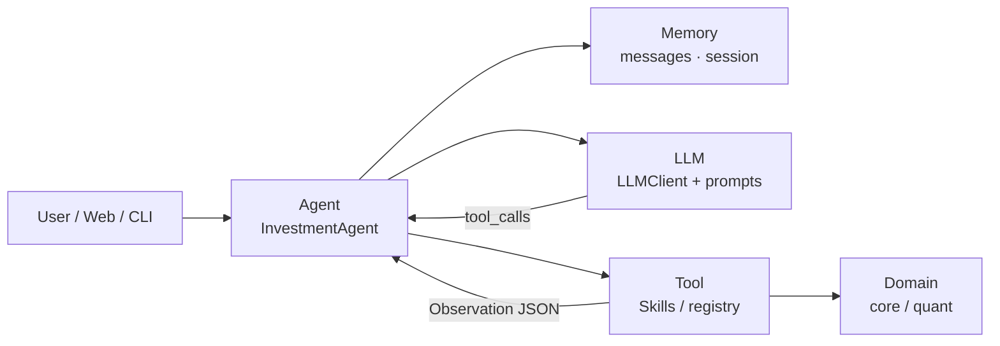

| 组件 | 职责 | 本仓库类 / 模块 |
|------|------|-----------------|
| **Memory** | 短期对话上下文；长期偏好（风格） | 短期：`messages` 多轮；会话 id（Web）。长期偏好：**弱**（多为配置文件，非独立 Memory 服务） |
| **Tool** | 外部能力原子化 | `skills/*/handler.py` + `tool_config.json`；量化门面 `quant/services` |
| **LLM** | 理解指令、选择工具、组织建议 | `agent/llm_client.py` · `prompts.py` |
| **Agent** | 编排感知–决策–执行循环 | `agent/agent.py`（多轮 FC，有轮次上限） |

#### 4. 对已选 n 只股票的决策链路

目标闭环（产品叙述）与实现边界：

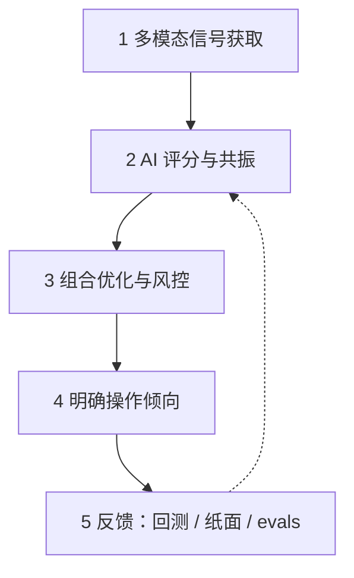

1. **感知**：量价 / 事件 / 资金流等信号。  
   - **已落地**：日线与现货、短线 `signal` 因子、资讯标题、部分资金相关字段（视数据源）。  
   - **规划中**：稳定 Tick 流、北向/主力资金全覆盖、事件 NLP 流水线。  
2. **认知评分**：多因子融合与交叉验证（技术 + 资金 + 舆情共振）。  
   - **已落地**：因子权重、横截面 TopK、stance 标签、LLM 综合叙述。  
3. **组合与风控**：仓位、单票/行业限额、动态止盈止损。  
   - **部分**：持仓规则与集中度提示、纸面调仓；ATR 自适应与完整三重风控引擎仍弱。  
4. **执行输出**：买入/卖出/加减仓/做 T 等**可理解指令**。  
   - **已落地**：自然语言建议 + 纸面/模拟做 T。  
   - **永不默认开通**：券商密码核验与资金划拨由官方 App 人工确认——见下节「非交易指令通道」。

#### 5. 开发落地与合规红线

与当前演进方式一致（详见 [roadmap.md](roadmap.md)）：

1. **从单点 Tool 做起**：先跑通单一 Skill（抓数 → JSON → 摘要），再挂上 Agent。  
2. **本地 Agent 串联**：对话驱动多工具工作流，而不是先上大而全中台。  
3. **非交易指令通道（强制）**：AI 只做语义识别、研究结论与订单**预填建议**；涉及真实交易时，跳转官方券商 App，由人工二次确认。本仓库现行定位为 **策略验证（量化研究 + 模拟账本 + AI 编排）**，**不代客下单**；实盘待验证成熟后另立项。

### 分层架构（工程实现）

```text
┌─────────────────────────────────────────────────────────┐
│  接入层    main.py / run_web.py / web/app.py + routers/  │
├─────────────────────────────────────────────────────────┤
│  服务层    services/* · quant/services（Mixin 门面）     │
├─────────────────────────────────────────────────────────┤
│  编排层    agent/agent.py · routing.py · registry    │
├─────────────────────────────────────────────────────────┤
│  认知层    llm_client.py + prompts.py                    │
├─────────────────────────────────────────────────────────┤
│  适配层    skills/*/handler.py（薄包装，委托 engine/core）│
├─────────────────────────────────────────────────────────┤
│  领域层    core/（facts · advise · stance · store · t0） │
├─────────────────────────────────────────────────────────┤
│  数据层    skills/common/ · AkShare · data/*.json        │
└─────────────────────────────────────────────────────────┘
```

## 技术栈

一句话：**Python 本地单体 + FastAPI Web + 原生前端 + 通义千问 Agent + JSON 落盘 + AkShare/腾讯行情**。面向策略验证（研究台 + 模拟账本）；AI 只编排与解释；刻意不做重型数仓与实盘中间件。

### 总览

| 层 | 选型 |
|----|------|
| **语言 / 运行时** | Python 3.9+（`pyproject.toml`：`>=3.10,<3.13`）；无 Node 构建管线 |
| **Web 后端** | FastAPI + Uvicorn；`httpx` / `requests` |
| **Web 前端** | 原生 HTML/CSS/JS（ES modules）；服务端拼页 `web/page_html.py` |
| **前端增强（CDN）** | Lightweight Charts · marked；局部 React 岛（非全站 SPA） |
| **AI** | 通义千问（DashScope，OpenAI 兼容 HTTP）；自研 `InvestmentAgent` + Skills |
| **行情 / 基本面** | 腾讯 qt（现价）· AkShare（日线/选股等）· pandas |
| **存储** | 本地 JSON / JSONL（无 SQLite / Redis）；见 [data-layer · 存储选型](data-layer.md#存储选型为何是-json何时才上数据库) |
| **量化主轴** | 组 OLS/Ridge β → **predicted_score（ŷ%）** 选股；`heuristic_score` / `signal_config.weights` 仅研究基线；ML 旁路见 `research/ml/` |
| **任务 / 运维** | 进程内 `POST /api/schedule/run` + shell cron / launchd；`unittest` + `evals` |
| **部署形态** | 单机本地（默认 `127.0.0.1:8000`）；暂不接实盘 OMS |

### 分层与代码落点

```text
接入     CLI (main.py) · Web (run_web.py → FastAPI web/app.py)
服务     services/* · quant/services
编排     agent/（LLM Function Calling，最多 5 轮）
领域     core/（信号 · 回测 · 纸面 · 风控 · store）
能力     skills/*（13 工具，薄 handler）
数据     DataService + AkShare/腾讯 + data/*.json
前端     web/static（vanilla + CDN 图表）
```

### Python 依赖（`requirements.txt`）

| 类别 | 包 |
|------|-----|
| **业务** | `requests` · `akshare` · `pandas` · `python-dotenv` |
| **Web** | `fastapi` · `uvicorn[standard]` · `httpx` |
| **LLM** | 无官方 SDK；`agent/llm_client.py` 直接 HTTP 调 DashScope（`DASHSCOPE_*`） |

**未默认安装**：SQLite ORM、React/Vite 工程、sklearn / torch（舆情或 ML 实验另装）、消息队列、Docker 编排。

### 前端细节

| 能力 | 实现 |
|------|------|
| 壳层 / 主路径 UI | Vanilla JS 分模块（`watching` / `paper` / `quant` …） |
| K 线 / 净值图 | TradingView **Lightweight Charts** 4.x（jsDelivr） |
| Markdown | **marked** |
| 大表 | 自研 `virtual_table.js`（可挂 React 岛根节点） |
| 实时推送 | FastAPI **WebSocket** `/ws/live` |
| **禁止项** | 全站 CRA / Ant Design Pro / 内嵌 Jupyter（见 [quant-ui-standard](quant-ui-standard.md)） |

### 数据与外部源

| 类型 | 技术 |
|------|------|
| 现价 | 腾讯行情 HTTP |
| 日线 / 选股 / 财务等 | AkShare（进程内锁串行，`skills.common.ak_lock`） |
| 账户 · 配置 · 缓存 · 流水 | `data/` 下 JSON / JSONL |
| 统一读口 | `core/data_service.py` |

### 测试与运维

| 项 | 入口 |
|----|------|
| 单测 | `python3 -m unittest discover -s tests -v` |
| 黄金路径 | `evals/run_checklist.py`（`--mock --presets` 与 CI 同款） |
| 本地 CI | `scripts/ci_quant.sh` |
| 日更 | `scripts/daily_*.sh` + cron / macOS launchd（[quant-ops](quant-ops.md)） |

安装与环境变量见 [getting-started.md](getting-started.md)；扩展 Skill / 限制见 [development.md](development.md)。

---

数据层五模块（采集 / 清洗 / 存储 / 服务 / 监控）与本仓库对照、演进约定见 **[data-layer.md](data-layer.md)**（含 [JSON vs 数据库选型](data-layer.md#存储选型为何是-json何时才上数据库)）。
策略层（选股择时 / 仓位 / 风控、输入输出、设计模板）见 **[strategy-layer.md](strategy-layer.md)**。  
风控模型（风险因子、Alpha×Risk、演进）见 **[risk-layer.md](risk-layer.md)**。  
强化学习视角（Policy/Reward ↔ 策略/风控；**未实现**在线 RL）见 **[rl-layer.md](rl-layer.md)**。  
舆情/另类数据（新闻→风险分；当前仅标题 Skill）见 **[sentiment-layer.md](sentiment-layer.md)**。

**P94 演进（非重写）**：`QuantService` 拆为 config/factors/portfolio/ops Mixin，门面类名与方法不变；Web 路由按域拆到 `web/routers/*`，URL 不变。历史 P 记录见 [quant-upgrade.md](archive/quant-upgrade.md)（归档）。

产品流程（观察 · 模拟 · 回溯；观察≠模拟）：见 [quant-ui.md](quant-ui.md)。路由：`/watching` `/follow` `/replay`（`/paper` `/strategy` `/quant` 等仍可用）。见 `action_map.py`、`GET /api/quant/actions` 与 [quant-concepts.md](quant-concepts.md)。

**入口边界**：观察页是唯一开仓入口（建仓前必过 `sync-paper/preview` 预演），模拟页只管已有仓位。凡「买什么、买多少」由规则决定的动作（按策略调仓）收进进阶区，并在持仓 `origin` 上标 `strategy` 与手动区分。

**命名约定**：产品对外统一称「模拟」/URL `/follow`；内部 canonical 仍为 `paper`（`paper.json`、`/api/paper`）。旧页 `/paper` 302 到 `/follow`。

**领域端口**：行情与信号经 `core/ports/` 进入账本；默认适配器由 `skills.ports_bind` 注入（`market.py` 不硬 import skills），单测可 `set_adapter` 替换。上层业务读数优先走 `core.data_service`。框架梳理见 [framework-review.md](framework-review.md)。

**成交成本**：`paper.cost_model` 为 `zero` 或 `simple_cn`。费率权威源为 **CostPort**（`core/backtest/cost_port.py`）：纸面 `paper_costs`、回测 `costs`、辅助 `TransactionCostCalculator` 同源；组合回测含成本为换手计费（`cost_mode=turnover`）。建仓预演、手动买卖与策略调仓共用纸面路径。

**依赖方向（自顶向下）**：接入 → 服务 → 编排 → 适配 → 领域 → 数据。  
`core/` 不 import Handler/LLM；行情经 ports；`advise` 经 `core.facts` 直接调 engine，避免 Handler JSON 往返。

### 分层架构（组件详图）

**图 1 — 系统组件与数据流**

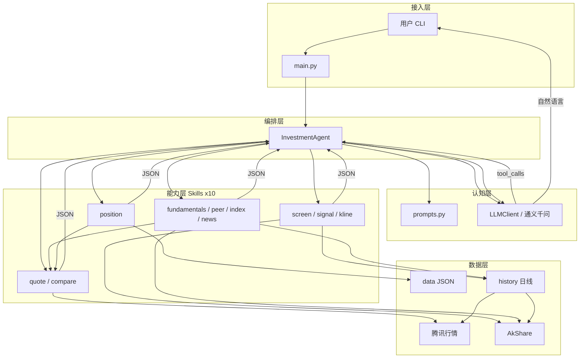

**图 2 — Agent 多轮调度（时序）**

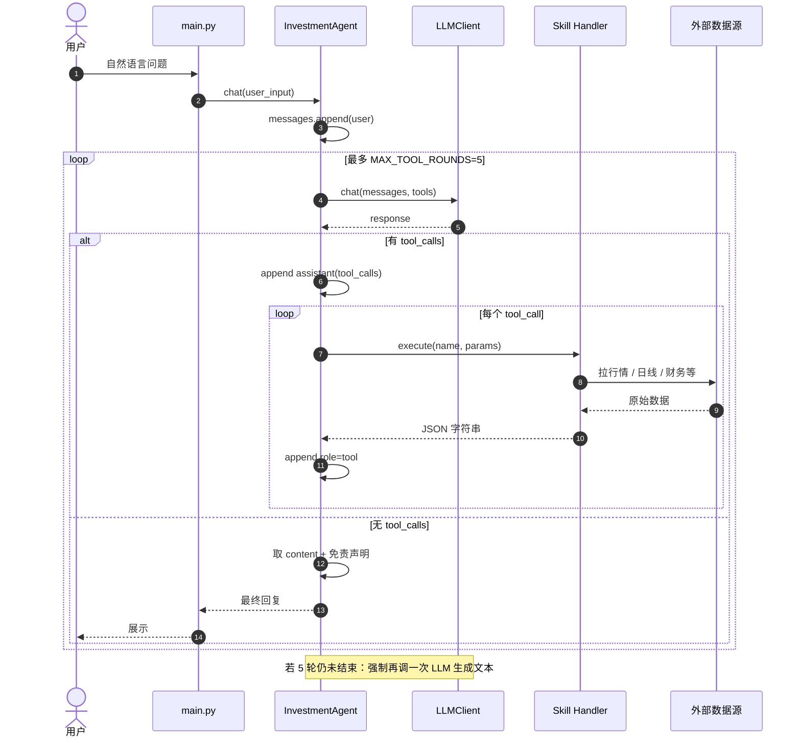

**图 3 — Skill 依赖与复用**

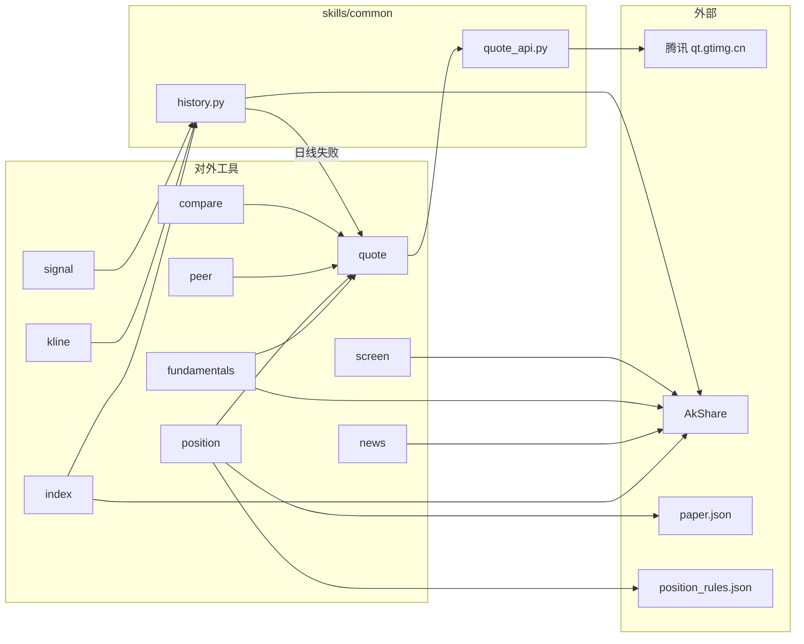

**图 4 — 典型工具链（意图 → Skills）**

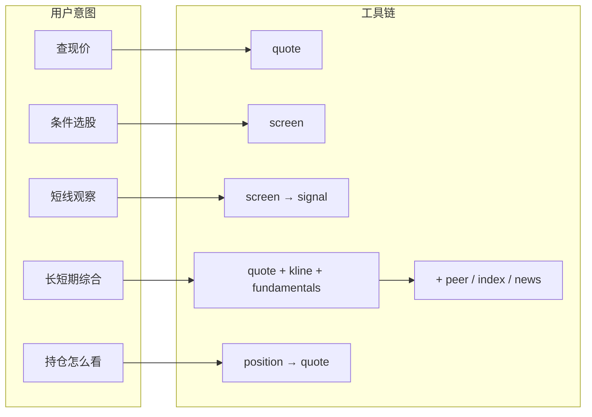

**图 5 — 单 Skill 内部结构**

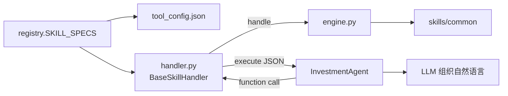

### 端到端请求生命周期

```text
1. main.py 加载 .env（dotenv 或内置解析）→ 构造 InvestmentAgent
2. 用户输入 append 到 messages（role=user）
3. LLM + 全部 tool_config → 返回 content 或 tool_calls
4. 若有 tool_calls：
     - 保留 assistant（含 tool_calls）
     - handlers[name].execute → JSON 字符串
     - append role=tool（带 tool_call_id）
     - 回到步骤 3（最多 MAX_TOOL_ROUNDS=5）
5. 无 tool_calls：取最终 content
6. _ensure_disclaimer 按需追加免责声明
7. 返回用户；reset 清空历史（保留 system）
```

### 执行链路示例

下面用三个问法把「谁调用谁」串起来。核心约定不变：**选工具与写话术是 LLM；数字只来自 Skill / `skills/common`。**

#### 例 1：单工具 —「茅台现价」

```text
用户 ──► main.py ──► InvestmentAgent.chat("茅台现价")
```

| 步 | 谁 | 做什么 |
|----|-----|--------|
| 0 | 启动时 | `registry` 加载 10 个 `tool_config` + 创建 handlers，并校验 |
| 1 | Agent | `messages` 追加 `role=user` |
| 2 | LLM | 带着全部 tools 看问题 → 决定调 `quote` |
| 3 | Agent | 解析出 `{"name":"quote","parameters":{"stock_code":"茅台"}}` |
| 4 | Handler | `QuoteHandler.execute` → `handle` → `StockAPI.query("茅台")` |
| 5 | common | 映射「茅台」→ `sh600519`，打腾讯行情，返回 dict |
| 6 | Agent | JSON 以 `role=tool` 写回 `messages` |
| 7 | LLM | 再读历史，写出自然语言（价格等数字来自 JSON） |
| 8 | Agent | 补免责声明 → 返回用户 |

代码路径：

```text
agent.chat
  → llm.chat(messages, tools)
  → handlers["quote"].execute(...)
      → BaseSkillHandler.execute
      → QuoteHandler.handle
      → skills.common.quote_api.StockAPI.query
  → llm.chat（无 tool_calls，出最终文本）
  → _ensure_disclaimer
```

一次典型的 `messages` 演变：

```text
[system] SYSTEM_PROMPT
[user] 茅台现价
[assistant] tool_calls: quote(stock_code=茅台)     ← LLM 第 1 轮
[tool] {"success":true,"price":"...","change":"...",...}
[assistant] 贵州茅台当前约 …（解读）              ← LLM 第 2 轮
           + 免责声明
```

#### 例 2：多工具 —「快手最近怎么看，长短期都说说」

LLM 常在一轮或两轮里串多个工具，例如：

```text
第 1 轮 LLM → tool_calls:
  quote(快手) + kline(快手) + signal([01024]) + fundamentals(快手)

第 2 轮 LLM → 无 tool_calls，综合 JSON 写回复
```

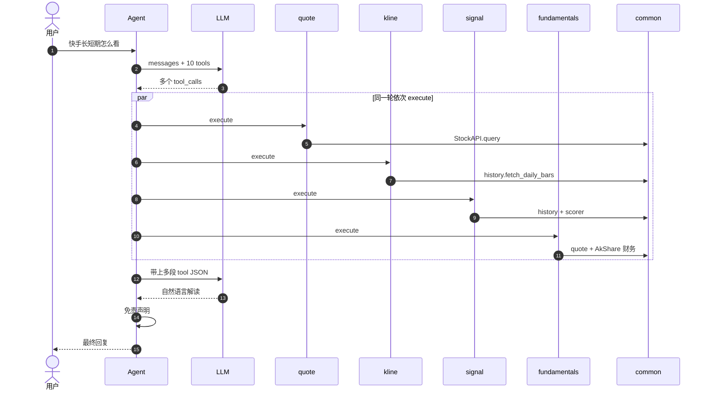

要点：

- **选工具的是 LLM**，不是关键词 if/else；由 `prompts` + `tool_config.description` 引导。
- **数字只出自 Skill / common**；LLM 组织「事实 → 观察 → 风险」。
- 同一轮可多个 `tool_calls`；若还要再查（如先 `screen` 再 `signal`），进入下一轮，最多 `MAX_TOOL_ROUNDS=5`。

#### 例 3：不走 Agent（路径 B，调试用）

只跑数据层，没有 LLM：

```bash
cd investment
python3 -c "from skills.quote.handler import QuoteHandler; print(QuoteHandler().execute({'parameters':{'stock_code':'茅台'}}))"
```

链路缩短为：

```text
脚本 → Handler.execute → handle → common/engine → JSON 打印
```

没有「选工具 / 写话术 / 免责声明」。完整对话请走路径 A：`python3 main.py`。

### 工具路由（谁决定调哪个 Skill）

**不是**关键词 if/else，而是：

| 要素 | 作用 |
|------|------|
| `tool_config.json` | 工具说明书（name/description/parameters） |
| `prompts.py` | 角色、路由偏好、用语与拒答边界 |
| LLM `tool_choice=auto` | 按用户语义选工具并填参 |

| 用户意图 | 典型工具链 |
|----------|------------|
| 查现价 | `quote` |
| 多票比价 | `compare` |
| 条件选股 | `screen` → 可选 `signal` |
| 短线观察 | `signal`（可先 `screen`） |
| K 线/阴线 | `kline`（常配 `quote`） |
| 长期/估值 | `fundamentals` + `kline`（可选 `peer`/`index`） |
| 同行 | `peer` |
| 相对大盘 | `index` |
| 新闻资讯 | `news` |
| 持仓怎么看 | `position`（文件或临时 `holdings`） |
| 综合长短期 | `quote` + `kline` + `fundamentals`（+ `signal`/`news`） |

### 接口设计

契约已落在代码：`agent/contracts.py`（Protocol + 基类）+ `agent/registry.py`（单一注册表 + 启动校验）。

#### 为何叫 `contracts.py`（而不是 `protocol.py`）

| 文件名 | 通常装什么 | 是否匹配现状 |
|--------|------------|--------------|
| `protocol.py` / `protocols.py` | 主要是 `typing.Protocol` | 不贴切：同文件还有 `BaseSkillHandler`、`dump_tool_result` |
| **`contracts.py`**（采用） | 跨层契约：接口 + 约定实现 + 序列化约定 | 匹配 |

说明：

- `SkillHandler(Protocol)` 只是契约的一部分；统一 `execute` → JSON 由 **`BaseSkillHandler`** 落实。
- 若命名为 `protocol.py`，容易误以为「只有类型协议、没有基类」。
- 若一定要强调 Protocol，更常见的是复数 `protocols.py`，且宜只放 Protocol，基类另拆——对当前体量属于过度拆分，故不采用。

结论：保持 `agent/contracts.py`；下文「接口 / 契约」均指此模块。

#### 总览

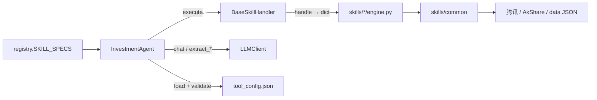

| 边界 | 代码位置 | 硬约束 |
|------|----------|--------|
| Skill Handler | `contracts.SkillHandler` + `BaseSkillHandler` | **硬**：启动 `isinstance` 校验；Agent 只调 `execute` |
| 注册表 | `registry.SKILL_SPECS` | **硬**：tools / handlers / `tool_config.name` 三者一致 |
| LLMClient | `llm_client.py` | Agent / main 依赖其方法表面 |
| InvestmentAgent | `chat` / `reset` | 对外入口 |
| 日线 / 行情 | `skills/common` | 字段约定 + 单测 |

#### 1. Skill Handler

```python
# agent/contracts.py
@runtime_checkable
class SkillHandler(Protocol):
    def execute(self, function_call: dict) -> str: ...

class BaseSkillHandler:
    def handle(self, params: dict) -> dict: ...
    def execute(self, function_call: dict) -> str:  # 统一 JSON + 异常包装
        ...
```

Agent 只调用：

```python
result: str = handler.execute({"name": tool_name, "parameters": params})
```

各 Skill：`class XxxHandler(BaseSkillHandler)`，实现 `handle`，设置 `error_prefix`。

#### 2. 单一注册表 + `tool_config.json`

```python
# agent/registry.py — 唯一事实源
SKILL_SPECS = (
    ("quote", QuoteHandler),
    ...
)
```

启动时 `load_tool_definitions()` + `validate_registry()`：

- 每个目录存在 `tool_config.json`，且 `config["name"] == 注册名`
- `handlers` / `tools` 集合与 `SKILL_SPECS` 一致
- 每个 handler 满足 `SkillHandler`（具备 `execute`）

#### 3. LLMClient（认知层表面）

实现：`agent/llm_client.py`。无接口类；Agent / `main.py` 依赖：

| 方法 | 用途 |
|------|------|
| `is_available() -> bool` | 启动探测 |
| `get_last_error() -> str \| None` | 失败原因（如模型 404） |
| `chat(messages, tools=None, enable_search=None) -> dict` | Chat Completions 原始响应（可带联网搜索） |
| `extract_function_calls(response) -> list` | 解析为 `[{id, name, parameters}, ...]` |
| `get_response_content(response) -> str` | 最终文本 |
| `get_assistant_message(response) -> dict` | 含 `tool_calls` 的 assistant 消息，原样写回历史 |

底层协议：`POST {DASHSCOPE_ENDPOINT}/chat/completions`（OpenAI 兼容，`tool_choice=auto`，可选 `enable_search`）。

#### 4. InvestmentAgent（编排入口）

| 方法 | 约定 |
|------|------|
| `chat(user_input: str) -> str` | 多轮 tool loop + 免责声明兜底后的自然语言 |
| `reset()` | 清空历史，保留 `system`（`SYSTEM_PROMPT`） |

内部状态：`messages`（OpenAI 风格）、`tools`、`handlers`。

#### 5. 数据形状约定（软合约）

**工具结果 JSON**（Handler 返回值反序列化后）：

| 字段 | 约定 |
|------|------|
| `success` | 布尔；失败时为 `false` |
| `error` | 失败原因；禁止静默成功 + 空数据 |
| `note` | 可选；含免责 / 数据源说明等 |
| 业务字段 | 各 Skill 自定义；数字须来自真实取数 |

**日线 bar**（`skills/common/history.py` → `normalize_bars`）：

```text
{date, open, high, low, close, volume}
```

`signal` / `kline` / `index` 复用此形状；日线失败时可 `quote_fallback`，结果中带 `data_source` 区分可信度。

**实时行情**（`skills.common.quote_api.StockAPI`）：

| 要点 | 说明 |
|------|------|
| `resolve_symbol(raw) -> symbol \| None` | 名称/代码 → 腾讯符号 |
| `query(stock_code) -> dict` | `success` + `price` / `change_*` / `price_raw` 等 |
| 缓存 | 同 symbol 约 60s |

**日线**（`skills.common.history` + `core/store.py`）：`normalize_bars` / `fetch_daily_bars`（24h 本地缓存） / `bars_from_quote_fallback`。完整数据层说明见 [data-layer.md](data-layer.md)。

#### 6. Skill 目录与扩展步骤

| 文件 | 职责 |
|------|------|
| `tool_config.json` | 暴露给 LLM 的函数定义 |
| `handler.py` | `BaseSkillHandler` 子类，实现 `handle` |
| `engine.py` | 领域逻辑（可单测 mock） |
| 共享能力 | 放 `skills/common/`，勿挂在某一 Skill 下 |

扩展时：

1. 新增 `skills/<name>/`（handler + engine + tool_config）  
2. 在 `registry.SKILL_SPECS` **只改一处**注册  
3. `prompts.py` 补路由说明  
4. `tests/` 离线单测（网络 mock）

#### 7. 刻意不做的抽象

- 不在 Agent 内做关键词硬路由（路由交给 LLM + tool_config）。  
- 不把「解读话术」做成 Skill（话术只在 LLM 侧）。  
- 不为数据源先上完整 Repository / 时序仓（MVP 以 `common` + `store` 足够）；选型与触发条件见 [data-layer · 存储选型](data-layer.md#存储选型为何是-json何时才上数据库)；演进见 [data-layer · 演进](data-layer.md#演进m1-路径内已收口--仍待)。

### 能力分层（13 个工具）

| 层 | 工具 | 说明 |
|----|------|------|
| 行情基础 | `quote` `compare` | 现价与横向价格对比 |
| 选股/短线/回测 | `screen` `signal` `kline` `backtest` | 筛选、因子分、K 线、signal 历史回测 |
| 研究台编排 | `quant` | 量化研究台门面（IC / 组合回测 / 报告等） |
| 买卖结论 | `advise` | 规则 stance（quote+signal+kline+peer/index → stance_label） |
| 中长期研究 | `fundamentals` `peer` `index` `news` | 估值财务、同行、超额、资讯 |
| 组合动作 | `position` | 本地/临时持仓 + 可配置规则 |

共享模块：`skills/common/history.py`、`skills/common/quote_api.py`；领域量化引擎：`core/`（`stance` `backtest` `paper` / `paper_cycle` `store`）；CLI 包装：`research/`；研究库：`quant/research/`。框架债务见 [framework-review.md](framework-review.md)。

### 关键模块职责

| 模块 | 职责 |
|------|------|
| `main.py` / `run_web.py` | 接入：CLI / Web 启动 |
| `services/*` | 会话、纸面账户等服务边界 |
| `core/*` | 领域：facts / advise / stance / store |
| `agent/routing.py` | 意图检测与 hint 注入 |
| `agent/registry.py` | Skill 注册（Handler 延迟加载） |
| `agent/agent.py` | 编排：tool loop、免责声明 |
| `agent/llm_client.py` | HTTP 调通义千问；解析 `tool_calls` |
| `agent/prompts.py` | 系统提示：角色、路由偏好、输出与合规边界 |
| `skills/*/handler.py` | 薄适配层 → engine / core |
| `skills/common/` | 跨工具行情 / 日线 I/O |
| `data/*.json` | 持仓、纸面、规则配置 |

### prompts.py 的用途

文件：[`agent/prompts.py`](../agent/prompts.py)。  
它**不取数、不算规则**，只定义「AI 如何服务量化工作流」——属于认知层的**行为说明书**。真正选哪个 Skill 仍由 LLM + `tool_config.json` 完成；`prompts` 负责约束角色、偏好路由、回复结构和合规红线。

#### 在链路中的位置

```text
InvestmentAgent 启动
  → messages = [{ role: system, content: SYSTEM_PROMPT }]   ← prompts 注入
  → 用户问题 / tool 结果不断 append
  → 每轮 llm.chat(messages, tools=...)
  → 最终回复若缺免责声明 → Agent 用 DISCLAIMER 兜底追加
```

`reset` 会清空对话，但**保留**这条 `system`（再次使用同一 `SYSTEM_PROMPT`）。

#### 导出内容

| 符号 | 用途 | 是否已被 Agent 使用 |
|------|------|---------------------|
| `SYSTEM_PROMPT` | 主系统提示：身份、工具清单、路由规则、输出结构、买入类问题必答节、拒答边界 | **是**（`messages[0]`） |
| `DISCLAIMER` | 「以上为量化研究与模拟结论，市场有风险，不保证收益，不代客下单。」 | **是**（`_ensure_disclaimer` 兜底；也写在 SYSTEM_PROMPT 里） |
| `ANALYSIS_HINT` | 解读类补充提示（事实→观察→风险） | 已定义，当前 Agent **未自动注入**（预留） |
| `SHORT_HORIZON_HINT` | 短线 1～3 天用语约束 | 已定义，当前 Agent **未自动注入**（预留） |

#### SYSTEM_PROMPT 解决什么问题

| 块 | 作用 |
|----|------|
| 角色定位 | **量化助手**：解释信号/策略结论与回测模拟结果，非持牌投顾 |
| 可用工具列表 | 与 `registry` 中 10 个 Skill 对齐的自然语言说明，辅助选工具 |
| 路由规则 | 软引导（如持仓→`position`；「是否可以买入」→至少 `quote+kline+signal`），**不是**代码 if/else |
| 输出要求 | 数字须来自工具；高信息密度；建议须与事实一致 |
| 「是否可以买入」必答节 | 「策略结论：是否买入」：规则结论 + 依据 + 失效条件 |
| 拒答边界 | 保证收益、代客下单、内幕/违法等 |

扩写策略时优先改 `SYSTEM_PROMPT` 的「信息密度」与路由，而不是加长客套话。

#### 与 `tool_config.json` 的分工

| | `prompts.py` | `tool_config.json` |
|--|--------------|---------------------|
| 粒度 | 全局行为（整次对话） | 单个工具的说明书（name/description/parameters） |
| 影响 | 怎么答、答到什么程度、合规 | 什么时候适合调这个工具、参数怎么填 |
| 修改时机 | 改话术策略、路由偏好、合规 | 新增/调整某个 Skill 的对外描述 |

扩 Skill 时：除注册 `registry` 外，通常还要在 `SYSTEM_PROMPT` 的「可用工具 / 路由规则」里补一行，否则模型可能不知道新工具的使用场景。

#### 和代码兜底的关系

- **模型侧**：`SYSTEM_PROMPT` 要求结尾自带免责声明、禁止荐股口吻。  
- **代码侧**：`InvestmentAgent._ensure_disclaimer` 在命中投资相关关键词且回复缺少 `DISCLAIMER` 时**强制追加**——双保险，不依赖模型每次都记得写。

### LLM 与配置

- 协议：`POST {DASHSCOPE_ENDPOINT}/chat/completions`（OpenAI 兼容）。
- 变量：`DASHSCOPE_API_KEY` / `DASHSCOPE_ENDPOINT` / `DASHSCOPE_MODEL`（默认 `qwen-plus`）；联网搜索见 `DASHSCOPE_ENABLE_SEARCH`。
- 迁移期仍可读旧变量 `DOUBAO_*`（不推荐）。
- 无 LLM 时：可直接 `import skills.*.handler` 测数据层（见下文示例）。

### Token 消耗统计

通义千问非流式响应通常带 `usage`（`prompt_tokens` / `completion_tokens` / `total_tokens`，部分模型还有 `reasoning_tokens`）。系统已接入会话级累计：

| 层级 | 说明 |
|------|------|
| `LLMClient._record_usage` | 每次 `chat()` 解析并累加到 `session_usage` |
| `InvestmentAgent.last_turn_usage` | **一轮用户问题**内全部 LLM 调用合计（含多轮 tool loop） |
| 每次回答正文末尾 | `chat()` 返回值自动附带本轮 + 会话累计（**不写入** `messages`，避免污染下一轮上下文） |
| CLI | 输入 `usage` / `tokens` 可再查；`reset` 清零 |

```text
（投顾正文…）

---
本轮 token：prompt=… completion=… total=… calls=2 ｜ 会话累计：…
```

`calls` 为该范围内 API 请求次数（一次问答常因 tool loop ≥ 2）。Skill 本地执行**不计** token。若响应无 `usage` 字段，计数为 0（不阻断对话）。

### 两种使用路径

| 路径 | 入口 | 需要 LLM | 产出 |
|------|------|----------|------|
| A. 完整 Agent | `python3 main.py` | 是 | 选工具 + 自然语言解读 |
| B. Skill 直调 | `python3 -c "from skills..."` | 否 | 仅 JSON 事实/规则结果 |

---

---

## 子目录 README 索引

各代码目录均有 `README.md` 说明职责与入口。Web 量化面板 **运维状态 → 浏览子目录 README** 可在线阅读；API：`GET /api/readme?dir=<路径>`。

| 目录 | README |
|------|--------|
| `agent/` | [agent/README.md](../agent/README.md) |
| `core/` | [core/README.md](../core/README.md) |
| `core/backtest/` | [core/backtest/README.md](../core/backtest/README.md) |
| `core/signal/` | [core/signal/README.md](../core/signal/README.md) |
| `core/signal/factors/` | [core/signal/factors/README.md](../core/signal/factors/README.md) |
| `data/` | [data/README.md](../data/README.md) |
| `data/reports/` | [data/reports/README.md](../data/reports/README.md) |
| `data/store/` | [data/store/README.md](../data/store/README.md) |
| `docs/` | [docs/README.md](../docs/README.md) |
| `evals/` | [evals/README.md](../evals/README.md) |
| `quant/` | [quant/README.md](../quant/README.md) |
| `quant/ops/` | [quant/ops/README.md](../quant/ops/README.md) |
| `quant/research/` | [quant/research/README.md](../quant/research/README.md) |
| `quant/services/` | [quant/services/README.md](../quant/services/README.md) |
| `quant/skill/` | [quant/skill/README.md](../quant/skill/README.md) |
| `research/` | [research/README.md](../research/README.md) |
| `scripts/` | [scripts/README.md](../scripts/README.md) |
| `scripts/launchd/` | [scripts/launchd/README.md](../scripts/launchd/README.md) |
| `services/` | [services/README.md](../services/README.md) |
| `skills/` | [skills/README.md](../skills/README.md) |
| `skills/advise/` | [skills/advise/README.md](../skills/advise/README.md) |
| `skills/backtest/` | [skills/backtest/README.md](../skills/backtest/README.md) |
| `skills/common/` | [skills/common/README.md](../skills/common/README.md) |
| `skills/compare/` | [skills/compare/README.md](../skills/compare/README.md) |
| `skills/fundamentals/` | [skills/fundamentals/README.md](../skills/fundamentals/README.md) |
| `skills/index/` | [skills/index/README.md](../skills/index/README.md) |
| `skills/kline/` | [skills/kline/README.md](../skills/kline/README.md) |
| `skills/news/` | [skills/news/README.md](../skills/news/README.md) |
| `skills/peer/` | [skills/peer/README.md](../skills/peer/README.md) |
| `skills/position/` | [skills/position/README.md](../skills/position/README.md) |
| `skills/quant/` | [skills/quant/README.md](../skills/quant/README.md) |
| `skills/quote/` | [skills/quote/README.md](../skills/quote/README.md) |
| `skills/screen/` | [skills/screen/README.md](../skills/screen/README.md) |
| `skills/signal/` | [skills/signal/README.md](../skills/signal/README.md) |
| `tests/` | [tests/README.md](../tests/README.md) |
| `web/` | [web/README.md](../web/README.md) |
| `web/static/` | [web/static/README.md](../web/static/README.md) |
