# 架构总览

[← 文档索引](README.md) · 架构图与命名约定见下文；目录结构见 [§ 代码目录结构](#代码目录结构)

### 定位

Investment 是 **量化研究与模拟交易系统**（CLI + Web + 研究台），融合 **AI** 做意图理解、工具编排与结果解释：核心是信号评分、策略规则、回测与**模拟账户**；大模型不替代领域计算。  
**不是**持牌投资顾问产品；**现行定位 = 策略验证**（研究台 + 模拟账户），**不涉及真实账户交易、不代客下单**；模拟盈亏**不保证收益**。待策略验证成熟后再评估实盘（N6）。产品边界见 [design-spine · 产品边界](design-spine.md#产品边界现行)。

**产品核心设计主轴**（现行逻辑链 + **[产品北极星](design-spine.md#产品北极星)** + [能力地图](design-spine.md#能力地图六大模块)）见 **[design-spine.md](design-spine.md)**。下文控制论与工程分层是实现结构；产品叙事以设计主轴为准。运行时选型见 **[技术栈](#技术栈)**。

### 设计原则

1. **事实与结论分离**：价格、评分、财务字段只来自 Skill / `core` JSON；LLM 在事实之上组织解释与编排，不得编造数字。  
2. **工具即边界**：每个能力对应一个 `skills/<name>/` + `tool_config.json`，由 Function Calling 暴露。  
3. **可组合**：复杂问题靠多轮/多工具串联（如 `quote + kline + signal`），话术须与工具事实一致。  
4. **可降级**：日线失败时 `quote_fallback` / `depth=intraday_proxy`，且须在回复中标明「日线不完整」；港股基本面尽量给 PE/市值，失败则写清缺口。  
5. **深度分析模式**：问「分析 / 能否买入」时 prompts 要求多层结构（K 线/动能/相对强弱/基本面资讯/情景），篇幅放宽至约 700～1100 字。买入依据详见下文 **「判断是否买入的依据是什么」**。  
6. **风险披露**：提示词要求附带风险声明 + Agent 自动补 `DISCLAIMER`；禁止保证收益与代客下单。

### 控制论视角：感知–决策–执行–反馈闭环

剥离业务细节后，本系统可抽象为 **Agent 闭环**：感知外部状态 → 推理决策 → 调用工具执行 → 用结果反馈改进。  
工程上的「接入 / 编排 / Skill / 领域」分层是**实现结构**；下图是**控制论结构**——两者对照，不互相替代。

**抽象回路**

```text
Input (State) → Policy (Model) → Action (Tool) → Reward (Feedback) → Update (Learning)
```

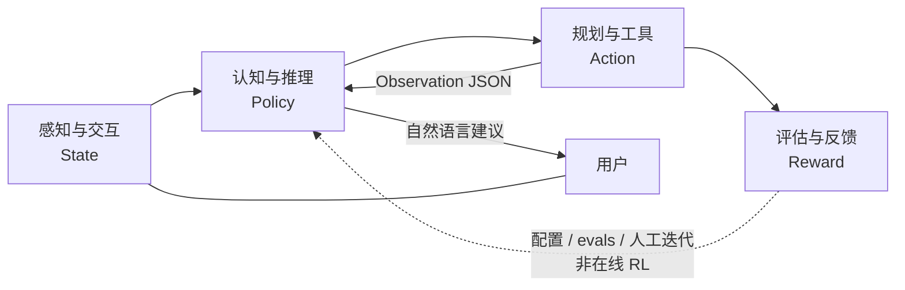

| 逻辑层 | 职责（抽象） | 本仓库落点 | 成熟度 |
|--------|--------------|------------|--------|
| **感知与交互** | 降低信息熵：自然语言 → 意图；行情/财报/资讯 → 可计算结构 | Web/CLI 接入；`skills/quote|fundamentals|news|…`；会话与右侧结果面板 | **强**：异构接入 + Skill JSON 标准化。弱：完整知识图谱、真多模态 |
| **认知与推理** | 高维模式映射：上下文、拆解子任务、解释策略与回测结果 | `agent/agent.py` · `prompts.py` · `llm_client.py` · 多轮 Function Calling | **强**：意图与编排。弱：显式长短期记忆库、可审计因果图 |
| **规划与工具** | 能力原子化：高层目标 → Skill 调用链 | `agent/registry` · `skills/*/tool_config.json` · Handler → `core/` / engine | **最扎实**：与原则「工具即边界」一致 |
| **评估与反馈** | 用结果校正策略：回测指标、仿真、回归校验 | `core/backtest` · 纸面账户 · `evals/` 黄金用例 · 量化报告 | **半闭环**：有仿真与 checklist；**不是**在线 RL 自动调权 |

**与工程分层的对照**

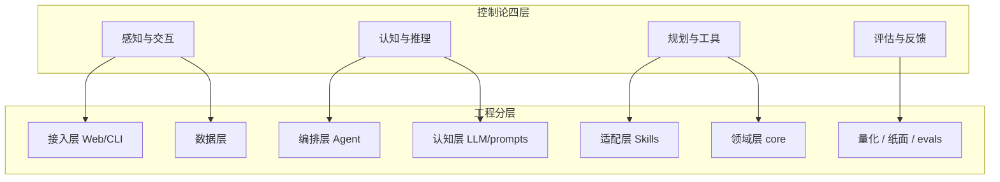

**本仓库特有的硬边界（迁移到其它垂直域时也应保留）**

1. **事实与建议分离**：价格、评分、财务等数字只来自 Skill / `core` JSON；LLM 只在事实之上组织建议，不得编造。  
2. **执行不含实盘下单**：Action 止于查询、规则建议、回测与纸面仿真；Reward 用于研究与产品迭代，不驱动自动成交。  
3. **Update 当前以人审为主**：改 `signal_config` / 规则 / prompts、跑 evals 与纸面，而不是把盈亏直接 backprop 进模型权重。  
   骨架 API 见路线图 **D1–D6**（`/api/jobs` · `/api/memory` · `/api/decisions` · `/api/feedback/suggest` · `/api/schedule/run` · `/api/orders/prefill`）。

该抽象同样适用于「数据分析 + 辅助决策」类垂直域（医疗、法律等）：换的是领域 Skill 与评估指标，闭环形态不变。实现扩展时优先新增原子工具与评估用例，而不是把逻辑堆进 Prompt。

### 产品视角：四层金字塔与决策链路

控制论四层回答「智能体如何闭环」；本节回答「**量化交易产品**如何分层、覆盖哪些能力、代码如何抽象」。与 [design-spine.md · 路线图](design-spine.md#能力评估与升级规划路线图视角) 的能力画像对照阅读：下文 **已落地** 表示仓库内可用，**规划中** 表示目标形态而非现状。

产品本质与模块级因果链（已发生 → 影响估计 → 验证 → 动作）见 **[design-spine · 因果链](design-spine.md#因果链已发生--影响估计--动作)**。

#### 1. 四层金字塔（数据 / 认知 / 决策 / 反馈）

数据、决策与执行解耦；自下而上为能力依赖方向。

```text
            ┌─────────────────────┐
            │  反馈进化层          │  回测·纸面·evals·（远期 RL）
            ├─────────────────────┤
            │  决策执行层          │  stance / 持仓规则 / 纸面·做 T（非实盘）
            ├─────────────────────┤
            │  认知推理层          │  LLM + Agent 编排 + 规则引擎
            ├─────────────────────┤
            │  数据感知层          │  Skills + AkShare / 行情 / 本地 JSON
            └─────────────────────┘
```

| 金字塔层 | 产品含义 | 与控制论 / 工程对照 | 本仓库现状 |
|----------|----------|---------------------|------------|
| **数据感知** | 眼睛与耳朵：行情、财务、宏观、资讯等接入与清洗 | 感知层；数据层 + Skills | **已落地**：日线/现货、基本面、资讯标题等。弱：Tick 全量、宏观全集、社交舆情、完整研报 |
| **认知推理** | 大脑：清洗、情感/事件理解、逻辑推演 | 认知层；LLM + prompts | **已落地**：NL 意图与策略结果解释。弱：显式「公司–行业–产业链」知识图谱 |
| **决策执行** | 中枢：策略 + 风控 → 交易倾向信号 | 规划层 + 领域 `stance` / `position` | **已落地**：买入/观望/减仓等**建议倾向**、纸面与模拟做 T。**不做**：对接券商实盘下单 |
| **反馈进化** | 自我迭代：结果回写策略 | 评估层 | **半闭环**：回测指标、纸面净值、黄金用例。弱：在线 RL 自动调参（概念见 [architecture.md · RL 视角](architecture.md#强化学习rl视角)） |

#### 2. 核心功能模块（盘前 → 盘后）

| 模块 | 说明 | 状态 |
|------|------|------|
| 智能选股与筛选 | 自然语言多条件（如 ROE / 股价区间） | **已落地**（`screen` + Agent） |
| 市场搜索与资讯解读 | 公告/资讯检索与影响提炼 | **部分**：`news` 标题摘要；全文研报深度解读弱 |
| 财务数据深度解读 | 报表整合、多维对比 | **部分**：`fundamentals` / `peer`；三大报表完整 decodification 弱 |
| 实时行情与异动提醒 | 条件触发（涨幅、MACD 等）推送 | **规划中**（当前为问答拉取，非推送观察） |
| 智能复盘与归因 | 涨停逻辑、板块轮动、持仓归因 | **部分**：持仓建议 + 量化/纸面复盘；自动盘后归因弱 |

#### 3. 核心代码抽象（Memory · Tool · LLM · Agent）

面向对象落点（Python）：

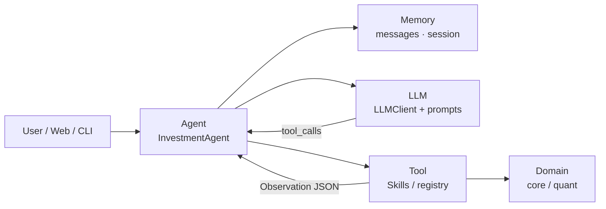

| 组件 | 职责 | 本仓库类 / 模块 |
|------|------|-----------------|
| **Memory** | 短期对话上下文；长期偏好（风格） | 短期：`messages` 多轮；会话 id（Web）。长期偏好：**弱**（多为配置文件，非独立 Memory 服务） |
| **Tool** | 外部能力原子化 | `skills/*/handler.py` + `tool_config.json`；量化门面 `quant/services` |
| **LLM** | 理解指令、选择工具、组织建议 | `agent/llm_client.py` · `prompts.py` |
| **Agent** | 编排感知–决策–执行循环 | `agent/agent.py`（多轮 FC，有轮次上限） |

#### 4. 对已选 n 只股票的决策链路

目标闭环（产品叙述）与实现边界：

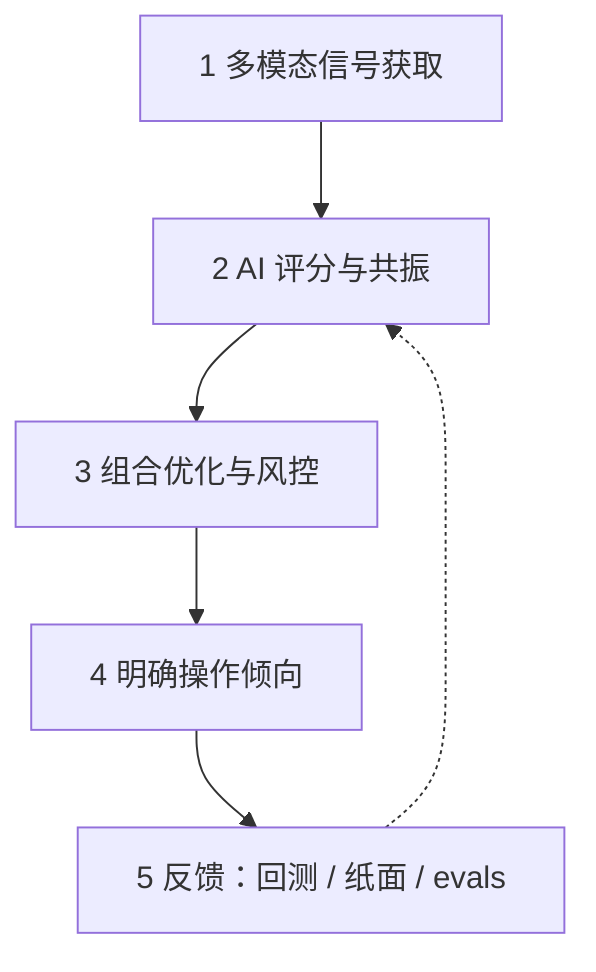

1. **感知**：量价 / 事件 / 资金流等信号。  
   - **已落地**：日线与现货、短线 `signal` 因子、资讯标题、部分资金相关字段（视数据源）。  
   - **规划中**：稳定 Tick 流、北向/主力资金全覆盖、事件 NLP 流水线。  
2. **认知评分**：多因子融合与交叉验证（技术 + 资金 + 舆情共振）。  
   - **已落地**：因子权重、横截面 TopK、stance 标签、LLM 综合叙述。  
3. **组合与风控**：仓位、单票/行业限额、动态止盈止损。  
   - **部分**：持仓规则与集中度提示、纸面调仓；ATR 自适应与完整三重风控引擎仍弱。  
4. **执行输出**：买入/卖出/加减仓/做 T 等**可理解指令**。  
   - **已落地**：自然语言建议 + 纸面/模拟做 T。  
   - **永不默认开通**：券商密码核验与资金划拨由官方 App 人工确认——见下节「非交易指令通道」。

#### 5. 开发落地与合规红线

与当前演进方式一致（详见 [design-spine.md · 路线图](design-spine.md#能力评估与升级规划路线图视角)）：

1. **从单点 Tool 做起**：先跑通单一 Skill（抓数 → JSON → 摘要），再挂上 Agent。  
2. **本地 Agent 串联**：对话驱动多工具工作流，而不是先上大而全中台。  
3. **非交易指令通道（强制）**：AI 只做语义识别、研究结论与订单**预填建议**；涉及真实交易时，跳转官方券商 App，由人工二次确认。本仓库现行定位为 **策略验证（量化研究 + 模拟账本 + AI 编排）**，**不代客下单**；实盘待验证成熟后另立项。

### 分层架构（工程实现）

```text
┌─────────────────────────────────────────────────────────┐
│  接入层    main.py / run_web.py / web/app.py + routers/  │
├─────────────────────────────────────────────────────────┤
│  应用服务  services/* · quant/services（Application Service）│
├─────────────────────────────────────────────────────────┤
│  编排层    agent/agent.py · routing.py · registry    │
├─────────────────────────────────────────────────────────┤
│  认知层    llm_client.py + prompts.py                    │
├─────────────────────────────────────────────────────────┤
│  适配层    skills/*/handler.py（薄包装，委托 engine/core）│
├─────────────────────────────────────────────────────────┤
│  领域层    core/（门面 DS·SS·BS + facts · paper · risk） │
├─────────────────────────────────────────────────────────┤
│  数据层    skills/common/ · AkShare · data/*.json        │
└─────────────────────────────────────────────────────────┘
```

### Service 命名约定

代码里大量 `*Service` **不是微服务**，而是分层里的**稳定入口**。口语与文档固定两套叫法，**文件名暂不 rename**（避免 patch 路径与 import 大面积抖动）。

| 叫法 | 代码落点 | 职责 | 典型入口 |
|------|----------|------|----------|
| **Application Service**（应用服务） | `services/*` · `quant/services/` | Web/CLI **用例组装**；编排多步业务、定 API 边界 | `PaperService` · `WatchingService` · `QuantService` |
| **Domain Facade**（领域门面） | `core/data/facade` · `signal_service` · `backtest_service` | **单一领域能力**的统一出口；委托 `core/data` · `signal` · `backtest` | DS · SS · BS（`get_bars` · `score_one` · `run_topk` 研究探针；产品回测走 `paper_replay`） |

**原则**

1. 只有「给 router / CLI / Agent 用的**用例入口**」在文档里称 **Application Service**。  
2. `core` 里的读口 / 打分 / 回测在文档里称 **Domain Facade**（口语 **DS / SS / BS**），与业务服务**不同层**。  
3. `QuantService` 是研究台 **Application Service**，向下调 DS/SS/BS，**不替代**领域门面。  
4. 纯函数、helpers、engine **不要**叫 Service。  
5. **新代码**：`services/` 与 `quant/services/` 可继续 `XxxService`；`core` 新门面优先包入口（`core.data` / `get_default_*()`），少再造并列 `XxxService` 文件名。

详见 [§ 代码目录结构](#代码目录结构) · [services/README.md](../services/README.md)。

## 技术栈

一句话：**Python 本地单体 + FastAPI Web + 原生前端 + 通义千问 Agent + JSON 落盘 + AkShare/腾讯行情**。面向策略验证（研究台 + 模拟账本）；AI 只编排与解释；刻意不做重型数仓与实盘中间件。

### 总览

| 层 | 选型 |
|----|------|
| **语言 / 运行时** | Python 3.9+（`pyproject.toml`：`>=3.10,<3.13`）；无 Node 构建管线 |
| **Web 后端** | FastAPI + Uvicorn；`httpx` / `requests` |
| **Web 前端** | 原生 HTML/CSS/JS（ES modules）；服务端拼页 `web/page_html.py` |
| **前端增强（CDN）** | Lightweight Charts · marked；局部 React 岛（非全站 SPA） |
| **AI** | 通义千问（DashScope，OpenAI 兼容 HTTP）；自研 `InvestmentAgent` + Skills |
| **行情 / 基本面** | 腾讯 qt（现价）· AkShare（日线/选股等）· pandas |
| **存储** | 配置/账本/流水：本地 JSON / JSONL；**日线/分钟线缓存**：默认 SQLite WAL（`INVESTMENT_BARS_BACKEND=sqlite\|json`）；见 [§ 数据层](#数据层data-layer) · 存储选型 · [§ SQLite 改造](#日分钟线缓存-sqlite-改造方案) · [§ 工程结构轨 A0–A4](#工程结构轨a0a4) |
| **量化主轴** | 组 OLS/Ridge β → **predicted_score（ŷ%）** 选股；`heuristic_score` / `signal_config.weights` 仅研究基线；ML 旁路见 `research/ml/` |
| **任务 / 运维** | 进程内 `POST /api/schedule/run` + shell cron / launchd；`unittest` + `evals` |
| **部署形态** | 单机本地（默认 `127.0.0.1:8000`）；暂不接实盘 OMS |

### 分层与代码落点

```text
接入     CLI (main.py) · Web (run_web.py → FastAPI web/app.py)
应用服务 services/* · quant/services（Application Service）
编排     agent/（LLM Function Calling，最多 5 轮）
领域门面 core/*_service（DS · SS · BS）→ core/（信号 · 回测 · 纸面 · 风控）
能力     skills/*（13 工具，薄 handler）
数据     DS + AkShare/腾讯 + data/*.json · bars.db
前端     web/static（vanilla + CDN 图表）
```

### Python 依赖（`requirements.txt`）

| 类别 | 包 |
|------|-----|
| **业务** | `requests` · `akshare` · `pandas` · `python-dotenv` |
| **Web** | `fastapi` · `uvicorn[standard]` · `httpx` |
| **LLM** | 无官方 SDK；`agent/llm_client.py` 直接 HTTP 调 DashScope（`DASHSCOPE_*`） |

**未默认安装**：SQLAlchemy 等 ORM、React/Vite 工程、sklearn / torch（舆情或 ML 实验另装）、消息队列、Docker 编排。日线/分钟线缓存用标准库 `sqlite3`（见 `core/store_bars_sqlite.py`）。

### 前端细节

| 能力 | 实现 |
|------|------|
| 壳层 / 主路径 UI | Vanilla JS 分模块（`watching` / `paper` / `quant` …） |
| K 线 / 净值图 | TradingView **Lightweight Charts** 4.x（jsDelivr） |
| Markdown | **marked** |
| 大表 | 自研 `virtual_table.js`（可挂 React 岛根节点） |
| 实时推送 | FastAPI **WebSocket** `/ws/live` |
| **禁止项** | 全站 CRA / Ant Design Pro / 内嵌 Jupyter（见 [quant-ui-standard](quant-ui.md#web-ui-标准研究台)） |

### 数据与外部源

| 类型 | 技术 |
|------|------|
| 现价 | 腾讯行情 HTTP |
| 日线 / 选股 / 财务等 | AkShare（进程内锁串行，`skills.common.ak_lock`） |
| 账户 · 配置 · 缓存 · 流水 | `data/` 下 JSON / JSONL |
| 统一读口 | `core/data/facade.py` |

### 测试与运维

| 项 | 入口 |
|----|------|
| 单测 | `python3 -m unittest discover -s tests -v` |
| 黄金路径 | `evals/run_checklist.py`（`--mock --presets` 与 CI 同款） |
| 本地 CI | `scripts/ci_quant.sh` |
| 日更 | `scripts/daily_*.sh` + cron / macOS launchd（[quant-ops](quant.md#量化运维)） |

安装与环境变量见 [development.md · 快速上手](development.md#快速上手)；扩展 Skill / 限制见 [development.md](development.md)。

---

数据层五模块（采集 / 清洗 / 存储 / 服务 / 监控）与本仓库对照、演进约定见 **[§ 数据层](#数据层data-layer)**（含 § 数据层 · 存储选型）。
策略层（选股择时 / 仓位 / 风控、输入输出、设计模板）见 **[architecture.md · 策略层](architecture.md#策略层)**。  
风控模型（风险因子、Alpha×Risk、演进）见 **[architecture.md · 风控层](architecture.md#风控层)**。  
强化学习视角（Policy/Reward ↔ 策略/风控；**未实现**在线 RL）见 **[architecture.md · RL 视角](architecture.md#强化学习rl视角)**。  
舆情/另类数据（新闻→风险分；当前仅标题 Skill）见 **[architecture.md · 舆情层](architecture.md#舆情层)**。

**P94 演进（非重写）**：`QuantService` 拆为 config/factors/portfolio/ops Mixin，门面类名与方法不变；Web 路由按域拆到 `web/routers/*`，URL 不变。历史 P 记录见 [quant-upgrade.md](archive/quant-upgrade.md)（归档）。

产品流程（观察 · 模拟 · 回溯；观察≠模拟）：见 [quant-ui.md](quant-ui.md)。路由：`/watching` `/follow` `/replay`（`/paper` `/strategy` `/quant` 等仍可用）。见 `action_map.py`、`GET /api/quant/actions` 与 [quant.md · 入门概念](quant.md#量化入门概念)。

**入口边界**：观察页是唯一开仓入口（建仓前必过 `sync-paper/preview` 预演），模拟页只管已有仓位。凡「买什么、买多少」由规则决定的动作（按策略调仓）收进进阶区，并在持仓 `origin` 上标 `strategy` 与手动区分。做 T 为 **overlay**，不改变「持有什么」的主线；见 [quant.md · 策略调仓 vs 底仓做 T](quant.md#策略调仓-vs-底仓做-t)。

**命名约定**：产品对外统一称「模拟」/URL `/follow`；内部 canonical 仍为 `paper`（`paper.json`、`/api/paper`）。旧页 `/paper` 302 到 `/follow`。

**领域端口**：行情与信号经 `core/ports/` 进入账本；默认适配器由 `skills.ports_bind` 注入（`market.py` 不硬 import skills），单测可 `set_adapter` 替换。上层业务读数优先走 `core.data.facade`。框架梳理见 [architecture.md · 框架梳理](architecture.md)。

**成交成本**：`paper.cost_model` 为 `zero` 或 `simple_cn`。费率权威源为 **CostPort**（`core/backtest/cost_port.py`）：纸面 `core/paper/costs`、回测 `costs`、辅助 `TransactionCostCalculator` 同源；组合回测含成本为换手计费（`cost_mode=turnover`）。建仓预演、手动买卖与策略调仓共用纸面路径。

**依赖方向（自顶向下）**：接入 → 服务 → 编排 → 适配 → 领域 → 数据。  
`core/` 不 import Handler/LLM；行情经 ports；`advise` 经 `core.facts` 直接调 engine，避免 Handler JSON 往返。

### 分层架构（组件详图）

**图 1 — 系统组件与数据流**

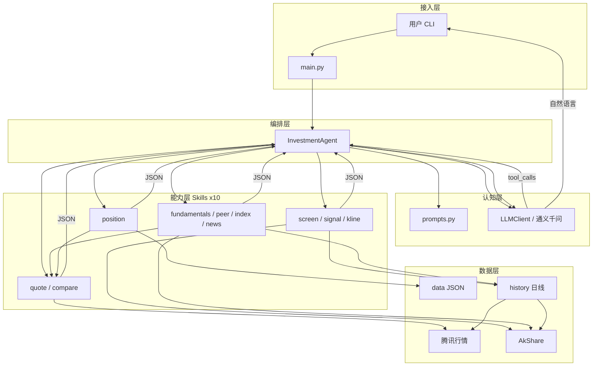

**图 2 — Agent 多轮调度（时序）**

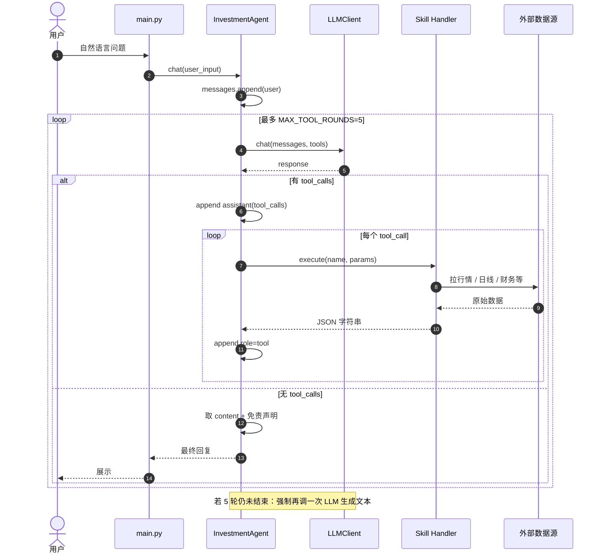

**图 3 — Skill 依赖与复用**

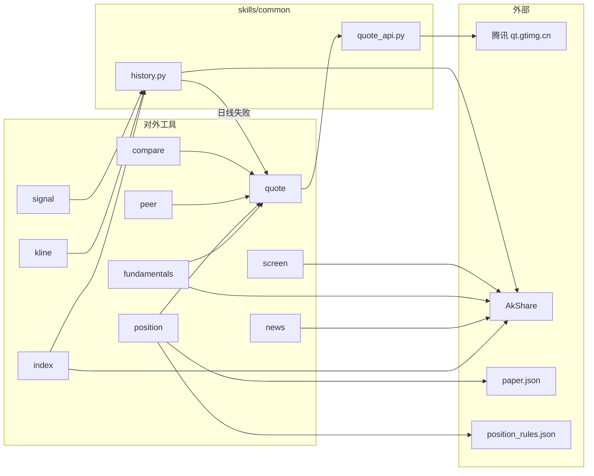

**图 4 — 典型工具链（意图 → Skills）**

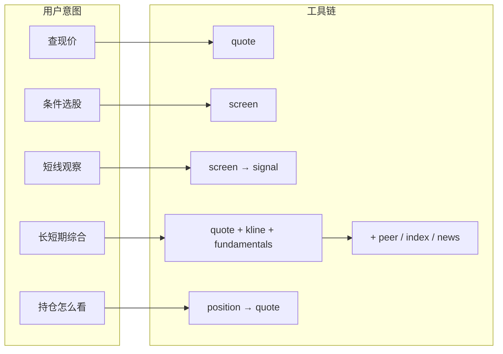

**图 5 — 单 Skill 内部结构**

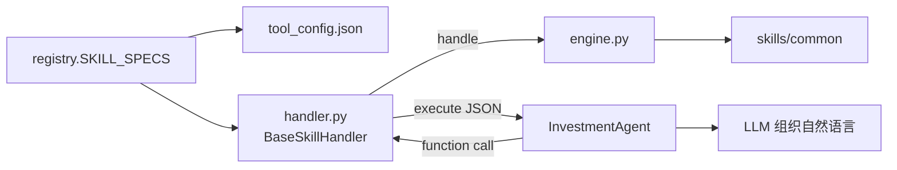

### 端到端请求生命周期

```text
1. main.py 加载 .env（dotenv 或内置解析）→ 构造 InvestmentAgent
2. 用户输入 append 到 messages（role=user）
3. LLM + 全部 tool_config → 返回 content 或 tool_calls
4. 若有 tool_calls：
     - 保留 assistant（含 tool_calls）
     - handlers[name].execute → JSON 字符串
     - append role=tool（带 tool_call_id）
     - 回到步骤 3（最多 MAX_TOOL_ROUNDS=5）
5. 无 tool_calls：取最终 content
6. _ensure_disclaimer 按需追加免责声明
7. 返回用户；reset 清空历史（保留 system）
```

### 执行链路示例

下面用三个问法把「谁调用谁」串起来。核心约定不变：**选工具与写话术是 LLM；数字只来自 Skill / `skills/common`。**

#### 例 1：单工具 —「茅台现价」

```text
用户 ──► main.py ──► InvestmentAgent.chat("茅台现价")
```

| 步 | 谁 | 做什么 |
|----|-----|--------|
| 0 | 启动时 | `registry` 加载 10 个 `tool_config` + 创建 handlers，并校验 |
| 1 | Agent | `messages` 追加 `role=user` |
| 2 | LLM | 带着全部 tools 看问题 → 决定调 `quote` |
| 3 | Agent | 解析出 `{"name":"quote","parameters":{"stock_code":"茅台"}}` |
| 4 | Handler | `QuoteHandler.execute` → `handle` → `StockAPI.query("茅台")` |
| 5 | common | 映射「茅台」→ `sh600519`，打腾讯行情，返回 dict |
| 6 | Agent | JSON 以 `role=tool` 写回 `messages` |
| 7 | LLM | 再读历史，写出自然语言（价格等数字来自 JSON） |
| 8 | Agent | 补免责声明 → 返回用户 |

代码路径：

```text
agent.chat
  → llm.chat(messages, tools)
  → handlers["quote"].execute(...)
      → BaseSkillHandler.execute
      → QuoteHandler.handle
      → skills.common.quote_api.StockAPI.query
  → llm.chat（无 tool_calls，出最终文本）
  → _ensure_disclaimer
```

一次典型的 `messages` 演变：

```text
[system] SYSTEM_PROMPT
[user] 茅台现价
[assistant] tool_calls: quote(stock_code=茅台)     ← LLM 第 1 轮
[tool] {"success":true,"price":"...","change":"...",...}
[assistant] 贵州茅台当前约 …（解读）              ← LLM 第 2 轮
           + 免责声明
```

#### 例 2：多工具 —「快手最近怎么看，长短期都说说」

LLM 常在一轮或两轮里串多个工具，例如：

```text
第 1 轮 LLM → tool_calls:
  quote(快手) + kline(快手) + signal([01024]) + fundamentals(快手)

第 2 轮 LLM → 无 tool_calls，综合 JSON 写回复
```

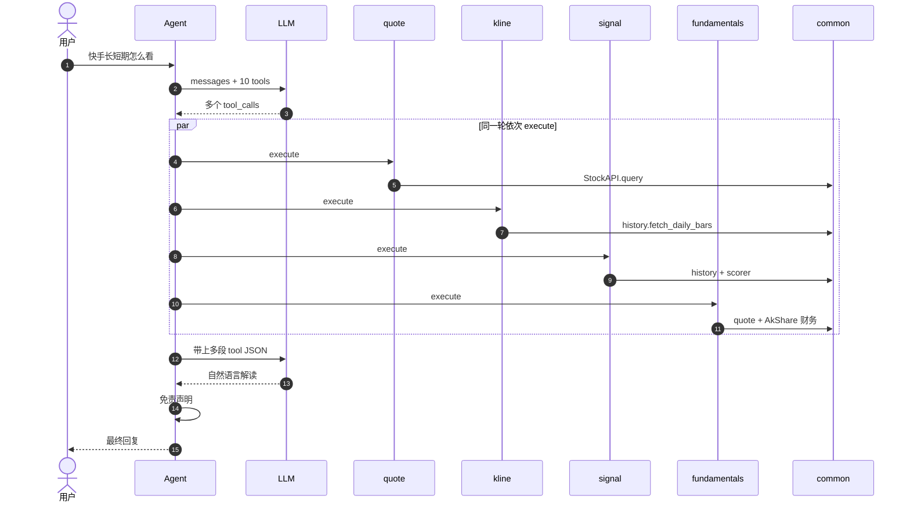

要点：

- **选工具的是 LLM**，不是关键词 if/else；由 `prompts` + `tool_config.description` 引导。
- **数字只出自 Skill / common**；LLM 组织「事实 → 观察 → 风险」。
- 同一轮可多个 `tool_calls`；若还要再查（如先 `screen` 再 `signal`），进入下一轮，最多 `MAX_TOOL_ROUNDS=5`。

#### 例 3：不走 Agent（路径 B，调试用）

只跑数据层，没有 LLM：

```bash
cd investment
python3 -c "from skills.quote.handler import QuoteHandler; print(QuoteHandler().execute({'parameters':{'stock_code':'茅台'}}))"
```

链路缩短为：

```text
脚本 → Handler.execute → handle → common/engine → JSON 打印
```

没有「选工具 / 写话术 / 免责声明」。完整对话请走路径 A：`python3 main.py`。

### 工具路由（谁决定调哪个 Skill）

**不是**关键词 if/else，而是：

| 要素 | 作用 |
|------|------|
| `tool_config.json` | 工具说明书（name/description/parameters） |
| `prompts.py` | 角色、路由偏好、用语与拒答边界 |
| LLM `tool_choice=auto` | 按用户语义选工具并填参 |

| 用户意图 | 典型工具链 |
|----------|------------|
| 查现价 | `quote` |
| 多票比价 | `compare` |
| 条件选股 | `screen` → 可选 `signal` |
| 短线观察 | `signal`（可先 `screen`） |
| K 线/阴线 | `kline`（常配 `quote`） |
| 长期/估值 | `fundamentals` + `kline`（可选 `peer`/`index`） |
| 同行 | `peer` |
| 相对大盘 | `index` |
| 新闻资讯 | `news` |
| 持仓怎么看 | `position`（文件或临时 `holdings`） |
| 综合长短期 | `quote` + `kline` + `fundamentals`（+ `signal`/`news`） |

### 接口设计

契约已落在代码：`agent/contracts.py`（Protocol + 基类）+ `agent/registry.py`（单一注册表 + 启动校验）。

#### 为何叫 `contracts.py`（而不是 `protocol.py`）

| 文件名 | 通常装什么 | 是否匹配现状 |
|--------|------------|--------------|
| `protocol.py` / `protocols.py` | 主要是 `typing.Protocol` | 不贴切：同文件还有 `BaseSkillHandler`、`dump_tool_result` |
| **`contracts.py`**（采用） | 跨层契约：接口 + 约定实现 + 序列化约定 | 匹配 |

说明：

- `SkillHandler(Protocol)` 只是契约的一部分；统一 `execute` → JSON 由 **`BaseSkillHandler`** 落实。
- 若命名为 `protocol.py`，容易误以为「只有类型协议、没有基类」。
- 若一定要强调 Protocol，更常见的是复数 `protocols.py`，且宜只放 Protocol，基类另拆——对当前体量属于过度拆分，故不采用。

结论：保持 `agent/contracts.py`；下文「接口 / 契约」均指此模块。

#### 总览

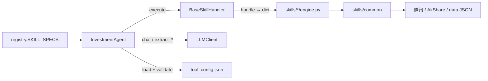

| 边界 | 代码位置 | 硬约束 |
|------|----------|--------|
| Skill Handler | `contracts.SkillHandler` + `BaseSkillHandler` | **硬**：启动 `isinstance` 校验；Agent 只调 `execute` |
| 注册表 | `registry.SKILL_SPECS` | **硬**：tools / handlers / `tool_config.name` 三者一致 |
| LLMClient | `llm_client.py` | Agent / main 依赖其方法表面 |
| InvestmentAgent | `chat` / `reset` | 对外入口 |
| 日线 / 行情 | `skills/common` | 字段约定 + 单测 |

#### 1. Skill Handler

```python
# agent/contracts.py
@runtime_checkable
class SkillHandler(Protocol):
    def execute(self, function_call: dict) -> str: ...

class BaseSkillHandler:
    def handle(self, params: dict) -> dict: ...
    def execute(self, function_call: dict) -> str:  # 统一 JSON + 异常包装
        ...
```

Agent 只调用：

```python
result: str = handler.execute({"name": tool_name, "parameters": params})
```

各 Skill：`class XxxHandler(BaseSkillHandler)`，实现 `handle`，设置 `error_prefix`。

#### 2. 单一注册表 + `tool_config.json`

```python
# agent/registry.py — 唯一事实源
SKILL_SPECS = (
    ("quote", QuoteHandler),
    ...
)
```

启动时 `load_tool_definitions()` + `validate_registry()`：

- 每个目录存在 `tool_config.json`，且 `config["name"] == 注册名`
- `handlers` / `tools` 集合与 `SKILL_SPECS` 一致
- 每个 handler 满足 `SkillHandler`（具备 `execute`）

#### 3. LLMClient（认知层表面）

实现：`agent/llm_client.py`。无接口类；Agent / `main.py` 依赖：

| 方法 | 用途 |
|------|------|
| `is_available() -> bool` | 启动探测 |
| `get_last_error() -> str \| None` | 失败原因（如模型 404） |
| `chat(messages, tools=None, enable_search=None) -> dict` | Chat Completions 原始响应（可带联网搜索） |
| `extract_function_calls(response) -> list` | 解析为 `[{id, name, parameters}, ...]` |
| `get_response_content(response) -> str` | 最终文本 |
| `get_assistant_message(response) -> dict` | 含 `tool_calls` 的 assistant 消息，原样写回历史 |

底层协议：`POST {DASHSCOPE_ENDPOINT}/chat/completions`（OpenAI 兼容，`tool_choice=auto`，可选 `enable_search`）。

#### 4. InvestmentAgent（编排入口）

| 方法 | 约定 |
|------|------|
| `chat(user_input: str) -> str` | 多轮 tool loop + 免责声明兜底后的自然语言 |
| `reset()` | 清空历史，保留 `system`（`SYSTEM_PROMPT`） |

内部状态：`messages`（OpenAI 风格）、`tools`、`handlers`。

#### 5. 数据形状约定（软合约）

**工具结果 JSON**（Handler 返回值反序列化后）：

| 字段 | 约定 |
|------|------|
| `success` | 布尔；失败时为 `false` |
| `error` | 失败原因；禁止静默成功 + 空数据 |
| `note` | 可选；含免责 / 数据源说明等 |
| 业务字段 | 各 Skill 自定义；数字须来自真实取数 |

**日线 bar**（`skills/common/history.py` → `normalize_bars`）：

```text
{date, open, high, low, close, volume}
```

`signal` / `kline` / `index` 复用此形状；日线失败时可 `quote_fallback`，结果中带 `data_source` 区分可信度。

**实时行情**（`skills.common.quote_api.StockAPI`）：

| 要点 | 说明 |
|------|------|
| `resolve_symbol(raw) -> symbol \| None` | 名称/代码 → 腾讯符号 |
| `query(stock_code) -> dict` | `success` + `price` / `change_*` / `price_raw` 等 |
| 缓存 | 同 symbol 约 60s |

**日线**（`skills.common.history` + `core/store.py`）：`normalize_bars` / `fetch_daily_bars`（24h 本地缓存） / `bars_from_quote_fallback`。完整数据层说明见 [§ 数据层](#数据层data-layer)。

#### 6. Skill 目录与扩展步骤

| 文件 | 职责 |
|------|------|
| `tool_config.json` | 暴露给 LLM 的函数定义 |
| `handler.py` | `BaseSkillHandler` 子类，实现 `handle` |
| `engine.py` | 领域逻辑（可单测 mock） |
| 共享能力 | 放 `skills/common/`，勿挂在某一 Skill 下 |

扩展时：

1. 新增 `skills/<name>/`（handler + engine + tool_config）  
2. 在 `registry.SKILL_SPECS` **只改一处**注册  
3. `prompts.py` 补路由说明  
4. `tests/` 离线单测（网络 mock）

#### 7. 刻意不做的抽象

- 不在 Agent 内做关键词硬路由（路由交给 LLM + tool_config）。  
- 不把「解读话术」做成 Skill（话术只在 LLM 侧）。  
- 不为数据源先上完整 Repository / 时序仓（MVP 以 `common` + `store` 足够）；选型与触发条件见 [§ 数据层](#数据层data-layer) · 存储选型；演进见 § 数据层 · 演进。

### 能力分层（13 个工具）

| 层 | 工具 | 说明 |
|----|------|------|
| 行情基础 | `quote` `compare` | 现价与横向价格对比 |
| 选股/短线/回测 | `screen` `signal` `kline` `backtest` | 筛选、因子分、K 线、signal 历史回测 |
| 研究台编排 | `quant` | 量化研究台门面（IC / 组合回测 / 报告等） |
| 买卖结论 | `advise` | 规则 stance（quote+signal+kline+peer/index → stance_label） |
| 中长期研究 | `fundamentals` `peer` `index` `news` | 估值财务、同行、超额、资讯 |
| 组合动作 | `position` | 本地/临时持仓 + 可配置规则 |

共享模块：`skills/common/history.py`、`skills/common/quote_api.py`；领域量化引擎：`core/`（`stance` `backtest` `paper` / `paper_cycle` `store`）；CLI 包装：`research/`；研究库：`quant/research/`。框架债务见 [architecture.md · 框架梳理](architecture.md)。

### 关键模块职责

| 模块 | 职责 |
|------|------|
| `main.py` / `run_web.py` | 接入：CLI / Web 启动 |
| `services/*` | 会话、纸面账户等服务边界 |
| `core/*` | 领域：facts / advise / stance / store |
| `agent/routing.py` | 意图检测与 hint 注入 |
| `agent/registry.py` | Skill 注册（Handler 延迟加载） |
| `agent/agent.py` | 编排：tool loop、免责声明 |
| `agent/llm_client.py` | HTTP 调通义千问；解析 `tool_calls` |
| `agent/prompts.py` | 系统提示：角色、路由偏好、输出与合规边界 |
| `skills/*/handler.py` | 薄适配层 → engine / core |
| `skills/common/` | 跨工具行情 / 日线 I/O |
| `data/*.json` | 持仓、纸面、规则配置 |

### prompts.py 的用途

文件：[`agent/prompts.py`](../agent/prompts.py)。  
它**不取数、不算规则**，只定义「AI 如何服务量化工作流」——属于认知层的**行为说明书**。真正选哪个 Skill 仍由 LLM + `tool_config.json` 完成；`prompts` 负责约束角色、偏好路由、回复结构和合规红线。

#### 在链路中的位置

```text
InvestmentAgent 启动
  → messages = [{ role: system, content: SYSTEM_PROMPT }]   ← prompts 注入
  → 用户问题 / tool 结果不断 append
  → 每轮 llm.chat(messages, tools=...)
  → 最终回复若缺免责声明 → Agent 用 DISCLAIMER 兜底追加
```

`reset` 会清空对话，但**保留**这条 `system`（再次使用同一 `SYSTEM_PROMPT`）。

#### 导出内容

| 符号 | 用途 | 是否已被 Agent 使用 |
|------|------|---------------------|
| `SYSTEM_PROMPT` | 主系统提示：身份、工具清单、路由规则、输出结构、买入类问题必答节、拒答边界 | **是**（`messages[0]`） |
| `DISCLAIMER` | 「以上为量化研究与模拟结论，市场有风险，不保证收益，不代客下单。」 | **是**（`_ensure_disclaimer` 兜底；也写在 SYSTEM_PROMPT 里） |
| `ANALYSIS_HINT` | 解读类补充提示（事实→观察→风险） | 已定义，当前 Agent **未自动注入**（预留） |
| `SHORT_HORIZON_HINT` | 短线 1～3 天用语约束 | 已定义，当前 Agent **未自动注入**（预留） |

#### SYSTEM_PROMPT 解决什么问题

| 块 | 作用 |
|----|------|
| 角色定位 | **量化助手**：解释信号/策略结论与回测模拟结果，非持牌投顾 |
| 可用工具列表 | 与 `registry` 中 10 个 Skill 对齐的自然语言说明，辅助选工具 |
| 路由规则 | 软引导（如持仓→`position`；「是否可以买入」→至少 `quote+kline+signal`），**不是**代码 if/else |
| 输出要求 | 数字须来自工具；高信息密度；建议须与事实一致 |
| 「是否可以买入」必答节 | 「策略结论：是否买入」：规则结论 + 依据 + 失效条件 |
| 拒答边界 | 保证收益、代客下单、内幕/违法等 |

扩写策略时优先改 `SYSTEM_PROMPT` 的「信息密度」与路由，而不是加长客套话。

#### 与 `tool_config.json` 的分工

| | `prompts.py` | `tool_config.json` |
|--|--------------|---------------------|
| 粒度 | 全局行为（整次对话） | 单个工具的说明书（name/description/parameters） |
| 影响 | 怎么答、答到什么程度、合规 | 什么时候适合调这个工具、参数怎么填 |
| 修改时机 | 改话术策略、路由偏好、合规 | 新增/调整某个 Skill 的对外描述 |

扩 Skill 时：除注册 `registry` 外，通常还要在 `SYSTEM_PROMPT` 的「可用工具 / 路由规则」里补一行，否则模型可能不知道新工具的使用场景。

#### 和代码兜底的关系

- **模型侧**：`SYSTEM_PROMPT` 要求结尾自带免责声明、禁止荐股口吻。  
- **代码侧**：`InvestmentAgent._ensure_disclaimer` 在命中投资相关关键词且回复缺少 `DISCLAIMER` 时**强制追加**——双保险，不依赖模型每次都记得写。

### LLM 与配置

- 协议：`POST {DASHSCOPE_ENDPOINT}/chat/completions`（OpenAI 兼容）。
- 变量：`DASHSCOPE_API_KEY` / `DASHSCOPE_ENDPOINT` / `DASHSCOPE_MODEL`（默认 `qwen-plus`）；联网搜索见 `DASHSCOPE_ENABLE_SEARCH`。
- 迁移期仍可读旧变量 `DOUBAO_*`（不推荐）。
- 无 LLM 时：可直接 `import skills.*.handler` 测数据层（见下文示例）。

### Token 消耗统计

通义千问非流式响应通常带 `usage`（`prompt_tokens` / `completion_tokens` / `total_tokens`，部分模型还有 `reasoning_tokens`）。系统已接入会话级累计：

| 层级 | 说明 |
|------|------|
| `LLMClient._record_usage` | 每次 `chat()` 解析并累加到 `session_usage` |
| `InvestmentAgent.last_turn_usage` | **一轮用户问题**内全部 LLM 调用合计（含多轮 tool loop） |
| 每次回答正文末尾 | `chat()` 返回值自动附带本轮 + 会话累计（**不写入** `messages`，避免污染下一轮上下文） |
| CLI | 输入 `usage` / `tokens` 可再查；`reset` 清零 |

```text
（投顾正文…）

---
本轮 token：prompt=… completion=… total=… calls=2 ｜ 会话累计：…
```

`calls` 为该范围内 API 请求次数（一次问答常因 tool loop ≥ 2）。Skill 本地执行**不计** token。若响应无 `usage` 字段，计数为 0（不阻断对话）。

### 两种使用路径

| 路径 | 入口 | 需要 LLM | 产出 |
|------|------|----------|------|
| A. 完整 Agent | `python3 main.py` | 是 | 选工具 + 自然语言解读 |
| B. Skill 直调 | `python3 -c "from skills..."` | 否 | 仅 JSON 事实/规则结果 |

---

---
---

## 系统架构图与模块全景（Mermaid）

[← 文档索引](README.md) · 产品主轴见 [design-spine.md](design-spine.md) · 命名约定见 [§ Service 命名约定](#service-命名约定) · 目录树见 [§ 代码目录结构](#代码目录结构)

**版本**：2026-08-22  
**定位**：本地 **策略验证** 单体（量化研究 + 模拟账本 + AI 编排）；不接实盘 OMS。

---

## 1. 系统定位

| 做 | 不做 |
|----|------|
| 观察名单、历史回测、纸面模拟买卖与调仓 | 真实券商下单、代客交易 |
| 用真实行情做研究与盯市 | 保证收益、持牌投顾 |
| AI 编排与解释（不改数字） | 微服务 / Redis / 全站 SPA |

**产品主路径**：观察 → 模拟（纸面）→ 回溯（研究台）。对外称「模拟」，内部 canonical 名 `paper`。

**因果主轴**（业务）：

```text
已发生事实 → 清洗门禁 → Alpha/Risk 估计 → 验证（回测·纸面）→ 动作 → 人审 promote
```

**工程主轴**（实现）：

```text
接入 → Application Service → Domain Facade（DS/SS/BS）→ core → 存储 / 外部源
旁路：Agent → Skills → 同上门面（LLM 只解释，不改 score/stance）
```

---

## 2. 架构图

### 2.1 业务逻辑框架

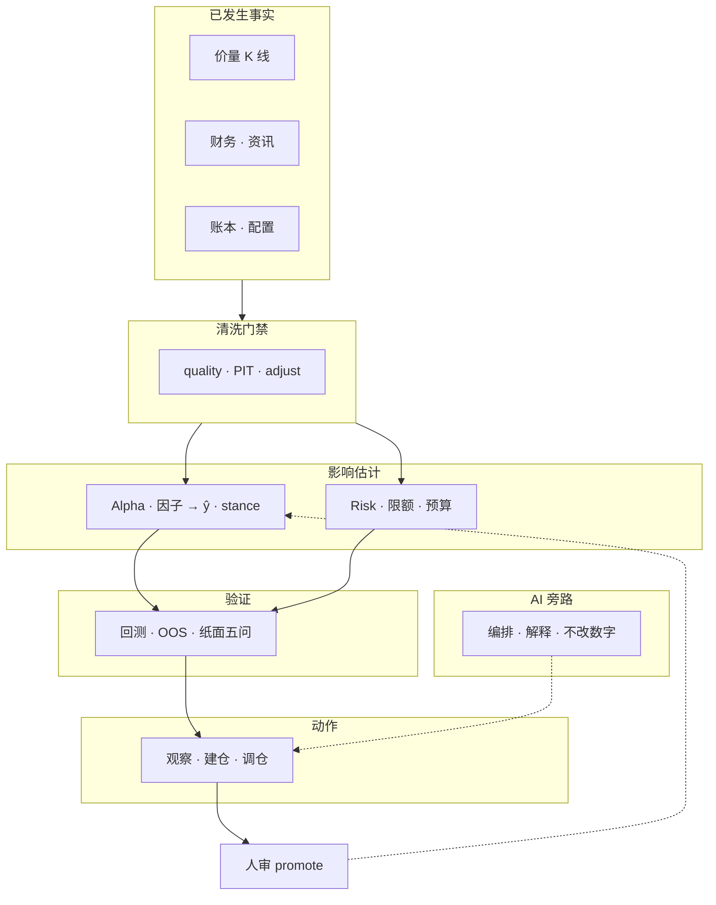

### 2.2 系统工程分层

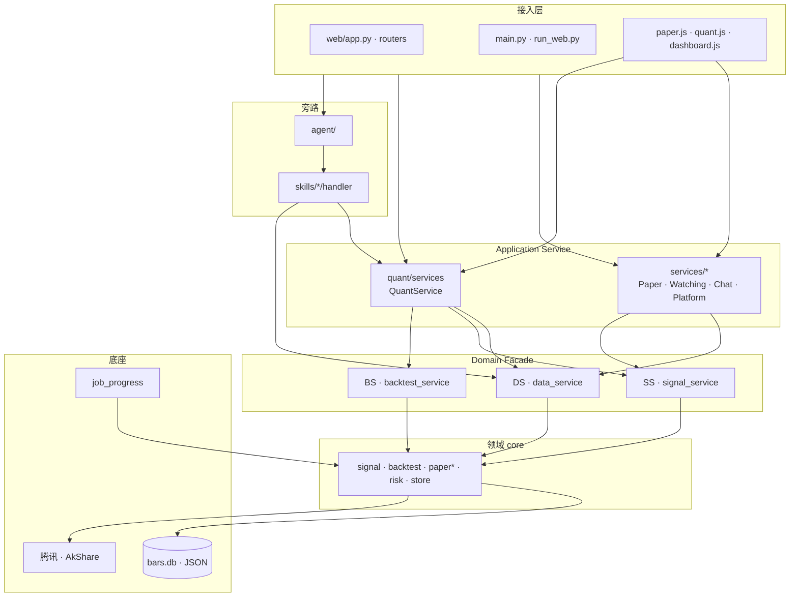

### 2.3 请求主路径

```text
① 纸面 / 观察
   UI → /api/paper|watching → PaperService / WatchingService
        → DS + SS + core.paper* → bars.db / paper.json

② 量化研究台
   UI → /api/quant/* → QuantService (Mixin)
        → DS / SS / BS + quant/research → Job 轮询

③ AI 对话
   Chat → Agent (FC≤5) → Skill handler → DS/SS/BS/QS
        → 自然语言解释（不改 score / stance_label）
```

### 2.4 两类 Service（命名）

| 文档叫法 | 代码落点 | 职责 |
|----------|----------|------|
| **Application Service** | `services/*` · `QuantService` | 用例组装；Web/CLI API 边界 |
| **Domain Facade** | `core/data/facade` · `signal_service` · `backtest_service` | DS 读 / SS 分 / BS 回测；单一领域出口 |

详见 [§ Service 命名约定](#service-命名约定)。

---

## 3. 分层模块说明与代码组成

### 3.1 接入层（Access）

**功能**：HTTP/CLI/WebSocket 入口；页面路由；静态资源；请求校验与依赖注入。

| 组件 | 路径 | 说明 |
|------|------|------|
| Web 应用 | `web/app.py` | FastAPI 主应用，挂载 routers |
| 启动 | `run_web.py` | Uvicorn 启动 |
| CLI | `main.py` | 命令行对话与研究入口 |
| 路由 | `web/routers/` | 按域拆分 API（见下表） |
| 页面拼装 | `web/page_html.py` | 服务端 HTML 模板 |
| 前端编排 | `web/static/js/` | 原生 JS 模块（无 Node 构建） |
| Schema | `web/schemas/` | Pydantic 请求/响应模型 |
| 依赖 | `web/deps.py` | 服务实例注入 |

**Routers 组成**：

| Router | 路径 | 主要 API 前缀 |
|--------|------|---------------|
| `meta` | `web/routers/meta.py` | 健康、版本、静态元数据 |
| `chat` | `web/routers/chat.py` | `/api/chat` 会话 |
| `paper` | `web/routers/paper.py` | `/api/paper` 模拟账本 |
| `watching` | `web/routers/watching.py` | `/api/watching` 观察池 |
| `strategy` | `web/routers/strategy.py` | 策略配置 |
| `daily` | `web/routers/daily.py` | `/api/daily` 日报编排 |
| `quant` | `web/routers/quant.py` | `/api/quant` 研究台主路由 |
| `quant_config` | `web/routers/quant_config.py` | 信号/策略配置 |
| `quant_research` | `web/routers/quant_research.py` | 因子/OLS/截面研究 |
| `quant_cluster` | `web/routers/quant_cluster.py` | 分组/簇池 |
| `quant_backtest` | `web/routers/quant_backtest.py` | TopK/组合回测 |
| `quant_score` | `web/routers/quant_score.py` | 打分预览 |
| `quant_dashboard` | `web/routers/quant_dashboard.py` | 研究台仪表盘 |
| `evals` | `web/routers/evals.py` | Golden eval |
| `platform` | `web/routers/platform.py` | Job/Memory/Decision 等平台 API |
| `live_ws` | `web/routers/live_ws.py` | WebSocket `/ws/live` |

**前端主模块**：

| 文件 | 职责 |
|------|------|
| `paper.js` | 模拟页总编排（子模块在 `paper/`） |
| `quant.js` | 研究台总编排（子模块在 `quant/`） |
| `dashboard.js` + `dashboard_api.js` | 首页仪表盘 |
| `ai_drawer.js` | ⌘K 对话抽屉 |
| `watching_table_island.js` | 观察池表格岛 |
| `api_client.js` | 统一 fetch 封装 |
| `live_ws.js` | 实时推送 |

---

### 3.2 Application Service 层

**功能**：把多个领域能力组装成**产品用例**；对上稳定 API，对下调 Domain Facade 与 core。

#### `services/` — 产品闭环

| 模块 | 路径 | 功能 |
|------|------|------|
| PaperService | `paper_service.py` + `paper_account.py` / `paper_jobs.py` / `paper_trades.py` / `paper_helpers.py` | 纸面账户、买卖、调仓 Job、策略晋升 |
| WatchingService | `watching_service.py` | 观察名单 CRUD、建仓入口 |
| ChatService | `chat_service.py` | Web/CLI 会话、Agent 调用 |
| DailyService | `daily_service.py` | 每日任务（纸面 + eval + 量化） |
| EvalService | `eval_service.py` | Golden eval 运行 |
| PlatformService | `platform_service.py` | Job / Memory / Decision / Feedback / Schedule / Prefill |
| position_stance | `position_stance.py` | 持仓 stance 摘要 |

#### `quant/services/` — 研究台

| 模块 | 路径 | 功能 |
|------|------|------|
| QuantService | `quant_service.py` | Mixin 门面入口 |
| Config | `quant_service_config.py` | 策略/信号配置列表 |
| Follow | `quant_service_follow.py` | ① 模拟（T0 研究；执行归 PaperService） |
| Replay | `quant_service_replay.py` | ② 回溯（paper_replay / rank_lots） |
| Compare | `quant_service_compare.py` | ③ 持仓联动摘要 |
| Factors | `quant_service_factors.py` | 因子面板、IC、OLS、截面 |
| Ops | `quant_service_ops.py` | 日报、导出、解读、watching 运维 |
| Portfolio | `quant_service_portfolio.py` | 组合回溯兼容入口 |
| 报告 | `quant_report_export.py` · `quant_report_index.py` · `quant_interpret.py` | Markdown/HTML 导出、归档、LLM 解读 |
| 桥接 | `portfolio_quant_bridge.py` · `signal_config_preview.py` · `action_map.py` | 持仓↔量化联动、配置 diff 预览、动作映射 |

---

### 3.3 Agent 与 Skills（旁路）

**功能**：自然语言意图 → 选工具 → 调 handler → 拿 JSON 事实 → LLM 组织话术。**不得改写** `score` / `stance_label`。

#### `agent/`

| 模块 | 路径 | 功能 |
|------|------|------|
| Agent | `agent.py` | 多轮 Function Calling（≤5 轮） |
| LLM | `llm_client.py` | 通义千问 HTTP 客户端 |
| Prompts | `prompts.py` | 系统提示、免责声明 |
| Registry | `registry.py` | 工具注册与 handler 查找 |
| Routing | `routing.py` | 参数准备、结果 enrich |
| Contracts | `contracts.py` | SkillHandler 协议 |

#### `skills/` — 13 个 Agent 工具

| Skill | 路径 | 功能 |
|-------|------|------|
| quote | `skills/quote/` | 实时行情（腾讯 qt） |
| compare | `skills/compare/` | 多股对比 |
| screen | `skills/screen/` | A 股条件选股 |
| signal | `skills/signal/` | 短线观察池打分 |
| backtest | `skills/backtest/` | 信号规则回测 |
| quant | `skills/quant/` | 量化研究台（委托 QuantService） |
| kline | `skills/kline/` | 日 K 形态 |
| fundamentals | `skills/fundamentals/` | 基本面 |
| news | `skills/news/` | 资讯标题 |
| advise | `skills/advise/` | 买卖倾向建议 |
| position | `skills/position/` | 持仓查询 |
| peer | `skills/peer/` | 同业对比 |
| index | `skills/index/` | 指数行情 |

**支撑模块**：

| 模块 | 路径 | 功能 |
|------|------|------|
| ports_bind | `skills/ports_bind.py` | 行情/信号适配器注入 core.ports |
| common | `skills/common/` | `quote_api` · `history` · AkShare 锁 |
| 引擎（非 FC 工具） | `macro/` · `announcement/` · `market_sentiment/` | 宏观/公告/情绪，供 core 或研究调用 |

---

### 3.4 Domain Facade 层（DS / SS / BS）

**功能**：领域能力的**唯一对外出口**；封装质量门禁、信封类型、生产/研究双轨。

| 门面 | 模块路径 | 实现包 | 主要 API |
|------|----------|--------|----------|
| **DS** | `core/data/facade.py` | `core/data/` | `get_quote` · `get_bars` · `bars_and_source` · `summarize_data_quality` |
| **SS** | `core/signal_service.py` | `core/signal/` | `score_one` · `rank_cross_section` · `rank_cluster_pools` |
| **BS** | `core/backtest_service.py` | `core/backtest/` | `run_topk`（研究探针，≠ 产品 `/replay`） · `run_signal_backtest` |

**端口与绑定**：

```text
DS → core/ports/market.py → skills/ports_bind.py → skills/common/
SS → core/signal/service.py → scorer · factors · config · gate
BS → core/backtest/service.py → engine · topk_backtest · topk_weights
```

---

### 3.5 领域层 `core/`

**功能**：确定性业务逻辑；**无 LLM、无 HTTP Handler**。live / 回测 / 纸面共用同一套规则。

#### 信号与打分 `core/signal/`

| 子模块 | 功能 |
|--------|------|
| `service.py` | SignalService 实现 |
| `scorer.py` · `score_stock.py` | 单票打分主路径 |
| `factors/` | 单因子 `score_*` 实现 |
| `factors/meta/` | 注册表、面板、IC/相关、健康、分类、系数、共线、风险归因 |
| `config.py` | `signal_config` 读写 |
| `gate.py` | ŷ 生产门禁、scale 推断 |
| `cross_section_batch.py` | 截面批量 |
| `cluster/` | 分组 live：晋升/指针、排名、OOS 标签、健康、审计、证据、Job 水合 |
| `dual_score/` | 双层 ŷ：融合、解析、τ/ON 头、簿字段、影子簿、人审配置 |

#### 回测 `core/backtest/`

| 子模块 | 功能 |
|--------|------|
| `service.py` | BacktestService 实现 |
| `engine.py` | 单票 signal 回测 |
| `paper_replay.py` | 产品历史回测（rank_lots；含分票贡献） |
| `topk_backtest.py` | TopK 等权/加权回测（研究探针，≠ `/replay`） |
| `topk_weights.py` | 权重计算（按用例拆分） |
| `matching.py` | 成交撮合规则 |
| `strategies/` | 策略模板 |

#### 纸面模拟 `core/paper/`

| 模块 | 职责 |
|------|------|
| `ledger.py` | 账本 CRUD、锁、快照、操作日志 |
| `exec.py` · `cycle.py` | 盯市、买卖、日循环 |
| `costs.py` · `sizing.py` | 费用、手数 |
| `rebalance/` | 调仓编排、匹配、门禁、预取 |

#### 市场 `core/market/`

| 模块 | 职责 |
|------|------|
| `symbols.py` | A/H/US 代码解析 |
| `calendar.py` | 交易日历、停牌过滤 |
| `context.py` · `context_store.py` · `context_merge.py` | 宏观/情绪上下文 |
| `sentiment_prior.py` · `prior_policy.py` | 情绪 prior、买卖门禁 |

#### 打分账本 `core/score_ledger/`

| 模块 | 职责 |
|------|------|
| `__init__.py` | 对外门面（冻结 / 回填 / 复盘） |
| `asof.py` · `freeze.py` · `io.py` | 决策日、冻结闸（盘中自动跳过）、读写 |
| `outcomes.py` · `review.py` · `series.py` | realized 回填、复盘报告、序列 |

**冻结闸**：刷簿附带冻结（`auto=True`）仅在**会话收盘后**写账本；盘中刷新分池簿不覆盖复盘快照。显式冻结历史 `as_of` 仍可随时重建。做 T 选向默认即时算分，不读账本。

#### 风控 `core/risk/`

| 模块 | 功能 |
|------|------|
| `checks.py` | 调仓前门禁 |
| `budget.py` · `exposure.py` | 风险预算与敞口 |

#### 观察与策略

| 模块 | 功能 |
|------|------|
| `core/watching/` | 观察池存储、健康检查、洞察缓存 |
| `stance.py` · `advise.py` · `position.py` | 倾向与建议 |
| `strategy.py` · `strategy_monitor.py` | 策略定义与监控 |
| `north_star.py` · `north_star_pro.py` | 北极星指标 |

#### 数据与存储

| 模块 | 功能 |
|------|------|
| `store.py` | 缓存读写；`INVESTMENT_BARS_BACKEND=sqlite\|json` |
| `store_bars_sqlite.py` | 日线/分钟线 SQLite WAL |
| `data/service.py` · `data/gate.py` | MarketDataService 与质量门禁 |
| `pit.py` · `coverage.py` · `quality_center.py` | PIT、覆盖率、质量中心 |
| `paths.py` · `env.py` | 路径与环境变量 |

#### 平台与运行时

| 模块 | 功能 |
|------|------|
| `job_progress.py` | 统一 Job 槽（paper · ols · chat · …） |
| `schedule_jobs.py` | 定时任务 |
| `decision_record.py` · `memory_store.py` · `feedback_suggest.py` | D 轨平台能力 |
| `observation.py` · `order_prefill.py` | 观察记录、订单预填 |

#### 研究内核（core 侧）

| 模块 | 功能 |
|------|------|
| `core/research/` | OLS fit、walk-forward、ŷ_τ 头（`tau_ridge`）等研究算法 |
| `t0/` | 做 T 回测内核 · `close_band` / `slots`（v6 收盘带宽）· `minute_path` · `intraday.py` · `auto_worker.py` |

---

### 3.6 量化研究 `quant/`

**功能**：研究台专属逻辑、报告、Agent quant Skill；**不替代** core 真相源。

| 目录 | 组成 | 功能 |
|------|------|------|
| `quant/services/` | 见 §3.2 | Application Service |
| `quant/research/` | `factor_ols_clusters.py` · `cluster_*.py` · `portfolio_*.py` · `t0_backtest.py` | 因子 OLS、分组、组合对照 |
| `quant/ops/` | daily preset、健康检查 | 运维脚本支撑 |
| `quant/skill/` | `engine.py` + handler | Agent `quant(task=...)` 引擎 |

---

### 3.7 研究 CLI `research/`

**功能**：薄命令行入口；逻辑在 `core/` / `quant/research/`；读数经 DS。

| 示例脚本 | 功能 |
|----------|------|
| `cross_section_run.py` | 截面排序导出 |
| `t0_backtest_run.py` | 做 T 回测 CLI |
| `quant_export_run.py` | 量化报告导出 |
| `cache_cli.py` | 缓存管理（含 `--clear`） |

---

### 3.8 数据与持久化 `data/`

| 类型 | 路径 | 内容 |
|------|------|------|
| 模拟账本 | `data/paper.json` | 持仓、资金、流水 |
| 观察池 | `data/watching.json` | 观察名单 |
| 信号配置 | `data/signal_config.json` | 因子权重、阈值 |
| 行情缓存 | `data/store/bars.db`（默认）或 `data/store/daily/` | SQLite WAL 或 JSON |
| Job 状态 | `data/jobs/*.json` | 长任务进度与结果 |
| 决策/记忆 | `data/decisions.jsonl` · `data/memory.json` | 平台 D 轨 |
| 报告 | `data/reports/` | 量化日报归档 |
| 回测快照 | `data/last_portfolio_backtest.json` · `data/last_t0_backtest.json` | `/replay` / `/follow` 刷新恢复，不重跑 |
| 配置备份 | `data/config_backups/` | signal_config 历史 |

环境变量：`INVESTMENT_STORE_DIR` · `INVESTMENT_BARS_BACKEND`。见 [data-layer](architecture.md#数据层) · [sqlite-migration](architecture.md)。

---

### 3.9 质量保障

| 目录 | 功能 |
|------|------|
| `tests/` | `unittest` 回归（store · job · backtest · quant · web API …） |
| `evals/` | Golden 用例与 repro 脚本 |
| `scripts/` | 迁移、日报 shell、launchd 示例 |

---

## 4. 模块依赖规则

```text
允许：
  routers → Application Service → Domain Facade → core → store/ports
  Agent → Skills → Application Service 或 Domain Facade
  core 内部模块互调

禁止：
  core import web / agent / llm
  router 直接 import core 深层实现（应经 Service/Facade）
  LLM 改写 score / stance_label 或静默写 signal_config
  Application Service 绕过 DS/SS/BS 直碰 store（读口由 DS 封装）
```

---

## 5. 技术栈摘要

| 层 | 选型 |
|----|------|
| 后端 | Python 3.10+ · FastAPI · Uvicorn |
| 前端 | 原生 HTML/CSS/JS（ES modules）· Lightweight Charts |
| AI | 通义千问（DashScope HTTP）· 自研 Agent + Skills |
| 行情 | 腾讯 qt · AkShare · pandas |
| 存储 | JSON 账本/配置 · SQLite WAL（bars 默认） |
| 任务 | 进程内 Job 槽 + JSON 落盘；AkShare ProcessPool |

---

## 6. 入口与验收

| 入口 | 命令 / URL |
|------|-------------|
| Web | `python run_web.py` → `http://127.0.0.1:8000` |
| CLI | `python main.py` |
| 单元测试 | `cd investment && python3 -m unittest discover -s tests` |
| 工程轨验收 | `python3 -m unittest tests.test_store tests.test_a2_job_runtime tests.test_a3_backtest_service` |

---

## 7. 相关文档

| 文档 | 内容 |
|------|------|
| [design-spine.md](design-spine.md) | 产品因果链、北极星、能力地图 |
| [architecture.md](architecture.md) | 控制论视角、金字塔、技术栈详表 |
| [architecture.md · 目录结构](architecture.md#代码目录结构) | 目录树与 Canonical 入口 |
| [architecture.md · 数据层](architecture.md#数据层) | 存储选型与 DataService 契约 |
| [quant.md](quant.md) | 量化因子、IC、OLS 细节 |
| [quant-ui.md](quant-ui.md) | Web 主路径与 UI 契约 |
| [architecture.md · 框架梳理](architecture.md) | 工程债与合理性分析 |
| [architecture.md · A 轨升级](architecture.md) | 工程结构轨 A0–A4 |

---

## 8. 架构图（ASCII 速查）

```text
                    ┌─────────────────────────────────────┐
                    │  Web / CLI / WS（接入）              │
                    └──────────────┬──────────────────────┘
                                   │
           ┌───────────────────────┼───────────────────────┐
           ▼                       ▼                       ▼
   ┌───────────────┐      ┌───────────────┐      ┌───────────────┐
   │ services/*    │      │ QuantService  │      │ Agent+Skills  │
   │ Application   │      │ Application   │      │ （旁路）       │
   └───────┬───────┘      └───────┬───────┘      └───────┬───────┘
           │                      │                      │
           └──────────────────────┼──────────────────────┘
                                  ▼
                    ┌─────────────────────────────────────┐
                    │  DS · SS · BS（Domain Facade）       │
                    └──────────────┬──────────────────────┘
                                   ▼
                    ┌─────────────────────────────────────┐
                    │  core（signal · backtest · paper · risk）│
                    └──────────────┬──────────────────────┘
                          ┌────────┴────────┐
                          ▼                 ▼
                   bars.db / JSON      腾讯 / AkShare
```

---

## 代码目录结构

[← 文档索引](README.md) · 完整架构说明见 [architecture.md](architecture.md)

```
investment/
├── core/                        # 领域层（确定性逻辑，无 LLM/Handler）
│   ├── paths.py · env.py · numbers.py
│   ├── data/                    # facade · service · policy · pit · coverage · quality
│   ├── signal_service.py        # 上层打分口（ŷ 信封 / 生产门禁）
│   ├── store.py · store_bars_sqlite.py
│   ├── ports/                   # market · adapters · signal（skills 经 ports_bind 注入）
│   ├── signal/                  # Service · scorer · factors · config · score_stock
│   ├── backtest/                # walk-forward · topk_backtest · strategies
│   ├── stance.py · advise.py · facts.py · position.py
│   ├── paper/                   # 账本 · exec · cycle · rebalance
│   ├── market/                  # symbols · calendar · context
│   ├── score_ledger/            # ŷ 冻结 · realized · 复盘
│   ├── watching/                # 观察池 store · health · insights
│   ├── job_progress.py · schedule_jobs.py · run_manifest.py
│   ├── decision_record.py · memory_store.py · feedback_suggest.py
│   ├── observation.py · order_prefill.py · alert_outbound.py
│   └── sentiment.py · t0/
├── quant/                       # 量化研究台
│   ├── services/                # QuantService、报告、持仓联动
│   ├── ops/                     # daily preset、健康检查
│   ├── research/                # 因子 IC、TopK 摘要、中性化对照
│   └── skill/                   # Agent quant(task=...) 引擎与 Handler
├── services/                    # 应用服务
│   ├── paper_service.py         # PaperService 组装
│   ├── paper_account.py · paper_jobs.py · paper_trades.py · paper_helpers.py
│   ├── chat_service.py · portfolio_service.py · daily_service.py
│   └── watching_service.py · platform_service.py · …
├── main.py                      # CLI
├── run_web.py                   # Web：uvicorn
├── web/
│   ├── app.py · deps.py · schemas.py · routers/
│   └── static/js/
│       ├── paper.js             # 模拟页编排
│       └── paper/fmt.js · chart.js
├── agent/                       # 编排层 + 认知层（正本）
├── skills/
│   ├── ports_bind.py            # 行情/信号适配器注册
│   ├── common/                  # quote_api · history（ports 实现侧）
│   └── <name>/                  # handler + engine + tool_config
├── research/                    # 薄 CLI（逻辑在 core/quant；读数经 DataService）
├── data/                        # JSON 状态 · store/ · jobs/paper.json
├── evals/ · tests/
└── docs/                        # 本目录
```

## 分层说明

| 层级 | 路径 | 职责 |
|------|------|------|
| **Domain Facade · DS** | `core/data/facade` → `core/ports` → `skills.ports_bind` | 读口；业务/Skill/研究统一质量契约 |
| **Domain Facade · SS** | `core/signal_service` → `core/signal/service` | 打分；纸面/量化/Skill 统一 ŷ 信封与生产门禁 |
| **Domain Facade · BS** | `core/backtest_service` → `core/backtest/service` | 回测信封；TopK / signal 回测 |
| 共享领域 | `core/signal` · `core/backtest` · `core/paper*` · `core/risk` | live / 回测 / 纸面同一套规则 |
| **Application Service** | `services/` | Web/CLI 用例；纸面拆 account/jobs/trades |
| **Application Service** | `quant/services/`（`QuantService`） | 研究台用例；向下调 DS/SS/BS |
| Agent 编排 | `agent/` · `skills/*` | LLM 路由、tool loop |

**命名**：文档里 **Application Service** = `services/*` 与 `QuantService`；**Domain Facade** = DS/SS/BS（`core/*_service.py`，文件名历史保留）。见 [§ Service 命名约定](#service-命名约定)。

## Canonical 入口速查

| 模块 | 路径 |
|------|------|
| DS（Domain Facade） | `core/data/facade.py` · `core/data/`（`MarketDataService` / Ports / 信封） |
| SS（Domain Facade） | `core/signal_service.py` · `core/signal/`（`SignalService` · `ScoreResult` · gate · metrics） |
| 行情端口 | `core/ports/market.py` · 绑定 `skills/ports_bind.py` |
| 因子打分 | `core/signal/scorer.py`（实现）· 出口经 SignalService |
| BS（Domain Facade） | `core/backtest_service.py` · `core/backtest/`（`BacktestService` · `engine`） |
| TopK 权重 | `core/backtest/topk_weights.py`（`topk_backtest` 再导出） |
| 纸面账本 | `core/paper.py` + `paper_exec` + `paper_cycle` |
| 风控门禁 | `core/risk/checks.py` |
| QuantService（Application Service） | `quant/services/quant_service.py` |
| Agent quant Skill | `quant/skill/` · 注册 `skills/quant/` |
| 模拟账本 | `core/paper.py`（`paper.json`）；对话 position 默认读此 |
| 观察池 | `core/watching/` |
| 研究 CLI | `research/*.py` |
| Job 轮询 | `GET /api/jobs/{name}`（纸面兼容 `/api/paper/job`） |

命名约定：产品「模拟」/ `/follow` = 内部 `paper`。详见 [§ 框架梳理与合理性](#代码框架梳理与合理性分析) · [本章](#架构总览)（含 [§ 技术栈](#技术栈)）。

---

## 数据层（Data Layer）

[← 文档索引](README.md) · 工程分层见 [本章](#架构总览) · 量化缓存细节见 [quant.md](quant.md)

数据层是量化系统的「燃料库」：屏蔽外部数据源差异，为策略 / 回测 / Skill 提供相对干净、统一的数据。  
**本仓库现状**：按需拉取 + 轻清洗 + JSON 短缓存 + **DataService 统一读口** + 观察池日线增量 / 基本面·资讯快照缓存 —— **不是** 全市场批式 ETL / Tick 仓 / 完整财务 PIT。  
**存储选型**：现行坚持本地 JSON/JSONL，不上库；理由与触发条件见下文 [存储选型](#存储选型为何是-json何时才上数据库)。

---

## 成熟模型：五个模块

| # | 模块 | 职责 |
|---|------|------|
| 1 | **采集（Ingestion）** | 从券商 / Tushare / 聚宽 / 行情站等搬运原始数据；定时任务、断点续传、重试 |
| 2 | **清洗与标准化（Cleaning）** | 缺失填充、复权、时间戳对齐、统一字段（如 `open/high/low/close/volume`） |
| 3 | **存储（Storage）** | 时序库存 K 线/Tick；关系库存标的与财务；文件存文本/PDF |
| 4 | **服务与接口（Service）** | 上层唯一窗口：如 `get_price(symbol, start, end, fields)`；**PIT**；热点缓存 |
| 5 | **监控与运维（Monitoring）** | 完整度 / 异常值检查、日志、告警 |

**初期原则**：不必一次做满五块。优先主线 **采集 → 清洗 → 存储 → 简单接口**，先保证准确与 **PIT（无未来函数）**；监控后补。

---

## 本仓库对照（现状）

| 模块 | 成熟目标 | 当前落地 | 主要入口 |
|------|----------|----------|----------|
| **采集** | 定时多源 ETL | **按需 + 观察池预热**：腾讯现价 + AkShare 日线；分钟线 **东财 → 新浪/腾讯 → BaoStock**；`bars_warmup` / `minute_warmup` / `fundamentals_warmup` / `spot_refresh` | `DataService` · `schedule_jobs` · Skills 实现 |
| **清洗** | 复权一致、日历对齐、PIT | **薄清洗**：`normalize_bars`；日线 as_of；财务/资讯标明 **non_pit snapshot** | `history.normalize_bars` · `data_pit` |
| **存储** | 时序库 / 仓 | **JSON**：日线增量合并 · `fundamentals/` · `news/` 快照；无全市场仓 | `core/store.py` → `data/store/` |
| **服务** | 稳定 `get_price` | **DataService**：领域包 `core/data`（`MarketDataService` / Ports / 信封）+ 薄门面 `facade.py`（dict 兼容） | `core/data/` · `core/data/facade.py` · `core/ports` |
| **监控** | 覆盖率 + 告警 | **覆盖率**：`data_coverage`；warmup/日更出站；`quality` good/thin/empty | `core/data_coverage.py` · `alert_outbound` |

**刻意边界**（与 [architecture · 刻意不做](architecture.md) 一致）：不先上全市场时序仓 / Tick；**DataService + 观察池增量** 已落地；财务 PIT / 多源对齐另规划。

---

## 当前数据流

```text
Agent / Skill / Research / 纸面
        │
        ▼
   DataService（唯一读口）
        │
        ├─ get_quote ──────────────────► 腾讯 qt（内存约 60s）
        │
        ├─ get_bars (incremental)
        │     ├─ load/merge daily cache ► data/store/daily/{CN|HK|US}/{code}.json
        │     └─ AkShare（qfq）─────────► save_daily_cache + quality
        │
        ├─ get_minute_bars / fetch_minute_bars
        │     ├─ load minute cache ─────► bars.db minute_bars 或 minute/**/*.json
        │     ├─ AkShare 东财分钟（主）──► stock_zh_a_hist_min_em（近端 · 易封）
        │     ├─ 新浪/腾讯分钟（近端备）─► 有数则跳过 BaoStock
        │     └─ BaoStock（空仓备）──────► query_history_k_data_plus（默认 30 日历日）
        │
        ├─ get_spot ───────────────────► AkShare 现货 → spot_a_em.json
        ├─ get_fundamentals ───────────► 快照缓存 data/store/fundamentals/
        └─ get_news ───────────────────► 快照缓存 data/store/news/
```

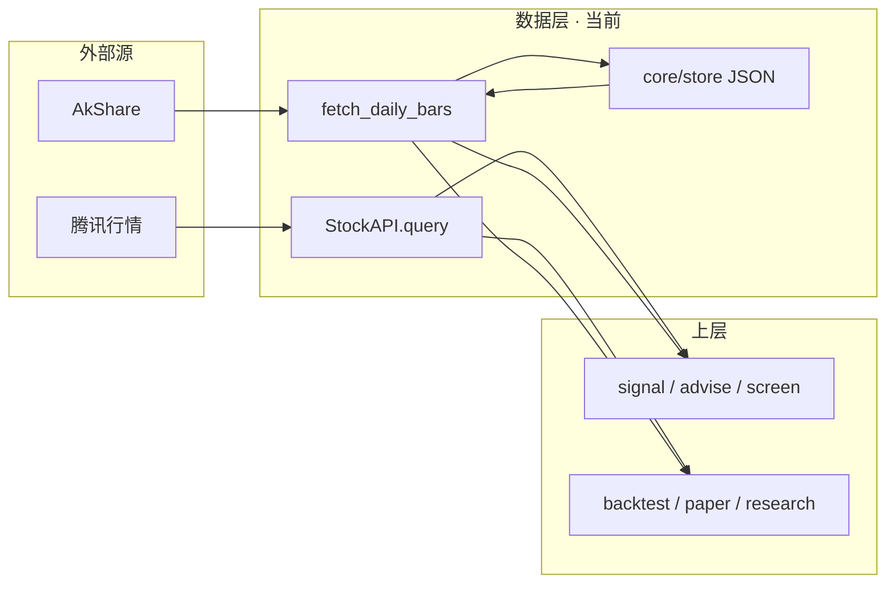

环境变量：`INVESTMENT_STORE_DIR` · `INVESTMENT_DISABLE_CACHE=1`（见 [roadmap · P4.2](design-spine.md#能力评估与升级规划路线图视角)）。

---

## 分钟线采集架构（AkShare · BaoStock）

做 T 第一触达、ŷ_hl 训练、tail_anomaly 等依赖 **5m 分钟缓存**（默认 period=`5`）。实现集中在 **skills 层**，上层经 `core.ports.market.fetch_minute_bars` 调用，**不**在业务里直连接 AkShare / BaoStock。

**与日线（日 K）的差异**：研究台「日线」区块——日常 **「增量补齐」**（`get_bars(incremental=True)` / `force_latest_bars` 从本地 `date_max` **缺口 merge** 至今日）；兜底 **「强更日 K」**（`incremental=False` 整窗重拉）。观察池末 bar 对齐 as-of，供 **ŷ_EOD / IC / OOS** 共用。分钟线亦有 **增量补齐 / 强更 5m** 双入口（近几日 topup vs lookback 全窗），本地仓表/路径与日 K 不同。

### 分层与入口

| 层 | 路径 | 职责 |
|----|------|------|
| **对外读口** | `core/ports/market.py` · `fetch_minute_bars` | 与日线 `get_bars` 并列；ports 由 `skills.ports_bind` 注入 |
| **拉取编排** | `skills/common/minute_history.py` | 缓存 TTL · 东财→新浪/腾讯（有数则跳过 BS）→BaoStock · merge · 落盘 |
| **东财（AkShare）** | `_fetch_em_minute_bars` | `ak.stock_zh_a_hist_min_em`；`skills/common/ak_lock` 进程内串行 |
| **新浪/腾讯** | `skills/common/sina_tx_minute.py` | 近端；东财空时启用，有数则跳过 BaoStock |
| **BaoStock** | `skills/common/baostock_minute.py` | `query_history_k_data_plus`；子进程 + 超时 kill |
| **本地仓** | `core/store.py` · `store_bars_sqlite.py` | `load/save/merge_minute_cache`；默认 SQLite `minute_bars` |
| **批量预热** | `core/schedule_jobs._minute_warmup_core` | schedule `minute_warmup` · Web **强更 5m** Job |
| **Web 强更** | `quant/research/cluster_minute_status.py` | `GET /api/quant/cluster-minute/status` · `POST …/refresh` · Job `cluster-minute-refresh` |

### 单票拉取流程（`fetch_a_minute_bars`）

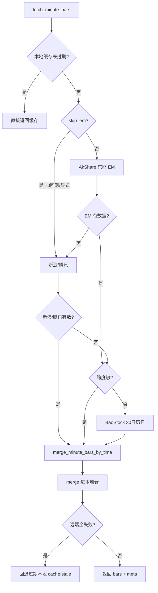

1. **读缓存**：`use_cache=True` 且 `max_age_hours` 内有效 → 不打远端。默认 TTL **12h**（`MINUTE_CACHE_HOURS`）。`use_cache=False` 仅跳过读短路，仍打远端。
2. **远端**：见下节两源配合；成功后 `_merge_save_minute_bars`（与旧条 `merge_minute_bars_by_time` 再 `save_minute_cache`）——**与入口 `use_cache` 无关，强制补拉也会落盘**。
3. **失败兜底**：远端全空时 `_load_stale_minute`，`data_source` 标 `cache:stale:…`，避免做 T 回测整批挂死。
4. **裁剪**：`MINUTE_BARS_MAX_KEEP=12000`（约 250 交易日 × 48 根/日 5m）。

强更 / schedule 预热使用 `max_age_hours=0.01`，几乎总是尝试刷新；单票失败仍可回退旧缓存。

### AkShare（东财 EM）— 主源 · 偏近端

| 项 | 约定 |
|----|------|
| 接口 | `akshare.stock_zh_a_hist_min_em`（经 `import_akshare` + 全局锁） |
| 深度 | 1m ≈ 近 **5 日**；5/15/30/60m 本仓默认 **30 日历日**（`MINUTE_EM_LOOKBACK_DAYS`），且易 `RemoteDisconnected` |
| 窗口 | `start = now - lookback` 日历日，封顶策略上限 90 |
| 复权 | 5m+ 默认 **前复权 qfq** |
| 频控 | 每次远端拉取后 **sleep 10s**（东财 / 新浪腾讯 / BaoStock 各一次） |

默认走 EM；``INVESTMENT_MINUTE_WARMUP_SKIP_EM=1`` 时批量不调 EM。

### 新浪/腾讯 — 近端备 · 先于 BaoStock

实现 `skills/common/sina_tx_minute.py`（直连新浪/腾讯公开 K 线，与东财用的 akshare 无关）。

| 项 | 约定 |
|----|------|
| 触发 | 东财空 / `skip_em` 时打；**排在 BaoStock 前面** |
| 主/备 | 5/15/30/60m：**新浪** `CN_MarketData.getKLineData` → 失败改 **腾讯** `kline/mkline`；1m 仅腾讯 |
| 深度 | `datalen` 上限约 **1023** 根（5m ≈ 20 交易日）；分钟不能按历史日期切片，只从现在往前 |
| 复权 | 源站默认（新浪该接口通常前复权） |
| 频控 | 拉取后同样 sleep 10s |
| 开关 | `INVESTMENT_MINUTE_SINA_TX_FALLBACK` 默认 `1` |

补 Missing 近端 / T0 当日触达；新浪约 20 交易日，对齐 Ready≥20d。有数则 **不再打 BaoStock**。

### BaoStock — 近 30 日 · 最后

| 项 | 约定 |
|----|------|
| 接口 | `baostock.query_history_k_data_plus`；5/15/30/60m 约 **2020-01-03 至今** |
| 复权 | `adjustflag=2`（前复权） |
| 依赖 | `requirements.txt` · `baostock>=0.8.8`；`INVESTMENT_MINUTE_BS_FALLBACK=0` 可关备用 |
| 深度 | 本仓默认回看 **30 日历日**（`MINUTE_BAOSTOCK_LOOKBACK_DAYS`；与东财窗口同为 30） |
| 超时 | 子进程拉取，默认 **90s** kill（`MINUTE_BAOSTOCK_TIMEOUT_SEC` · `INVESTMENT_MINUTE_BS_TIMEOUT_SEC`）；`0` 关闭子进程隔离 |
| 批量 | 每次拉取后同样 sleep 10s |

`_maybe_fetch_baostock_minute_bars` 仅在 **新浪/腾讯未接住** 且（当前 bar **空**或 **日历跨度** `< 30 日`）时调用。东财已给出近端但短于该窗口时仍会打 BaoStock。

然后 merge：**同日整段以后到源为准**（`merge_minute_bars_by_time` 默认 `lock_calendar_day`，禁止同日跨源按时间戳缝合）；重叠日若成交量中位比≈100 则先把手→股对齐。近端东财（或新浪/腾讯），远端缺口仅在未走新浪时补 BaoStock。

**批量 skip_em**（`INVESTMENT_MINUTE_WARMUP_SKIP_EM=1`）：不调东财，顺序为新浪/腾讯 → BaoStock；默认 **关**。

### 批量预热与 Web 强更

| 入口 | 行为 |
|------|------|
| `POST /api/schedule/run` · `kind=minute_warmup` | `_minute_warmup_core`；默认 `skip_em=False`（东财→新浪/腾讯，有数则跳过 BaoStock） |
| Web 量化台 · **强更 5m** | `POST /api/quant/cluster-minute/refresh` → 后台 Job `cluster-minute-refresh` |
| 状态 | `GET /api/quant/cluster-minute/status`（Ready ≥20d 等）· `GET /api/jobs/cluster-minute-refresh` |

每只票：东财（可 skip）→ 新浪/腾讯（仅当前仍空；有数则跳过 BaoStock）→ BaoStock（两源都空，或东财过短）；各源间隔 10s。**已 Ready** 则跳过远端。

**非**「真增量 API」：强更仍按窗口重查远端，再与本地 `merge`。Ready 跳过；新浪接住则不再打 BaoStock；东财/BaoStock 窗口均为 **30 日历日**；各源间隔 10s。

### 环境变量（分钟）

| 变量 | 默认 | 含义 |
|------|------|------|
| `INVESTMENT_MINUTE_WARMUP_SKIP_EM` | `0` | 批量预热/强更跳过东财（`1`=新浪/腾讯→BaoStock） |
| `INVESTMENT_MINUTE_WARMUP_SKIP_IF_READY` | `1` | 本地已 Ready 则跳过远端拉取 |
| `INVESTMENT_MINUTE_WARMUP_READY_MIN_SPAN_DAYS` | `20` | Ready 闸：有 bar 的交易日数 |
| `INVESTMENT_MINUTE_WARMUP_STALE_HOURS` | `24` | Ready 闸：`fetched_at` 超过则重拉 |
| `INVESTMENT_MINUTE_FETCH_DELAY_SEC` | `10` | 东财 / 新浪腾讯 / BaoStock 分钟远端拉取后间隔（秒） |
| `INVESTMENT_MINUTE_BS_FALLBACK` | `1` | 是否启用 BaoStock 备用 |
| `INVESTMENT_MINUTE_SINA_TX_FALLBACK` | `1` | 东财空时新浪/腾讯近端；有数则跳过 BaoStock |
| `INVESTMENT_MINUTE_EM_LOOKBACK_DAYS` | `30` | 东财分钟回看日历日（上限 90） |
| `INVESTMENT_MINUTE_BS_LOOKBACK_DAYS` | `30` | BaoStock 分钟回看日历日（上限 90） |
| `INVESTMENT_MINUTE_BS_TIMEOUT_SEC` | `90` | BaoStock 子进程超时；`0` 关闭 |
| `INVESTMENT_BARS_BACKEND` | `sqlite` | 分钟与日线共用 bars 后端 |

### 与 DataService 的关系

分钟线 **尚未** 完全收入 `MarketDataService.get_bars` 形态；研究/做 T/强更经 **ports `fetch_minute_bars`** → `minute_history`，与日线 DataService 路径 **并行**。存储仍走 **A1** 同一 `bars.db` / `minute_bars` 表（或 JSON 回退）。

---

## 软合约（上层应依赖的形状）

**日线 bar**（`normalize_bars`）：

```text
{ date, open, high, low, close, volume, amount? }
```

`volume` 仅成交量；`amount` 为独立成交额（有则保留）。二者不再混用。

**实时行情**（`StockAPI.query`）：`success` + `price` / `change_*` 等；同 symbol 约 60s 内存缓存。

**质量与来源**：缓存条目带 `quality.level`（`good` / `thin` / `empty`）与 `data_source`；live 若走 `quote_fallback`，与回测完整日线 **可能不一致** —— 解读时必须说明。

**P1 生产评分门禁**（`allows_production_score` · `score_stock`）：仅 `quality.level=good` 且非 fallback 可进生产 `score`；`thin` / `empty` / `quote_fallback` → `hard_reject`（`quality_gate=True`），**不调用** `score_bars`。历史回测仍直接调 `score_bars`，不受门禁影响。研究可传 `bypass_quality_gate=True`。`get_bars(reject_quote_fallback=)` / offline 路径默认拒绝伪日线。

**行业 vs 板别（DS-R2）**：`_sector_for` 只读 `sector_map`（未映射=`未分类`）；板别启发式在 `_board_for` / exposure `styles`。行业限额与中性化只吃 sector。

**ann_missing（DS-R3）**：`fundamentals.ann_missing_policy` 默认 `zero_weight`；码占比超 `ann_missing_code_ratio_block` 时 DQ=`bad`。

**复权策略**：声明策略 `DEFAULT_ADJUST_POLICY=qfq`，写入 Run Manifest 顶层 `adjust_policy`；实际源可能为 `none` / `cached`（见 `infer_adjust`）。

**PIT 最小约定**（日线 as_of 已接线；财务 history 面板 R1 最小可用）：

| 数据类型 | PIT？ | 说明 |
|----------|-------|------|
| 日线回测窗口 | **是（研究近似）** | `core/data_pit.window_as_of`；单票/组合回测打分窗只含决策日及以前；`get_bars(..., as_of=)` 可切条 |
| 基本面 | **live+研究 as_of（X0）** | live `score_stock` 经 `resolve_live_fundamentals` 与 panel/OLS 同源；缺 ann 标 `ann_missing`；覆盖见 DQ / sample_ops |
| 资讯标题 | **否** | 实时拉取，不作历史面板；舆情因子演进见 [architecture.md · 舆情层](architecture.md#舆情层) |

### 验证宇宙约定（V0）

| 项 | 约定 |
|----|------|
| 配置 | `data/validation_universe.json`：`include_only` 非空则只用该列表，否则=观察池。屏蔽某票从观察池删除 |
| 空财务 | `GET /api/ops/empty-fundamentals`；长期拉不到的码从观察池删除，勿用 demo ladder 冒充覆盖 |
| 真实多期入库 | `python3 research/sample_ops_run.py ingest-history --codes …`；调度 `fundamentals_warmup` **默认**串联 ingest（可传 `ingest_history=false` 关闭） |
| 禁止 | `seed-ladder` / `synthetic_demo` 点不得计入「策略已验证」；闸门看 `real_multi_coverage` |

**约定**：生产决策不得依赖「当日不可见」的未来 bar / 未来财报；`pit_report.fundamentals` 汇总 resolved_ok / missing_as_of。  
这与产品本质一致：**只根据当时已发生事实做影响估计**（见 [design-spine.md](design-spine.md)）。

---

## 存储布局（运行时）

| 路径 | 内容 |
|------|------|
| `data/store/daily/{CN\|HK\|US}/{code}.json` | 日线 bars + `fetched_at` + quality + `date_min/max`（增量合并；默认不入 git） |
| `data/store/bars.db` · `minute_bars` / `minute_cache_meta` | 分钟线（默认 SQLite）；或 `data/store/minute/{period}/CN/{code}.json` |
| `data/store/fundamentals/{code}.json` | 基本面快照 + `history[]`（真实多期 / 可选 synthetic_demo）+ `fetched_at` |
| `data/store/news/{code}.json` | 资讯标题快照 + `fetched_at`（non_pit） |
| `data/store/spot_a_em.json` | A 股现货筛选磁盘兜底 |
| `data/watching.json` · `paper.json` · `signal_config.json` … | 产品配置 / 账户（非行情仓） |
| `data/reports/` | 量化日报归档 |

详见 [data/README.md](../data/README.md) · [data/store/README.md](../data/store/README.md)。

---

## 存储选型：为何是 JSON，何时才上数据库

**结论（现行）**：配置与账本继续 JSON；**日线/分钟线缓存**走工程结构轨 **A1**：默认 SQLite WAL（`INVESTMENT_BARS_BACKEND=sqlite`），可回滚 `json`。账户、信号配置、交易流水仍 **本地 JSON / JSONL**——与「策略验证、观察池级规模、暂不接实盘」对齐。

与 [本章 § 刻意不做](#架构总览)、[§ 工程结构轨 A0–A4](#工程结构轨a0a4)、[§ SQLite 改造](#日分钟线缓存-sqlite-改造方案) 一致：不为「专业感」把全部状态塞进一个库；行情按规模升 SQLite，配置保持可 diff。

### 各类数据落盘对照

| 类别 | 落盘 | 典型路径 | 说明 |
|------|------|----------|------|
| **模拟账户** | JSON | `data/paper.json` | 假钱账本（现金 · 持仓 · 成交）；非券商实盘 |
| **观察池** | JSON | `data/watching.json` | 产品状态，非行情仓 |
| **信号 / 规则配置** | JSON | `signal_config.json` · `position_rules.json` | 人审可改；晋升有备份约定 |
| **日线 / 分钟线** | SQLite（默认）或 JSON | `data/store/bars.db` · 或 `daily|minute/**/*.json` | `INVESTMENT_BARS_BACKEND`；上层经 DataService / ports |
| **基本面 / 资讯** | 按标的 JSON | `data/store/fundamentals|news/` | 快照 + PIT 面板；不进 bars.db |
| **决策 / TTM 事件** | JSONL 追加 | `decisions.jsonl` · `ttm_events.jsonl` | 流水审计，轻量追加写 |
| **日报 / 告警** | JSON · MD | `quant_daily.json` · `reports/` · `alerts/` | 运行时产物 |
| **回测快照** | JSON | `last_portfolio_backtest.json` · `last_t0_backtest.json` | 刷新恢复 KPI / 做 T 结果；不重跑 |

上层统一经 **DataService** / `core/store` 读写；禁止业务层散落直接扫盘当「隐式数据库」。

### JSON 适用原因（现行）

- **规模匹配**：观察池级日线，不是全 A / Tick
- **可读可 diff**：配置与账本可 git / 手改 / 备份；零运维
- **产品阶段**：只做假设 → 回测 → 纸面；无多账户并发 OMS
- **边界清晰**：全市场数仓 / Tick / 多源对齐 — **不做（锁定）**

### 已知局限（可接受，直到触顶）

| 风险 | 何时会痛 |
|------|----------|
| **并发写覆盖** | 多进程同时改 `paper.json` |
| **聚合查询弱** | 跨票 / 跨日 SQL 式分析要自己扫文件 |
| **文件膨胀** | 全市场多年日线、分钟线、Tick |
| **事务与强审计不足** | 实盘订单、资金流水要回滚 / 对账 |

单机、单用户、策略验证阶段，上述多数尚未成为瓶颈。

### 何时再上库（分类型，而非一刀切）

| 触发条件 | 建议方向 |
|----------|----------|
| 现行（策略验证 / 纸面） | 配置/账本 **JSON**；bars **SQLite 默认**（可切 `json`）；读写收口 DataService / store |
| 观察池再变大、跨票聚合仍痛 | 可再评估 **Parquet / 按日分区**（与 bars.db 并存，不吞配置） |
| 接实盘 OMS、多账户、强审计（N6 闸门后） | 账户与成交 → **SQLite / Postgres**；行情仍可用文件或时序库 |
| 全市场批式研究 | 专门行情仓；**与产品配置 JSON 分开** |

原则：**配置与小状态继续文件；账本按一致性需求升级关系库；行情按规模升级列式/时序** —— 不要「全部迁进一个 SQLite」当银弹。

---

## 演进（M1 路径内已收口 / 仍待）

| 项 | 状态 |
|----|------|
| **M1.1 DataService 收口** | **已落地**：`get_quote/bars/fundamentals/news/spot`；quant/paper/research 经 DataService |
| **ports adapter 注入** | **已落地**：`skills.ports_bind` → `core.ports.adapters`；`market.py` 不硬 import skills |
| **M1.2 观察池覆盖率** | **已落地**：`data_coverage` · `bars_warmup` / `paper_daily` 汇总 + 出站 |
| **M1.3 基本面/资讯快照缓存** | **已落地**：`data/store/fundamentals|news` · `non_pit` · `fundamentals_warmup` |
| **M1.4 观察池日线增量** | **已落地**：`merge_bars_by_date` · `fetch_daily_bars(incremental=True)` |
| 复权多策略 `qfq\|hfq\|raw` | **D2 已落地**：`get_bars(adjust=)` · 缓存 `adjust_policy` 防混用；hfq 不可用回退 |
| 财务公告日 PIT | **D0 已加深**：ingest 写 `ann_date`/`available_as_of`；无则 `ann_missing` |
| 交易日历 lite | **D3 已落地**：`core/market/calendar.py` |
| DQ 中心 | **D4 已落地**：`GET /api/ops/data-quality` |
| **DS-R0 日线缓存 path_lock** | **已落地**：`save_*` / `merge_save_daily_cache` / snapshot 写路径持锁 |
| **DS-R1 TTL 一元化** | **已落地**：`core/data_policy.py`；store IO 计入 DQ `store_io` |
| **DS-R2 行业≠板别** | **已落地**：`_sector_for`→未分类；`_board_for`/styles 仍板别 |
| **DS-R2.1 清洗伪主题** | **已落地**：`is_board_label`；`scrub_board_labels_from_sector_map`；sync 不再写板别 |
| **DS-R2.2 现货行业补全** | **已落地**：`enrich_sector_map_from_spot`；调度 `sector_map_enrich` / `spot_refresh` 串联；风控覆盖闸门 |
| **DS-R3 ann_missing 门禁** | **已落地**：`ann_missing_policy`（默认 zero_weight）；DQ ratio→bad |
| **DS-R4 拒 quote_fallback** | **已落地**：`reject_quote_fallback`；伪日期 quality=empty；offline 默认拒 |
| **DS-R5 刷新锁/裁剪** | **已落地**：`code_refresh_lock`；日线/分钟 trim 上限 |
| **分钟线 AkShare+BaoStock** | **已落地**：`minute_history` · `sina_tx_minute`（新浪/腾讯有数则跳过 BS）· `baostock_minute`；批量默认走东财；各源间隔 10s；见 [§ 分钟线采集架构](#分钟线采集架构akshare--baostock) |
| **DS encapsulate** | **已落地**：`core/data/`（`BarsResult`/`DataEnvelope` · `MarketPorts` · `MarketDataService`/`ResearchDataService`）；`facade.py` 薄门面仍返回 dict |
| **DS-E1 读口收口加深** | **已落地**：paper/threshold OOS/`portfolio_bars` 远端补数经 DS 且拒 fallback；`get_bars_batch` · `set_research_service`；spot `mem_cache` source；空宇宙 coverage=`None`；非 bars 信封显式 `production_ok` |
| **DS-E2 评分读口 + 可观测** | **已落地**：`score_stock.fetch_daily_bars`→DS 缓存+`bars_pack_worker` 池；bars 空宇宙 coverage=`None`；`metrics_snapshot`；batch 默认 adjust；ledger/insights `resolve_market_code` 经 ports |
| **DS-E3 quote/指数/惰性包** | **已落地**：paper quote/batch 经 DS；`get_index_bars`；`portfolio_bars` 离线不打 quote；lazy `core.data.__getattr__`；DQ 暴露 `data_service_metrics` |
| **DS-E4 收口扫尾** | **已落地**：`as_dict` 保留 kind/ok；score/watching/facts/schedule/cluster/event 行情经 DS；warmup 挂 metrics；topk 指数经 DS；portfolio 最终 resolve 跟 offline 语义 |
| **DS-E5 可观测 + 锁** | **已落地**：平台 DQ/调度 last 展示 `data_service_metrics`；`spot_refresh` 挂 metrics；`reset_metrics` 导出；框架锁业务禁直 import ports 读行情；仪表盘指数经 DS |
| **A1 Bars SQLite** | **已落地**：`INVESTMENT_BARS_BACKEND` · `core/store_bars_sqlite.py` · `scripts/migrate_bars_to_sqlite.py`；见 [§ SQLite 改造](#日分钟线缓存-sqlite-改造方案) · [§ 工程结构轨 A0–A4](#工程结构轨a0a4) |
| 全市场数仓 / Tick / 多源对齐 | **不做**（锁定） |

### 采集运维

- `POST /api/schedule/run` kinds：`bars_warmup` · `minute_warmup`（5m 预热 · 默认东财→新浪/腾讯，有数则跳过 BaoStock · 各源 10s）· `spot_refresh`（可串联行业补全）· `sector_map_enrich` · `fundamentals_warmup`（默认 ingest 真实 history）· `paper_daily` · `validation_prepare` · `sentiment_scan`
- Web 分钟强更：`POST /api/quant/cluster-minute/refresh` · `GET /api/quant/cluster-minute/status` · Job `GET /api/jobs/cluster-minute-refresh`
- 验证宇宙卫生：`GET /api/ops/validation-hygiene` · `POST /api/ops/validation-prepare`
- 舆情 as_of：`GET /api/ops/sentiment-as-of?code=&as_of=`
- 覆盖率字段：`coverage` / `data_coverage`（mapped、stale、levels）
- 告警码：`bars_coverage_thin` · `bars_stale` · `bars_empty` → `alert_outbound`
- 预热默认标的：验证宇宙（`validation_universe`）优先，否则 watching

目标交互（演进后）：

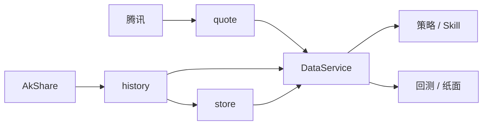

与路线图差距表一致：[design-spine.md · 路线图](design-spine.md#能力评估与升级规划路线图视角)（数据行：实时拉取 → 本地历史库、复权一致、多源对齐）。

---

## 相关代码速查

| 能力 | 路径 |
|------|------|
| 现价 | `skills/common/quote_api.py` |
| 日线拉取 + normalize | `skills/common/history.py` |
| **分钟拉取（东财→新浪/腾讯；有数则跳过 BaoStock）** | `skills/common/minute_history.py` · `skills/common/sina_tx_minute.py` · `skills/common/baostock_minute.py` |
| 日线缓存 R/W · quality | `core/store.py` |
| **DataService（N1/M1）** | 门面 `core/data/facade.py`（模块函数 → dict）；领域 `core/data/`（`MarketDataService` · `BarsResult` · `MarketPorts`） |
| TTL / 质量阈值 | `core/data_policy.py` |
| 财务 PIT 面板 | `core/fundamentals_pit.py` |
| 样本运营 / 验证宇宙 | `core/sample_ops.py` · `core/validation_universe.py` · `GET /api/ops/sample-status` |
| 成熟闸门 | `core/maturity_gate.py` · `GET /api/ops/maturity-gate` · [design-spine.md · N6 准入](design-spine.md#n6-真真盘准入备忘) |
| 源一致性审计 | `core/data_consistency.py` |
| 覆盖率 | `core/data_coverage.py` |
| 路径 | `core/paths.py`（`STORE_DIR`） |
| 缓存 CLI | `research/cache_cli.py` |
| 调度预热 | `core/schedule_jobs.py`（`bars_warmup` · `minute_warmup` · `spot_refresh` · `fundamentals_warmup`） |
| 观察池分钟状态/强更 | `quant/research/cluster_minute_status.py` · `quant/services/quant_service_factors.py` |
| 现货筛选 | `skills/screen/engine.py` |
| 基本面 / 资讯 | `skills/fundamentals/engine.py` · `skills/news/engine.py` |

上层调用约定：Agent 只解读 Skill JSON 中的数字，**不得编造**行情或财务字段（见 architecture 原则「数据与建议分离」）。

---

## 策略层（Strategy Layer）

[← 文档索引](README.md) · 入门见 [quant.md · 入门概念](quant.md) · 因子/stance 原理见 [quant.md](quant.md) · 数据输入见 [§ 数据层](#数据层data-layer)

**定义**：策略 = 一套将市场数据转化为**交易意图**的确定性规则。  
一句话：策略是函数 `f(x) = y` —— `x` 为行情与账户上下文，`f` 为选股/择时/仓位/风控，`y` 为标准化信号（不是直接下真单）。

本仓库 **没有** 经典 `StrategyBase.on_bar` 类体系；等价逻辑拆在 **`score_bars` → `stance` / 回测入场 → 纸面 `rules`**。  
**Q2**：唯一 canonical 策略为 **`short_conservative`**（`core/strategy.py` + `STRATEGY_SPECS[].lifecycle`）：回测参数、模拟 `paper_rules`、默认 `cost_model`、账户 `risk` 限额。研究配置经 **`POST /api/strategy/promote`** 显式晋级（API 仍在；策略中心页不再挂空壳按钮），禁止静默覆盖。

**ExecutionSpec（v1.1）**：`lifecycle.execution` 收编两类纸面动作——**结构层调仓**（持有什么、各占多少；ŷ_trade 排序 + ŷ_EOD/ŷ_τ 买卖闸）与 **overlay 做 T**（底仓上 dual_y：y_τ 定方向 + 5m 往返 timing；不改变选股主线）。**ŷ_τ 模型共用、决策接口不同**，见 [quant.md · 策略调仓 vs 底仓做 T](quant.md#策略调仓-vs-底仓做-t)。纸面 / 做 T 回测经 `core/execution.resolve_effective_execution` 合并  
`DEFAULT → Spec → paper.rules → 请求 → channel runtime_defaults`，禁止入口各自硬编码 `direction` / `path_mode`。  
Web：`GET/POST /api/paper/execution` · `GET .../diff` · `POST .../reset` · **历史回测**改调仓/做 T 规则表单；交易执行只读规格 + 预演/Worker · 策略晋升回显做 T 摘要。  
耦合：`coupling.t0_vs_stance` = `independent` | `skip_if_avoid` | `only_if_hold`（纸面预演按持仓 stance 跳过）。

**自动做 T 落账（Web Worker）**：Follow 页 Worker = 本 Web 进程内后台线程，**5 分钟轮询 + 5m 盯盘**（与 K 线周期对齐；分钟线 `use_cache` TTL ≈5min，无新 bar 跳过打网；**振幅门禁按 5m 前缀 high/low 滚动**，不足则下根 K 重试；交易时段内触达即落账，不再日终整段回放）；开关写 `data/t0_auto_worker.json`，状态写 `data/t0_intraday_state.json`，并同步 `paper.rules.t0_auto.enabled`。  
API：`GET/POST /api/paper/t0/worker`（启停 + 状态）· `GET /api/paper/t0/auto`（`last_run` 只读轮询）。  
手动补跑：Follow「手动预演 / 手动落账」· `POST /api/paper/t0`（不依赖 Worker）。`run_web.py` lifespan 启动时若 worker 开关为 ON 则自动 restore；进程退出 stop。  
外部 cron 仍可用 `schedule_jobs.run_paper_t0`；`paper_daily` 链式触发需 `t0_auto.enabled` 且 `schedule=with_paper_daily`（UI 已移除 schedule 下拉，默认 `after_close`）。

**自动调仓落账（Web Worker）**：Follow「策略调仓」运行卡与做 T 同结构（进程面板 → 面板外盯盘框）。每个交易日在已保存 **fill_clock～10:00** 现价成交一次（默认 09:30），过点不补跑。开关与 last_run / desk 写 `data/rebalance_auto_worker.json`。  
API：`GET/POST /api/paper/rebalance/worker`（`worker` + `desk`）。盯盘落账前按持仓占位监视，落账后开/加/减/清/持；上次落账文案 `时间 · 自动|手动 · 卖 n · 买 n`。手动预演 / 确认落账与 Worker 同一 fill_clock～10:00 窗口，过点不补跑、不挂开盘单。做 T worker 在调仓未完成且仍在开盘窗内会等待。
---

## 黑盒工厂直觉

```text
原材料（行情 / 账户 / 参考信息 / 时间）
        ↓
   图纸（策略规则）
        ↓
成品（买卖意图 + 日志）  →  交给回测引擎或纸面记账（不接券商）
```

---

## 三个核心部分（成熟模型）

| # | 部分 | 回答什么 |
|---|------|----------|
| 1 | **选股与择时** | 买什么 · 何时买/卖 |
| 2 | **仓位管理** | 买多少 · 如何分配资金 |
| 3 | **风险控制** | 止损/止盈 · 账户级红线 |

### 本仓库落点

| 部分 | 当前实现 | 配置 / 代码 |
|------|----------|-------------|
| **选股** | 观察池过滤 + `hard_reject` + `min_score` 排序 TopN | `watching.json` · `signal_config.hard_reject` / `rank` · `screen` |
| **择时（买入侧）** | 因子加权 `score` → stance 分档 / 回测入场阈值 | `score_bars` · `compute_buy_stance` · `stance_thresholds` |
| **择时（卖出侧）** | 部分：持有期 `horizon_days`、纸面 `stop_loss` / `max_hold_days`；`invalidation` 多为**文案参考**非自动单 | `paper.rules` · `invalidation.stop_pct` |
| **仓位** | 纸面：`position_pct` · `max_positions`；组合回测等权/规则调仓 | `paper.rules` · 组合回测引擎 |
| **风控** | 硬拒绝、stance 降档、纸面止损；**账户级**回撤/单票上限见 `core/risk`（调仓前拦截加仓） | `StrategySpec.lifecycle.risk` · `check_account_risk` |

**输出边界**：产出的是意图与模拟成交记录，**现行不代客下单**（策略验证）；实盘待成熟后另立项。

---

## 输入（原材料）

成熟策略通常以 **Context** 注入：

| 输入 | 含义 | 本仓库来源 |
|------|------|------------|
| 行情 OHLCV / 序列 | 当前与历史 K 线 | [data-layer](architecture.md#数据层) → `fetch_daily_bars` / quote |
| 账户状态 | 现金、持仓、盈亏 | `paper.json`（模拟）或回测引擎内存账本 |
| 参考信息 | 名称、行业、停牌等 | 部分经 AkShare / fundamentals；不全 |
| 时间戳 | 交易日 / 是否交易时段 | bar 的 `date`；日线级为主 |

上层应经数据服务取数，策略内尽量不直接调外部源（演进约定见数据层文档）。

---

## 输出（成品）

| 输出 | 含义 | 本仓库形态 |
|------|------|------------|
| 信号列表 | 标的 · 方向 · 目标仓位/数量 · 订单类型 | `stance_label` / `hard_reject`；回测 trade list；纸面 `trades[]` · `signal_log[]` |
| 日志与状态 | 触发原因、内部状态 | `reasons` · `invalidation` · `reject_reason` · paper snapshots |

方向语义对照：

| 成熟模型 | 本仓库常见表达 |
|----------|----------------|
| BUY / SELL / HOLD | `buy_light` / `probe` / `wait` / `avoid`；回测「入场持有 N 日」；纸面买入/调仓/止损卖出 |
| 市价 / 限价 | 模拟多为规则价（现价/开盘代理）；**无**真实 OMS 订单类型 |

---

## 与 Web 五页的关系

| 页 | 策略角色 |
|----|----------|
| `/strategy` | **看图纸**：M prior（个股舆情只在观察徽章） |
| `/watching` | **划狩猎范围**（选股输入名单） |
| `/replay` | 用图纸交**历史卷**（资金模拟在引擎内） |
| `/paper` + `/follow` | 图纸 + **假账**持续记账 |
| `/quant` | 组 β → ŷ 研究与 live 启用，**不自动改**全局 weights |

测试类型与是否需要纸面：[quant.md · 入门概念](quant.md)。

---

## 代码形态（本仓库 vs 经典）

| 经典写法 | 本仓库 |
|----------|--------|
| `class MyStrategy(StrategyBase)` + `on_bar` / `on_tick` | 无统一 Strategy 基类 |
| 策略内算指标并下意图 | `score_bars(bars) → score`；`compute_buy_stance(...) → stance_*` |
| 配置散落代码 | `data/signal_config.json` + `paper.rules` |
| 执行模块接券商 | 回测引擎 / `core/paper.py` 模拟记账 |

演进若引入 `StrategyBase`，仍应：**数字只来自确定性模块**；LLM 只解读，不改 `score` / `stance_label`。  
与 RL Policy 的关系见 [architecture.md · RL 视角](architecture.md#强化学习rl视角)（当前不训练神经网络策略）。

---

## 策略设计文档模板（填空）

写代码或改配置前，先花约 10 分钟填完。填不清的格子 = 策略还没想透。

```text
策略名称：（例：双均线突破 / 短线多因子 signal_v1）
策略类型：（趋势跟踪 / 均值回归 / 多因子选股 / 事件驱动）
适用标的：（沪深300 / 全A / 自建观察池 …）
回测周期：（YYYY-MM-DD ～ YYYY-MM-DD）
交易频率：（日线 / 分钟 / Tick）

1. 股票池构建（选股）
   - 基础过滤：（剔除 ST / 次新 / 停牌 …）
   - 行业/板块：
   - 财务/因子筛选：

2. 买入信号（择时）
   - 技术/因子条件：
   - 形态/价格：
   - 组合条件（须同时满足）：

3. 卖出信号（平仓）
   - 止盈：
   - 止损：
   - 时间止损（持有 N 日）：
   - 信号反转：

4. 仓位与资金管理
   - 单票上限：
   - 建仓方式：（一次 / 分批）
   - 分配算法：（等权 / 波动倒数 / …）

5. 风险控制（账户级）
   - 最大回撤限制：
   - 单日亏损限制：
   - 持仓数量上限：

6. 交易成本假设
   - 佣金：
   - 印花税：
   - 滑点：
```

填好后：改 `signal_config` / `paper.rules`，或扩展因子与回测参数；按 [quant-ui.md](quant-ui.md) 用 `/replay` 与 `/follow` 分别做历史回测与模拟盘。

---

## 示例：当前默认短线策略（已填）

对照生产默认配置（数值以仓库文件为准，下文为摘要）。

```text
策略名称：短线多因子 signal_v1（观察池 + stance）
策略类型：多因子选股 / 短线动能（规则加权，非 ML 拟合）
适用标的：用户配置的 watching 观察池（模拟持仓随交易产生；非整市场自动扫）
回测周期：按次回测参数（如近 120 日）；非固定长样本
交易频率：日线

1. 股票池
   - 基础过滤：日线不足 → hard_reject；近 3 日涨幅≥15% 或跌幅≤-12% → hard_reject
   - 行业/板块：未默认限制（可由 screen / watching 人工圈定）
   - 财务/因子：可解释线性加权（`factor_registry` 白名单，约 20 因子）；估值/质量/成长等缺数据中性 50；截面默认 **行业 + 规模残差** 中性化（可关）；`factor_groups` + 截面相关作去冗提示；生产分禁止 NN；网格「应用最优」须附 OOS/WF，禁止仅 IS 一键 promote

2. 买入
   - score ≥ min_score（默认 55）且非 hard_reject
   - stance：score 区间 → avoid / wait / probe / buy_light，再经 K 线/peer/index 降档
   - 纸面：另受 max_positions、position_pct 约束

3. 卖出
   - 回测：持有 horizon_days 后平仓（简化）
   - 纸面：stop_loss_pnl、max_hold_days、min_hold_score 等（见 paper.rules）
   - invalidation：约 -3% 等为建议文案，非自动下单

4. 仓位
   - 纸面默认：单票约现金 × 15%（position_pct），最多约 20 只（保守短线 15）
   - 组合回测：规则/等权调仓（详见回测模块）

5. 账户风控
   - 有：持仓数上限、硬拒绝、stance 降档、`check_account_risk`（回撤/单票仓位 → 调仓跳过加仓）
   - 弱/无：单日亏损熔断、实盘强平

6. 成本
   - 模拟账户默认 `simple_cn`（佣金+印花税）；`zero` 仅教学/调试并须锁定
   - 回测 / 调仓写出 Run Manifest（策略版本 · 成本 · 规则指纹）
```

配置入口：`data/signal_config.json` · `data/paper.example.json` → `paper.json` · `core/strategy.py` · Web `/strategy` · `POST /api/strategy/promote`。

---

## 相关代码速查

| 能力 | 路径 |
|------|------|
| StrategySpec / 晋级 | `core/strategy.py` · `core/backtest/strategies.py` |
| 因子打分 | `core/signal/scorer.py` · `score_bars` |
| 配置加载 | `core/signal/config.py` · `data/signal_config.json` |
| 买卖分档 | `core/stance.py` · `compute_buy_stance` |
| 历史验证 | `core/backtest/engine.py` · Run Manifest |
| 纸面规则执行 | `core/paper.py` |
| 账户风控 | `core/risk/checks.py` |
| 持仓加减仓规则 | `data/position_rules.json` · `core/position.py`（真仓建议，≠ 纸面策略） |

---

## 相关文档

| 文档 | 内容 |
|------|------|
| [quant.md](quant.md) | score → stance → 回测 → 纸面 |
| [quant.md · 入门概念](quant.md) | 名词与测试类型 |
| [quant-ui.md](quant-ui.md) | `/strategy` 页用法 |
| [§ 数据层](#数据层data-layer) | 策略输入从哪来 |
| [architecture.md · 风控层](architecture.md#风控层) | 账户风控门禁 |
| [design-spine.md · 路线图](design-spine.md#能力评估与升级规划路线图视角) | Q1–Q5 与远期缺口 |

---

## 风控模型（Risk Layer）

[← 文档索引](README.md) · 策略进攻侧见 [§ 策略层](#策略层strategy-layer) · 因子/stance 见 [quant.md](quant.md) · 数据输入见 [§ 数据层](#数据层data-layer)

**定义**：风控模型 = 把组合与市场风险量化后，输出**限额 / 预警 / 干预意图**的确定性（或可拟合）规则。  
与 Alpha（打分找收益）形成 **双轮驱动**：Alpha 负责进攻，Risk 负责防守。

本仓库当前以 **静态规则 + 轻量动态（regime 降分）+ 账户调仓前门禁** 为主；**不是** 多风险因子加权 + ML 拟合的完整 Risk 引擎。输出多为建议或纸面模拟动作，**现行不接实盘强平**（策略验证阶段）。

在产品因果链中，Risk 负责估计「已发生敞口」对组合的影响（能买多少、要不要停），与 Alpha 的「相对吸引力」估计并列——见 [design-spine.md](design-spine.md)。

**Q4 已落地**：`core/risk/checks.py` · `check_account_risk` —— 账户最大回撤、单票仓位上限、持仓只数；`blocks` 非空时 `run_daily_cycle` **跳过加仓**（减仓/止损仍执行）。限额来自 `StrategySpec.lifecycle.risk`。

---

## Alpha × Risk 闭环

```text
行情 / 账户 / 组合结构
        │
        ├─► Alpha（score_bars / stance）  →  谁更值得买、倾向买/观望
        │
        └─► Risk（限额 · 止损 · 降档 · 预警）→  能买多少、要不要砍、整体敞口
                │
                ▼
         交易意图（回测记账 / 纸面）—— 非券商下单
```

| | Alpha 模型 | Risk 模型 |
|--|------------|-----------|
| 目标 | 收益 / 排序 | 生存 / 回撤 / 集中度 |
| 典型输出 | `score` · `stance_label` | 动态 `position_pct` · 风险分 · 减仓指令 |
| 本仓库重心 | **已较强**（八因子 + IC 建议） | **调仓前门禁已落地**；风格暴露/波动预算仍弱 |

---

## 成熟思路：三块

### 1. 拆解风控因子（把风险量化）

| 风险因子 | 监控什么 | 典型动作 |
|----------|----------|----------|
| **市场风险** | 大盘波动率、流动性枯竭 | 波动飙升 → 整体仓位打折 |
| **风格/行业暴露** | 行业/市值/风格是否过浓 | 超限 → 预警或强制分散 |
| **个股特质风险** | 异常波动、放量异动、与大盘背离 | 单票降仓 / 剔除 |
| **拥挤度** | 赛道或策略是否过热 | 降杠杆、回避踩踏 |

### 2. 动态权重 / 状态切换（可拟合）

静态止损（如「跌 8% 砍仓」）在风格切换时易失效。成熟做法：

- **按 regime 调权重**：震荡市抬高波动因子；趋势市更盯行业暴露  
- **非线性识别**：风险传导、隐性踩踏（ML 潜力，需数据与验证）  
- **状态识别**：HMM / 聚类判牛熊高波，再切换限额表  

与 Alpha 一样：先有可解释因子与 OOS，再谈自动拟合；**不自动静默改生产限额**（与 `signal_config` 人工合并原则一致）。

### 3. 输入与输出

| 方向 | 内容 |
|------|------|
| **输入** | 组合状态（持仓、行业/市值暴露）· 市场环境（波动、流动性）· 历史风险案例（训练用） |
| **输出** | **动态限额**（如单票上限 10%→5%）· **风险分 0～1** · **干预意图**（减仓/暂停开仓/清仓意图） |

干预交给执行/纸面层模拟；本系统 **不做** 真实强平。

---

## 本仓库对照（现状）

| 成熟能力 | 当前落点 | 说明 |
|----------|----------|------|
| 市场风险 / regime | `core/signal/regime.py` · `signal_config.regime` | 弱趋势时对 **score 降分**，非直接砍仓 |
| 个股硬门槛 | `hard_reject`（追高/急跌/日线不足） | 偏入场过滤，非持仓期风控 |
| 失效参考 | `invalidation`（约 `-3%` 文案） | **建议级**，非自动止损单 |
| 纸面止损 / 时间 | `paper.rules.stop_loss_pnl` · `max_hold_days` · `min_hold_score` | 模拟卖出 |
| 仓位上限 | `max_positions` · `position_pct` | **静态**比例 |
| 持仓集中度 | `position` 规则提示 | 真仓建议；非组合 Risk 引擎 |
| 行业/风格暴露 | `core/risk/exposure.build_exposure_matrix` | 持仓×主题行业 + 板块风格 + 仓位档；超限与门禁同源 |
| 拥挤度 | 无 | R3 可选 / 远期 |
| 风险分 0～1 | 无统一 | R3 可选 / 远期 |
| 账户最大回撤熔断 | `check_account_risk` + StrategySpec.risk | 调仓前门禁；超限拦加仓；`block_items.code` |
| 组合目标权重 | `optimize_weights` → `last_optimize` / ops_report | **分数风险预算**（默认）+ 可选贪心填仓；**高波缩放**有效单票/行业上限 |
| 波动缩放 | `core/risk/budget.market_vol_scale` | 指数近20日波动/基线 ≥1.5 → 上限×0.8；取数失败不挡调仓 |
| 拦截有效率 | `north_star.summarize_risk_blocks` | 按码/日/周；`meta.outcome` 标注后算有效率/误拦率 |
| 策略限额 | StrategySpec.risk / `paper.rules` | 调仓前门禁；UI 不在策略中心挂只读审计 |
| ML 风控拟合 | 无 | 远期 |

配置摘要见 `data/signal_config.json`（`invalidation` / `regime`）与 `data/paper.example.json`（`rules`）。

---

## 实战演进（建议顺序）

与「先静态、再简单动态、再 ML」一致：

```text
① 静态规则（已有）
   hard_reject · stance 降档 · paper 止损/持仓上限 · invalidation 文案
        ↓
② 简单动态（已落地轻量）
   市场波动抬升 → 有效 max_position/sector ×0.8；
   目标权重按 score 比例分配；可选 `risk_parity_lite` / `qp_lite`（cvxpy，未装则 unavailable 回退）
        ↓
③ 暴露可见 + 拦截可审计（R3/V3 已落地）
   持仓行业/风格矩阵 · 原因码 · 有效率（策略页标注 outcome，≥20 条才展示趋势）
   完整风格/Beta VaR / 拥挤度 → 仍远期；**QP 非闸门阻塞**
```

### 策略验证阶段风控清单（V3）

| 项 | 要求 |
|----|------|
| 调仓前硬拦 | `check_account_risk`；`risk_block` 带结构化原因码 |
| 暴露巡检 | 日更/调仓附暴露矩阵；超限与预算同源 |
| outcome 纪律 | 策略页标注真拦/误拦；`labeled_count≥20` 后才解读有效率 |
| 权重模式对照 | `score_budget` vs `risk_parity_lite`（及可选 `qp_lite`）可切换验证 |
| 不做 | 真强平、实时 VaR 引擎、独立 Bloomberg 风控台 |

**原则**：

1. Risk 输出是 **意图与限额**，不是保证不亏。  
2. 与 Alpha 一样：数字确定性计算，LLM 只解读。  
3. **策略验证阶段**：在 **回测 + 纸面** 验证动态限额；待验证成熟后再谈真账户（N6）。  
4. 与 RL 的关系（风控 → Reward 翻译；勿与 LLM Agent 混淆）见 [architecture.md · RL 视角](architecture.md#强化学习rl视角)。

---

## 与策略设计模板的衔接

填 [§ 策略层 · 风险控制](#策略层strategy-layer) 时，尽量写成可量化条目，例如：

- 单票上限 / 总仓上限（可写「基础值 + 高波折扣」）  
- 止损 / 时间止损  
- 账户回撤暂停开仓阈值（若尚未实现，标「目标」）  

Alpha 条目（选股择时）与 Risk 条目分开写，避免「一个大 if」搅在一起。

---

## 相关代码速查

| 账户调仓前门禁 | `core/risk/checks.py` · `check_account_risk` |
| 暴露矩阵（R3） | `core/risk/exposure.py` · `build_exposure_matrix` |
| 行业映射 / 目标权重（N3） | `data/sector_map.json` · `core/portfolio_optimize.py` · `core/risk/budget.py`（波动缩放·分数预算·`risk_parity_lite`） |
| 拦截标注 / 有效率（R3） | `core/risk/block_outcome.py` · `north_star.summarize_risk_blocks` · `GET/POST /api/paper/risk-blocks*` |
| sector_map 对齐 CLI | `research/sector_map_sync_run.py` · `core/sector_map_sync.py` |
| 告警出站（P2++） | `core/alert_outbound.py` · `paper_daily` → `data/alerts/` · 可选 `INVESTMENT_ALERT_WEBHOOK` |
| 策略衰减监控（N5） | `core/strategy_monitor.py`（回撤 + 滚动 IC + 行业覆盖） |
| Regime 降分 | `core/signal/regime.py` |
| hard_reject / invalidation | `core/signal/scorer.py` · `signal_config` |
| 买卖降档 | `core/stance.py` |
| 纸面止损与仓位 | `core/paper.py` · `paper.rules` |
| 真仓规则建议 | `core/position.py` · `position_rules.json` |
| 回测回撤等指标 | `core/backtest/`（评估用，非实时风控） |
| OOS / regime 报告（N4） | `core/backtest/oos_report.py` |

---

## 相关文档

| 文档 | 内容 |
|------|------|
| [§ 策略层](#策略层strategy-layer) | 选股择时 / 仓位 / 风控在策略中的位置 |
| [architecture.md · RL 视角](architecture.md#强化学习rl视角) | 风控规则 → Reward；Policy/Env 映射 |
| [quant.md](quant.md) | score · stance · 纸面规则细节 |
| [quant.md · 入门概念](quant.md#量化入门概念) | 测试类型（风控要在回测/模拟里验） |
| [design-spine.md · 路线图](design-spine.md#能力评估与升级规划路线图视角) | 与专业系统差距 |
| [architecture.md](architecture.md) | 决策执行层 · 组合风控产品目标 |

---

## 舆情与另类数据（Sentiment / Alt-Data）

[← 文档索引](README.md) · 数据入口见 [§ 数据层](#数据层data-layer) · 因子侧见 [§ 策略层](#策略层strategy-layer) · [quant.md](quant.md)

**定位（现行契约）**：规则舆情 **S** 是与 `predicted_score`（ŷ）**正交的先验旁路**，不是可回测、可求 β 的数据驱动因子。

```text
ŷ = ReturnScoreModel(价量 / 财务 / …)   ← 唯一生产排序轴
S = score_headlines(当日标题)            ← 观察徽章（参考）
live 调仓 = rank_lots(y_fuse, y_on)     ← 不读 S
```

本仓库 **已有**：标题拉取与缓存；观察徽章；`sentiment_prior`（产品强制 `mode=off`）；标题 history jsonl（供 as_of 诊断）；`GET /api/ops/sentiment-as-of`。  
**没有**：完整可估 β 的全市场 news 仓、用 S 拟合 OLS β、LLM 写分进 ŷ、主回测注入舆情、个股舆情拦买/缩仓。

LLM 可**解读**标题；**不得**写入 `sub_scores` / ŷ。`sentiment.include_in_score` **恒保持 false**（硬闸）；`get_sentiment_prior_cfg` 强制 `mode=off`，调仓不执行 gate/risk。

超时 / 空标题 / 过期缓存回退时标记 `degraded=true` · `prior_eligible=false`，徽章不标触发。

---

## 先验 policy（live）

个股舆情 **只展示徽章**。文件里残留的 `risk` / `gate` 配置被运行时忽略。

| 表面 | 行为 |
|------|------|
| 观察 / 持仓 / 分数 tip | 看空/看多徽章 + `risk_hints` |
| Follow `rank_lots` / `/replay` | 不读 S |
| 旧横截面编排 | 读到的 cfg 也是 `off`，不拦买不缩仓 |

`apply_prior_to_buy` / `apply_prior_to_hold` 仍保留给单测合成 pack，生产 live cfg 不会产出 block/scale actions。

**Web**：策略中心不再编辑个股舆情；`POST /api/signal/config/sentiment-prior` 若被调用也强制 `mode=off`。

配置见 `signal_config.sentiment`；实现见 `core/sentiment_prior.py`；徽章由 `score_stock` 挂到观察/持仓。

**相关**：开盘缺口等 **事件先验**（与 S 并列的 \(E\)，同属 ŷ 外旁路）及盘中剩余收益头规划见 [quant.md · 盘中剩余收益头](quant.md#13-盘中剩余收益头intraday-residual方案)。

---

## 为何不是因子

缺可按决策日切片的历史 news → 无法合格 as_of 回测 → 估不出可信 `alt_sentiment` β。  
因此 **不进** 主回测 / OLS / promote；history 仅作将来诊断 IC，不支撑「开闸进 ŷ」。

---

## 在架构中的位置

```text
日线/财务 ──► ŷ（排序真源）
标题/规则 ──► S（先验）──► policy(ŷ,S) ──► 开仓/仓位
LLM ────────► 叙事（不进分）
```

| 层 | 关系 |
|----|------|
| Alpha / ŷ | 不含 S |
| [risk-layer](architecture.md#风控层) | S → warn / gate / scale |
| 投顾 | `news` 供解读；不参与 stance / sub_scores |

---

## 本仓库对照

| 能力 | 现状 |
|------|------|
| 规则情绪 S | **有** · `score_headlines`（强度=`polar×标题覆盖`，防稀疏负向虚高） |
| 降级跳过 gate | **有** · `degraded` / `prior_eligible=false` |
| as_of 面板 API | **有** · `GET /api/ops/sentiment-as-of` · history 覆盖进 hygiene |
| 先验 policy | **有** · `role=prior` · `prior.mode` |
| Live 进 ŷ | **否** · `include_in_score=false` · X5 边界诚实 |
| 调仓旁路 | **有** · skip / scale；`predicted_score` 不改写 |
| 主回测注入 S | **否** |
| OLS 求 S 的 β | **否** |
| LLM 分析 | **有** · 叙事；不得进 `sub_scores` |

---

## 相关代码速查

| 能力 | 路径 |
|------|------|
| 先验 policy | `core/sentiment_prior.py` |
| Live 打分 | `core/signal/score_stock.py`（输出 `sentiment_prior`） |
| 调仓接入 | `core/paper/rebalance/` |
| 硬闸 | `sentiment.include_in_score` |
| 观察 API | `web/routers/watching.py` |

---

## 相关文档

| 文档 | 内容 |
|------|------|
| [architecture.md · 风控层](architecture.md#风控层) | 防守侧输入 |
| [§ 策略层](#策略层strategy-layer) | ŷ 排序真源 |
| [quant.md · ŷ 全链路](quant.md#predicted_scoreŷ全链路) | ŷ 主链路（门禁与口径） |
| [design-spine.md](design-spine.md) | 先可信再变厚 |

---

## 强化学习视角（RL Layer）

[← 文档索引](README.md) · [§ 策略层](#策略层strategy-layer) · [§ 风控层](#风控模型risk-layer) · [quant.md](quant.md)

**一句话**：传统「策略 + 风控」≈ RL 里的 **Policy + Reward**；市场 / 回测 / 纸面 ≈ **Environment**。  
RL 追求的是 **最大化长期累积奖励**（赚得稳），不是单纯「预测下一根涨跌」。

本仓库 **未实现** 在线 RL / PyTorch TradingAgent。当前是 **规则 Policy + 规则 Risk**；回测与纸面可当作未来 RL 的 **离线环境**。  
勿与投顾里的 **LLM `InvestmentAgent`** 混淆：后者选 Skill、组织话术；RL Agent 学的是交易动作。

架构已标明：反馈层是半闭环，**不是**在线 RL 自动调权（见 [本章 § 控制论视角](#架构总览) · [design-spine.md · 路线图](design-spine.md#能力评估与升级规划路线图视角)）。

---

## 深度映射

| 传统量化 | 强化学习 | 本仓库今天 |
|----------|----------|------------|
| 打分策略 / stance → 买多少 | **Policy**：State → Action | `score_bars` + `compute_buy_stance` + `paper.rules`（确定性） |
| 风控红线（止损、降仓、限开仓） | **Reward** 里的惩罚项 + 约束 | `hard_reject` · `invalidation` · 纸面止损；惩罚未统一成 reward |
| 历史行情 + 账户反馈 | **Environment** 步进 | `backtest` 引擎 · `paper` 日循环 |
| 净值 / 回撤 / 换手 | 逐步 **Reward** 与 episode 统计 | 回测 metrics · 纸面 snapshots（评估用，不训练） |

```text
State（行情 · 持仓 · 现金 · 可选风险特征）
   │
   ▼
Policy（规则今天 / 神经网络远期）──► Action（买/卖/仓位意图）
   │
   ▼
Environment（回测或纸面记账）──► 新 State + Reward
   │
   └──────── 累积回报最大化（RL 训练目标；本仓库未开）
```

### 三个对应关系

1. **策略 ↔ Policy**  
   传统：因子分 → 买/卖/持有。  
   RL：网络直接输出动作（如目标仓位）。本仓库仍是可审计规则链。

2. **风控 ↔ Reward（及约束）**  
   传统：触线则惩罚（平仓、禁开仓）。  
   RL：把红线写成负奖励，让策略为「拿高分」自发控仓——见下文奖励拆解。  
   注意：Reward 塑造行为，**不能替代** 实盘硬约束（账户熔断仍应规则保底）。

3. **市场 ↔ Environment**  
   动作之后返回新 K 线、盈亏与奖励。  
   本仓库：`core/backtest` / `core/paper` 已是「步进记账」雏形，缺的是 Gym 式 API 与训练环。

---

## 为何常被称作「终极形态」

| 阶段 | 做法 | 优化目标 |
|------|------|----------|
| 监督学习拟合风控/权重 | 预测风险或收益标签 | 预测准 |
| **强化学习** | 在环境中试错，最大化累积奖励 | **赚得稳**（收益 − 回撤 − 成本 …） |

RL 可以把进攻与防守揉进同一套可学习 Policy；代价是：样本效率、非平稳、过拟合历史、可解释与合规更难。  
因此路线是：**规则保底 → 数据与环境扎实 → 再考虑 RL 研究台**，而非一上来端到端实盘。

与 [quant.md](quant.md) 同一产品原则：生产决策须可引用 `stance_label`；黑盒上线需人工冻结 artifact。

---

## 传统风控 → 奖励函数（翻译表）

智能体只优化长期累积奖励。把 if-else 红线译成「发奖金 / 扣工资」：

| # | 成分 | 传统规则直觉 | RL 翻译（示意） |
|---|------|--------------|-----------------|
| 1 | **基础收益** | 赚钱就好 | \(R_{profit} = \Delta equity / equity_{prev}\)；可改为夏普类风险调整收益 |
| 2 | **回撤惩罚** | 回撤超 15% 强平 | \(R_{dd} = -c \cdot drawdown^{2}\)（回撤越大越痛） |
| 3 | **波动惩罚** | 波动过大减仓 | \(R_{vol} = -\sigma(\text{近 N 步收益})\) |
| 4 | **交易成本** | 限制换手 | \(R_{cost} = -\text{手续费}\)（抑制刷单） |

示意合计（文档级，非生产代码）：

```text
R = R_profit + R_drawdown + R_volatility + R_cost
```

伪代码：

```python
def calculate_reward(current_equity, previous_equity, max_equity, trade_cost):
    profit = (current_equity - previous_equity) / previous_equity
    drawdown = (max_equity - current_equity) / max_equity
    # 平方放大：小回撤轻罚，大回撤重罚
    dd_penalty = -(drawdown ** 2) * 5.0
    cost_penalty = -trade_cost
    return profit + dd_penalty + cost_penalty
```

| 本仓库规则 | 可映射到 |
|------------|----------|
| `stop_loss_pnl` / 账户回撤限制（目标） | 回撤惩罚或 episode 提前终止 |
| `position_pct` · 高波打折（risk 演进） | 动作空间限制；或波动惩罚 |
| 佣金/滑点（回测成本模型） | 交易成本惩罚 |
| `hard_reject` / stance `avoid` | 动作掩码（禁止买）或大额负奖励 |
| `invalidation` 文案 | 不宜单独当 reward；应落到可计算的跌破/持有期条件 |

**硬约束 vs 软惩罚**：实盘对接时，监管与爆仓线应用 **不可学习的硬规则**；Reward 只塑造偏好。本系统不接实盘，纸面阶段也应保留硬止损作保底。

---

## 与现有栈的衔接（若将来做研究）

```text
① 规则 Policy + 规则 Risk（当前）
② 统一 Environment 适配：回测/纸面 → step(action)→(state, reward, done)
③ 离线评估：固定 Policy 在 Environment 上算累积回报（已有 metrics 雏形）
④ 可选：Actor-Critic / PPO 等在模拟中训练（新目录，不默认进生产 stance）
⑤ 人工对比 OOS + 纸面影子盘 → 才考虑 blend；永不静默覆盖 signal_config
```

前置条件（与拟合模型类似）：live/backtest 同源、PIT、成本模型、可复现种子与 evals。  
**不**默认引入 PyTorch/Gym 依赖；不把 LLM Agent 改成 RL 训练器。

经典 Actor-Critic 骨架（仅作概念，不入库实现）：

```text
TradingAgent(state) → action_probs（Actor≈综合策略）
                   → state_value（Critic≈状态价值，≠本仓库 Risk 模块）
Reward = 收益 − 回撤惩罚 − 成本 …
```

---

## 相关文档

| 文档 | 内容 |
|------|------|
| [architecture.md · 风控层](architecture.md#风控层) | 风控因子与规则演进（Reward 的原料） |
| [architecture.md · 策略层](architecture.md#策略层) | Policy 的规则形态 |
| [quant.md](quant.md) | 特征/评估；offline policy eval 表述 |
| [architecture.md · 数据层](architecture.md#数据层) | Environment 的行情燃料 |
| [architecture.md](architecture.md) | 反馈层非在线 RL |
| [design-spine.md · 路线图](design-spine.md#能力评估与升级规划路线图视角) | 生产路径不含在线 RL |

---

## 代码框架梳理与合理性分析

[← 文档索引](README.md) · 工程分层见 [本章](#架构总览) · 数据口见 [§ 数据层](#数据层data-layer) · 风控见 [§ 风控层](#风控模型risk-layer) · 路线图见 [design-spine.md · 路线图](design-spine.md#能力评估与升级规划路线图视角)

本文是对 `investment/` **现行代码框架**的梳理与债务分级（复核 **2026-08-05**；O1–O9 / Y-S / **框架深审 C1–C3·H1–H6** **已落地**）。  
写法约定：**「已收口」** = 主路径已落地、可验收；**「设计保留」** = 有意双轨，不算必须还债。

---

## 1. 系统定位

本地 **量化研究 + 纸面模拟 + AI 编排**，不做实盘代客下单。产品主路径：**观察 → 模拟 → 回溯**（观察 ≠ 模拟）。

| 轴 | 内容 |
|----|------|
| 因果主轴 | 已发生事实 → 影响估计 → 验证 → 动作（[design-spine](design-spine.md)） |
| 工程主轴 | 数据 → 信号 → 因子 → 倾向 → 动作 |
| AI 边界 | 编排与解释；**不得**改写 `score` / `stance_label` |
| 路径终点 | **策略验证**（研究台 + 纸面）；OMS = N6，验证成熟后另立项 |

与路线图对齐：Q1–Q5 / P0–P2++ 主干已验收；本文只管**工程债**，不重复北极星产品缺口（见 [roadmap](design-spine.md#能力评估与升级规划路线图视角)）。

---

## 2. 顶层目录

| 目录 | 职责 | 备注 |
|------|------|------|
| `core/` | 领域层：信号/回测/纸面/风控/DataService/ports/定时（无 LLM/HTTP） | canonical 真相源 |
| `services/` | Web/CLI **Application Service**（纸面拆 account/jobs/trades） | 见 [services/README.md](../services/README.md) |
| `quant/` | 研究台 **Application Service** `QuantService` + `quant/research` + Agent `quant/skill` | 见 [quant/services/README.md](../quant/services/README.md) |
| `web/` | FastAPI + 静态 UI（`/watching` `/follow` `/replay`） | `js/paper/*` 子模块 |
| `agent/` | LLM 编排、registry、prompts | 正本（原 `advisor/` 已删） |
| `skills/` | Agent 工具 + `common/`（ports 实现）+ `ports_bind` | 消费侧经 DataService/ports |
| `data/` | JSON 状态、日线缓存、`jobs/` | — |
| `research/` | 薄 CLI（读数经 DataService） | — |
| `evals/` | 黄金用例 + repro | — |

入口：`run_web.py` · `main.py` · `core/schedule_jobs.py`。目录树见 [architecture.md · 目录结构](architecture.md#代码目录结构)。

**命名（设计保留）**

| 类别 | 文档叫法 | 代码 |
|------|----------|------|
| 用例组装 | **Application Service** | `services/*` · `quant/services/QuantService` |
| 领域出口 | **Domain Facade**（DS · SS · BS） | `core/data/facade` · `signal_service` · `backtest_service` |

| 对外 / URL | 对内 canonical |
|------------|----------------|
| 「模拟」· `/follow` | `paper` · `/api/paper*` · `paper.json` |
| Agent | `agent/` |
| 量化 Skill | `quant/skill` + `skills/quant`（tool_config） |

---

## 3. 分层与主调用链

```text
接入 (web/main) → Application Service (services · quant/services)
  → 编排 (agent) → 适配 (skills/handler)
  → Domain Facade (DS/SS/BS) → core → ports → skills.ports_bind
```

Web 主路径：观察建仓 → 确认调仓（`run_daily_cycle`）→ 轮询 **`GET /api/jobs/paper`**（兼容 `/api/paper/job`）→ 回溯 QuantService。

---

## 4. 做得对的地方

1. 领域与 HTTP/LLM 分离  
2. 产品边界清晰（观察 ≠ 模拟）  
3. DataService + ports；Skill/研究/业务读口已对齐  
4. 策略 / 风控 / 五问可验收  
5. Job 抗 reload（`WEB_RELOAD` 默认关；paper 槽落盘）  
6. 纸面体量拆分：`paper_exec` / `paper_cycle` / services mixins / `js/paper/*`
7. 未接线死模块已删：`core/signal/factors/optimizer.py` · `volatility_position.py`

---

## 5. 债务台账

### 5.1 已收口（含本轮 O1–O9）

| ID | 原问题 | 落地证据 |
|----|--------|----------|
| **H1** | 业务读口绕过 DataService | 纸面/量化/调度经 DataService |
| **H2** | `market` 硬 import skills | `adapters` + `ports_bind` |
| **H3** | reload 清空 Job | `WEB_RELOAD=0`；`data/jobs/paper.json` |
| **H4** | 调仓堆在 `paper.py` | `paper_cycle` + `paper_exec`（账本 IO ~250 行） |
| **H5** | 风控几乎没有 | `core/risk/checks.py` 调仓前硬拦 |
| **O1** | Skill 直调 `skills.common` | quote/kline/signal/compare/… → DataService/ports；回测结果带 `quality` |
| **O2** | core 硬依赖 skills | 仅 `ports/adapters.py` lazy bind；signal/spot 经 adapter |
| **O3** | 双 Job HTTP | UI → `/api/jobs/paper`；`/api/paper/job` 兼容保留 |
| **O4** | research 半收口 | CLI 无 `skills.common`；`get_quote` / DataService |
| **O5** | `paper.py` 过大 | 成交盯市 → `paper_exec.py` |
| **O6** | `paper_service` 偏厚 | `paper_account` / `paper_jobs` / `paper_trades` / `paper_helpers` |
| **O7** | `paper.js` 巨石 | `js/paper/fmt.js` · `chart.js`；编排仍 `paper.js` |
| **O8** | `architecture.md#代码目录结构` 滞后 | 已按现行 `core/` / services / js 刷新 |
| **O9** | services→skills 穿透 | `watching_service.search` → ports；insights 经 `load_disk_spot` |
| **Y-S1** | 日更 `min_score=55` 当 ŷ 门槛 → 目标簿近空 | `resolve_optimize_score_floor`；`paper_cycle` 传 `None`；≥10 视为遗留 0–100 |
| **Y-S2** | StrategySpec/`promote` 写 0–100 选股门 | `paper_rules` 仅限额；`apply_strategy_to_paper` / promote 剥离 legacy keys |
| **Y-S3** | feedback 建议改 `rank.min_score` | 改建议 `scoring.min_predicted_score`；不写 weights |
| **Y-S4** | services/core 直调 minute/财务 skills | `ports.fetch_minute_bars` · `fetch_cn_financial_series` + ports_bind |
| **F-C1** | core→quant.research 分层倒置 | `core/research/*`；quant 再导出 |
| **F-C2** | ŷ/0–100 渗入 neutralize·回测 UI·stance | neutralize 保 ŷ；JS `min_predicted_score`；stance 无静默回退 |
| **F-C3** | 三条调仓语义 | `core/paper/rebalance/orchestrator` + preset 别名 |
| **F-H1/H2** | web/quant 绕过 ports | watching→DataService；factors/t0→ports；stance 门面 |
| **F-H3** | 多 JSON 半晋升 | `live_config_manifest` 指纹 + alerts |
| **F-H5/H6** | weight_suggest / Job 多入口 | 日报跳过 IC suggest；`/api/jobs/{name}` canonical |
| **F-M1/M2** | 守卫不全 · 双 config GET | quant/services+core→quant 守卫；signal config 标 canonical |
| **F-B1** | north_star 巨石 | `risk_metrics` · `ttm_events` · `backtest_curve_store`；north_star 再导出 |
| **F-B2** | cluster live 证据/状态 | `cluster/live_evidence.py` |
| **F-B3** | factor_ols_clusters 巨石 | `cluster_partition` · `cluster_weight_display` |
| **F-B4** | quant.js 门槛逻辑 | `web/static/js/quant/scoring.js` |
| **F-B5** | quant.js 功能域迁出 | `quant/` 工厂 + **6 域** `domain_*`；watching helpers→`watching_*_ui`·`watching_panel_ui`；分组结果按需展开因子表（避免主线程卡在「分组中…」）；建议 tip→`suggest_status_ui`；已修回测 `min_score:55`→`portfolioBtScoreFloorPayload`；`ASSET_V=p670` |
| **FH0** | mode 未硬门禁组 ŷ | `score_stock` / `cross_section` / live topk：仅 `active` 写主分；`shadow` 对照；`off` 不算组 ŷ；`max_oos_fail_rate` 默认 0.5；契约测 `test_cluster_mode_yhat_gate` |
| **FH1** | 晋升非原子 / 半晋升只告警 | `cluster_pointer.json` + 版本化 artifact + `os.replace`；active 硬门禁（缺簿/坏指针）；`force`→`promote_audit.jsonl`；`test_cluster_pointer_fh1` |
| **FH2** | 分组同步占 worker | 默认 Job `quant-ols-clusters`；UI 轮询；`sync=true` 兼容；`POST /api/jobs/{name}/cancel`；`test_fh2_ols_clusters_job` |
| **FH3** | core→services · legacy 55 | `core/signal/score_view.py`；守卫禁 services；`rank.min_score` deprecated |
| **FH4** | 静默 except | `score_stock.warnings`（舆情）；promote/mode manifest 失败进 warnings；`test_fh4_score_warnings` |
| **FH5** | 分组默认非 PIT | 默认 `pit_fundamentals=true`；`lookahead_flags`；UI PIT/非 PIT 旗标；**深化** `cluster_panels` 末日 as_of 探针 + `pit_as_of` 诚实旗标 |
| **FH4+** | 巨石再切 | `cluster/live_audit` · `cluster_panels` 按用例拆出（非为行数） |

### 5.2 设计保留（勿当缺陷乱拆）

| 项 | 说明 |
|----|------|
| **`paper` 唯一账本** | 模拟真相源；对照仓 `portfolio.json` **已下线**；position 默认读 paper |
| **`paper` / `follow` /「模拟」** | 对外模拟 + 对内 paper |
| **非 paper Job 纯内存** | evals/schedule 短任务可接受 |

### 5.3 明确不做

- 拆 AI 旁路、重写 paper 引擎、券商 OMS（N6）  
- 全市场 Tick / 完整财务 PIT 数仓  
- 在线 RL 自动改权  

---

## 6. 结论

| 维度 | 评价 |
|------|------|
| 整体 | 研究台 + 纸面准实盘分层已理顺 |
| 框架急债 | **O1–O9 / Y-S / F-C1–C3·H\* 已落地**；维持 ports 与 ŷ 单标尺 + live manifest 纪律 |
| **下一程（工程结构轨）** | **A0–A4**：契约冻结 → Bars SQLite → Job 运行时硬化 → BacktestService + 按用例拆巨石 → 前端稳态。见 [architecture.md · A 轨升级](architecture.md) · [architecture.md · SQLite 迁移](architecture.md)。SS-E1～E5 / FH0–FH5 已收口 |
| 产品缺口 | 仍见 roadmap / design-spine / predicted-score-chain（非本表） |
| 体量债 | `quant.js` 已拆域 + 工厂；巨石按用例再切归 **A3/A4**（非为拆而拆） |

单测锚点：`tests/test_framework_hardening.py`（含 core 无硬 skills import、Skill→DataService）· `tests/test_m1_data_collection.py` · `tests/test_d1_d6_platform.py`。

---

## 7. 快速对照：文档 ↔ 代码

| 概念 | 落点 |
|------|------|
| 唯一读口 | `core/data/facade.py` |
| 端口 | `core/ports/{market,adapters,signal}.py` |
| 绑定 | `skills/ports_bind.py` |
| 账本 / 成交 / 日循环 | `core/paper/`（ledger · exec · cycle · rebalance） |
| Live 清单 | `core/live_config_manifest.py` · `data/live/live_config_manifest.json` |
| 研究共享（core） | `core/research/{factor_ols_fit,panel,portfolio_bars,oos_slim}.py` |
| 风控门禁 | `core/risk/checks.py` |
| Job 槽 | `core/job_progress.py` · **`GET /api/jobs/{name}`**（canonical） |
| 模拟 UI | `web/static/js/paper.js` + `paper/fmt.js` · `chart.js` |

---

## 工程结构轨（A0–A4）

[← 文档索引](README.md) · 产品边界见 [design-spine.md](design-spine.md) · 存储选型见 [§ 数据层](#数据层data-layer) · Bars 迁库细则见 [§ SQLite 改造](#日分钟线缓存-sqlite-改造方案)

**规划日期**：2026-08-21  
**定位**：产品能力轨（P/Q/R/V、DC/FM/RK）已收口后的 **工程结构** 下一程。不扩 Tick / 数仓 / SPA / OMS。

## 一句话

```text
契约冻结 → Bars SQLite → Job 运行时硬化 → 领域门面对称 → 前端稳态
```

## 锁定

| 做 | 不做 |
|----|------|
| 日线/分钟线 SQLite WAL（`INVESTMENT_BARS_BACKEND`） | 微服务 / Redis / Celery / Postgres |
| Job stale/cancel 统一；长任务可评估进程隔离 | 把 paper/watching/config 全部迁库 |
| BacktestService 信封；按用例拆巨石 | 全站 React / Vite / Ant Design Pro |
| paper/quant 编排继续下沉岛 | NN→生产 ŷ；OMS（N6 另立） |

## 环境变量

| 变量 | 含义 | 默认 |
|------|------|------|
| `INVESTMENT_BARS_BACKEND` | `sqlite` \| `json`；日线/分钟线缓存后端 | `sqlite`（无库或失败时可切 `json`） |
| `INVESTMENT_STORE_DIR` | 缓存根目录（其下 `bars.db` 或 `daily/`） | `data/store` |

## 验收命令（本轨）

```bash
cd investment
python3 -m unittest tests.test_store tests.test_a2_job_runtime tests.test_a3_backtest_service -v
python3 scripts/migrate_bars_to_sqlite.py --dry-run
```


## 巨石行数预算（维护用）

| 阈值 | 含义 |
|------|------|
| 根编排（`paper.js` / `quant.js`） | 目标趋势不增；新逻辑进子模块 |
| 领域引擎（`topk_backtest` / `factor_ols_clusters`） | 按用例切；单文件避免继续堆过 2.5k |
| `domain_*` | 仅改该域时再切；不为拆而拆 |

## 阶段状态

| 阶段 | 主题 | 状态 |
|------|------|------|
| **A0** | 契约冻结 | 本文 + architecture / data-layer / framework-review 指针 |
| **A1** | Bars SQLite | **已落地** |
| **A2** | Job 运行时 | **已落地**：chat 亦落盘；`stale_policy`/`persisted` 进 Job 快照；`reclaim_all_stale`；隔离评估见下节 |
| **A3** | BacktestService + 巨石 | **已落地**：`core/backtest/service.py` · `topk_weights` · `cluster_report_util`；QuantReplay 经 `backtest_service.run_topk` |
| **A4** | 前端稳态 | **已落地**：`paper/job_poll` · `paper/north_star_ui` · `dashboard_api`；quant.js 根文件禁堆域注释 |

Canonical Job API：`GET /api/jobs/{name}` · `POST /api/jobs/{name}/cancel`（`force=true` 立即释放槽）。  
读口：Domain Facade — DS · SS · BS（`core/*_service`；文档见 [§ Service 命名约定](#service-命名约定)）· CostPort。

## A2 · 进程隔离评估（结论）

| 任务 | 现行 | 是否再上 ProcessPool | 理由 |
|------|------|----------------------|------|
| AkShare 拉数 | `skills/common/ak_worker.py` ProcessPool | 已隔离 | 崩溃不拖死 Web |
| paper / chat / ols 进度 | `data/jobs/*.json` 落盘 | — | reload 后可解释中断 |
| 分组 OLS fit | Job 槽内 ThreadPool | **暂不上** ProcessPool | panel/矩阵难 pickle；已有 Job + cancel + stale reclaim；HTTP 经 `progress=1` 轻量轮询 |

后续若 OLS 仍饿死 API：优先「子进程整段 run_ols_clusters」单入口，而不是拆散 fit 函数。

---

## 日线/分钟线缓存 SQLite 改造方案

> 状态：**已落地（A1）** · 双后端 `INVESTMENT_BARS_BACKEND=sqlite|json`（默认 sqlite）  
> 范围：`core/store.py` + `core/store_bars_sqlite.py`；配置与账本保持 JSON  
> 迁移：`python3 scripts/migrate_bars_to_sqlite.py [--dry-run]`（不删原 JSON）  
> 工程轨：[§ 工程结构轨 A0–A4](#工程结构轨a0a4)

## 一、背景与目标

### 现状痛点

1. **跨票/跨日聚合读慢**：因子 IC、panel 回归、组合回测需扫 `data/store/daily/**/*.json`（~100 文件），逐个 `json.load` 再内存合并，无索引可用。
2. **Web 并发读 vs cron/回测并发写互扰**：`atomic_write_json` 防覆盖但不防"读半成品"，且文件级写时读侧可能拿到空文件。
3. **JSONL 日志增长后扫描慢**（二期再议，本次不含）。

### 目标

- 跨票/跨日查询从"扫 N 文件"降为单条 SQL
- Web 读与 cron 写真正并发（WAL：读不阻塞写）
- **上层零改动**——被 `core/ports` 隔离，DataService / signal / backtest / paper 无感

### 非目标

- 不迁配置类 JSON（`paper.json` / `watching.json` / `signal_config.json`）：人审可改、git diff、写频低
- 不迁基本面/资讯快照：按标的读、单文件不大、PIT 已收口 `fundamentals_pit`
- 不引入 Redis / Postgres：单机单用户阶段过度设计
- 不接 Tick / Level-2：公开免费源不提供，当前阶段非必需

## 二、实际调用链与改动面

### 调用链（已核对）

```
DataService.get_bars (core/data/facade.py:99)
  → core.ports.market.fetch_daily_bars          ← port 分发
    → skills.common.history.fetch_daily_bars     ← adapter（ports_bind 绑定）
      → core.store.{peek / load / merge / save}_daily_cache
```

DataService 只从 store 导入纯函数 `assess_quality`，bars 读写全走 ports。**DataService 无感靠的是 ports 隔离**，不是 store 内部改了它就自动无感。

### store 的 bar 函数全部调用方（已穷举）

| 调用方 | 用到的函数 | 读取的 meta 字段 |
|------|------|------|
| `skills/common/history.py:310-411` | peek / load / merge / save | `adjust_policy`(L336)、`data_source`(L349) |
| `skills/common/minute_history.py:14` | minute load/save/merge | 同上 |
| `core/data_coverage.py:82,96` | peek_daily_cache_meta | `quality`、`fetched_at`、`bar_count`(L111-114) |
| `research/cache_cli.py:56` | list_cached_symbols | `market/code/quality/data_source/fetched_at`(L62-65) |

### 契约风险核查结论

| 契约项 | 风险 | 结论 |
|------|------|------|
| `save_daily_cache` 返回 `path:str` | history.py L411-418 未捕获返回值 | 可自由改 |
| `peek_daily_cache_meta` 返回 `path` 字段 | data_coverage 只读 quality/fetched_at/bar_count | **无人用，可砍** |
| `list_cached_symbols` 返回 `path` 字段 | cache_cli L62-65 不读 path | **无人用，可砍** |
| `daily_cache_path` / `minute_cache_path` | 仅 store.py 内部调用，无外部引用 | 可重构 |
| `merge_bars_by_date` | 纯函数（existing+incoming→list） | 保留，upsert 在 save 内做 |

### 唯一外部契约泄漏

`research/cache_cli.py:39-53` 的 `--clear` **绕过 store 直接扫盘删 .json**：

```python
base = os.path.join(store, "daily")
for name in os.listdir(mdir):
    if name.endswith(".json"):
        os.remove(os.path.join(mdir, name))
```

迁库后失效，**必须同步收口**（见第六节）。

## 三、SQLite 建表 DDL

库文件路径：`{store_dir}/bars.db`（保留 `get_store_dir()` / `INVESTMENT_STORE_DIR` 语义，目录下多一个 db 文件）。

```sql
PRAGMA journal_mode=WAL;          -- 并发读不阻塞写，解决"并发查询"的关键
PRAGMA synchronous=NORMAL;        -- WAL 下安全，兼顾性能
PRAGMA busy_timeout=5000;         -- 写锁等待 5s，避免瞬时冲突报错
PRAGMA foreign_keys=ON;

-- 日线 OHLCV（每行一根 K 线）
CREATE TABLE IF NOT EXISTS daily_bars (
  code          TEXT NOT NULL,             -- 裸代码（600519 / 00700 / AAPL）
  market        TEXT NOT NULL,             -- CN / HK / US
  date          TEXT NOT NULL,             -- YYYY-MM-DD
  open          REAL,
  high          REAL,
  low           REAL,
  close         REAL NOT NULL,
  volume        REAL,
  adjust_policy TEXT NOT NULL,             -- qfq / raw / hfq，防混用
  data_source   TEXT,                      -- 写入批次的源（akshare_cn_daily:qfq 等）
  fetched_at    TEXT NOT NULL,             -- ISO 字符串，该行入库时间
  PRIMARY KEY (code, date, adjust_policy, market)
) WITHOUT ROWID;

CREATE INDEX IF NOT EXISTS idx_daily_date ON daily_bars(date);
CREATE INDEX IF NOT EXISTS idx_daily_code ON daily_bars(code, adjust_policy);

-- 日线缓存元数据（每 code+policy 一行；支撑 peek/list O(1)）
CREATE TABLE IF NOT EXISTS daily_cache_meta (
  market        TEXT NOT NULL,
  code          TEXT NOT NULL,
  adjust_policy TEXT NOT NULL,
  stock_code    TEXT,                      -- 带前缀展示码（sh600519）
  data_source   TEXT,
  fetched_at    TEXT NOT NULL,             -- 最近一次 save 时间
  quality       TEXT,                      -- assess_quality 的 JSON 串
  bar_count     INTEGER,
  date_min      TEXT,
  date_max      TEXT,
  PRIMARY KEY (market, code, adjust_policy)
);

-- 分钟线（结构对称）
CREATE TABLE IF NOT EXISTS minute_bars (
  code          TEXT NOT NULL,
  market        TEXT NOT NULL,
  datetime      TEXT NOT NULL,             -- YYYY-MM-DD HH:MM（或原 datetime 字段）
  date          TEXT,                      -- 派生：datetime[:10]，便于按日聚合
  open          REAL, high REAL, low REAL, close REAL, volume REAL,
  adjust_policy TEXT NOT NULL,
  period        TEXT NOT NULL,             -- "5" 等
  data_source   TEXT,
  fetched_at    TEXT NOT NULL,
  PRIMARY KEY (code, datetime, period, adjust_policy, market)
) WITHOUT ROWID;

CREATE INDEX IF NOT EXISTS idx_minute_date ON minute_bars(date);

CREATE TABLE IF NOT EXISTS minute_cache_meta (
  market TEXT NOT NULL, code TEXT NOT NULL,
  period TEXT NOT NULL, adjust_policy TEXT NOT NULL,
  stock_code TEXT, data_source TEXT, fetched_at TEXT NOT NULL,
  bar_count INTEGER, date_min TEXT, date_max TEXT,
  PRIMARY KEY (market, code, period, adjust_policy)
);
```

### 设计要点

- `adjust_policy` 进主键：复刻 `history.py:336` "缓存 policy 与请求不一致则跳过"的防混用语义
- 单独 `*_cache_meta` 表：让 `peek_daily_cache_meta` / `list_cached_symbols` 是 O(1) 而非扫全表
- `quality` 存 JSON 串：嵌套 dict（level/bar_count/first_date/last_date/notes），整体读整体写，规范化收益低
- `WITHOUT ROWID`：主键即聚簇索引，省空间且按 (code,date) 范围查询更快

## 四、meta 字段映射表

### load_daily_cache 返回的 meta dict（契约必须逐字段对齐）

| meta 字段 | 当前来源（JSON payload） | 新来源（SQLite） | 备注 |
|-----------|------------------------|------------------|------|
| `market` | payload.market | daily_cache_meta.market | 直读 |
| `code` | payload.code | daily_cache_meta.code | 直读 |
| `stock_code` | payload.stock_code | daily_cache_meta.stock_code | 直读 |
| `data_source` | payload.data_source | daily_cache_meta.data_source | 直读 |
| `fetched_at` | payload.fetched_at（ISO） | daily_cache_meta.fetched_at | 保持 ISO 字符串 |
| `quality` | payload.quality（dict） | `json.loads(daily_cache_meta.quality)` | 出库反序列化 |
| `from_cache` | 硬编码 True | 硬编码 True | 不变 |
| `date_min` | payload.date_min | daily_cache_meta.date_min | 直读 |
| `date_max` | payload.date_max | daily_cache_meta.date_max | 直读 |
| `bar_count` | payload.bar_count | daily_cache_meta.bar_count | 直读 |
| `adjust_policy` | payload.adjust_policy | daily_cache_meta.adjust_policy | 直读 |

### peek_daily_cache_meta 返回 dict

| 字段 | 当前 | 新 | 备注 |
|------|------|----|------|
| `path` | 文件路径 | **删除**（无调用方使用，已核对） | 唯一可安全砍的字段 |
| 其余字段 | payload 直读 | meta 表直读 | 全部保留 |

调用方核对：`data_coverage.py:111-114` 只读 quality/fetched_at/bar_count；`history.py:336` 只读 adjust_policy。砍 `path` 零影响。

### list_cached_symbols 返回 list[dict]

| 字段 | 当前 | 新 | 备注 |
|------|------|----|------|
| `path` | 文件路径 | **删除**（cache_cli L62-65 不读） | 安全砍 |
| 其余字段 | payload 直读 | `SELECT ... FROM daily_cache_meta` | 保留 |

## 五、store.py 函数逐个改造（签名不变）

| 函数 | 当前实现 | 新实现 | 签名变化 |
|------|---------|--------|---------|
| `load_daily_cache` | open JSON → 校验 TTL → 返回 (bars, meta) | 查 meta 表校验 fetched_at TTL → 查 daily_bars `WHERE code=? AND adjust_policy=? ORDER BY date` → 组装 meta | **无** |
| `save_daily_cache` | 组装 payload → atomic_write_json → 返回 path | assess_quality → `INSERT OR REPLACE` 进 daily_bars → upsert daily_cache_meta → 返回 db 路径 | **无**（返回值无人用） |
| `peek_daily_cache_meta` | open JSON → 取字段 | `SELECT * FROM daily_cache_meta WHERE market=? AND code=?` | **无** |
| `list_cached_symbols` | os.listdir + 逐文件 json.load | `SELECT * FROM daily_cache_meta [WHERE market=?]` | **无** |
| `merge_bars_by_date` | 纯函数 | **不改**（upsert 在 save 内用 `INSERT OR REPLACE`） | 无 |
| `load_minute_cache` / `save_minute_cache` | JSON | 对称改造，走 minute_bars / minute_cache_meta | **无** |
| `merge_minute_bars_by_time` | 纯函数；默认同日整段替换（`lock_calendar_day`） | **已改**（禁同日跨源缝合） | 无 |
| `daily_cache_path` / `minute_cache_path` | 算文件路径 | 内部不再用于存储，保留导出用途 | 无 |

### save_daily_cache 内部 upsert 逻辑（伪代码）

```python
def save_daily_cache(market, code, bars, *, data_source, stock_code=None,
                     store_dir=None, adjust_policy="qfq"):
    conn = _conn(store_dir)
    fetched_at = datetime.now().isoformat(timespec="seconds")
    quality = assess_quality(bars, data_source=data_source, fetched_at=datetime.now())
    date_min = bars[0].get("date") if bars else None
    date_max = bars[-1].get("date") if bars else None
    policy = adjust_policy or "qfq"

    with _write_lock:  # 串行写，WAL 下读不阻塞
        conn.executemany(
            """INSERT OR REPLACE INTO daily_bars
               (code,market,date,open,high,low,close,volume,adjust_policy,data_source,fetched_at)
               VALUES (?,?,?,?,?,?,?,?,?,?,?)""",
            [(code, market, b.get("date"), b.get("open"), b.get("high"),
              b.get("low"), b.get("close"), b.get("volume"), policy, data_source, fetched_at)
             for b in (bars or [])]
        )
        conn.execute(
            """INSERT OR REPLACE INTO daily_cache_meta
               (market,code,adjust_policy,stock_code,data_source,fetched_at,
                quality,bar_count,date_min,date_max)
               VALUES (?,?,?,?,?,?,?,?,?,?)""",
            (market, code, policy, stock_code or code, data_source, fetched_at,
             json.dumps(quality), len(bars or []), date_min, date_max)
        )
        conn.commit()
    return _db_path(store_dir)  # 返回值无调用方，保留仅为兼容
```

## 六、连接管理（并发核心）

```python
import sqlite3, threading
_conn_cache: Dict[str, sqlite3.Connection] = {}
_write_lock = threading.Lock()

def _conn(store_dir: Optional[str] = None) -> sqlite3.Connection:
    path = _db_path(store_dir)  # {store_dir}/bars.db
    if path in _conn_cache:
        return _conn_cache[path]
    os.makedirs(os.path.dirname(path), exist_ok=True)
    c = sqlite3.connect(path, check_same_thread=False, timeout=5.0)
    c.execute("PRAGMA journal_mode=WAL")
    c.execute("PRAGMA synchronous=NORMAL")
    c.execute("PRAGMA busy_timeout=5000")
    _conn_cache[path] = c
    return c
```

**要点**：
- `check_same_thread=False`：Web 多线程共享一个连接（SQLite 驱动层自带串行化）
- `_write_lock`：进程内串行写；WAL 模式下读不受影响——这才是真正解决"Web 并发读 vs cron 写"的关键
- 不引入连接池：单机单 db，一个连接足够；引入池反而增加锁竞争

## 七、迁移脚本设计

新增 `scripts/migrate_bars_to_sqlite.py`，一次性运行。

```python
# 伪代码骨架
def migrate(store_dir):
    conn = _conn(store_dir)
    _create_tables(conn)
    # 扫 daily JSON
    daily_base = os.path.join(store_dir, "daily")
    for market in os.listdir(daily_base):
        mdir = os.path.join(daily_base, market)
        for fname in os.listdir(mdir):
            if not fname.endswith(".json"):
                continue
            payload = json.load(open(os.path.join(mdir, fname)))
            code = payload["code"]
            policy = payload.get("adjust_policy") or "qfq"
            bars = payload.get("bars") or []
            conn.executemany("INSERT OR REPLACE INTO daily_bars (...) VALUES (...)", [...])
            conn.execute("INSERT OR REPLACE INTO daily_cache_meta (...) VALUES (...)", ...)
    # minute 同理
    conn.commit()
```

### 关键约束

- **幂等**：全部用 `INSERT OR REPLACE`，重复运行不报错、不重复
- **不删原 JSON**：迁移后 `data/store/daily/**/*.json` 原地保留作回滚备份；待运行 1-2 周稳定后再清理
- **进度输出**：每 50 个 code 打印一行，便于观察卡住
- **校验**：迁移完跑 `SELECT COUNT(*) FROM daily_bars` vs 文件数 × 平均 bar 数，对得上才通过
- **--dry-run**：加参数只统计不写入，先预估规模

## 八、cache_cli 收口（唯一外部契约泄漏）

当前 `research/cache_cli.py:39-53` 的 `--clear` 绕过 store 直接 `os.remove` 删 JSON，迁库后失效。

### 改法

1. store.py 新增 `clear_daily_cache(market: Optional[str] = None, store_dir=None) -> int`
   - 实现：`DELETE FROM daily_bars [WHERE market=?]` + `DELETE FROM daily_cache_meta [WHERE market=?]`，返回删除行数
2. cache_cli.py 的 `--clear` 分支改为调 `clear_daily_cache(market=args.market)`
3. `--list` 已走 `list_cached_symbols`，无需改

## 九、风险与回滚

| 风险 | 缓解 |
|------|------|
| SQLite 改造引入 bug 导致 bars 读不到 | 迁移脚本不删原 JSON；store.py 加环境变量 `INVESTMENT_BARS_BACKEND=sqlite\|json`，出问题切回 json（保留旧函数为 `_json` 后缀） |
| WAL 文件增长 | 定期 `PRAGMA wal_checkpoint(TRUNCATE)`；或在 save 后偶发 checkpoint |
| 并发写死锁 | `_write_lock` + `busy_timeout=5000` 双保险；实测无死锁 |
| 测试 mock 点失效 | mock 点在 `skills.common.history.load_daily_cache`（test_history.py:51），store 内部改实现不影响 mock 路径 |
| meta 字段遗漏 | 上表已逐字段核对调用方；test_store.py 直测会兜底 |

### 回滚路径

`git revert store.py + cache_cli.py` 即可，数据层因原 JSON 保留而无损。

## 十、改动清单总览

| 文件 | 改动 | 规模 |
|------|------|------|
| `core/store.py` | 6 函数内部重写 + 新增 `_conn`/`_db_path`/`clear_daily_cache`/建表 | ~250 行 |
| `research/cache_cli.py` | `--clear` 改调 store 接口 | ~10 行 |
| `scripts/migrate_bars_to_sqlite.py` | 新增迁移脚本 | ~80 行 |
| `skills/common/history.py` | **不改** | 0 |
| `skills/common/minute_history.py` | **不改** | 0 |
| `core/data/facade.py` / ports / signal / backtest / paper | **不改** | 0 |
| 测试 | test_store.py 直测需过；其余 mock 点不变 | 验证 |

## 十一、决策点（已拍板 · A1）

1. `quality` 存 JSON 串 — **采用**
2. `INVESTMENT_BARS_BACKEND` 双后端 — **采用**（默认 `sqlite`，可切 `json`）
3. 分钟线同步迁 — **采用**（与日线同库）

## 子目录 README 索引

各代码目录均有 `README.md` 说明职责与入口。Web 量化面板 **运维状态 → 浏览子目录 README** 可在线阅读；API：`GET /api/readme?dir=<路径>`。

| 目录 | README |
|------|--------|
| `agent/` | [agent/README.md](../agent/README.md) |
| `core/` | [core/README.md](../core/README.md) |
| `core/backtest/` | [core/backtest/README.md](../core/backtest/README.md) |
| `core/signal/` | [core/signal/README.md](../core/signal/README.md) |
| `core/signal/factors/` | [core/signal/factors/README.md](../core/signal/factors/README.md) |
| `data/` | [data/README.md](../data/README.md) |
| `data/reports/` | [data/reports/README.md](../data/reports/README.md) |
| `data/store/` | [data/store/README.md](../data/store/README.md) |
| `docs/` | [docs/README.md](../docs/README.md) |
| `evals/` | [evals/README.md](../evals/README.md) |
| `quant/` | [quant/README.md](../quant/README.md) |
| `quant/ops/` | [quant/ops/README.md](../quant/ops/README.md) |
| `quant/research/` | [quant/research/README.md](../quant/research/README.md) |
| `quant/services/` | [quant/services/README.md](../quant/services/README.md) |
| `quant/skill/` | [quant/skill/README.md](../quant/skill/README.md) |
| `research/` | [research/README.md](../research/README.md) |
| `scripts/` | [scripts/README.md](../scripts/README.md) |
| `scripts/launchd/` | [scripts/launchd/README.md](../scripts/launchd/README.md) |
| `services/` | [services/README.md](../services/README.md) |
| `skills/` | [skills/README.md](../skills/README.md) |
| `skills/advise/` | [skills/advise/README.md](../skills/advise/README.md) |
| `skills/backtest/` | [skills/backtest/README.md](../skills/backtest/README.md) |
| `skills/common/` | [skills/common/README.md](../skills/common/README.md) |
| `skills/compare/` | [skills/compare/README.md](../skills/compare/README.md) |
| `skills/fundamentals/` | [skills/fundamentals/README.md](../skills/fundamentals/README.md) |
| `skills/index/` | [skills/index/README.md](../skills/index/README.md) |
| `skills/kline/` | [skills/kline/README.md](../skills/kline/README.md) |
| `skills/news/` | [skills/news/README.md](../skills/news/README.md) |
| `skills/peer/` | [skills/peer/README.md](../skills/peer/README.md) |
| `skills/position/` | [skills/position/README.md](../skills/position/README.md) |
| `skills/quant/` | [skills/quant/README.md](../skills/quant/README.md) |
| `skills/quote/` | [skills/quote/README.md](../skills/quote/README.md) |
| `skills/screen/` | [skills/screen/README.md](../skills/screen/README.md) |
| `skills/signal/` | [skills/signal/README.md](../skills/signal/README.md) |
| `tests/` | [tests/README.md](../tests/README.md) |
| `web/` | [web/README.md](../web/README.md) |
| `web/static/` | [web/static/README.md](../web/static/README.md) |
