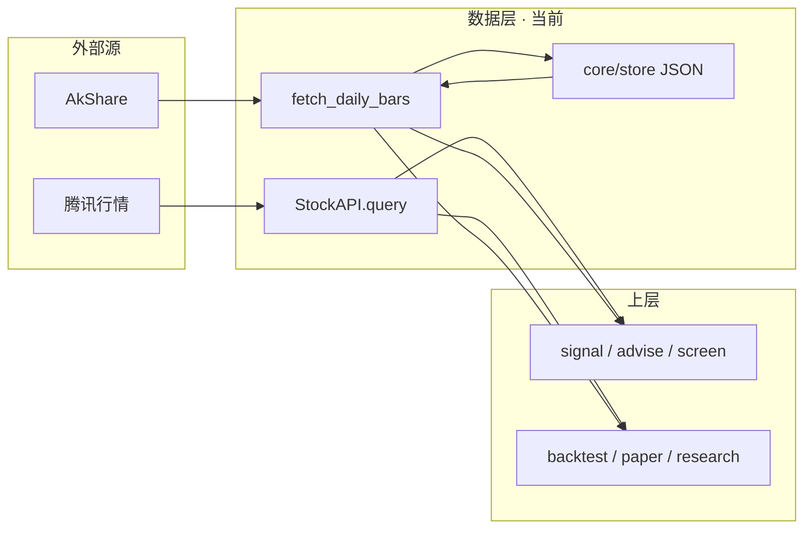
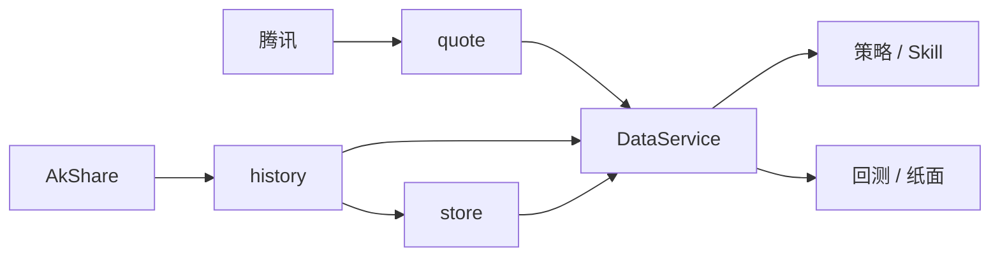

# 数据层（Data Layer）

[← 文档索引](README.md) · 工程分层见 [architecture.md](architecture.md) · 量化缓存细节见 [quant.md · 第五层](quant.md#第五层数据缓存与可复现corestorepy)

数据层是量化系统的「燃料库」：屏蔽外部数据源差异，为策略 / 回测 / Skill 提供相对干净、统一的数据。  
**本仓库现状**：按需拉取 + 轻清洗 + JSON 短缓存 + **DataService 统一读口** + 观察池日线增量 / 基本面·资讯快照缓存 —— **不是** 全市场批式 ETL / Tick 仓 / 完整财务 PIT。  
**存储选型**：现行坚持本地 JSON/JSONL，不上库；理由与触发条件见下文 [存储选型](#存储选型为何是-json何时才上数据库)。

---

## 成熟模型：五个模块

| # | 模块 | 职责 |
|---|------|------|
| 1 | **采集（Ingestion）** | 从券商 / Tushare / 聚宽 / 行情站等搬运原始数据；定时任务、断点续传、重试 |
| 2 | **清洗与标准化（Cleaning）** | 缺失填充、复权、时间戳对齐、统一字段（如 `open/high/low/close/volume`） |
| 3 | **存储（Storage）** | 时序库存 K 线/Tick；关系库存标的与财务；文件存文本/PDF |
| 4 | **服务与接口（Service）** | 上层唯一窗口：如 `get_price(symbol, start, end, fields)`；**PIT**；热点缓存 |
| 5 | **监控与运维（Monitoring）** | 完整度 / 异常值检查、日志、告警 |

**初期原则**：不必一次做满五块。优先主线 **采集 → 清洗 → 存储 → 简单接口**，先保证准确与 **PIT（无未来函数）**；监控后补。

---

## 本仓库对照（现状）

| 模块 | 成熟目标 | 当前落地 | 主要入口 |
|------|----------|----------|----------|
| **采集** | 定时多源 ETL | **按需 + 观察池预热**：腾讯现价 + AkShare；`bars_warmup` / `fundamentals_warmup` / `spot_refresh` | `DataService` · `schedule_jobs` · Skills 实现 |
| **清洗** | 复权一致、日历对齐、PIT | **薄清洗**：`normalize_bars`；日线 as_of；财务/资讯标明 **non_pit snapshot** | `history.normalize_bars` · `data_pit` |
| **存储** | 时序库 / 仓 | **JSON**：日线增量合并 · `fundamentals/` · `news/` 快照；无全市场仓 | `core/store.py` → `data/store/` |
| **服务** | 稳定 `get_price` | **DataService**：领域包 `core/data`（`MarketDataService` / Ports / 信封）+ 薄门面 `data_service.py`（dict 兼容） | `core/data/` · `core/data_service.py` · `core/ports` |
| **监控** | 覆盖率 + 告警 | **覆盖率**：`data_coverage`；warmup/日更出站；`quality` good/thin/empty | `core/data_coverage.py` · `alert_outbound` |

**刻意边界**（与 [architecture · 刻意不做](architecture.md) 一致）：不先上全市场时序仓 / Tick；**DataService + 观察池增量** 已落地；财务 PIT / 多源对齐另规划。

---

## 当前数据流

```text
Agent / Skill / Research / 纸面
        │
        ▼
   DataService（唯一读口）
        │
        ├─ get_quote ──────────────────► 腾讯 qt（内存约 60s）
        │
        ├─ get_bars (incremental)
        │     ├─ load/merge daily cache ► data/store/daily/{CN|HK|US}/{code}.json
        │     └─ AkShare（qfq）─────────► save_daily_cache + quality
        │
        ├─ get_spot ───────────────────► AkShare 现货 → spot_a_em.json
        ├─ get_fundamentals ───────────► 快照缓存 data/store/fundamentals/
        └─ get_news ───────────────────► 快照缓存 data/store/news/
```



环境变量：`INVESTMENT_STORE_DIR` · `INVESTMENT_DISABLE_CACHE=1`（见 [roadmap · P4.2](roadmap.md)）。

---

## 软合约（上层应依赖的形状）

**日线 bar**（`normalize_bars`）：

```text
{ date, open, high, low, close, volume, amount? }
```

`volume` 仅成交量；`amount` 为独立成交额（有则保留）。二者不再混用。

**实时行情**（`StockAPI.query`）：`success` + `price` / `change_*` 等；同 symbol 约 60s 内存缓存。

**质量与来源**：缓存条目带 `quality.level`（`good` / `thin` / `empty`）与 `data_source`；live 若走 `quote_fallback`，与回测完整日线 **可能不一致** —— 解读时必须说明。

**P1 生产评分门禁**（`allows_production_score` · `score_stock`）：仅 `quality.level=good` 且非 fallback 可进生产 `score`；`thin` / `empty` / `quote_fallback` → `hard_reject`（`quality_gate=True`），**不调用** `score_bars`。历史回测仍直接调 `score_bars`，不受门禁影响。研究可传 `bypass_quality_gate=True`。`get_bars(reject_quote_fallback=)` / offline 路径默认拒绝伪日线。

**行业 vs 板别（DS-R2）**：`_sector_for` 只读 `sector_map`（未映射=`未分类`）；板别启发式在 `_board_for` / exposure `styles`。行业限额与中性化只吃 sector。

**ann_missing（DS-R3）**：`fundamentals.ann_missing_policy` 默认 `zero_weight`；码占比超 `ann_missing_code_ratio_block` 时 DQ=`bad`。

**复权策略**：声明策略 `DEFAULT_ADJUST_POLICY=qfq`，写入 Run Manifest 顶层 `adjust_policy`；实际源可能为 `none` / `cached`（见 `infer_adjust`）。

**PIT 最小约定**（日线 as_of 已接线；财务 history 面板 R1 最小可用）：

| 数据类型 | PIT？ | 说明 |
|----------|-------|------|
| 日线回测窗口 | **是（研究近似）** | `core/data_pit.window_as_of`；单票/组合回测打分窗只含决策日及以前；`get_bars(..., as_of=)` 可切条 |
| 基本面 | **live+研究 as_of（X0）** | live `score_stock` 经 `resolve_live_fundamentals` 与 panel/OLS 同源；缺 ann 标 `ann_missing`；覆盖见 DQ / sample_ops |
| 资讯标题 | **否** | 实时拉取，不作历史面板；舆情因子演进见 [sentiment-layer.md](sentiment-layer.md) |

### 验证宇宙约定（V0）

| 项 | 约定 |
|----|------|
| 配置 | `data/validation_universe.json`：`include_only` 非空则只用该列表，否则 `watching − exclude_codes` |
| 空财务 | `GET /api/ops/empty-fundamentals`；长期拉不到的码写入 `exclude_codes`，勿用 demo ladder 冒充覆盖 |
| 真实多期入库 | `python3 research/sample_ops_run.py ingest-history --codes …`；调度 `fundamentals_warmup` **默认**串联 ingest（可传 `ingest_history=false` 关闭） |
| 禁止 | `seed-ladder` / `synthetic_demo` 点不得计入「策略已验证」；闸门看 `real_multi_coverage` |

**约定**：生产决策不得依赖「当日不可见」的未来 bar / 未来财报；`pit_report.fundamentals` 汇总 resolved_ok / missing_as_of。  
这与产品本质一致：**只根据当时已发生事实做影响估计**（见 [design-spine · 因果链](design-spine.md#因果链已发生--影响估计--动作)）。

---

## 存储布局（运行时）

| 路径 | 内容 |
|------|------|
| `data/store/daily/{CN\|HK\|US}/{code}.json` | 日线 bars + `fetched_at` + quality + `date_min/max`（增量合并；默认不入 git） |
| `data/store/fundamentals/{code}.json` | 基本面快照 + `history[]`（真实多期 / 可选 synthetic_demo）+ `fetched_at` |
| `data/store/news/{code}.json` | 资讯标题快照 + `fetched_at`（non_pit） |
| `data/store/spot_a_em.json` | A 股现货筛选磁盘兜底 |
| `data/watching.json` · `paper.json` · `signal_config.json` … | 产品配置 / 账户（非行情仓） |
| `data/reports/` | 量化日报归档 |

详见 [data/README.md](../data/README.md) · [data/store/README.md](../data/store/README.md)。

---

## 存储选型：为何是 JSON，何时才上数据库

**结论（现行）**：配置与账本继续 JSON；**日线/分钟线缓存**走工程结构轨 **A1**：默认 SQLite WAL（`INVESTMENT_BARS_BACKEND=sqlite`），可回滚 `json`。账户、信号配置、交易流水仍 **本地 JSON / JSONL**——与「策略验证、观察池级规模、暂不接实盘」对齐。

与 [architecture · 刻意不做](architecture.md#7-刻意不做的抽象)、[architecture-upgrade-a](architecture-upgrade-a.md)、[sqlite-migration](sqlite-migration.md) 一致：不为「专业感」把全部状态塞进一个库；行情按规模升 SQLite，配置保持可 diff。

### 各类数据落盘对照

| 类别 | 落盘 | 典型路径 | 说明 |
|------|------|----------|------|
| **模拟账户** | JSON | `data/paper.json` | 假钱账本（现金 · 持仓 · 成交）；非券商实盘 |
| **观察池** | JSON | `data/watching.json` | 产品状态，非行情仓 |
| **信号 / 规则配置** | JSON | `signal_config.json` · `position_rules.json` | 人审可改；晋升有备份约定 |
| **日线 / 分钟线** | SQLite（默认）或 JSON | `data/store/bars.db` · 或 `daily|minute/**/*.json` | `INVESTMENT_BARS_BACKEND`；上层经 DataService / ports |
| **基本面 / 资讯** | 按标的 JSON | `data/store/fundamentals|news/` | 快照 + PIT 面板；不进 bars.db |
| **决策 / TTM 事件** | JSONL 追加 | `decisions.jsonl` · `ttm_events.jsonl` | 流水审计，轻量追加写 |
| **日报 / 告警** | JSON · MD | `quant_daily.json` · `reports/` · `alerts/` | 运行时产物 |

上层统一经 **DataService** / `core/store` 读写；禁止业务层散落直接扫盘当「隐式数据库」。

### JSON 适用原因（现行）

- **规模匹配**：观察池级日线，不是全 A / Tick
- **可读可 diff**：配置与账本可 git / 手改 / 备份；零运维
- **产品阶段**：只做假设 → 回测 → 纸面；无多账户并发 OMS
- **边界清晰**：全市场数仓 / Tick / 多源对齐 — **不做（锁定）**

### 已知局限（可接受，直到触顶）

| 风险 | 何时会痛 |
|------|----------|
| **并发写覆盖** | 多进程同时改 `paper.json` |
| **聚合查询弱** | 跨票 / 跨日 SQL 式分析要自己扫文件 |
| **文件膨胀** | 全市场多年日线、分钟线、Tick |
| **事务与强审计不足** | 实盘订单、资金流水要回滚 / 对账 |

单机、单用户、策略验证阶段，上述多数尚未成为瓶颈。

### 何时再上库（分类型，而非一刀切）

| 触发条件 | 建议方向 |
|----------|----------|
| 现行（策略验证 / 纸面） | 配置/账本 **JSON**；bars **SQLite 默认**（可切 `json`）；读写收口 DataService / store |
| 观察池再变大、跨票聚合仍痛 | 可再评估 **Parquet / 按日分区**（与 bars.db 并存，不吞配置） |
| 接实盘 OMS、多账户、强审计（N6 闸门后） | 账户与成交 → **SQLite / Postgres**；行情仍可用文件或时序库 |
| 全市场批式研究 | 专门行情仓；**与产品配置 JSON 分开** |

原则：**配置与小状态继续文件；账本按一致性需求升级关系库；行情按规模升级列式/时序** —— 不要「全部迁进一个 SQLite」当银弹。

---

## 演进（M1 路径内已收口 / 仍待）

| 项 | 状态 |
|----|------|
| **M1.1 DataService 收口** | **已落地**：`get_quote/bars/fundamentals/news/spot`；quant/paper/research 经 DataService |
| **ports adapter 注入** | **已落地**：`skills.ports_bind` → `core.ports.adapters`；`market.py` 不硬 import skills |
| **M1.2 观察池覆盖率** | **已落地**：`data_coverage` · `bars_warmup` / `paper_daily` 汇总 + 出站 |
| **M1.3 基本面/资讯快照缓存** | **已落地**：`data/store/fundamentals|news` · `non_pit` · `fundamentals_warmup` |
| **M1.4 观察池日线增量** | **已落地**：`merge_bars_by_date` · `fetch_daily_bars(incremental=True)` |
| 复权多策略 `qfq\|hfq\|raw` | **D2 已落地**：`get_bars(adjust=)` · 缓存 `adjust_policy` 防混用；hfq 不可用回退 |
| 财务公告日 PIT | **D0 已加深**：ingest 写 `ann_date`/`available_as_of`；无则 `ann_missing` |
| 交易日历 lite | **D3 已落地**：`core/market_calendar.py` |
| DQ 中心 | **D4 已落地**：`GET /api/ops/data-quality` |
| **DS-R0 日线缓存 path_lock** | **已落地**：`save_*` / `merge_save_daily_cache` / snapshot 写路径持锁 |
| **DS-R1 TTL 一元化** | **已落地**：`core/data_policy.py`；store IO 计入 DQ `store_io` |
| **DS-R2 行业≠板别** | **已落地**：`_sector_for`→未分类；`_board_for`/styles 仍板别 |
| **DS-R2.1 清洗伪主题** | **已落地**：`is_board_label`；`scrub_board_labels_from_sector_map`；sync 不再写板别 |
| **DS-R2.2 现货行业补全** | **已落地**：`enrich_sector_map_from_spot`；调度 `sector_map_enrich` / `spot_refresh` 串联；风控覆盖闸门 |
| **DS-R3 ann_missing 门禁** | **已落地**：`ann_missing_policy`（默认 zero_weight）；DQ ratio→bad |
| **DS-R4 拒 quote_fallback** | **已落地**：`reject_quote_fallback`；伪日期 quality=empty；offline 默认拒 |
| **DS-R5 刷新锁/裁剪** | **已落地**：`code_refresh_lock`；日线/分钟 trim 上限 |
| **DS encapsulate** | **已落地**：`core/data/`（`BarsResult`/`DataEnvelope` · `MarketPorts` · `MarketDataService`/`ResearchDataService`）；`data_service.py` 薄门面仍返回 dict |
| **DS-E1 读口收口加深** | **已落地**：paper/threshold OOS/`portfolio_bars` 远端补数经 DS 且拒 fallback；`get_bars_batch` · `set_research_service`；spot `mem_cache` source；空宇宙 coverage=`None`；非 bars 信封显式 `production_ok` |
| **DS-E2 评分读口 + 可观测** | **已落地**：`score_stock.fetch_daily_bars`→DS 缓存+`bars_pack_worker` 池；bars 空宇宙 coverage=`None`；`metrics_snapshot`；batch 默认 adjust；ledger/insights `resolve_market_code` 经 ports |
| **DS-E3 quote/指数/惰性包** | **已落地**：paper quote/batch 经 DS；`get_index_bars`；`portfolio_bars` 离线不打 quote；lazy `core.data.__getattr__`；DQ 暴露 `data_service_metrics` |
| **DS-E4 收口扫尾** | **已落地**：`as_dict` 保留 kind/ok；score/watching/facts/schedule/cluster/event 行情经 DS；warmup 挂 metrics；topk 指数经 DS；portfolio 最终 resolve 跟 offline 语义 |
| **DS-E5 可观测 + 锁** | **已落地**：平台 DQ/调度 last 展示 `data_service_metrics`；`spot_refresh` 挂 metrics；`reset_metrics` 导出；框架锁业务禁直 import ports 读行情；仪表盘指数经 DS |
| **A1 Bars SQLite** | **已落地**：`INVESTMENT_BARS_BACKEND` · `core/store_bars_sqlite.py` · `scripts/migrate_bars_to_sqlite.py`；见 [sqlite-migration](sqlite-migration.md) · [architecture-upgrade-a](architecture-upgrade-a.md) |
| 全市场数仓 / Tick / 多源对齐 | **不做**（锁定） |

### 采集运维

- `POST /api/schedule/run` kinds：`bars_warmup` · `spot_refresh`（可串联行业补全）· `sector_map_enrich` · `fundamentals_warmup`（默认 ingest 真实 history）· `paper_daily` · `validation_prepare` · `sentiment_scan`
- 验证宇宙卫生：`GET /api/ops/validation-hygiene` · `POST /api/ops/validation-prepare`
- 舆情 as_of：`GET /api/ops/sentiment-as-of?code=&as_of=`
- 覆盖率字段：`coverage` / `data_coverage`（mapped、stale、levels）
- 告警码：`bars_coverage_thin` · `bars_stale` · `bars_empty` → `alert_outbound`
- 预热默认标的：验证宇宙（`validation_universe`）优先，否则 watching

目标交互（演进后）：



与路线图差距表一致：[roadmap · 当前定位 vs 量化系统](roadmap.md#当前定位-vs-量化系统)（数据行：实时拉取 → 本地历史库、复权一致、多源对齐）。

---

## 相关代码速查

| 能力 | 路径 |
|------|------|
| 现价 | `skills/common/quote_api.py` |
| 日线拉取 + normalize | `skills/common/history.py` |
| 日线缓存 R/W · quality | `core/store.py` |
| **DataService（N1/M1）** | 门面 `core/data_service.py`（模块函数 → dict）；领域 `core/data/`（`MarketDataService` · `BarsResult` · `MarketPorts`） |
| TTL / 质量阈值 | `core/data_policy.py` |
| 财务 PIT 面板 | `core/fundamentals_pit.py` |
| 样本运营 / 验证宇宙 | `core/sample_ops.py` · `core/validation_universe.py` · `GET /api/ops/sample-status` |
| 成熟闸门 | `core/maturity_gate.py` · `GET /api/ops/maturity-gate` · [n6-live-gate.md](n6-live-gate.md) |
| 源一致性审计 | `core/data_consistency.py` |
| 覆盖率 | `core/data_coverage.py` |
| 路径 | `core/paths.py`（`STORE_DIR`） |
| 缓存 CLI | `research/cache_cli.py` |
| 调度预热 | `core/schedule_jobs.py`（`bars_warmup` · `spot_refresh` · `fundamentals_warmup`） |
| 现货筛选 | `skills/screen/engine.py` |
| 基本面 / 资讯 | `skills/fundamentals/engine.py` · `skills/news/engine.py` |

上层调用约定：Agent 只解读 Skill JSON 中的数字，**不得编造**行情或财务字段（见 architecture 原则「数据与建议分离」）。
