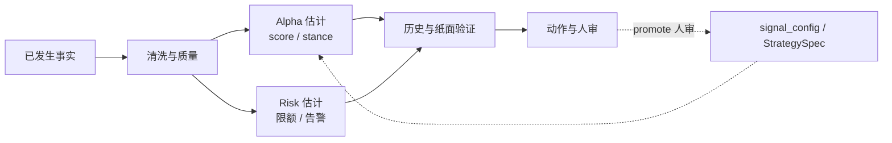
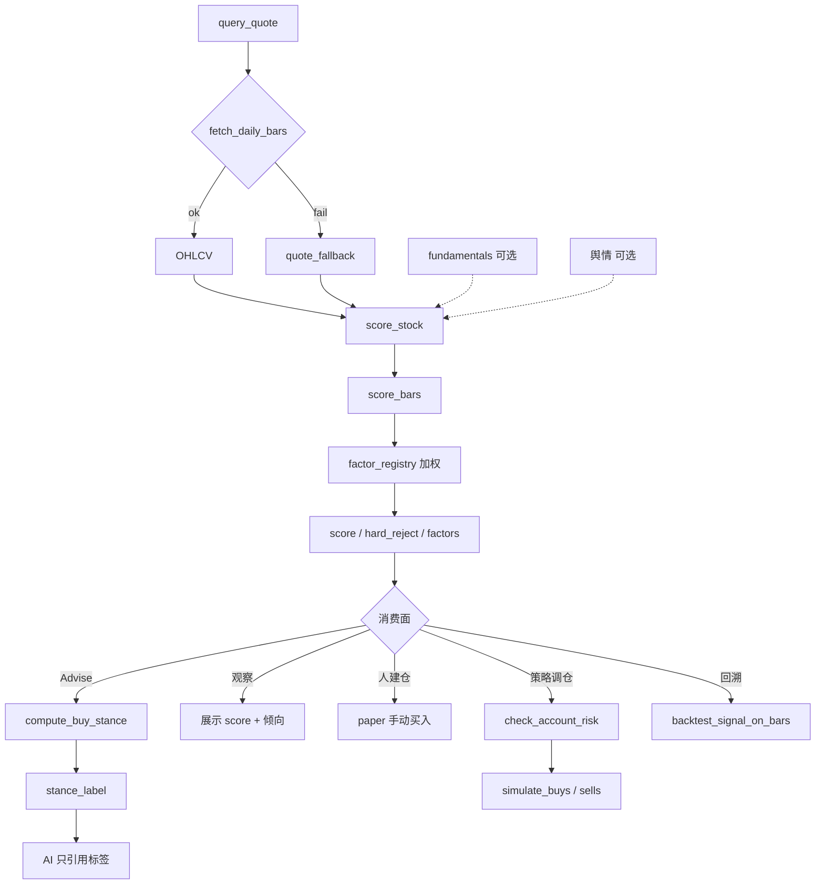

# 产品核心设计主轴

[← 文档索引](README.md) · 工程分层见 [architecture.md](architecture.md) · 因子/stance 细节见 [quant.md](quant.md) · Web 主路径见 [quant-ui.md](quant-ui.md)

本文是产品的 **核心设计主轴**，分三层读：

1. **本质与因果链**：已发生事实 → 影响估计 → 验证 → 动作（见 [因果链](#因果链已发生--影响估计--动作)）。  
2. **现行实现主轴**：数据 → 信号 → 因子 → 倾向 → 动作；**量化主轴 + AI 旁路**两条轨（可复现、可验收）。  
3. **北极星与能力地图**：北极星 = **策略落地为稳定风险调整收益的转化效率**（见 [产品北极星](#产品北极星)）；六大模块是支撑能力地图，不是北极星本身。**现行产品边界** = 研究台 + 模拟账户（**策略验证**）；真·实盘 OMS **暂不启动**，待策略在回测与纸面验证成熟后另立项（N6）。

其它文档（控制论、金字塔、策略层、Web 说明书）都围绕本主轴展开，不与之冲突。

---

## 产品边界（现行）

| | 说明 |
|--|------|
| **定位** | **策略验证**系统：信号、策略、回测、模拟账本、AI 编排 |
| **交易** | **仅限模拟账户**（`data/paper.json` / Web「交易执行」）；行情可为真实，成交只记本地假账 |
| **阶段** | 先验证策略是否可复现、可风控、回测–纸面拟合可接受；**暂不接实盘** |
| **不做（现行）** | 真实券商账户下单、代客交易、保证收益、持牌投顾 |
| **以后（N6）** | 策略验证成熟后再支持实盘交易（另立项；不计入当前北极星分子） |
| **用语** | 对外称「模拟」；内部 canonical 名 `paper`（纸面）。「准实盘」= 用模拟账户逼近实盘流程，**不是**接券商 |

---

## 一句话

**本质**：只根据**当时已经发生、可审计**的事实，估计其对股票（及组合）的边际影响；不是预言未发生的事。  
**现行**：确定性量化主轴算出数字与倾向；AI 旁路负责编排与解释；谁决定买什么、买多少就归谁；**一切买卖仅发生在模拟账户（策略验证阶段），不涉及真实账户交易**。  
**北极星**：最大化「假设 → 验证 → 纸面落地」的 **风险调整收益 × 迭代速度 × 回测–纸面拟合度**（见 [产品北极星](#产品北极星)）；六大模块是地图；真·实盘 Realization 单列 **N6**（验证成熟后另立项）。

```text
【本质】已发生事实 →（可复现映射）→ 对标的/组合影响的估计 → 倾向与动作（人审边界内）
【现行】数据 → 信号(score) → 因子加权 → 倾向(stance) → 动作(观察/人建仓/规则调仓/回溯)
【北极星】纸面夏普/卡玛 × 假设验证速度 × 回测–纸面拟合度
【阶段】策略验证（研究台+纸面）→ 成熟后 N6 实盘（另立项）
【能力地图】收集 → 清洗 → 因子/模型 → 组合/风控 → 回测 → 纸面迭代（→ N6 实盘）
```

---

## 因果链：已发生 → 影响估计 → 动作

量化在本仓库的工作定义：

> **用决策时点 \(t\) 及以前可得的信息，估计对股价路径 / 相对吸引力 / 风险敞口的影响；再映射为可审计的分、倾向与（纸面）动作。**

这与「预测明天一定涨」不同：输出是 **条件估计与排序**，须能回答「依据哪些已发生事实、用哪套规则、排除了什么」。

### 因果链总图

```text
已发生事实（t 及以前可见）
    │  价量 · 基本面快照 · 标题情绪 · 账户状态 · 历史规则表现
    ▼
清洗 / 质量门禁（无脏数据进生产分）
    │  normalize · quality · adjust_policy · allows_production_score
    ▼
影响估计（Alpha / Risk 两条估计）
    ├─ Alpha：因子子分 → 加权 score → stance_label（相对吸引力与倾向）
    └─ Risk：回撤/集中度/成本/滚动 IC（能买多少、要不要停）
    ▼
验证（规则是否仍有效）
    │  回测 · OOS/regime · WF · IC · 纸面五问
    ▼
动作（谁拍板）
    │  观察只读 · 人建仓 · 策略调仓 · 告警→人审 promote
    ▼
（可选）配置迭代 —— 只经人审，不静默写盘
```



### 对照现有模块

| 因果环节 | 在估什么 | 本仓库落点 | 硬边界 |
|----------|----------|------------|--------|
| **事实输入** | 当时可见的价量、财务、资讯、账本 | `ports` · `fetch_daily_bars` · fundamentals · sentiment · `watching` / `paper` | 基本面多为 **snapshot**（非完整 PIT）；须在质量/文档标明 |
| **清洗门禁** | 能否进入生产估计 | `normalize_bars` · `assess_quality` · `allows_production_score` · manifest `adjust_policy` | thin/empty/fallback → `hard_reject`，不硬塞分 |
| **Alpha 估计** | 已发生形态对「相对吸引力」的影响 | `factor_registry` · `score_bars` · `compute_buy_stance` | 生产 Alpha = **线性可解释加权**；LLM **不改** `score` / `stance_label` |
| **Risk 估计** | 已发生敞口对「能买多少 / 要不要停」的影响 | `check_account_risk` · `optimize_weights` · `strategy_monitor`（回撤 · 滚动 IC · 行业覆盖） · 成本 `simple_cn` | 监控 **只告警**；不自动改权、不代客下单 |
| **验证** | 同一规则在历史上是否仍有效 | `backtest` · OOS/regime · `wf_slices` · IC / `weight_suggest` · 纸面 `ops_report` 五问 | 研究结果 ≠ 实盘保证；OOS 失败须可见 |
| **动作** | 估计如何变成可审计行为 | 观察 · 人建仓 · `run_daily_cycle` / 横截面调仓 · `paper_daily` · DecisionRecord | **现行不接 OMS**（策略验证）；配置变更走 feedback → **人审 promote** |
| **旁路解释** | 把估计讲给人听 | Agent / Skills / prompts | 只能 **引用** `stance_label`，不得改写数字 |

### 与六大模块的对应

| 六大模块 | 在因果链中的角色 |
|----------|------------------|
| 1 收集 | 扩大「已发生事实」的覆盖面 |
| 2 清洗 | 保证事实在 \(t\) 合法、可复现（PIT / 复权 / 质量） |
| 3 因子/模型 | 事实 → 影响的 **Alpha 映射**（现行线性；NN 仅研究轨） |
| 4 组合/风控 | 事实 → 影响的 **Risk 映射**（限额、集中度、成本） |
| 5 回测 | 用**更早的已发生区间**检验映射是否过拟合 |
| 6 实盘迭代 | 用**新发生的结果**检测衰减，人审后更新映射（纸面代替 OMS） |

### 反例（本仓库刻意不做）

| 反例 | 为何违背本质 |
|------|----------------|
| 用 \(t+1\) 才可知的 bar / 财报打 \(t\) 日的分 | 把「未发生」当「已发生」（未来函数） |
| LLM 直接改写 `score` / `stance_label` | 估计不可审计、不可回放 |
| 监控自动改 `signal_config` | 把告警当成已验证的因果结论并静默执行 |
| 券商 OMS 未闸门上线 | 把「影响估计」直接变成不可撤销的真实下单 |

更细的逻辑链（数据→信号→因子→倾向→动作）见下文；PIT 约定见 [data-layer.md](data-layer.md)；风控对照见 [risk-layer.md](risk-layer.md)。

---

## 产品北极星

<a id="产品北极星"></a>

> **最大化「策略从假设验证到纸面落地」产生稳定风险调整后收益的转化效率与确定性。**
>
> 系统价值 ≈ **纸面风险调整收益 (Paper Risk-Adjusted Return)** × **研发迭代速度 (Iteration Velocity)** × **回测–纸面拟合度 (Paper Realization Rate)**
>
> 真·实盘 Realization（券商 PnL 相关）单列 **N6**：现行策略验证阶段不接 OMS，故不塞进当前北极星分子——避免把第三项结构性归零，同时又用含 OMS 的满分画像制造虚假满分压力。待回测+纸面验证成熟后再立项。

专业全栈公式是 `Live Sharpe × Velocity × Live Realization`。本仓库在**策略验证阶段**把 **Live → Paper**：用模拟账本逼近「可落地」；用 **回测–纸面拟合** 代理「实盘确定性」，直到 N6。

### 为什么不是「六大模块完成度」

| 旧口径（已废弃为北极星） | 新口径 |
|--------------------------|--------|
| 北极星 = 专业六大模块满分画像的完成百分比 | 北极星 = 三项乘积的转化效率 |
| 验收信号：「模块粗估 %」「五问能答」 | 验收信号：滚动纸面夏普/卡玛 · TTM · 回测–纸面相关 |
| 优化易滑向「再补一个能力模块」 | 优化须回答：是否抬高三项之一、且不损另外两项 |

六大模块 **降级为能力地图**（见下节）：回答「我们有哪些支撑能力」；**不**回答「系统价值有多高」。

### 三大支柱（路径内）

| 支柱 | 含义 | 本仓库落点 |
|------|------|------------|
| **风险调整收益** | 不追单次暴利；追求可复现的超额与可控回撤 | 纸面滚动夏普 / 卡玛；回测夏普是诊断，不是北极星本身 |
| **迭代速度** | Alpha 衰减快；假设 → 数据 → 回测 → 纸面要快 | Time-to-Market；研究台吞吐（非仅人审稳态） |
| **拟合度** | 回测美、落地惨是最大损耗 | 研究 / 纸面 / 回测 **共用 `score_bars`**；强制成本与 OOS；追踪回测曲线 vs 纸面净值相关 |

### 二级核心指标（可追踪）

| 维度 | 指标 | 业务含义 | 路径内现状（2026-07） |
|------|------|----------|----------------------|
| **收益质量** | **滚动纸面夏普 / 卡玛** | 模拟账户风险调整后表现（主 KPI） | **R0 已仪表化**：`core/north_star` · `/api/north-star` · 日更 `north_star`；样本不足为 unavailable |
| **研发效率** | **Time-to-Market** | Idea → 可复现回测报告（再 → 纸面规则跑通）的中位时间 | **R0 已打点**：`ttm_events.jsonl`（反馈建议 / 回测 / promote）；中位小时可查 |
| **落地确定性** | **回测–纸面 PnL 相关 / 跟踪误差** | 同一策略窗口下回测资金曲线与纸面净值的拟合 | **R0 已仪表化**：回测落盘曲线 + Corr/TE；无交集时 unavailable |
| **风控底线** | **拦截有效率 · 误拦率 · 零重大事故** | 硬拦是功能；有效率才是结果 | 有硬拦流水计数；**有效率/误拦率仍待标注** |
| **（边界外）** | 端到端 Tick→确认延迟 | 高频关键路径 | 日线研究台；**不做微秒 KPI** |

### 角色视角映射

| 角色 | 其北极星 | 系统应支撑 | 路径内覆盖 |
|------|----------|------------|------------|
| **研究员** | 快速验证 Alpha 是否有效 | 数据 API、可复现回测、参数/因子实验吞吐 | 部分：回测/IC/五问；弱：IDE、参数曲面、TTM |
| **交易执行（纸面）** | 以可审计、低损耗执行策略意图 | 预演→确认、成本可见、限额硬拦 | 有：调仓五问/日更；无 OMS/盘口（边界外） |
| **风控 / 运维** | 守底线且不无谓挡正常调仓 | 敞口可见、拦截可查、告警→人审 | 碎片：待办/五问/健康；缺专台与有效率 |

### 需求拷问（Actionable）

任一功能进规划前须能答「抬高公式哪一项」；答不上来则降级或砍掉。

1. **防幻觉**：是否鼓励无约束调参到完美曲线？须保留真实成本、OOS/WF、交叉验证可见。  
2. **防割裂**：研究 / 回测 / 纸面是否同一套计分与数据约定？禁止「回测一套、纸面另一套」。  
3. **速度服务闭环**：是否缩短 TTM，或只是装饰性报表/炫技 UI？  
4. **风控内嵌**：拦截是否在动作生效前硬拦？事后邮件不算抬高风控柱。  
5. **边界诚实**：是否把 N6/OMS 能力误标成当前北极星进度？

---

## 能力地图（六大模块）

<a id="专业系统北极星满分画像"></a>
<a id="能力地图六大模块"></a>

标准化量化投研闭环的 **支撑能力地图**（原「满分画像」）。用于对照缺口与排期 N1–N6；**模块完成度 ≠ 北极星达成度**。

```text
多维数据收集
    → 数据清洗与预处理
    → 因子挖掘与模型构建（Alpha 打分）
    → 组合优化与风险控制
    → 历史回测验证
    → 纸面部署与动态迭代（真·实盘 = N6）
         └── 监控 · 衰减检测 · 参数/策略迭代 ──→（回写模型与配置）
```

默认路径 **现行不承诺 OMS / Tick 全量 / 黑盒 NN 上线**（见锁定取舍）。实盘交易待策略验证成熟后走 N6。

| # | 模块 | 专业栈能力目标（对照） | 本仓库采纳目标（路径内） | 本仓库现状 | 主要落点 / 仍缺 | 主要服务北极星柱 |
|---|------|------------------------|--------------------------|------------|-----------------|------------------|
| 1 | **多维数据收集** | 统一行情仓（日/分钟/Tick）+ 财务/宏观/另类；多源对齐、可订阅增量 | 日线 + 现货 + 基本面快照 + 资讯标题可复现拉取；薄 `DataService` | **部分 ~62%** | **M1 已收口**：DataService · 覆盖率 · 快照缓存 · 观察池日线增量；仍缺 Tick/宏观/全市场数仓 | Velocity · 拟合（数据一致） |
| 2 | **数据清洗与预处理** | 完整 **PIT**、复权策略参数化、公司行为、日历对齐、质量分级进生产门禁 | 日线 as_of 切条；`quality` 门禁；`adjust_policy` 进 manifest；基本面标明非 PIT | **部分 ~58%** | `normalize` · `allows_production_score` · `data_pit` · `pit_report`；缺财务 PIT / 复权多策略缓存 | 拟合（防未来函数） |
| 3 | **因子挖掘与模型** | 大规模因子库 + IC/IR 流水线 + 中性化；可选 ML/NN，artifact 冻结可 promote | 可解释线性 `score_bars`；IC / `weight_suggest` 只读导出；NN **仅研究轨** | **规则加权 ~60%** | `factor_registry` · 横截面中性化 · 策略页 IC；NN 不上生产 `score` | Velocity · 收益质量 |
| 4 | **组合优化与风控** | QP/风险预算求解；单票/行业/风格暴露；VaR/限额实时；成本与冲击进目标函数 | 分数风险预算 + `risk_parity_lite` + 暴露矩阵 + 单票/行业硬拦；行业 map 覆盖与预算告警；纸面止损/回撤熔断 | **部分 ~68%** | `optimize_weights` · `risk/budget` · `check_account_risk` · `exposure`；仍缺完整 QP / 风格因子 / 实时 VaR | 收益质量 · 风控底线 |
| 5 | **历史回测验证** | 组合级事件驱动；T+1/涨跌停/冲击；WF/OOS/多 regime；Brinson/因子归因 | 共用 `score_bars`；成本对照；WF/OOS/regime；撮合近似（板别涨跌停 + 跌停延后卖）；个股/行业/选股超额归因 | **较强 ~80%** | `backtest` · `matching` · `attribution` · `wf_slices`；非交易所级仿真 | 拟合 · 收益质量诊断 |
| 6 | **部署与迭代** | OMS/券商 API；实时监控与自动风控；衰减触发再训练/调仓流水线 | **纸面准实盘（策略验证）**：日更调度、滚动 IC、告警出站、人审 promote；**现行不接 OMS** | **模拟 ~52%** | `paper_daily` · `strategy_monitor` · `alert_outbound`；N6 = 验证成熟后另立项 | 纸面收益 · 拟合闭环 |

### 专业 vs 本仓库：一句话对照

| 维度 | 专业全栈 | 本仓库（路径内） |
|------|----------|------------------|
| **北极星终点** | 实盘风险调整收益 × 速度 × 实盘拟合 | **纸面**风险调整收益 × 速度 × **回测–纸面**拟合 |
| 输出 | 确定性信号 → 回测 → 执行 → 监控 | 同左，执行止于 **纸面**；AI 只解释不改分 |
| 决策 | 策略代码为主 | `score` / `stance` 规则为主；LLM **旁路** |
| 数据 | 本地历史库 + PIT 面板 | 按需拉取 + 缓存 + 日线 as_of；财务仍 snapshot |
| 验证 | OOS / IC/IR / 归因 / 成本冲击 | OOS · WF · IC · 近似撮合 · 简化归因 |
| 交易 | OMS / 券商 API | **现行不代客下单**；纸面账本验证策略；成熟后 N6 |

### 模块意图速览（与上表同义）

| # | 模块 | 产品意图（压缩） |
|---|------|------------------|
| 1 | 多维数据收集 | 交易所行情、财经财务、社区情绪等另类数据，维度尽量全 |
| 2 | 数据清洗与预处理 | 标准化、剔异常/缺失/错误，保证入模质量与一致性（PIT） |
| 3 | 因子挖掘与模型构建 | 抽象量价/基本面/情绪因子；复杂非线性可研究，生产须可审计 |
| 4 | 组合优化与风险控制 | 目标如年化/回撤；单票/行业集中度约束 |
| 5 | 历史回测验证 | 代入历史模拟交易，验年化、回撤、多环境稳健性 |
| 6 | 部署与动态迭代 | 上线监控、风格切换与模型衰减时调参迭代（本路径=纸面） |

### 能力地图子项目拆分

<a id="北极星子项目拆分"></a>

> **结论**：能力地图拆成 **6 个子项目**（上表六大模块）；工程实现拆成 **6 条轨（N1–N6）**，与模块大致一一对应。  
> 本仓库默认可交付立项 ≈ **5 条（N1–N5 加深）+ 1 条闸门后立项（N6 OMS）**。不新增「第七大模块」。  
> **排期优先级**须先过 [需求拷问](#需求拷问actionable)：优先抬高纸面夏普/卡玛、TTM、回测–纸面拟合；模块填空次之；**不在验证未成熟时并行冲 N6**。

| # | 子项目（能力模块） | 工程轨 | 路径内目标（压缩） | 相对对照粗估 | 状态 |
|---|--------------------|--------|--------------------|--------------|------|
| 1 | 多维数据收集 | **N1** | DataService / 可复现拉取 | ~62% | 骨架 + M1 已收口 |
| 2 | 数据清洗与预处理 | **N1**（同轨加深） | 日线 PIT、质量门禁 | ~58% | 骨架；财务 PIT 仍弱 |
| 3 | 因子挖掘与模型 | **N2** | 线性 `score_bars` + IC；NN 仅研究轨 | ~60% | 骨架落地 |
| 4 | 组合优化与风控 | **N3** | 分数预算权重 + 波动缩放 + 限额硬拦 | ~60% | 骨架 + 动态轻量 |
| 5 | 历史回测验证 | **N4** | OOS / WF / 成本 / 板别涨跌停·跌停延后 | ~80% | 骨架；最强模块 |
| 6 | 部署与迭代 | **N5** 纸面 / **N6** OMS | 日更 + 告警 + 人审；**现行不接 OMS** | ~52% / 未启动 | N5 策略验证主路径；N6 验证成熟后另立项 |

```text
能力地图（6）          工程轨（6）
─────────────────      ────────────────────────────
1 数据收集          ──► N1 DataQuality（含收集）
2 清洗 / PIT        ──► N1（同轨加深）
3 因子 / 模型       ──► N2 FactorLab
4 组合 / 风控       ──► N3 PortfolioRisk
5 历史回测          ──► N4 BacktestOOS
6 部署与迭代        ──► N5 PaperOpsLoop → N6 LiveGate（另立项）
```

**立项口径**

| 口径 | 数量 | 说明 |
|------|------|------|
| **产品北极星** | **1** | 三项乘积；见 [产品北极星](#产品北极星) |
| 能力地图 | **6** | 专业栈对照模块；支撑北极星，不是北极星 |
| 工程实现轨 | **6** | N1–N6；模块 1+2 常合在 N1 一条里做 |
| 本仓库默认可交付 | **5 + 1** | N1–N5 加深进主路径；N6 OMS **验证成熟后另立项**（现行不排期） |

**下一刀（先问北极星柱，再挂模块）**：

| 优先 | 动作 | 抬高哪一柱 | 挂模块 |
|------|------|------------|--------|
| 1 | 滚动纸面夏普/卡玛进仪表盘与日更 | 收益质量 | 6 / N5 |
| 2 | 回测–纸面净值相关 / 跟踪误差 | 拟合度 | 5+6 / N4+N5 |
| 3 | 度量并压缩 TTM（研究台加深：参数扫描 / 写策略入口） | 迭代速度 | 3 / N2 + Web W3 |
| 4 | 风控拦截有效率 / 误拦率可见 | 风控底线 | 4 / N3 |
| 5 | 财务 PIT · 冲击成本 · 完整 QP（仍有价值，但次于上列仪表） | 拟合 / 收益质量 | 2 / 4 / 5 |

工程细节见 [实现路径（N1–N6）](#北极星实现路径n1n6) · [roadmap · N1–N6](roadmap.md#北极星实现路径n1n6)。

### 达成度评估（2026-07）

> **总判断**：能力地图相对专业对照未齐；现行主轴与 N1–N5 骨架可验收。**北极星三项已 R0 仪表化**；**R0–R5 主干已落地**。产品定位 = **策略验证**（研究台 + 纸面）；N6 真·实盘待验证成熟后另立项，现行不排期。

| 层 | 是否达成 | 说明 |
|----|----------|------|
| **产品北极星（三项乘积）** | **已仪表化 / 待用样本优化** | 滚动纸面夏普·TTM·回测–纸面相关可查；数值健康度随运行累积 |
| **能力地图（六大模块对照）** | **部分～较强** | 粗估整体约 **~70%～78%**；回测相对最强，部署（无 OMS）最弱 |
| **N1–N5 实现路径** | **P0–P2 可验收** | 五问/限额/质量/WF/IC/日更调度/告警→人审晋升已接线 |
| **现行主轴**（观察·策略·模拟·回溯 + AI 旁路） | **基本达成** | `score_bars` → stance → 建仓/调仓/回测共用计分；LLM **不改写** `score` / `stance` |
| **升级重构 R0–R5** | **已收口** | 见 [upgrade-refactor-plan](upgrade-refactor-plan.md) |
| **N6 真·实盘 OMS** | **未启动（有意推迟）** | 待回测 + 纸面验证成熟、合规就绪后另立项；**不计入当前北极星分子** |

**北极星二级指标基线**

| 指标 | 状态 | 下一步 |
|------|------|--------|
| 滚动纸面夏普 / 卡玛 | **R0 已落地** | 日更积累样本；与回测夏普分列解读 |
| Time-to-Market | **R0 打点 · R2 研究台已加深** | 继续压缩中位耗时 |
| 回测–纸面相关 / TE | **R0 已落地** | R1 PIT/冲击样本积累抬拟合 |
| 拦截有效率 / 误拦率 | **R3 可算**（须 `meta.outcome` 标注） | 补标注样本 |

**能力地图粗估（相对专业对照；非北极星 KPI）**

| # | 模块 | 粗估 | 一句 |
|---|------|------|------|
| 1 | 多维数据收集 | ~62% | DataService + 覆盖率 + 快照/增量；缺 Tick/宏观/数仓 |
| 2 | 数据清洗与预处理 | ~62% | 日线 PIT + 财务 PIT as_of；复权多策略仍弱 |
| 3 | 因子挖掘与模型 | ~62% | 线性可解释 + IC/权重/草稿晋升；NN 仅研究轨 |
| 4 | 组合优化与风控 | ~70% | 分数预算 + risk_parity_lite + 暴露矩阵 + 原因码/outcome；仍缺完整 QP |
| 5 | 历史回测验证 | ~85% | OOS/regime 分桶/WF/成本/Brinson lite/信号成交对照 |
| 6 | 部署与迭代 | ~55% | 纸面日更 + 滚动 IC + 出站告警 + 人审晋升；无 OMS |

**当前焦点**：**观察池日频+1 趋势探针**见 **[next-day-trend.md](next-day-trend.md)**；E 轨见 [evidence-strengthen.md](evidence-strengthen.md)。继续真实 `paper_daily`、财务预热；`GET /api/ops/data-quality` · `maturity-gate` · `sample-status`；**不冲 N6 / 全市场数仓 / 半日预判**。

### P0 落地状态（2026-07）

| 项 | 状态 | 落点 |
|----|------|------|
| 日更五问 | **已落地** | `ops_report` 顶层字段；模拟页「调仓五问」条；`paper_daily` DecisionRecord |
| 回测默认 cost/OOS/regime | **已落地** | API `apply_costs=True`；Web 指标卡与摘要展示 |
| 限额硬拦 + 日志 | **已落地** | `run_daily_cycle` / 横截面调仓拦截加仓；`risk_block` 操作日志 |
| data_quality 可查 | **已落地** | 调仓/日更/组合回测响应；`fallback_count` UI 文案 |

### P1 落地状态（已收口）

| 项 | 状态 | 落点 |
|----|------|------|
| 清洗门禁 | **已落地** | `allows_production_score`；`score_stock` 对 thin/empty/fallback → `hard_reject` |
| 复权策略进 manifest | **已落地** | `adjust_policy=qfq` 顶层字段；`summarize_data_quality.gated_count` |
| PIT 最小约定 | **文档化** | [data-layer.md](data-layer.md) |
| OOS 失败标红 | **已落地** | `oos_summary.failed`；组合回测指标卡 / 摘要 `down` |
| optimize 进调仓建议 | **已落地** | `last_optimize` / `target_weights` 进 ops_report 与日更/横截面；新开仓受目标仓上限 |
| StrategySpec 限额 UI | **已落地** | 策略页列表 + `strategy-risk-limits` 只读展示 risk |
| 成本对照 zero vs simple_cn | **已落地** | `cost_compare` 附于组合回测响应与指标卡 |
| Walk-forward 切片 | **已落地** | `rolling_walk_forward_slices` · `wf_slices` 附于组合回测；回溯页折表 |
| IC 一键导出 · weight_suggest 进策略页 | **已落地** | 策略页「分析 IC / 权重」+ 导出 IC / 权重 diff（只读，不写盘） |

### P2 落地状态（2026-07）

| 项 | 状态 | 落点 |
|----|------|------|
| `paper_daily` 定时 | **已落地** | `scripts/daily_paper.sh` · launchd 示例 · `POST /api/schedule/run` · `GET /api/schedule/last` |
| 监控告警进 UI | **已落地** | 横截面 ops_report 接线 `assess_strategy_health`；平台/模拟页展示告警 |
| 告警→建议→promote | **已落地** | feedback `monitor_alerts`；平台/模拟「从告警生成建议」；策略卡人审 promote |

### P2+ 稳态加深（已完成）

| 项 | 状态 | 落点 |
|----|------|------|
| 滚动 IC 进监控 | **已落地** | `estimate_composite_ic` → 日更/调仓 `compute_rolling_ic`；`ic_decay` 告警 |
| 行业 map 覆盖告警 | **已落地** | `sector_coverage_report`；覆盖 <50% → `sector_map_thin`；ops 展示滚动 IC / 行业覆盖 |

### P2++ 专业差距补强（已完成）

相对专业量化栈的路径内缺口（**不含 OMS**），逐项落地：

| 项 | 状态 | 落点 |
|----|------|------|
| 日线 PIT / as_of | **已落地** | `core/data_pit` · 回测 `window_as_of` · `get_bars(as_of=)` · 结果 `pit_report` |
| 行业 map + 预算告警 | **已落地** | 扩 `data/sector_map.json`；`optimize_weights.budget_alerts` / `sector_coverage` |
| 分数风险预算 + 高波缩放 | **已落地** | `core/risk/budget.py`；默认 `score_budget`；五问「仓位预算」 |
| 撮合近似（T+1 / 板别涨跌停 / 跌停延后卖 / 滑点档） | **已落地** | `matching.resolve_exit_index` · 单票/TopK `skipped_limit_exit` / `exit_deferred` |
| 收益归因（个股/行业/选股超额） | **已落地** | `core/backtest/attribution` · 组合回测 `attribution` · 回溯页指标卡 |
| 告警出站 | **已落地** | `core/alert_outbound` · `paper_daily` → `data/alerts/` · 可选 `INVESTMENT_ALERT_WEBHOOK` |

粗估：相对专业对照约 **~70%～78%**；仍缺完整数仓/QP/交易所级撮合；财务 PIT 为最小路径。**N6 实盘有意推迟**（策略验证成熟后另立项）。能力地图见上文 [能力地图](#能力地图六大模块)；北极星公式见 [产品北极星](#产品北极星)。

完整阶段规划（P0–P3、依赖顺序、锁定取舍）见 **[roadmap.md · 北极星实现规划](roadmap.md#北极星实现规划p0p3)**。

### 与现行主轴的对齐方式

| 能力模块 | 现行对应（已可讲清的故事） |
|----------|----------------------------|
| 收集 / 清洗 | `core/ports` + Skills + `store` 缓存 |
| 因子 / 模型 | `score_bars` → `score`（现行 = 可解释多因子加权；目标可演进到 NN，但须冻结 artifact、样本外、人审晋升） |
| 组合 / 风控 | `stance` 定倾向；纸面规则 + risk gate 定「买多少」；目标补组合优化与行业约束 |
| 回测 | 与 live **共用 `score_bars`** 的回溯引擎（拟合度前提） |
| 纸面迭代 | 现阶段用 **纸面 + 监控文案 + 配置晋升** 代替 OMS；AI 只解释不改分 |

**原则不变**：即便目标态引入神经网络或实盘，**生产决策数字仍须可审计**；LLM / 黑盒不得静默改写线上 `score` / `stance_label`；实盘须单独验收，不与研究台混为「已代客下单」。功能评审优先过 [需求拷问](#需求拷问actionable)。

---

## 北极星实现路径（N1–N6）

在已落地的 **Q1–Q5** 之上推进能力地图六大模块（服务 [产品北极星](#产品北极星) 三项乘积）。子项目拆分口径见上文 [能力地图子项目拆分](#北极星子项目拆分)；详细验收与取舍见 [roadmap.md · N1–N6](roadmap.md#北极星实现路径n1n6)。

| 阶段 | 对应模块 | 本仓库动作 | 状态 |
|------|----------|------------|------|
| **N1** | 收集 + 清洗 | 薄 `DataService`；质量/复权进 manifest；调度 `bars_warmup` / `spot_refresh` | **骨架落地** |
| **N2** | 因子 / 模型 | 因子 IC 实验室；情绪可选因子；`research/ml/` 仅离线 artifact | **骨架落地** |
| **N3** | 组合 / 风控 | StrategySpec 限额；`optimize_weights` 分数预算 + 高波缩放 | **骨架 + 动态轻量** |
| **N4** | 历史回测 | OOS / regime 摘要；报告强制展示成本模型 | **骨架落地** |
| **N5** | 准实盘迭代 | 调度 `paper_daily`；衰减监控；人审晋升闭环 | **P2 可验收** |
| **N6** | 真·实盘 | 策略验证成熟 + 合规后评估 OMS；**现行不排期** | 有意推迟 |

```text
N1 DataQuality → N2 FactorLab → N3 PortfolioRisk → N4 BacktestOOS → N5 PaperOpsLoop
                                                                      → N6 LiveGate（另立项）
N2 ──offline──► research/ml artifact ──promote only──► N5
```

**锁定取舍**：生产 Alpha 仍为 `score_bars` 线性加权；NN 不得直连生产 `score`；不接券商 OMS，N5 用纸面日更 + 监控代替「部署」。

达成度细节见上文 [达成度评估（2026-07）](#达成度评估2026-07)；P0–P3 实现规划与下一程见 [roadmap.md · 北极星实现规划](roadmap.md#北极星实现规划p0p3)。

---

## 两条轨

| 轨 | 职责 | 落点 | 硬边界 |
|----|------|------|--------|
| **量化主轴** | 算分、定倾向、模拟买卖、历史回测 | `core/signal` · `stance` · `paper` · `backtest` · `data/signal_config.json` | 数字只来自 Python；live / 纸面 / 回测 **共用 `score_bars`** |
| **AI 旁路** | 意图理解、选 Skill、研究话术 | `agent/` · Skills · prompts | 「能否买入」须 **逐字引用** `advise.stance_label`；**不得改写** `score` / `stance_label`；不静默改生产配置 |

```text
┌─────────────────────────────────────────────────────────┐
│  AI 编排层（旁路）                                        │
│  Agent 选工具 / 解释 facts / 引用 stance_label            │
├─────────────────────────────────────────────────────────┤
│  量化主轴（真相源）                                        │
│  score_bars → score + hard_reject + factors               │
│  compute_buy_stance → stance_code / stance_label          │
│  paper / backtest → 模拟动作与历史验证                     │
└─────────────────────────────────────────────────────────┘
```

工程分层（接入 / 服务 / 编排 / Skills / `core` / 数据）是 **实现结构**；上表两条轨是 **产品结构**。对照见 [architecture.md](architecture.md)。

---

## 逻辑链：数据 → 信号 → 因子 → 倾向 → 动作

> 本节是因果链在工程上的展开。总览与模块对照见上文 [因果链：已发生 → 影响估计 → 动作](#因果链已发生--影响估计--动作)。

### 1. 数据（感知输入）

| 数据 | 用途 | 入口 |
|------|------|------|
| 实时行情 | 现价、涨跌、量 | `core/ports/market.query_quote` → 腾讯行情 |
| 日线 OHLCV | 因子计算主输入 | `fetch_daily_bars`（失败则 `quote_fallback`） |
| 基本面（可选） | 估值 / 质量因子 | `build_fundamentals` |
| 指数相对强弱 | 超额收益 | `build_relative` |
| 舆情标题（可选） | 对 score 微调；观察页提醒 | `sentiment` / `news` |
| 配置与账本 | 权重、阈值、名单、纸面 | `data/signal_config.json` · `watching.json` · `paper.json` |

领域层不直接碰 HTTP；一律经 **`core/ports/*` → `skills/*/engine`**。AkShare 调用须进程内串行（见 `skills/common/ak_lock.py`），避免并发打崩 Web 进程。

### 2. 信号（第一层：`score_bars`）

单票入口：`score_stock` → 核心 **`score_bars`**（`core/signal/scorer.py`）。

| 产出 | 含义 |
|------|------|
| `score` | 0～100 短线综合分（不是涨跌概率，也不是下单指令） |
| `hard_reject` / `reject_reason` | 硬过滤出局（日线不足、近 3 日暴涨/暴跌等） |
| `sub_scores` / `factors` | 各因子分与中间量 |
| `invalidation` | 失效条件文案 |

**共享核心**：live 信号、纸面扫描、回测 **共用同一套 `score_bars()`**，保证「现在看到的分」与「历史验证的分」同源。

### 3. 因子（加权合成 score）

`factor_registry.compute_configured_factors` 按 `signal_config.json` 加权。实现于 `core/signal/factors/*`。

典型因子族：动量、量价、相对强弱、波动、反转、流动性、估值、质量，以及形态 / 均线斜率等扩展项。

```text
bars (+ quote / 基本面)
  → 各因子 0～100 子分
  → 线性加权（+ 可选 regime / 交互 / 舆情微调）
  → score / hard_reject
```

权重与阈值的研究建议可导出 diff，**人工合并**后方可进生产；不自动静默改 `signal_config.json`。细节见 [quant.md](quant.md)。

### 4. 倾向（第二层：`compute_buy_stance`）

分数之上还有一层规则：**`compute_buy_stance`**（`core/stance.py`）。

- 按 `stance_thresholds` 把 score 映射为：`avoid` / `wait` / `probe` / `buy_light`（或 `insufficient`）
- 再被大跌、坏 K 线、弱同业、相对大盘过弱、数据为 fallback 等 **降一档**
- 输出 **`stance_label`**：给人看、给 AI 引用的唯一结论文案

完整「能否买」：`collect_stock_facts` → `compute_buy_stance` → `evaluate_buy_advice`（`core/advise.py`）。

**stance ≠ 自动下单**。它是「倾向标签」；纸面真正买多少看另一套规则（`min_score` / 仓位 / Kelly / 风控门禁）。

### 5. 动作（谁执行、谁拍板）

| 场景 | 决策内容 | 谁拍板 |
|------|----------|--------|
| **观察** | 名单 + 展示 score / 倾向；不改账本 | 人维护名单；摘要只读 |
| **观察 → 加入纸面** | 买什么、买多少 | **人**（金额 / 股数）；出处 `manual` |
| **模拟 · 策略调仓** | 按规则加仓减仓 | **策略规则** + `check_account_risk`；出处 `strategy` |
| **回溯** | 历史上若 score≥阈值则持有 N 日 | 回测引擎 / StrategySpec |
| **对话「能不能买」** | 只输出倾向标签 | stance；AI 不得改写 |

StrategySpec（如 `signal_v1` + 成本模型 `simple_cn`）把信号参数、纸面规则、风控限额绑成可版本化规格。见 [strategy-layer.md](strategy-layer.md)、[risk-layer.md](risk-layer.md)。

产品主路径三件事（**观察 ≠ 模拟**）：

1. **观察** — 长期名单 + 建仓入口  
2. **模拟** — 已有仓位的假钱账本  
3. **回溯** — 组合级历史验证  

### 用户心智与验证闭环（现行）

用户常把系统收成两件事，**大体正确但不完整**：

| 用户感知 | 系统真实能力 | 校准 |
|----------|--------------|------|
| **(1)** 不定期手动「策略调仓」，用一段时间纸面表现验 `short` / `short_conservative` | 交易执行：预演→确认；持仓标 `strategy`；净值可累积 | **纸面流程验证**，不是完整科学验证。名单/建仓常来自数据中心**人工**；持仓可混手动+策略，归因不干净。应配合历史回测、五问、风控拦截、北极星 Corr/TE |
| **(2)** 「做 T 回测」验 T 策略 | 做 T 回测 + 预演/确认做 T（ExecutionSpec overlay） | **底仓 overlay 验证**，非独立选股策略；有效性依赖底仓与成交假设（日线代理等） |

更贴近真实产品的心智（五步）：

```text
① 数据中心选池与人工建仓
    → ② 历史回测：验证规则（Top-K / WF / 成本）
    → ③ 交易执行：纸面落地（手管仓 · 策略调仓 · 可选做 T）
    → ④ 策略中心：改参须人审晋升
    → ⑤ 系统设置：北极星拟合 · 告警 · 审计
```

**(1)(2) 落在第 ③ 步**；②④⑤ 常「有能力、少感知」。UI 应用短引导把回测与晋升接在调仓/做 T 之后，而不是在交易页堆更多旋钮。

常被忽略但仍可用的能力：观察评分/倾向与建仓流水；组合回测与参数扫描/导出；策略 IC·草稿·promote；纸面日更与调仓五问；账户风控（只数/单票/行业/回撤）；手动加减仓与成本模型；告警→建议（不写盘）；AI 解读（不改 `score`/`stance`）；`/ws/live` 与命令面板。

Web 文案与页面落点见 [quant-ui · 用户心智与验证闭环](quant-ui.md#用户心智与验证闭环)。

---

## 架构串联（开心路径）

一只票从行情到动作：



工程落点对照：

```text
Web / CLI     → 触发「看 / 建仓 / 调仓 / 回测」
services/     → 业务门面
agent + skills→ 取数与对话编排（旁路）
core/         → 唯一算分与倾向真相源
data/*.json   → 配置与账本落盘
```

---

## 不可破的边界（验收时对照）

1. **已发生才可进估计**：决策时点 \(t\) 只用当时可见事实；禁止未来函数（见 [因果链](#因果链已发生--影响估计--动作)）。  
2. **事实与结论分离**：价格、score、财务字段只来自 Skill / `core` JSON。  
3. **LLM 不在数值链中**：不得编造或改写 `score` / `stance_label`。  
4. **stance 是标签，不是订单**：纸面仓位由人或策略规则决定，并标记出处。  
5. **无实盘下单**：Action 止于查询、建议、回测、纸面仿真。  
6. **配置变更可审计**：IC / 权重 / 阈值建议须人审；策略晋升走显式 `promote_strategy`。

---

## 相关文档

| 文档 | 关系 |
|------|------|
| [architecture.md](architecture.md) | 控制论闭环、工程分层、产品金字塔 |
| [quant.md](quant.md) | 因子权重、hard_reject、stance 阈值、纸面规则细节 |
| [quant-concepts.md](quant-concepts.md) | 入门名词与观察/纸面边界 |
| [quant-ui.md](quant-ui.md) | Web 每页一事（说明书） |
| [quant-ui-standard.md](quant-ui-standard.md) | 改 UI 契约与验收清单 |
| [quant-ui-gap.md](quant-ui-gap.md) | Web 相对专业交易终端的 UI/功能差距 |
| [quant-ui-upgrade.md](quant-ui-upgrade.md) | Web 全面升级方案（W0–W4） |
| [data-layer.md](data-layer.md) | 数据采集与缓存 · PIT |
| [strategy-layer.md](strategy-layer.md) | StrategySpec |
| [risk-layer.md](risk-layer.md) | 账户风控门禁 |
| [rl-layer.md](rl-layer.md) | 若用 RL 视角映射本主轴 |
| [roadmap.md](roadmap.md) | 下一阶段规划 |
