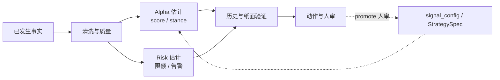
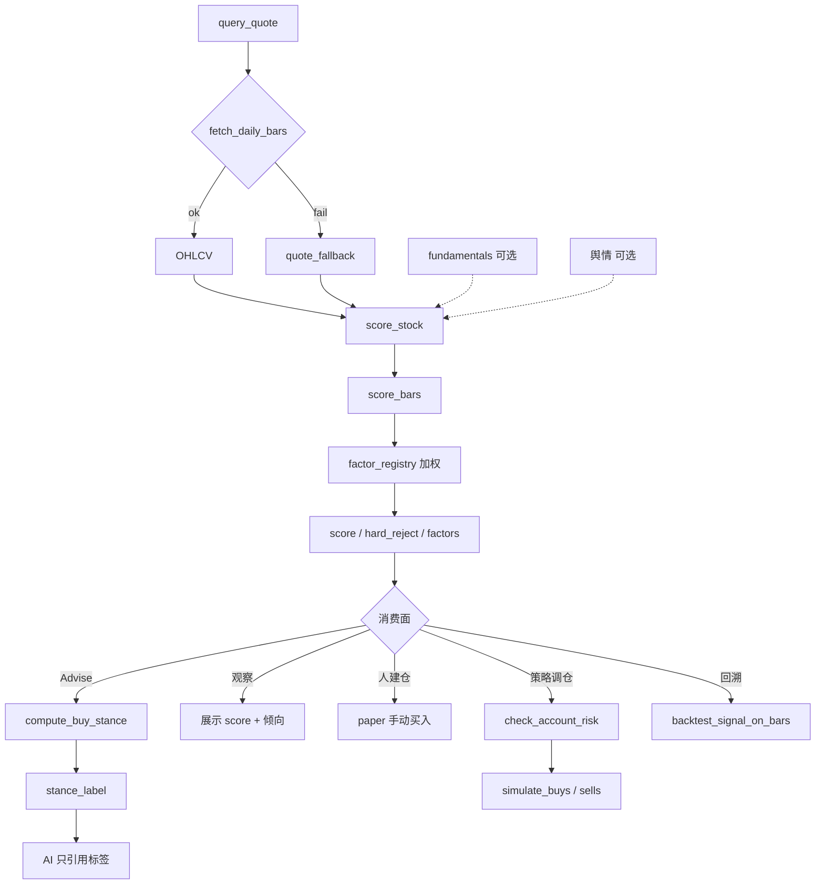

# 产品核心设计主轴

[← 文档索引](README.md) · 工程分层见 [architecture.md](architecture.md) · 因子/stance 细节见 [quant.md](quant.md) · ŷ 全链路见 [quant.md · ŷ 全链路](quant.md#predicted_scoreŷ全链路) · 盘中/实时增强见 [quant.md · 盘中剩余收益头](quant.md#13-盘中剩余收益头intraday-residual方案) · τ 契约与分组升级见 [quant.md · τ 契约升级](quant.md#14-决策时刻-τ-契约--双层-predicted_score--分组目标升级) · Web 主路径见 [quant-ui.md](quant-ui.md)

本文是产品的 **核心设计主轴**，分三层读：

1. **本质与因果链**：已发生事实 → 影响估计 → 验证 → 动作（见 [因果链](#因果链已发生--影响估计--动作)）。  
2. **现行实现主轴**：数据 → 信号 → 因子 → 倾向 → 动作；**量化主轴 + AI 旁路**两条轨（可复现、可验收）。  
3. **北极星与能力地图**：北极星 = **策略落地为稳定风险调整收益的转化效率**（见 [产品北极星](#产品北极星)）；六大模块是支撑能力地图，不是北极星本身。**现行产品边界** = 研究台 + 模拟账户（**策略验证**）；真·实盘 OMS **暂不启动**，待策略在回测与纸面验证成熟后另立项（N6）。

其它文档（控制论、金字塔、策略层、Web 说明书）都围绕本主轴展开，不与之冲突。

---

## 产品边界（现行）

| | 说明 |
|--|------|
| **定位** | **策略验证**系统：信号、策略、回测、模拟账本、AI 编排 |
| **交易** | **仅限模拟账户**（`data/paper.json` / Web「交易执行」）；行情可为真实，成交只记本地假账 |
| **阶段** | 先验证策略是否可复现、可风控、回测–纸面拟合可接受；**暂不接实盘** |
| **不做（现行）** | 真实券商账户下单、代客交易、保证收益、持牌投顾 |
| **以后（N6）** | 策略验证成熟后再支持实盘交易（另立项；不计入当前北极星分子） |
| **用语** | 对外称「模拟」；内部 canonical 名 `paper`（纸面）。「准实盘」= 用模拟账户逼近实盘流程，**不是**接券商 |

---

## 一句话

**本质**：只根据**当时已经发生、可审计**的事实，估计其对股票（及组合）的边际影响；不是预言未发生的事。  
**现行**：确定性量化主轴算出数字与倾向；AI 旁路负责编排与解释；谁决定买什么、买多少就归谁；**一切买卖仅发生在模拟账户（策略验证阶段），不涉及真实账户交易**。  
**北极星**：最大化「假设 → 验证 → 纸面落地」的 **风险调整收益 × 迭代速度 × 回测–纸面拟合度**（见 [产品北极星](#产品北极星)）；六大模块是地图；真·实盘 Realization 单列 **N6**（验证成熟后另立项）。

```text
【本质】已发生事实 →（可复现映射）→ 对标的/组合影响的估计 → 倾向与动作（人审边界内）
【现行】数据 → 因子(sub_scores) → 线性回归ŷ(因子系数β) → 倾向(stance) → 动作(观察/人建仓/规则调仓/回溯)
【北极星】纸面夏普/卡玛 × 假设验证速度 × 回测–纸面拟合度
【阶段】策略验证（研究台+纸面）→ 成熟后 N6 实盘（另立项）
【能力地图】收集 → 清洗 → 因子/模型 → 组合/风控 → 回测 → 纸面迭代（→ N6 实盘）
```

---

## 因果链：已发生 → 影响估计 → 动作

量化在本仓库的工作定义：

> **用决策时点 \(t\) 及以前可得的信息，估计对股价路径 / 相对吸引力 / 风险敞口的影响；再映射为可审计的分、倾向与（纸面）动作。**

这与「预测明天一定涨」不同：输出是 **条件估计与排序**，须能回答「依据哪些已发生事实、用哪套规则、排除了什么」。

### 因果链总图

```text
已发生事实（t 及以前可见）
    │  价量 · 基本面快照 · 标题情绪 · 账户状态 · 历史规则表现
    ▼
清洗 / 质量门禁（无脏数据进生产分）
    │  normalize · quality · adjust_policy · allows_production_score
    ▼
影响估计（Alpha / Risk 两条估计）
    ├─ Alpha：**双层 ŷ**
    │         · ŷ_EOD = predicted_score：T−1 因子 → 组 β → 前瞻 h 日（主排序 / 买入）
    │         · ŷ_τ = predicted_score_tau（雏形 score_rem）：X+Z_≤τ → 当日剩余（展示/门控→规划买入闸）
    │         heuristic 加权 score 仅研究基线，不驱动 live 选股
    └─ Risk：回撤/集中度/成本/滚动 ŷ IC（能买多少、要不要停）
    ▼
验证（规则是否仍有效）
    │  回测 · OOS/regime · WF · IC · 纸面五问
    ▼
动作（谁拍板）
    │  观察只读 · 人建仓 · 策略调仓 · 告警→人审 promote
    ▼
（可选）配置迭代 —— 只经人审，不静默写盘
```



### 对照现有模块

| 因果环节 | 在估什么 | 本仓库落点 | 硬边界 |
|----------|----------|------------|--------|
| **事实输入** | 当时可见的价量、财务、资讯、账本 | `ports` · `fetch_daily_bars` · fundamentals · sentiment · `watching` / `paper` | 基本面多为 **snapshot**（非完整 PIT）；须在质量/文档标明 |
| **清洗门禁** | 能否进入生产估计 | `normalize_bars` · `assess_quality` · `allows_production_score` · manifest `adjust_policy` | thin/empty/fallback → `hard_reject`，不硬塞分 |
| **Alpha 估计** | 已发生形态对「相对吸引力」的影响 | `factor_registry` · `score_bars`→sub_scores · `ReturnScoreModel`（β）· **双层**：`predicted_score`（EOD）+ `score_rem`/`predicted_score_tau`（τ）· `compute_buy_stance` | 生产主排序 = **EOD ŷ**；τ 头独立 Ridge（rem），不改组 β；融合见 [predicted-score-chain §2.5](quant.md#predicted_scoreŷ全链路)；组 β 仅 `cluster_scoring.mode=active` 进主分（FH0）；`heuristic_score` **仅研究对照基线**；LLM **不改** `score` / `stance_label` |
| **Risk 估计** | 已发生敞口对「能买多少 / 要不要停」的影响 | `check_account_risk` · `optimize_weights` · `strategy_monitor`（回撤 · 滚动 IC · 行业覆盖） · 成本 `simple_cn` | 监控 **只告警**；不自动改权、不代客下单 |
| **验证** | 同一规则在历史上是否仍有效 | `backtest` · OOS/regime · `wf_slices` · IC / `weight_suggest` · 纸面 `ops_report` 五问 | 研究结果 ≠ 实盘保证；OOS 失败须可见 |
| **动作** | 估计如何变成可审计行为 | 观察 · 人建仓 · `run_daily_cycle` / 横截面调仓 · `paper_daily` · DecisionRecord | **现行不接 OMS**（策略验证）；配置变更走 feedback → **人审 promote** |
| **旁路解释** | 把估计讲给人听 | Agent / Skills / prompts | 只能 **引用** `stance_label`，不得改写数字 |

### 与六大模块的对应

| 六大模块 | 在因果链中的角色 |
|----------|------------------|
| 1 收集 | 扩大「已发生事实」的覆盖面 |
| 2 清洗 | 保证事实在 \(t\) 合法、可复现（PIT / 复权 / 质量） |
| 3 因子/模型 | 事实 → 影响的 **Alpha 映射**（现行线性；NN 仅研究轨） |
| 4 组合/风控 | 事实 → 影响的 **Risk 映射**（限额、集中度、成本） |
| 5 回测 | 用**更早的已发生区间**检验映射是否过拟合 |
| 6 实盘迭代 | 用**新发生的结果**检测衰减，人审后更新映射（纸面代替 OMS） |

### 反例（本仓库刻意不做）

| 反例 | 为何违背本质 |
|------|----------------|
| 用 \(t+1\) 才可知的 bar / 财报打 \(t\) 日的分 | 把「未发生」当「已发生」（未来函数） |
| LLM 直接改写 `score` / `stance_label` | 估计不可审计、不可回放 |
| 监控自动改 `signal_config` | 把告警当成已验证的因果结论并静默执行 |
| 券商 OMS 未闸门上线 | 把「影响估计」直接变成不可撤销的真实下单 |

更细的逻辑链（数据→信号→因子→倾向→动作）见下文；PIT 约定见 [architecture.md · 数据层](architecture.md#数据层)；风控对照见 [architecture.md · 风控层](architecture.md#风控层)。

---

## 产品北极星

<a id="产品北极星"></a>

> **最大化「策略从假设验证到纸面落地」产生稳定风险调整后收益的转化效率与确定性。**
>
> 系统价值 ≈ **纸面风险调整收益 (Paper Risk-Adjusted Return)** × **研发迭代速度 (Iteration Velocity)** × **回测–纸面拟合度 (Paper Realization Rate)**
>
> 真·实盘 Realization（券商 PnL 相关）单列 **N6**：现行策略验证阶段不接 OMS，故不塞进当前北极星分子——避免把第三项结构性归零，同时又用含 OMS 的满分画像制造虚假满分压力。待回测+纸面验证成熟后再立项。

专业全栈公式是 `Live Sharpe × Velocity × Live Realization`。本仓库在**策略验证阶段**把 **Live → Paper**：用模拟账本逼近「可落地」；用 **回测–纸面拟合** 代理「实盘确定性」，直到 N6。

### 为什么不是「六大模块完成度」

| 旧口径（已废弃为北极星） | 新口径 |
|--------------------------|--------|
| 北极星 = 专业六大模块满分画像的完成百分比 | 北极星 = 三项乘积的转化效率 |
| 验收信号：「模块粗估 %」「五问能答」 | 验收信号：滚动纸面夏普/卡玛 · TTM · 回测–纸面相关 |
| 优化易滑向「再补一个能力模块」 | 优化须回答：是否抬高三项之一、且不损另外两项 |

六大模块 **降级为能力地图**（见下节）：回答「我们有哪些支撑能力」；**不**回答「系统价值有多高」。

### 三大支柱（路径内）

| 支柱 | 含义 | 本仓库落点 |
|------|------|------------|
| **风险调整收益** | 不追单次暴利；追求可复现的超额与可控回撤 | 纸面滚动夏普 / 卡玛；回测夏普是诊断，不是北极星本身 |
| **迭代速度** | Alpha 衰减快；假设 → 数据 → 回测 → 纸面要快 | Time-to-Market；研究台吞吐（非仅人审稳态） |
| **拟合度** | 回测美、落地惨是最大损耗 | 研究 / 纸面 / 回测 **共用 `score_bars`**；强制成本与 OOS；追踪回测曲线 vs 纸面净值相关 |

### 二级核心指标（可追踪）

| 维度 | 指标 | 业务含义 | 路径内现状（2026-07） |
|------|------|----------|----------------------|
| **收益质量** | **滚动纸面夏普 / 卡玛** | 模拟账户风险调整后表现（主 KPI） | **R0 已仪表化**：`core/north_star` · `/api/north-star` · 日更 `north_star`；样本不足为 unavailable |
| **研发效率** | **Time-to-Market** | Idea → 可复现回测报告（再 → 纸面规则跑通）的中位时间 | **R0 已打点**：`ttm_events.jsonl`（反馈建议 / 回测 / promote）；中位小时可查 |
| **落地确定性** | **回测–纸面 PnL 相关 / 跟踪误差** | 同一策略窗口下回测资金曲线与纸面净值的拟合 | **R0 已仪表化**：回测落盘曲线 + Corr/TE；无交集时 unavailable |
| **风控底线** | **拦截有效率 · 误拦率 · 零重大事故** | 硬拦是功能；有效率才是结果 | 有硬拦流水计数；**有效率/误拦率仍待标注** |
| **（边界外）** | 端到端 Tick→确认延迟 | 高频关键路径 | 日线研究台；**不做微秒 KPI** |

### 角色视角映射

| 角色 | 其北极星 | 系统应支撑 | 路径内覆盖 |
|------|----------|------------|------------|
| **研究员** | 快速验证 Alpha 是否有效 | 数据 API、可复现回测、参数/因子实验吞吐 | 部分：回测/IC/五问；弱：IDE、参数曲面、TTM |
| **交易执行（纸面）** | 以可审计、低损耗执行策略意图 | 预演→确认、成本可见、限额硬拦 | 有：调仓五问/日更；无 OMS/盘口（边界外） |
| **风控 / 运维** | 守底线且不无谓挡正常调仓 | 敞口可见、拦截可查、告警→人审 | 碎片：待办/五问/健康；缺专台与有效率 |

### 需求拷问（Actionable）

任一功能进规划前须能答「抬高公式哪一项」；答不上来则降级或砍掉。

1. **防幻觉**：是否鼓励无约束调参到完美曲线？须保留真实成本、OOS/WF、交叉验证可见。  
2. **防割裂**：研究 / 回测 / 纸面是否同一套计分与数据约定？禁止「回测一套、纸面另一套」。  
3. **速度服务闭环**：是否缩短 TTM，或只是装饰性报表/炫技 UI？  
4. **风控内嵌**：拦截是否在动作生效前硬拦？事后邮件不算抬高风控柱。  
5. **边界诚实**：是否把 N6/OMS 能力误标成当前北极星进度？

---

## 能力地图（六大模块）

<a id="专业系统北极星满分画像"></a>
<a id="能力地图六大模块"></a>

标准化量化投研闭环的 **支撑能力地图**（原「满分画像」）。用于对照缺口与排期 N1–N6；**模块完成度 ≠ 北极星达成度**。

```text
多维数据收集
    → 数据清洗与预处理
    → 因子挖掘与模型构建（Alpha 打分）
    → 组合优化与风险控制
    → 历史回测验证
    → 纸面部署与动态迭代（真·实盘 = N6）
         └── 监控 · 衰减检测 · 参数/策略迭代 ──→（回写模型与配置）
```

默认路径 **现行不承诺 OMS / Tick 全量 / 黑盒 NN 上线**（见锁定取舍）。实盘交易待策略验证成熟后走 N6。

| # | 模块 | 专业栈能力目标（对照） | 本仓库采纳目标（路径内） | 本仓库现状 | 主要落点 / 仍缺 | 主要服务北极星柱 |
|---|------|------------------------|--------------------------|------------|-----------------|------------------|
| 1 | **多维数据收集** | 统一行情仓（日/分钟/Tick）+ 财务/宏观/另类；多源对齐、可订阅增量 | 日线 + 现货 + 基本面快照 + 资讯标题可复现拉取；薄 `DataService` | **部分 ~62%** | **M1 已收口**：DataService · 覆盖率 · 快照缓存 · 观察池日线增量；仍缺 Tick/宏观/全市场数仓；路径内加深见 [pro-core-strengthen · DC](archive/pro-core-strengthen.md) | Velocity · 拟合（数据一致） |
| 2 | **数据清洗与预处理** | 完整 **PIT**、复权策略参数化、公司行为、日历对齐、质量分级进生产门禁 | 日线 as_of 切条；`quality` 门禁；`adjust_policy` 进 manifest；基本面标明非 PIT | **部分 ~58%** | `normalize` · `allows_production_score` · `data_pit` · `pit_report`；财务 PIT 深度 / 停牌对齐见 [pro-core DC](archive/pro-core-strengthen.md) | 拟合（防未来函数） |
| 3 | **因子挖掘与模型** | 大规模因子库 + IC/IR 流水线 + 中性化；可选 ML/NN，artifact 冻结可 promote | `score_bars`→sub_scores + **回归 ŷ**（当前 OLS/Ridge）；IC / weight_suggest 遗留；`heuristic_score` 仅 OOS 基线；NN **仅研究轨** | **线性 ŷ ~70%** | `ReturnScoreModel` · 分组 β · 横截面；健康门/衰减见 [pro-core FM](archive/pro-core-strengthen.md)；NN 不上生产 `score` | Velocity · 收益质量 |
| 4 | **组合优化与风控** | QP/风险预算求解；单票/行业/风格暴露；VaR/限额实时；成本与冲击进目标函数 | 分数风险预算 + `risk_parity_lite` + 暴露矩阵 + 单票/行业硬拦；行业 map 覆盖与预算告警；纸面止损/回撤熔断 | **部分 ~68%** | `optimize_weights` · `risk/budget` · `check_account_risk` · `exposure`；风格进目标/动态限额见 [pro-core RK](archive/pro-core-strengthen.md)；仍缺完整 QP / 实时 VaR | 收益质量 · 风控底线 |
| 5 | **历史回测验证** | 组合级事件驱动；T+1/涨跌停/冲击；WF/OOS/多 regime；Brinson/因子归因 | 共用 `score_bars`；成本对照；WF/OOS/regime；撮合近似（板别涨跌停 + 跌停延后卖）；个股/行业/选股超额归因 | **较强 ~80%** | `backtest` · `matching` · `attribution` · `wf_slices`；非交易所级仿真 | 拟合 · 收益质量诊断 |
| 6 | **部署与迭代** | OMS/券商 API；实时监控与自动风控；衰减触发再训练/调仓流水线 | **纸面准实盘（策略验证）**：日更调度、滚动 IC、告警出站、人审 promote；**现行不接 OMS** | **模拟 ~52%** | `paper_daily` · `strategy_monitor` · `alert_outbound`；N6 = 验证成熟后另立项 | 纸面收益 · 拟合闭环 |

### 专业 vs 本仓库：一句话对照

| 维度 | 专业全栈 | 本仓库（路径内） |
|------|----------|------------------|
| **北极星终点** | 实盘风险调整收益 × 速度 × 实盘拟合 | **纸面**风险调整收益 × 速度 × **回测–纸面**拟合 |
| 输出 | 确定性信号 → 回测 → 执行 → 监控 | 同左，执行止于 **纸面**；AI 只解释不改分 |
| 决策 | 策略代码为主 | `score` / `stance` 规则为主；LLM **旁路** |
| 数据 | 本地历史库 + PIT 面板 | 按需拉取 + 缓存 + 日线 as_of；财务仍 snapshot |
| 验证 | OOS / IC/IR / 归因 / 成本冲击 | OOS · WF · IC · 近似撮合 · 简化归因 |
| 交易 | OMS / 券商 API | **现行不代客下单**；纸面账本验证策略；成熟后 N6 |

### 模块意图速览（与上表同义）

| # | 模块 | 产品意图（压缩） |
|---|------|------------------|
| 1 | 多维数据收集 | 交易所行情、财经财务、社区情绪等另类数据，维度尽量全 |
| 2 | 数据清洗与预处理 | 标准化、剔异常/缺失/错误，保证入模质量与一致性（PIT） |
| 3 | 因子挖掘与模型构建 | 抽象量价/基本面/情绪因子；复杂非线性可研究，生产须可审计 |
| 4 | 组合优化与风险控制 | 目标如年化/回撤；单票/行业集中度约束 |
| 5 | 历史回测验证 | 代入历史模拟交易，验年化、回撤、多环境稳健性 |
| 6 | 部署与动态迭代 | 上线监控、风格切换与模型衰减时调参迭代（本路径=纸面） |

### 能力地图子项目拆分

<a id="北极星子项目拆分"></a>

> **结论**：能力地图拆成 **6 个子项目**（上表六大模块）；工程实现拆成 **6 条轨（N1–N6）**，与模块大致一一对应。  
> 本仓库默认可交付立项 ≈ **5 条（N1–N5 加深）+ 1 条闸门后立项（N6 OMS）**。不新增「第七大模块」。  
> **排期优先级**须先过 [需求拷问](#需求拷问actionable)：优先抬高纸面夏普/卡玛、TTM、回测–纸面拟合；模块填空次之；**不在验证未成熟时并行冲 N6**。

| # | 子项目（能力模块） | 工程轨 | 路径内目标（压缩） | 相对对照粗估 | 状态 |
|---|--------------------|--------|--------------------|--------------|------|
| 1 | 多维数据收集 | **N1** | DataService / 可复现拉取 | ~62% | 骨架 + M1 已收口 |
| 2 | 数据清洗与预处理 | **N1**（同轨加深） | 日线 PIT、质量门禁 | ~58% | 骨架；财务 PIT 仍弱 |
| 3 | 因子挖掘与模型 | **N2** | 线性 `score_bars` + IC；NN 仅研究轨 | ~60% | 骨架落地 |
| 4 | 组合优化与风控 | **N3** | 分数预算权重 + 波动缩放 + 限额硬拦 | ~60% | 骨架 + 动态轻量 |
| 5 | 历史回测验证 | **N4** | OOS / WF / 成本 / 板别涨跌停·跌停延后 | ~80% | 骨架；最强模块 |
| 6 | 部署与迭代 | **N5** 纸面 / **N6** OMS | 日更 + 告警 + 人审；**现行不接 OMS** | ~52% / 未启动 | N5 策略验证主路径；N6 验证成熟后另立项 |

```text
能力地图（6）          工程轨（6）
─────────────────      ────────────────────────────
1 数据收集          ──► N1 DataQuality（含收集）
2 清洗 / PIT        ──► N1（同轨加深）
3 因子 / 模型       ──► N2 FactorLab
4 组合 / 风控       ──► N3 PortfolioRisk
5 历史回测          ──► N4 BacktestOOS
6 部署与迭代        ──► N5 PaperOpsLoop → N6 LiveGate（另立项）
```

**立项口径**

| 口径 | 数量 | 说明 |
|------|------|------|
| **产品北极星** | **1** | 三项乘积；见 [产品北极星](#产品北极星) |
| 能力地图 | **6** | 专业栈对照模块；支撑北极星，不是北极星 |
| 工程实现轨 | **6** | N1–N6；模块 1+2 常合在 N1 一条里做 |
| 本仓库默认可交付 | **5 + 1** | N1–N5 加深进主路径；N6 OMS **验证成熟后另立项**（现行不排期） |

**下一刀（先问北极星柱，再挂模块）**：

| 优先 | 动作 | 抬高哪一柱 | 挂模块 |
|------|------|------------|--------|
| 1 | 滚动纸面夏普/卡玛进仪表盘与日更 | 收益质量 | 6 / N5 |
| 2 | 回测–纸面净值相关 / 跟踪误差 | 拟合度 | 5+6 / N4+N5 |
| 3 | 度量并压缩 TTM（研究台加深：参数扫描 / 写策略入口） | 迭代速度 | 3 / N2 + Web W3 |
| 4 | 风控拦截有效率 / 误拦率可见 | 风控底线 | 4 / N3 |
| 5 | 财务 PIT · 冲击成本 · 完整 QP（仍有价值，但次于上列仪表） | 拟合 / 收益质量 | 2 / 4 / 5 |

工程细节见 [实现路径（N1–N6）](#北极星实现路径n1n6) · [roadmap · N1–N6](design-spine.md#北极星实现路径n1n6)。

### 达成度评估（2026-07）

> **总判断**：能力地图相对专业对照未齐；现行主轴与 N1–N5 骨架可验收。**北极星三项已 R0 仪表化**；**R0–R5 主干已落地**。产品定位 = **策略验证**（研究台 + 纸面）；N6 真·实盘待验证成熟后另立项，现行不排期。

| 层 | 是否达成 | 说明 |
|----|----------|------|
| **产品北极星（三项乘积）** | **已仪表化 / 待用样本优化** | 滚动纸面夏普·TTM·回测–纸面相关可查；数值健康度随运行累积 |
| **能力地图（六大模块对照）** | **部分～较强** | 粗估整体约 **~70%～78%**；回测相对最强，部署（无 OMS）最弱 |
| **N1–N5 实现路径** | **P0–P2 可验收** | 五问/限额/质量/WF/IC/日更调度/告警→人审晋升已接线 |
| **现行主轴**（观察·策略·模拟·回溯 + AI 旁路） | **基本达成** | `score_bars` → stance → 建仓/调仓/回测共用计分；LLM **不改写** `score` / `stance` |
| **升级重构 R0–R5** | **已收口** | 见 [upgrade-refactor-plan](archive/upgrade-refactor-plan.md) |
| **N6 真·实盘 OMS** | **未启动（有意推迟）** | 待回测 + 纸面验证成熟、合规就绪后另立项；**不计入当前北极星分子** |

**北极星二级指标基线**

| 指标 | 状态 | 下一步 |
|------|------|--------|
| 滚动纸面夏普 / 卡玛 | **R0 已落地** | 日更积累样本；与回测夏普分列解读 |
| Time-to-Market | **R0 打点 · R2 研究台已加深** | 继续压缩中位耗时 |
| 回测–纸面相关 / TE | **R0 已落地** | R1 PIT/冲击样本积累抬拟合 |
| 拦截有效率 / 误拦率 | **R3 可算**（须 `meta.outcome` 标注） | 补标注样本 |

**能力地图粗估（相对专业对照；非北极星 KPI）**

| # | 模块 | 粗估 | 一句 |
|---|------|------|------|
| 1 | 多维数据收集 | ~62% | DataService + 覆盖率 + 快照/增量；缺 Tick/宏观/数仓 |
| 2 | 数据清洗与预处理 | ~62% | 日线 PIT + 财务 PIT as_of；复权多策略仍弱 |
| 3 | 因子挖掘与模型 | ~62% | 线性可解释 + IC/权重/草稿晋升；NN 仅研究轨 |
| 4 | 组合优化与风控 | ~70% | 分数预算 + risk_parity_lite + 暴露矩阵 + 原因码/outcome；仍缺完整 QP |
| 5 | 历史回测验证 | ~85% | OOS/regime 分桶/WF/成本/Brinson lite/信号成交对照 |
| 6 | 部署与迭代 | ~55% | 纸面日更 + 滚动 IC + 出站告警 + 人审晋升；无 OMS |

**当前焦点**：DC/FM/RK 主干已落地（见 [archive/pro-core-strengthen.md](archive/pro-core-strengthen.md)）。继续真实 `paper_daily`、财务预热与闸门勾选；**评估是否立项 N6** 见本章末「N6 真·实盘准入备忘」。**不冲 OMS / 全市场数仓**。

### P0 落地状态（2026-07）

| 项 | 状态 | 落点 |
|----|------|------|
| 日更五问 | **已落地** | `ops_report` 顶层字段；模拟页「调仓五问」条；`paper_daily` DecisionRecord |
| 回测默认 cost/OOS/regime | **已落地** | API `apply_costs=True`；Web 指标卡与摘要展示 |
| 限额硬拦 + 日志 | **已落地** | `run_daily_cycle` / 横截面调仓拦截加仓；`risk_block` 操作日志 |
| data_quality 可查 | **已落地** | 调仓/日更/组合回测响应；`fallback_count` UI 文案 |

### P1 落地状态（已收口）

| 项 | 状态 | 落点 |
|----|------|------|
| 清洗门禁 | **已落地** | `allows_production_score`；`score_stock` 对 thin/empty/fallback → `hard_reject` |
| 复权策略进 manifest | **已落地** | `adjust_policy=qfq` 顶层字段；`summarize_data_quality.gated_count` |
| PIT 最小约定 | **文档化** | [architecture.md · 数据层](architecture.md#数据层) |
| OOS 失败标红 | **已落地** | `oos_summary.failed`；组合回测指标卡 / 摘要 `down` |
| optimize 进调仓建议 | **已落地** | `last_optimize` / `target_weights` 进 ops_report 与日更/横截面；新开仓受目标仓上限 |
| StrategySpec 限额 UI | **已落地** | 策略页列表 + `strategy-risk-limits` 只读展示 risk |
| 成本对照 zero vs simple_cn | **已落地** | `cost_compare` 附于组合回测响应与指标卡 |
| Walk-forward 切片 | **已落地** | `rolling_walk_forward_slices` · `wf_slices` 附于组合回测；回溯页折表 |
| IC 一键导出 · weight_suggest 进策略页 | **已落地** | 策略页「分析 IC / 权重」+ 导出 IC / 权重 diff（只读，不写盘） |

### P2 落地状态（2026-07）

| 项 | 状态 | 落点 |
|----|------|------|
| `paper_daily` 定时 | **已落地** | `scripts/daily_paper.sh` · launchd 示例 · `POST /api/schedule/run` · `GET /api/schedule/last` |
| 监控告警进 UI | **已落地** | 横截面 ops_report 接线 `assess_strategy_health`；平台/模拟页展示告警 |
| 告警→建议→promote | **已落地** | feedback `monitor_alerts`；平台/模拟「从告警生成建议」；策略卡人审 promote |

### P2+ 稳态加深（已完成）

| 项 | 状态 | 落点 |
|----|------|------|
| 滚动 IC 进监控 | **已落地** | `estimate_composite_ic` → 日更/调仓 `compute_rolling_ic`；`ic_decay` 告警 |
| 行业 map 覆盖告警 | **已落地** | `sector_coverage_report`；覆盖 <50% → `sector_map_thin`；ops 展示滚动 IC / 行业覆盖 |

### P2++ 专业差距补强（已完成）

相对专业量化栈的路径内缺口（**不含 OMS**），逐项落地：

| 项 | 状态 | 落点 |
|----|------|------|
| 日线 PIT / as_of | **已落地** | `core/data_pit` · 回测 `window_as_of` · `get_bars(as_of=)` · 结果 `pit_report` |
| 行业 map + 预算告警 | **已落地** | 扩 `data/sector_map.json`；`optimize_weights.budget_alerts` / `sector_coverage` |
| 分数风险预算 + 高波缩放 | **已落地** | `core/risk/budget.py`；默认 `score_budget`；五问「仓位预算」 |
| 撮合近似（T+1 / 板别涨跌停 / 跌停延后卖 / 滑点档） | **已落地** | `matching.resolve_exit_index` · 单票/TopK `skipped_limit_exit` / `exit_deferred` |
| 收益归因（个股/行业/选股超额） | **已落地** | `core/backtest/attribution` · 组合回测 `attribution` · 回溯页指标卡 |
| 告警出站 | **已落地** | `core/alert_outbound` · `paper_daily` → `data/alerts/` · 可选 `INVESTMENT_ALERT_WEBHOOK` |

粗估：相对专业对照约 **~70%～78%**；仍缺完整数仓/QP/交易所级撮合；财务 PIT 为最小路径。**N6 实盘有意推迟**（策略验证成熟后另立项）。能力地图见上文 [能力地图](#能力地图六大模块)；北极星公式见 [产品北极星](#产品北极星)。

完整阶段规划（P0–P3、依赖顺序、锁定取舍）见 **[roadmap.md · 北极星实现规划](design-spine.md#北极星实现规划p0p3)**。

### 与现行主轴的对齐方式

| 能力模块 | 现行对应（已可讲清的故事） |
|----------|----------------------------|
| 收集 / 清洗 | `core/ports` + Skills + `store` 缓存 |
| 因子 / 模型 | `score_bars` → `score`（现行 = 可解释多因子加权；目标可演进到 NN，但须冻结 artifact、样本外、人审晋升） |
| 组合 / 风控 | `stance` 定倾向；纸面规则 + risk gate 定「买多少」；目标补组合优化与行业约束 |
| 回测 | 与 live **共用 `score_bars`** 的回溯引擎（拟合度前提） |
| 纸面迭代 | 现阶段用 **纸面 + 监控文案 + 配置晋升** 代替 OMS；AI 只解释不改分 |

**原则不变**：即便目标态引入神经网络或实盘，**生产决策数字仍须可审计**；LLM / 黑盒不得静默改写线上 `score` / `stance_label`；实盘须单独验收，不与研究台混为「已代客下单」。功能评审优先过 [需求拷问](#需求拷问actionable)。

---

## 北极星实现路径（N1–N6）

在已落地的 **Q1–Q5** 之上推进能力地图六大模块（服务 [产品北极星](#产品北极星) 三项乘积）。子项目拆分口径见上文 [能力地图子项目拆分](#北极星子项目拆分)；详细验收与取舍见 [roadmap.md · N1–N6](design-spine.md#北极星实现路径n1n6)。

| 阶段 | 对应模块 | 本仓库动作 | 状态 |
|------|----------|------------|------|
| **N1** | 收集 + 清洗 | 薄 `DataService`；质量/复权进 manifest；调度 `bars_warmup` / `spot_refresh` | **骨架落地** |
| **N2** | 因子 / 模型 | 因子 IC 实验室；情绪可选因子；`research/ml/` 仅离线 artifact | **骨架落地** |
| **N3** | 组合 / 风控 | StrategySpec 限额；`optimize_weights` 分数预算 + 高波缩放 | **骨架 + 动态轻量** |
| **N4** | 历史回测 | OOS / regime 摘要；报告强制展示成本模型 | **骨架落地** |
| **N5** | 准实盘迭代 | 调度 `paper_daily`；衰减监控；人审晋升闭环 | **P2 可验收** |
| **N6** | 真·实盘 | 策略验证成熟 + 合规后评估 OMS；**现行不排期** | 有意推迟 |

```text
N1 DataQuality → N2 FactorLab → N3 PortfolioRisk → N4 BacktestOOS → N5 PaperOpsLoop
                                                                      → N6 LiveGate（另立项）
N2 ──offline──► research/ml artifact ──promote only──► N5
```

**锁定取舍**：生产 Alpha 仍为 `score_bars` 线性加权；NN 不得直连生产 `score`；不接券商 OMS，N5 用纸面日更 + 监控代替「部署」。

达成度细节见上文 [达成度评估（2026-07）](#达成度评估2026-07)；P0–P3 实现规划与下一程见 [roadmap.md · 北极星实现规划](design-spine.md#北极星实现规划p0p3)。

---

## 两条轨

| 轨 | 职责 | 落点 | 硬边界 |
|----|------|------|--------|
| **量化主轴** | 算分、定倾向、模拟买卖、历史回测 | `core/signal` · `stance` · `paper` · `backtest` · `data/signal_config.json` | 数字只来自 Python；live / 纸面 / 回测 **共用 `score_bars`** |
| **AI 旁路** | 意图理解、选 Skill、研究话术 | `agent/` · Skills · prompts | 「能否买入」须 **逐字引用** `advise.stance_label`；**不得改写** `score` / `stance_label`；不静默改生产配置 |

```text
┌─────────────────────────────────────────────────────────┐
│  AI 编排层（旁路）                                        │
│  Agent 选工具 / 解释 facts / 引用 stance_label            │
├─────────────────────────────────────────────────────────┤
│  量化主轴（真相源）                                        │
│  score_bars → score + hard_reject + factors               │
│  compute_buy_stance → stance_code / stance_label          │
│  paper / backtest → 模拟动作与历史验证                     │
└─────────────────────────────────────────────────────────┘
```

工程分层（接入 / 服务 / 编排 / Skills / `core` / 数据）是 **实现结构**；上表两条轨是 **产品结构**。对照见 [architecture.md](architecture.md)。

---

## 逻辑链：数据 → 信号 → 因子 → 倾向 → 动作

> 本节是因果链在工程上的展开。总览与模块对照见上文 [因果链：已发生 → 影响估计 → 动作](#因果链已发生--影响估计--动作)。

### 1. 数据（感知输入）

| 数据 | 用途 | 入口 |
|------|------|------|
| 实时行情 | 现价、涨跌、量 | `core/ports/market.query_quote` → 腾讯行情 |
| 日线 OHLCV | 因子计算主输入 | `fetch_daily_bars`（失败则 `quote_fallback`） |
| 基本面（可选） | 估值 / 质量因子 | `build_fundamentals` |
| 指数相对强弱 | 超额收益 | `build_relative` |
| 舆情标题（可选） | 对 score 微调；观察页提醒 | `sentiment` / `news` |
| 配置与账本 | 权重、阈值、名单、纸面 | `data/signal_config.json` · `watching.json` · `paper.json` |

领域层不直接碰 HTTP；一律经 **`core/ports/*` → `skills/*/engine`**。AkShare 调用须进程内串行（见 `skills/common/ak_lock.py`），避免并发打崩 Web 进程。

### 2. 信号（第一层：`score_bars`）

单票入口：`score_stock` → 核心 **`score_bars`**（`core/signal/scorer.py`）。

| 产出 | 含义 |
|------|------|
| `score` | 0～100 短线综合分（不是涨跌概率，也不是下单指令） |
| `hard_reject` / `reject_reason` | 硬过滤出局（日线不足、近 3 日暴涨/暴跌等） |
| `sub_scores` / `factors` | 各因子分与中间量 |
| `invalidation` | 失效条件文案 |

**共享核心**：live 信号、纸面扫描、回测 **共用同一套 `score_bars()`**，保证「现在看到的分」与「历史验证的分」同源。

### 3. 因子（加权合成 score）

`factor_registry.compute_configured_factors` 按 `signal_config.json` 加权。实现于 `core/signal/factors/*`。

典型因子族：动量、量价、相对强弱、波动、反转、流动性、估值、质量，以及形态 / 均线斜率等扩展项。

```text
bars (+ quote / 基本面)
  → 各因子 0～100 子分
  → 线性加权（+ 可选 regime / 交互 / 舆情微调）
  → score / hard_reject
```

权重与阈值的研究建议可导出 diff，**人工合并**后方可进生产；不自动静默改 `signal_config.json`。细节见 [quant.md](quant.md)。

### 4. 倾向（第二层：`compute_buy_stance`）

分数之上还有一层规则：**`compute_buy_stance`**（`core/stance.py`）。

- 按 `stance_thresholds` 把 score 映射为：`avoid` / `wait` / `probe` / `buy_light`（或 `insufficient`）
- 再被大跌、坏 K 线、弱同业、相对大盘过弱、数据为 fallback 等 **降一档**
- 输出 **`stance_label`**：给人看、给 AI 引用的唯一结论文案

完整「能否买」：`collect_stock_facts` → `compute_buy_stance` → `evaluate_buy_advice`（`core/advise.py`）。

**stance ≠ 自动下单**。它是「倾向标签」；纸面真正买多少看另一套规则（`min_score` / 仓位 / Kelly / 风控门禁）。

### 5. 动作（谁执行、谁拍板）

| 场景 | 决策内容 | 谁拍板 |
|------|----------|--------|
| **观察** | 名单 + 展示 score / 倾向；不改账本 | 人维护名单；摘要只读 |
| **观察 → 加入纸面** | 买什么、买多少 | **人**（金额 / 股数）；出处 `manual` |
| **模拟 · 策略调仓** | 按规则加仓减仓 | **策略规则** + `check_account_risk`；出处 `strategy` |
| **回溯** | 历史上若 score≥阈值则持有 N 日 | 回测引擎 / StrategySpec |
| **对话「能不能买」** | 只输出倾向标签 | stance；AI 不得改写 |

StrategySpec（如 `signal_v1` + 成本模型 `simple_cn`）把信号参数、纸面规则、风控限额绑成可版本化规格。见 [architecture.md · 策略层](architecture.md#策略层)、[architecture.md · 风控层](architecture.md#风控层)。

产品主路径三件事（**观察 ≠ 模拟**）：

1. **观察** — 长期名单 + 建仓入口  
2. **模拟** — 已有仓位的假钱账本  
3. **回溯** — 组合级历史验证  

### 用户心智与验证闭环（现行）

用户常把系统收成两件事，**大体正确但不完整**：

| 用户感知 | 系统真实能力 | 校准 |
|----------|--------------|------|
| **(1)** 不定期手动「策略调仓」，用一段时间纸面表现验 `short` / `short_conservative` | 交易执行：预演→确认；持仓标 `strategy`；净值可累积 | **纸面流程验证**，不是完整科学验证。名单/建仓常来自数据中心**人工**；持仓可混手动+策略，归因不干净。应配合历史回测、五问、风控拦截、北极星 Corr/TE |
| **(2)** 「做 T 回测」验 T 策略 | 做 T 回测 + 预演/确认做 T（ExecutionSpec overlay） | **底仓 overlay 验证**，非独立选股策略；有效性依赖底仓与成交假设（日线代理等） |

更贴近真实产品的心智（五步）：

```text
① 数据中心选池与人工建仓
    → ② 历史回测：验证规则（Top-K / WF / 成本）
    → ③ 交易执行：纸面落地（手管仓 · 策略调仓 · 可选做 T）
    → ④ 策略中心：改参须人审晋升
    → ⑤ 系统设置：北极星拟合 · 告警 · 审计
```

**(1)(2) 落在第 ③ 步**；②④⑤ 常「有能力、少感知」。UI 应用短引导把回测与晋升接在调仓/做 T 之后，而不是在交易页堆更多旋钮。

常被忽略但仍可用的能力：观察评分/倾向与建仓流水；组合回测与参数扫描/导出；策略 IC·草稿·promote；纸面日更与调仓五问；账户风控（只数/单票/行业/回撤）；手动加减仓与成本模型；告警→建议（不写盘）；AI 解读（不改 `score`/`stance`）；`/ws/live` 与命令面板。

Web 文案与页面落点见 [quant-ui · 用户心智与验证闭环](quant-ui.md#用户心智与验证闭环)。

---

## 架构串联（开心路径）

一只票从行情到动作：



工程落点对照：

```text
Web / CLI     → 触发「看 / 建仓 / 调仓 / 回测」
services/     → 业务门面
agent + skills→ 取数与对话编排（旁路）
core/         → 唯一算分与倾向真相源
data/*.json   → 配置与账本落盘
```

---

## 不可破的边界（验收时对照）

1. **已发生才可进估计**：决策时点 \(t\) 只用当时可见事实；禁止未来函数（见 [因果链](#因果链已发生--影响估计--动作)）。  
2. **事实与结论分离**：价格、score、财务字段只来自 Skill / `core` JSON。  
3. **LLM 不在数值链中**：不得编造或改写 `score` / `stance_label`。  
4. **stance 是标签，不是订单**：纸面仓位由人或策略规则决定，并标记出处。  
5. **无实盘下单**：Action 止于查询、建议、回测、纸面仿真。  
6. **配置变更可审计**：IC / 权重 / 阈值建议须人审；策略晋升走显式 `promote_strategy`。

---

## N6 真·实盘准入备忘（仅文档 · 无代码）

**状态**：策略验证阶段 **不启动** OMS。本章节仅在成熟闸门（`GET /api/ops/maturity-gate`）通过后，作为另立项材料草案。参考：archive S 轨与 V 轨（已归档）。

### 前置（须全部成立）

1. `GET /api/ops/maturity-gate` 显示 `ready_for_n6_review=true`（或书面豁免单项）
2. 至少一套策略完成 IS + OOS/WF + 成本对照 + 暴露巡检 +（建议）因子截面 IC
3. 合规确认：主体资格、风险揭示、人工确认下单流程

### 立项后才做（本仓库现行禁止）

- 券商 API / 柜台连通
- 订单状态机、部分成交、撤单
- 真资金划转与强平

### 建议产品形态（草案）

- 默认 **人工二次确认** 下单（预填 → 跳转官方 App / 柜台）
- 纸面与实盘账户隔离；实盘 KPI 另列，不替换纸面北极星分子直至稳定

### 明确不做（即便立项）

- 代客自动全权交易、保证收益、无审计黑盒下单

---


---

## 能力评估与升级规划（路线图视角）

## 能力评估

### 当前能力画像（强 MVP）

| 层级 | 现状 | 成熟度 |
|------|------|--------|
| 架构 | LLM Function Calling + 12 Skills，可多轮串联 | 高 |
| 行情 `quote` | A/H/美股腾讯接口，映射表 + 60s 缓存 | 中高 |
| 对比 `compare` | 2～5 只并排涨跌量 | 中 |
| 选股 `screen` | A 股现货 + PE/PB/涨跌/行业关键词 | 中（依赖 AkShare） |
| 短线 `signal` | 动量/量价/波动；跨市场日线偶发 `quote_fallback` | 中 |
| K 线 `kline` | 近 N 日 OHLCV + 形态摘要 | 中 |
| 基本面 `fundamentals` | A 股 PE/PB/ROE/增速等 | 中 |
| 同行 `peer` | 预设同业组横向对比 | 中低 |
| 相对强弱 `index` | 近 N 日相对沪深300/恒生超额 | 中 |
| 资讯 `news` | 标题摘要（非全文研报） | 中低；数值化舆情见 [architecture.md · 舆情层](architecture.md#舆情层) |
| 持仓 `position` | 文件/临时 holdings + 可配置规则 | 中 |
| 解读/咨询 | prompt + 多工具串联 | 中 |
| 产品形态 | CLI + Web | MVP |

**已做得对的地方**：数据与话术分离；Skill 合约清晰；合规措辞；离线单测；P1～P3 核心能力已齐；**P4/P5 量化链路已落地**（因子 → 回测 → 纸面 → stance）。

**主要缺口（相对产品北极星 / 策略验证阶段）**：能力地图上财务 PIT / 统一数仓仍弱；组合缺完整 QP；撮合非交易所级。**实盘/OMS 未接是有意推迟**（N6：策略验证成熟后再立项，不计入当前北极星分子）。路径内 P2++ / R0–R5 已补日线 PIT、行业预算、撮合近似、归因、出站告警、北极星仪表。能力地图粗估约 **~70%～78%**；详见 [design-spine · 产品北极星](design-spine.md#产品北极星) · [能力地图](design-spine.md#能力地图六大模块) · [达成度评估](design-spine.md#达成度评估2026-07)。

---

## 量化升级与开发规划

### 当前定位 vs 量化系统

| 维度 | 当前 Investment | 典型量化系统（能力地图对照） |
|------|-----------------|--------------------------------|
| **阶段** | **策略验证**（回测 + 纸面） | 研究 → 仿真 → **实盘** |
| 输出 | 自然语言策略解读（旁路）+ 确定性 score/stance | 确定性信号 → 回测 → 执行 → 监控 |
| 决策 | 规则事实为主；LLM 合成解释 | 策略代码为主，LLM 可选做解读 |
| 数据 | DataService + 观察池增量/快照缓存（见 [architecture.md · 数据层](architecture.md#数据层)） | 统一 DataService、完整 PIT、本地历史库 / 多源对齐 |
| 验证 | 回测 · OOS/WF · IC · 简化归因 · evals | 回测、样本外、IC/IR、完整归因、冲击模型 |
| 交易 | **现行不代客下单**（纸面验证） | OMS / 券商 API |

**结论**：**产品定位 = 策略验证**；北极星 = 纸面风险调整收益 × 迭代速度 × 回测–纸面拟合度（见 [design-spine · 产品北极星](design-spine.md#产品北极星)）。真·实盘 Realization 单列 **N6**：待策略在回测与纸面验证成熟后再立项。**不宜**在验证未成熟时接实盘 OMS。

### 三条升级路径

| 路径 | 内容 | 与现有代码关系 | 优先级 |
|------|------|----------------|--------|
| **A 量化研究台** | 历史库、回测、因子报告；LLM 只解释 JSON | 复用 `signal/scorer`、`history` | **P4 已落地** |
| **B 半自动量化** | 定时信号、纸面账户、净值曲线 Web | 在 A 之上加调度与持久化 | **P5 已落地** |
| **C 生产量化** | 实盘/仿真、风控、OMS |  largely 新建，仅复用因子；风控演进见 [architecture.md · 风控层](architecture.md#风控层) | 远期 |

**继续不做**：自动下单、保证收益、黑盒荐股。

### 分阶段路线图

| 阶段 | 交付物 | 状态 |
|------|--------|------|
| **P4.1** | `core/backtest/engine.py` + `backtest` Skill（signal_v1 walk-forward） | **已落地** |
| **P4.2** | 日线本地缓存 `data/store/`、质量标记 | **已落地** |
| **P4.3** | 回测报告扩展：基准对比、分层收益、参数扫描 CLI | **已落地** |
| **P4.4** | evals 增加「信号可复现性」（同输入同输出，不依赖 LLM） | **已落地** |
| **P5.1** | 定时任务生成观察池 + 纸面持仓 JSON | **已落地** |
| **P5.2** | Web 展示净值/回撤曲线 | **已落地** |
| **P5.3** | 「是否买入」改为规则输出 stance + LLM 只解释 | **已落地** |

### 盘中 / 实时增强（进行中）

EOD ŷ 主轴不变；事件先验 + open→close 剩余收益头的**能力定义与阶段表（P0–R3）**见专文：  
[quant.md · 盘中剩余收益头](quant.md#13-盘中剩余收益头intraday-residual方案)。**P0～R3 代码已落地**；生产排序仍只用 EOD ŷ；rem 需 `POST /api/quant/rem-ridge`（`persist=true`）后人审启用门控。

**契约缺口与下一步**：**双层 ŷ** A1+F1 已落地；**F2** `predicted_score_blend` 可选（`fusion_mode=f2`）；**B1** promote 相对 active 的 OOS 失败率硬闸已落地；**B2/B3** focused 贪心 + promote-preflight / 落地卡已接通；A2 影子簿 + 复盘页 ŷ_τ 验收条已接。未做：**A3** 主轴切换（须影子簿达标）、分钟 τ 默认 live、分组重跑并成功 promote。见
[quant.md · τ 契约升级](quant.md#14-决策时刻-τ-契约--双层-predicted_score--分组目标升级) · [quant.md · ŷ 全链路 §2.5](quant.md#predicted_scoreŷ全链路)。

### P4.1 已落地：`backtest` Skill

**目录**：`core/backtest/engine.py`（引擎） + `skills/backtest/`（Agent 工具）

**策略 `signal_v1`**：Walk-forward 调用 `score_bars`（详见 [量化原理 · 第三层](quant.md#第三层历史回测walk-forward)）；分数 ≥ `min_score` 且非 `hard_reject` 时，模拟持有 `horizon_days` 日；输出胜率、均收益、累计收益、最大回撤、夏普近似。

**局限（须在回复中说明）**：未含手续费/滑点/涨跌停/T+1；与 live `signal` 的 `quote_fallback` 数据源可能不一致；**研究结果 ≠ 实盘建议**。

**无 LLM 直调**：

```bash
cd investment
python3 -c "
from skills.backtest.handler import BacktestHandler
import json
print(BacktestHandler().execute({
  'parameters': {
    'stock_codes': ['茅台', '招商银行'],
    'lookback_days': 120,
    'horizon_days': 3,
    'min_score': 55
  }
}))
"
```

**Agent 典型问法**：「回测茅台 signal 规则过去 120 天表现」「这个短线评分历史胜率如何」→ 路由 `backtest`。

### P4.2 已落地：日线本地缓存

**目录**：`data/store/daily/{CN|HK|US}/{code}.json`（缓存文件不入 git）

**模块**：`core/store.py`；`fetch_daily_bars()` 自动读/写缓存。

| 字段 | 含义 |
|------|------|
| `data_source` | 原始来源；命中缓存时为 `cache:akshare_cn_daily` 等 |
| `quality.level` | `good` / `thin` / `empty`（样本量、末根日期、数据源） |
| `fetched_at` | 写入时间；默认 **24h** 内有效 |

**环境变量**：

- `INVESTMENT_STORE_DIR` — 自定义缓存根目录  
- `INVESTMENT_DISABLE_CACHE=1` — 关闭缓存，始终走 AkShare  

**管理 CLI**：

```bash
cd investment
python3 research/cache_cli.py --list
python3 research/cache_cli.py --list --market CN
python3 research/cache_cli.py --clear
```

首次拉取某标的日线后会落盘；同一标的 24h 内重复调用 `signal` / `kline` / `backtest` / `index` 将优先读缓存，减轻 AkShare 压力并提高 evals 可复现性。

### P4.3 已落地：回测报告扩展

**增强字段**（`backtest` Skill / `core/backtest/engine.py`）：

| 块 | 字段 | 含义 |
|----|------|------|
| `benchmark` | `buy_hold_period_pct` | 同期买入持有收益 |
| | `excess_vs_buy_hold_pct` | 策略累计 − 买入持有 |
| | `index_period_pct` / `excess_avg_vs_index_pct` | 指数基准（`benchmark=auto/hs300/hsi`） |
| `score_buckets` | `55-64` / `65-74` / `75+` | 按入场 score 分层均收益/胜率 |

**参数扫描 CLI**：

```bash
cd investment
python3 research/backtest_scan.py --code 茅台 --lookback 120
python3 research/backtest_scan.py --code 茅台 --min-scores 50,55,60,65 --horizons 2,3,5 --json
```

按 `total_return_pct` 降序输出 top N 组 `(horizon_days, min_score)`，用于快速筛参数（仍须样本外验证，勿过拟合）。

**Skill 新参数**：`benchmark` — `auto`（默认，A 股→沪深300，港股→恒生）/ `hs300` / `hsi` / `none`。

### P4.4 已落地：信号可复现 evals

**脚本**：`evals/run_repro.py` + `evals/repro_fixtures.json`

对 `score_bars` / `backtest_signal` / mock 下的 `signal` Handler **双跑**，SHA256 指纹须一致。改 scorer 或回测逻辑后应先跑：

```bash
python3 evals/run_repro.py
```

### P5.1 已落地：纸面账户

**文件**：`data/paper.example.json` → 复制为 `data/paper.json`（不入 git）

**模块**：`core/paper.py` + CLI `research/paper_run.py`

| 步骤 | 命令 |
|------|------|
| 初始化 | `python3 research/paper_run.py --init` |
| 跑观察池 + 快照 | `python3 research/paper_run.py --run` |
| 纸面模拟买入 | `python3 research/paper_run.py --run --simulate-buy` |
| 查看净值 | `python3 research/paper_run.py --status` |

规则在 `paper.json` 的 `rules`：`min_score`、`max_positions`、`position_pct` 等。

**每日 cron（推荐）**：

```bash
cd investment
# 工作日收盘后：纸面观察池 + 离线 mock checklist
python3 research/daily_run.py --paper-run --eval-mock --json

# 可选：周末跑全量 Agent 回归（需 DOUBAO_API_KEY）
python3 research/daily_run.py --eval-agent --json
```

**非实盘、不代客下单**。

### P5.2 已落地：Web 纸面净值曲线

**API**（`web/app.py`）：

| 方法 | 路径 | 说明 |
|------|------|------|
| GET | `/api/paper` | 账户摘要 + `snapshots` 快照序列 |
| POST | `/api/paper/init` | 从 `data/paper.example.json` 初始化 |
| POST | `/api/paper/run` | 跑观察池；`{"simulate_buy": true}` 可纸面买入 |
| POST | `/api/daily/run` | 每日任务：`paper_run` + `eval_mock` 等组合 |

**Web UI**：顶栏 **「模拟」** → 净值/盈亏/持仓 + 曲线；观察页建仓。

| GET | `/api/evals/cases` | 列出 golden case 摘要 |
| GET | `/api/evals/last` | 读取上次保存的校验报告 |
| GET | `/api/evals/job` | 后台任务状态（全量 Agent 回归） |
| POST | `/api/evals/run` | 跑 checklist；body: `{case_id?, use_mock, with_agent, background?}` |

顶栏 **「校验」** → 黄金用例 Skills checklist（**每日 eval** 一键 mock；全量 Agent 后台跑并轮询；上次结果 / 下载 JSON）。  
顶栏 **「模拟」** → 假钱账本；对话 position 读 `paper.json`。

环境变量 `INVESTMENT_PAPER_PATH` 可自定义 `paper.json` 路径。

### P5.3 已落地：规则 stance + LLM 只解释

**模块**：`core/stance.py`（`compute_buy_stance`）  
**Skill**：`advise` — 委托 `core.advise.evaluate_buy_advice` → `core.facts` + stance。决策流程见 [量化原理 · 第二层](quant.md#第二层买卖-stancecompute_buy_stance--advise)。

| `stance_code` | `stance_label`（LLM 须逐字引用） |
|---------------|----------------------------------|
| `insufficient` | 信息不足暂不建议操作 |
| `avoid` / `wait` | 建议观望（暂不买入） |
| `probe` | 建议逢低分批关注但暂不追入 |
| `buy_light` | 可考虑轻仓试探（非追涨） |

**约束**（`prompts.py` / `agent.py`）：问「能不能买 / 是否买入」时 Agent 必须调 `advise`；「策略结论：是否买入」节只能引用 `advise.stance_label`，LLM 负责解读 `facts` 与 `invalidation`，不得升级/降级结论。

**无 LLM 直调**：

```bash
cd investment
python3 -c "
from skills.advise.handler import AdviseHandler
print(AdviseHandler().execute({'parameters': {'stock_code': '茅台'}}))
"
```

### 架构演进示意

```text
AI 编排层（旁路）         量化主轴（现行）              模拟账本
─────────────────        ─────────────────────        ─────────────
Agent 选工具/解释结果  ←→  signal → strategy → backtest   paper.json
Skills 取数                 store / ports / evals repro     观察建仓 · 调仓
                          quant 研究台 · watching/follow
```

---

### 升级路线（状态）

| 阶段 | 内容 | 状态 |
|------|------|------|
| **P1** | 日线（A/港）、`kline`、`.env`/gitignore、错误可读、名称映射 | 已落地 |
| **P2** | `fundamentals` / `peer` / `index` | 已落地 |
| **P3** | 持仓规则配置、临时 holdings、美股日线、`news` | 已落地 |
| **P4** | Web、`backtest`、日线缓存、repro evals | **已落地**（P4.1～P4.4） |
| **P5** | 纸面/模拟交易、定时信号、绩效看板 | **已落地**（P5.1～P5.3） |
| **D1–D6** | 观测/记忆/决策契约/反馈/调度/非交易预填 | **骨架已落地**（见下节） |
| **Q1–Q5** | 量化重心重构（见下节「下一阶段规划」） | **已落地**（本轮） |

---

## 下一阶段规划（量化交易 + AI 定位）

> 前提：系统定位已改为 **量化交易系统（融合 AI）**，不是持牌投顾。  
> P4/P5/D 骨架已具备「骨头」；本阶段把**重心从对话荐股拨到策略生命周期与可复现交易研究台**。  
> AI 保持旁路：编排与解释，不改写分数、不代客实盘下单。

### 目标架构（一句话）

```text
Data(PIT/缓存) → Factors/Signal → Strategy(版本) → Backtest/OOS → Paper(真实成本) → Risk/Ops
                                      ↑
                               AI Agent（可选入口）
```

### 原则与不做

| 做 | 不做（本阶段） |
|----|----------------|
| 策略可版本、可晋级、可复现 | 券商实盘 OMS / 自动下单 |
| 风控进调仓前门禁 | 在线 RL 自动调权 |
| 成交假设默认可审计 | 黑盒荐股、保证收益 |
| 文档/产品语言去「投顾脊柱」 | 为聊天重写整套量化内核 |

### 阶段总览

| 阶段 | 主题 | 周期（建议） | 依赖 | 验收标准 | 状态 |
|------|------|--------------|------|----------|------|
| **Q1** | 重心与契约 | 1～2 周 | — | 文档/叙事一致；architecture 主轴=量化管线 | **已落地** |
| **Q2** | Strategy 生命周期 | 2～3 周 | Q1 | `StrategySpec` 收编 signal_v1；research→paper 有显式 promote | **已落地** |
| **Q3** | 数据端口 + 运行清单 | 2～3 周 | Q1 | `core` 经 ports；每次回测/调仓写出 manifest | **已落地** |
| **Q4** | 风控 + 成交默认 | 2～3 周 | Q2 | DD/限额进调仓前；默认 `simple_cn` | **已落地** |
| **Q5**（可选） | 产品重力 | 1～2 周 | Q2 | 调仓/回溯优先；深度买入长文可选 | **已落地** |

**合计约 2～3 个月可打完 Q1–Q4**（单人兼职按上限估）；Q5 可与 Q4 并行。

### Q1 · 重心与契约（低风险，先做）

1. 统一对外叙事：README / architecture 产品金字塔 / skills 总述 / structure「投顾编排」→「Agent 编排」。  
2. 架构图改画：量化管线为主轴，Agent 画在旁路。  
3. 约定命名：产品「模拟」= 内部 `paper`；`agent/` 文档称 Agent（物理改名可放 Q5）。  
4. 明确账本：`paper` = 唯一交易真相源（对照仓已下线）。

**产出**：文档 PR；不改运行时行为（或仅文案）。

### Q2 · Strategy 对象与生命周期（核心）

1. 定义 `StrategySpec`（宇宙、参数、风控钩子、成交模型、版本号）。  
2. 将现有 `signal_v1` + `paper.rules` 相关阈值收进第一版 Strategy。  
3. **晋级闸门**：research 配置 diff → 人工确认 → promote 到 paper 使用的策略版本（禁止静默覆盖 `signal_config`，延续现有纪律）。  
4. 回测 CLI / `paper/run` / 调仓预演均声明 `strategy_id@version`。

**产出**：`core/backtest/strategies.py`（或 `core/strategy/`）扩展；单测；`architecture.md#策略层` 更新。

### Q3 · 端口封死 + 可复现契约

1. 行情/日线/基本面经 `core/ports`（或 DataService）；清掉 `core` 内剩余 `skills.*` 直连。  
2. 每次 `backtest` / `paper run` / 调仓 dry-run 写 **Run Manifest**（git/config fingerprint、数据源、成本模型、策略版本）。  
3. 强化 `evals/run_repro`：manifest 字段进 checklist。

**产出**：ports 覆盖率；manifest JSON schema；CI 一步验 repro。

### Q4 · 风控模块 + 成交诚实默认

1. `core/risk/`（或等价）：账户最大回撤熔断、单票/组合上限、调仓前检查。  
2. 研究/策略对照默认 `cost_model=simple_cn`；`zero` 仅标「教学/调试」。  
3. 文档对齐：回测成交价假设（如 next_open）与模拟账本一致处写清，不一致处显式警告。

**产出**：调仓预演展示「风控拦截」；成本默认切换 + 回归单测。

### Q5 · 产品重力（可选加固）

1. Web：模拟调仓报告 / 回溯结果优先于单票长文。  
2. `advise` 保留为可解释 stance，prompts「深度分析」改为可选模式。  
3. ~~评估是否将 `advisor/` 目录重命名为 `agent/`~~：**已落地**（`agent/` 为正本；`advisor/` 兼容转发包已删除）。

### 与 D1–D6 / 路径 C 的关系

- **D1–D6**：继续作平台骨架，**不**抢 Q2–Q4 主轴；调度（D5）优先挂「日更信号 + 模拟调仓」，而非荐股推送。  
- **路径 C（实盘/OMS）**：待策略验证成熟（回测 + 纸面可复现、风控审计齐全、合规确认）后另立项 N6；**现行不排期**。

### 建议执行顺序（甘特逻辑）

```text
Q1 ─────┐
        ├──► Q2 ─────┬──► Q4
        └──► Q3 ─────┘      │
                            └──► Q5（可选）
```

Q2 与 Q3 可部分并行（Strategy 接口先定，ports 清债同步）；Q4 依赖策略版本能挂风控/成本参数。

### 成功画像（Q4 结束时）

- 新人读 README/architecture 不会误认成投顾问诊产品。  
- 任意一次模拟调仓能回答：用的哪版策略、什么成本模型、数据是否可复现、是否被风控拦住。  
- AI 仍可通过对话触发工具，但**决策数字只来自 Strategy + core**。

---

## 北极星实现路径（N1–N6）

> 承接 [产品北极星](design-spine.md#产品北极星)（三项乘积）；能力地图对照见 [design-spine · 能力地图](design-spine.md#能力地图六大模块)（旧锚点 [专业系统满分画像](design-spine.md#专业系统北极星满分画像) 仍可用）。  
> **产品定位**：现行 = **策略验证**（研究台 + 纸面）；暂不接实盘。  
> **子项目拆分**：能力地图 **6** 模块 ↔ 工程 **N1–N6**；默认可交付 **N1–N5**；**N6 验证成熟后另立项**（见 [design-spine · 子项目拆分](design-spine.md#北极星子项目拆分)）。  
> **底座**：Q1–Q5 已完成；R0–R5 已收口。继续加深验证可信度与样本。  
> **锁定**：生产 Alpha = 线性 `score_bars`；NN 仅离线 artifact；**现行不接券商 OMS**。

### 子项目对照（与六大模块）

| # | 产品子项目 | 工程轨 | 路径内目标（压缩） | 粗估 | 本路径 |
|---|------------|--------|--------------------|------|--------|
| 1 | 多维数据收集 | N1 | DataService / 可复现拉取 | ~62% | 主路径加深 |
| 2 | 数据清洗 / PIT | N1 | 日线 PIT、质量门禁 | ~58% | 主路径加深 |
| 3 | 因子 / 模型 | N2 | 线性 score + IC；NN 研究轨 | ~60% | 主路径加深 |
| 4 | 组合 / 风控 | N3 | 分数预算 + 波动缩放 + 限额 | ~60% | 主路径加深 |
| 5 | 历史回测 | N4 | OOS / WF / 成本 / 板别涨跌停·跌停延后 | ~80% | 主路径加深 |
| 6 | 部署与迭代 | N5 / N6 | 纸面日更+人审（验证）；OMS 成熟后另立 | ~52% / — | N5 主路径；N6 **有意推迟** |

**结论**：**6** 个能力子项目；工程 **6** 轨；仓库现行排期 **N1–N5**（策略验证）；**N6 待验证成熟后另立**。模拟账户交易为验证阶段必做主能力。  
**下一程详细排期**：[upgrade-refactor-plan.md](archive/upgrade-refactor-plan.md)（R0–R5；与本文 P0–P2++ 已交付区分）。

### 阶段总览

| 阶段 | 主题 | 周期（建议） | 依赖 | 验收标准 | 状态 |
|------|------|--------------|------|----------|------|
| **N1** | 数据质量 / DataService | 2～3 周 | Q3 | 回测/调仓能回答数据源、复权、质量、是否 fallback | **骨架落地** |
| **N2** | 因子实验室 | 3～4 周 | N1 | IC/权重建议可导出；`research/ml` 不直连 score | **骨架落地** |
| **N3** | 组合 + 行业风控 | 2～3 周 | Q4 | StrategySpec 限额；分数预算权重 + 高波缩放 | **骨架 + 动态轻量** |
| **N4** | OOS / regime 回测 | 2～3 周 | N3 | 报告含成本、OOS、regime 切片 | **骨架落地** |
| **N5** | 纸面运营闭环 | 2～3 周 | N4 | `paper_daily` + 衰减告警 + 人审晋升 | **P2 可验收** |
| **N6** | 真·实盘闸门 | 验证成熟后 | N4+N5 + 合规 | OMS 另立项；默认人工确认下单 | **有意推迟（现行不排期）** |

### 达成度评估（2026-07）

与 [design-spine · 达成度评估](design-spine.md#达成度评估2026-07) 同源，此处给路线图读者的摘要：

| 判断 | 状态 |
|------|------|
| 产品北极星（三项乘积） | **已仪表化**（见 [产品北极星](design-spine.md#产品北极星) · R0） |
| 能力地图（六大模块对照） | **部分～较强**（见 [能力地图](design-spine.md#能力地图六大模块)） |
| 本仓库路径内采纳目标 | **部分～较强**（P2++ 后粗估 ~68%～74%） |
| N1–N5 | **P0–P2 可验收**（五问 / 回测默认 / 限额硬拦 / 质量 / 日更 / 告警晋升） |
| 升级重构 R0–R5 | **R0–R4 出门；R5 主干落地**（[upgrade-refactor-plan](archive/upgrade-refactor-plan.md)） |
| 现行「研究台 + 模拟账本 + AI 旁路」 | **基本达成** |
| N6 真·实盘 | **未启动**（策略验证成熟后再立项；不计入当前北极星分子） |

### 北极星实现规划（P0–P3）

> 策略：**北极星 = 纸面夏普/卡玛 × TTM × 回测–纸面拟合**（见 [design-spine · 产品北极星](design-spine.md#产品北极星)）；六大模块为能力地图。实现上把 N1–N5 做成**策略验证**闭环并仪表化二级指标；**N6 待验证成熟后另立项**。  
> 路径原则：先验证可信度，再加深模块。扩功能面（Tick / 数仓 / NN 上线 / OMS）一律排在策略验证成熟之后。  
> 本路径现行终点：**P0→P2++** + **R0–R5** + 样本加深；真·实盘 **N6 推迟**。

#### 四阶段总览

| 阶段 | 名称 | 周期 | 目标 | 达标信号 | 状态 |
|------|------|------|------|----------|------|
| **P0** | 做实骨架 | 2～3 周 | N1–N5 从「有代码」到「默认路径可答五问」 | ~55% 六大模块粗估 | **已完成** |
| **P1** | 加深模块 | 4～6 周 | 清洗门禁 · 组合限额真约束 · 回测稳健性 | ~65%～70% | **已完成** |
| **P2** | 准实盘稳态 | 3～4 周 | 纸面日更运维化 · 衰减→人审→晋升可演示 | N5 成功画像达标 | **已完成** |
| **P3** | N6 闸门 | 另立项 | 策略验证成熟 + 合规后再评估 OMS | 有意推迟 | 规划中 |

#### P0 · 做实骨架（已完成）

对应「下一刀」四条；每条须有 Web 可见或 API 可查的验收物。

| 轨道 | 工程动作 | 验收 | 状态 |
|------|----------|------|------|
| N5 日更五问 | `paper_daily` / `run_daily_cycle` 固定输出 `data_quality` · `strategy_id` · `cost_model` · `risk_blocks` · `monitor_alerts`；模拟页「调仓五问」 | 跑通一次日更并能答五问 | **已落地** |
| N4 回测默认 | 组合回测 API/Web 默认附带 `cost_model` + `oos_summary` + `regime_summary` | 任意一次组合回溯报告头三项齐全 | **已落地** |
| N3 限额真验收 | 调仓路径强制 `check_account_risk`（单票+行业）；超限拦加仓并写 `risk_block` 日志；集成测 | 故意超行业上限被拦，且日志可查 | **已落地** |
| N1 质量可见 | 调仓/回测/日更与 DecisionRecord 可查 `data_quality`；`fallback_count` 进 UI | 一次调仓能指出源、复权、是否 fallback | **已落地** |

落点摘要另见 [design-spine · P0 落地状态](design-spine.md#p0-落地状态2026-07)。

#### P1 · 加深模块（已完成）

| 模块 | 内容 | 状态 |
|------|------|------|
| **清洗** | 复权策略写入 manifest；bars 质量 level 门禁（差数据不进生产 score）；PIT 最小约定文档化 | **门禁+manifest+PIT 文档已落地** |
| **组合** | `optimize_weights` 默认进策略调仓建议；行业 map 覆盖观察池；限额进 StrategySpec UI | **目标权重+限额只读 UI 已落地** |
| **回测** | Walk-forward 最小切片；成本敏感对照（zero vs simple_cn）；OOS 失败时报告标红 | **已落地**（OOS 标红 · 成本对照 · `wf_slices`） |
| **因子** | IC 实验室一键导出；`weight_suggest` 只读 diff 进策略页；情绪因子默认仍 0 | **已落地**（策略页分析/导出；情绪默认 0） |

#### P2 · 准实盘稳态（已完成）

| 项 | 工程动作 | 验收 | 状态 |
|----|----------|------|------|
| 日更可定时 | `scripts/daily_paper.sh` · launchd · `POST /api/schedule/run` `paper_daily` · `GET /api/schedule/last` | cron/平台一键可跑 | **已落地** |
| 告警进 UI | 横截面 `assess_strategy_health` → ops_report；平台/模拟展示 | 日更/调仓可见 monitor_alerts | **已落地** |
| 演示闭环 | 告警 → `feedback/suggest(monitor_alerts)` → 策略页 promote → 再回测/纸面 | 人审路径可复现、不静默写盘 | **已落地** |

- **成功画像**：一次纸面日更稳定回答数据质量、策略版本、成本、风控拦截、监控告警；生产分仍可引用。

#### P2+ · 稳态加深（已完成）

| 项 | 工程动作 | 验收 | 状态 |
|----|----------|------|------|
| 滚动 IC | 日更/调仓估合成分 IC，写入 `monitor_metrics`；IC&lt;0.02 → `ic_decay` | 调仓五问可见滚动 IC | **已落地** |
| 行业覆盖 | `sector_map` 显式覆盖率告警；UI 展示 mapped/total | 覆盖不足时 info 告警 | **已落地** |

#### P2++ · 专业差距补强（已完成）

| 项 | 工程动作 | 验收 | 状态 |
|----|----------|------|------|
| 日线 PIT | `core/data_pit` · 回测窗口 as_of · `get_bars(as_of=)` · `pit_report` | 打分窗无未来 bar；报告含 PIT 标记 | **已落地** |
| 行业预算 | 扩 `sector_map.json`；`optimize_weights` 返回 coverage / budget_alerts | 热门观察池显式覆盖↑；近上限告警 | **已落地** |
| 撮合近似 | `matching.py`：next_open / 涨跌停过滤 / slippage_tier | 单票+组合回测可开关 | **已落地** |
| 收益归因 | `attribution.py`：个股/行业/选股超额 | 组合回测返回 `attribution`；回溯页可见 | **已落地** |
| 告警出站 | `alert_outbound`：本地 `data/alerts/` + 可选 webhook | `paper_daily` 写出 `alert_outbound` | **已落地** |

#### P2+++ · 模拟账户风控加深（已完成）

| 项 | 工程动作 | 验收 | 状态 |
|----|----------|------|------|
| 分数风险预算 | `optimize_weights` 默认 `score_budget`；可选 `greedy_cap` | 高分标的目标权重大于低分；仍受单票/行业上限 | **已落地** |
| 市场波动缩放 | `core/risk/budget.market_vol_scale`；高波有效上限 ×0.8 | 五问「仓位预算」可见；`budget_alerts` 含 `market_vol_dampen` | **已落地** |
| 撮合加深 | 板别涨跌停阈值；`resolve_exit_index` 跌停延后卖；单票+TopK | `skipped_limit_exit` / `exit_deferred` 可查 | **已落地** |

#### P3 · N6 闸门（策略验证成熟后另立项）

须 N4 OOS 可复现、N5 纸面运行达标、风控审计齐全、合规确认后，再评估 OMS；**现行不排期**（产品定位：先验证策略）。

#### 依赖顺序

```text
P0-N1 质量可见 ──┬──► P0-N4 回测默认 ──► P1 回测加深 ──┐
P0-N3 限额拦截 ──┤                                      ├──► P2 日更稳态 ──► (闸门) N6
P0-N5 日更五问 ──┘                                      │
                         P1 清洗门禁 / 因子导出 ─────────┘
```

#### 锁定取舍（全程）

- 生产 Alpha = `score_bars` 线性加权；NN 不得直连 `score`
- LLM 不得改写 `score` / `stance_label`
- **现行不接**券商 OMS（N6：策略验证成熟后另立项）
- 不扩 Tick/宏观/数仓大面，先把现有源质量做实
- 不自动改权：监控只告警，晋升须人审

**开工顺序**：P0→P1→P2 已验收；维持稳态，不要并行冲 NN / OMS / 数仓。

```text
N1 ──► N2 ──► N3 ──► N4 ──► N5 ──►（闸门）N6
         │                      ▲
         └── research/ml ───────┘ promote only
```

### N1 · DataService + 质量契约

1. `core/data_service.py`：`get_quote` / `get_bars` / `get_fundamentals` 收口 ports。  
2. Run Manifest 增加 `data_quality`（level、data_source、adjust、fallback 标记）。  
3. 调度 kinds：`bars_warmup` · `spot_refresh`。  
4. AkShare 继续 `ak_lock` 串行。

### N2 · 因子实验室 + ML 隔离

1. 巩固 IC / `weight_suggest`（只读 diff）。  
2. 情绪因子可选（`signal_config` 权重默认 0，人审后启用）。  
3. `research/ml/`：artifact 约定；禁止写入生产 `score`。

### N3 · 组合限额 + 贪心权重

1. StrategySpec.risk：`max_position_pct` · `max_sector_pct` · `max_positions` · `target_drawdown_pct`。  
2. `core/portfolio_optimize.py`：`optimize_weights`（按 score 贪心填仓）。  
3. `check_account_risk` 扩展行业集中度（`data/sector_map.json`）。

### N4 · OOS / regime 报告

1. 组合回测报告头强制 `cost_model`。  
2. `oos_summary` / `regime_summary` 字段进 portfolio backtest 结果。  
3. evals repro checklist 含 manifest 数据质量键。

### N5 · 准实盘（纸面）

1. 调度 `paper_daily` → `run_daily_cycle` + DecisionRecord。  
2. `core/strategy_monitor.py`：滚动衰减/回撤告警（只告警，不自动改权）。  
3. 演示路径：监控告警 → feedback suggest → 人审 promote → 再回测/纸面。

### N6 · 真·实盘（策略验证成熟后另立项）

须 N4 OOS 可复现、N5 纸面运行达标、风控审计齐全、合规确认后另立项。**现行产品定位为策略验证，暂不启动。**

### 成功画像（N5 结束）

- 六大模块各自落点与成熟度可指着仓库说清（见 [达成度评估](design-spine.md#达成度评估2026-07)）。  
- 一次纸面日更可回答：数据质量、策略版本、成本、风控拦截、监控告警。  
- 生产分仍可引用；NN 若存在只在研究轨。  

**当前相对成功画像**：P0–P2 / R0–R5 主干已接线；日常复跑与 OOS 纪律仍须持续。N6 OMS **有意推迟**（验证成熟后再立）。

---

### 架构升级 D1–D6（骨架）

对应 [architecture.md · 控制论闭环](architecture.md#控制论视角感知决策执行反馈闭环) 的工程补强；**不**开通实盘 OMS / 在线 RL（RL 概念映射见 [architecture.md · RL 视角](architecture.md#强化学习rl视角)）。

| 编号 | 方向 | 落点 | API |
|------|------|------|-----|
| **D1** | 统一 Observation + JobRegistry | `core/observation.py` · `core/job_progress.py`（多槽） | `GET /api/jobs` · `GET /api/jobs/{name}` |
| **D2** | 长期偏好 Memory | `core/memory_store.py` → `data/memory.json` | `GET/PUT /api/memory` |
| **D3** | DecisionRecord | `core/decision_record.py`；`advise` 默认可落盘 | `GET /api/decisions` · `POST /api/decisions/record` |
| **D4** | 配置反馈建议（不写盘） | `core/feedback_suggest.py` | `POST /api/feedback/suggest` |
| **D5** | 调度骨架（异动/盘后复盘） | `core/schedule_jobs.py` | `POST /api/schedule/run` · `GET /api/schedule/job` |
| **D6** | 非交易订单预填 | `core/order_prefill.py` | `GET /api/orders/prefill` |

门面：`services/platform_service.py` · 路由：`web/routers/platform.py`。  
Web：平台面板（`partials/platform_panel.html` · `js/platform.js`，`/?tab=platform`）；纸面进度轮询统一为 `GET /api/jobs/paper`。  
单测：`tests/test_d1_d6_platform.py`。

**环境变量**：`INVESTMENT_MEMORY_PATH` · `INVESTMENT_DECISIONS_PATH` · `INVESTMENT_RECORD_DECISIONS=0`（关闭 advise 自动落盘）。

**继续不做**：自动下单、保证收益、黑盒荐股、密码/资金划拨进本系统。

### 持仓规则配置

编辑 [`data/position_rules.json`](data/position_rules.json) 可调阈值，例如：

- `concentration_high`：降集中度触发权重%  
- `take_profit_pnl` / `take_profit_day_change`：减仓锁定  
- `stop_loss_pnl` / `stop_loss_day_change`：止损参考  

对话也可直接传临时持仓（不必改文件）：「我有 100 股茅台成本 1400，现金 5 万，怎么看」。

无 LLM 时测工具：

```bash
cd investment
python3 -c "from skills.news.handler import NewsHandler; print(NewsHandler().execute({'parameters':{'stock_code':'茅台','limit':5}}))"
python3 -c "from skills.position.handler import PositionHandler; print(PositionHandler().execute({'parameters':{'cash':50000,'holdings':[{'stock_code':'茅台','shares':100,'cost':1400}]}}))"
```


---

## 相关文档

| 文档 | 关系 |
|------|------|
| [architecture.md](architecture.md) | 工程分层 · 架构图 · 目录结构 · 技术栈 · 数据/策略/风控/舆情/RL 各层说明 · 框架梳理 · A0–A4 轨 · SQLite 迁移 |
| [quant.md](quant.md) | 入门概念 · 因子/stance/回测/纸面原理 · 运维 preset · 复盘对账 · ŷ 全链路 · 训练/打分/回测/复盘 · 双层 ŷ_EOD+ŷ_τ · 盘中剩余收益头 · τ 契约 |
| [quant-ui.md](quant-ui.md) | Web 说明书 · 契约 · 差距 · 升级方案 |
| [development.md](development.md) | 环境安装 · 测试/evals · 各 Skill 详解 |
