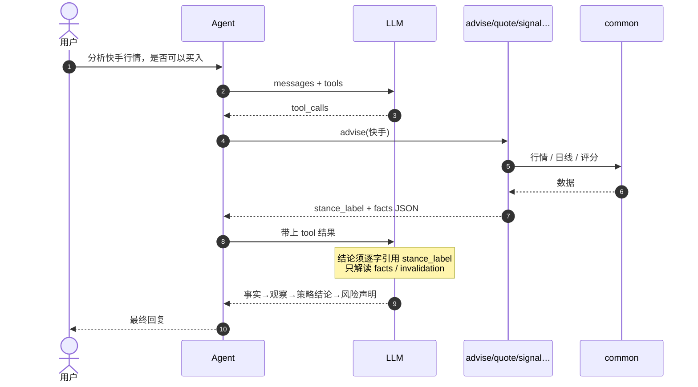

# 开发与入门手册

## 快速上手

[← 文档索引](README.md)

## 环境要求

- Python 3.9+（推荐；系统自带 3.8 也可跑行情/对比/离线单测）
- 通义千问（阿里云百炼 / DashScope）API Key
- 在线选股 / 完整短线日线：需安装 `akshare`（依赖 pandas）
- macOS 若无 `python` 命令，请用 `python3`

完整技术栈（语言 · Web · 前端 CDN · 存储 · 运维）见 **[architecture.md](architecture.md)**。

## 安装

```bash
cd investment
python3 -m pip install -U pip
python3 -m pip install -r requirements.txt
# 新建 .env，例如：
# DASHSCOPE_API_KEY=your_api_key
# DASHSCOPE_MODEL=qwen-plus
```

或使用环境变量：

```bash
export DASHSCOPE_API_KEY=your_api_key
export DASHSCOPE_ENDPOINT=https://ws-7hpevbps1ivbjf03.cn-beijing.maas.aliyuncs.com/compatible-mode/v1
export DASHSCOPE_MODEL=qwen-plus
# 联网搜索（默认开启）
# export DASHSCOPE_ENABLE_SEARCH=1
# export DASHSCOPE_SEARCH_STRATEGY=max
# export DASHSCOPE_SEARCH_FRESHNESS=7
# 可选：对话读超时秒数（默认 120）；探测默认 30
# export DASHSCOPE_TIMEOUT=180
# export DASHSCOPE_PROBE_TIMEOUT=45
```

## 运行

### CLI

```bash
cd investment
python3 main.py
```

交互命令：

- `quit` / `exit`：退出
- `reset`：清空对话历史，并清零 token 累计
- `usage` / `tokens`：查看本轮与会话累计 token

### Web 端

```bash
cd investment
python3 -m pip install -r requirements.txt
python3 run_web.py
```

浏览器打开 [http://127.0.0.1:8000](http://127.0.0.1:8000)。

| 项 | 说明 |
|----|------|
| 入口 | `run_web.py` → FastAPI `web/app.py` |
| 页面 | `web/static/`（对话 UI） |
| API | `POST /api/chat`、`GET /api/paper*`、`GET/POST /api/evals/*`、`GET /api/usage`、`GET /api/health` |
| 顶栏 | 主路径：**对话 · 观察 · 策略 · 模拟 · 回溯**；进阶页仍有 `/paper`（→模拟）、`/quant` |
| 会话 | 请求头 `X-Session-Id`（前端存 localStorage） |
| 端口 | 环境变量 `WEB_HOST`（默认 127.0.0.1）、`WEB_PORT`（默认 8000） |
| 热重载 | 默认 **关**（`WEB_RELOAD=0`）。开发改 py 时设 `WEB_RELOAD=1`；热重载会中断纸面后台任务，确认调仓时勿触发。纸面/分组/网格/对话 job 落盘 `data/jobs/*.json` |
| 日线缓存后端 | `INVESTMENT_BARS_BACKEND=sqlite`（默认）或 `json`；见 [sqlite-migration](architecture.md) · [architecture-upgrade-a](architecture.md) |

Web 与 CLI 共用同一套 `InvestmentAgent` / Skills / prompts；仍需配置 `DASHSCOPE_*`。

### 纸面 / 模拟是什么？

**模拟**（`/follow`）= 用假钱练手的日常账本：加减仓、清仓、净值曲线。  
**纸面**（`/paper`）= 同一套假账的**初始化 / 高级配置**入口，不进主导航；日常请用「模拟」。  
行情可以是真的，买卖只记在本地 `data/paper.json`，**不会亏真钱、不会下到真实券商账户**。本系统现行定位为 **策略验证**：**仅限模拟账户交易**。待验证成熟后再评估实盘。新仓从**观察**页建仓进来。完整说明见 [quant.md](quant.md) 与 [quant-ui.md](quant-ui.md)；边界见 [design-spine.md](design-spine.md)。

## 持仓（对话）

对话问持仓时，**默认读模拟账户** [`data/paper.json`](data/paper.json)（观察页建仓后即有）。

## 使用示例：分析快手的长短期持仓参考

若问的是「分析快手行情，**是否可以买入**」，系统路径与**买入依据**见 [§ 系统 Skill 详解](#各-skill-详解) / [§ 判断是否买入的依据](#各-skill-详解)。

下面以港股 **快手-W（01024）** 为例，说明长短期观察/持仓参考的完整链路。可走两条路径：

| 路径 | 怎么跑 | 是否完整 Investment |
|------|--------|---------------------|
| A. Agent 对话（推荐） | `python3 main.py` + 自然语言 | 是：LLM 选工具 + 解读 |
| B. 直接调 Skill | `python3 -c ...` | 否：只跑数据层，解读需人/模型另做 |

标的代码：`01024` / `hk01024`；名称「快手」已收入映射表（`adapters/market/quote_api.py`）。

### 路径 A：完整 Agent 流程（推荐）

```bash
cd investment
# 先配置 DASHSCOPE_* 环境变量或 .env
python3 main.py
```

在对话中输入例如：

```text
分析一下快手 01024 的短期和长期持仓怎么看
```

**Agent 内部预期过程**：

```text
1. 用户问题进入 InvestmentAgent.chat()
2. LLM 根据 prompts + tool_config 选择工具，常见组合：
   - quote(stock_code="快手" 或 "01024")     → 现价 / 涨跌 / 高低 / 量
   - kline(stock_code="快手", limit=10)      → 近 N 日形态
   - signal(stock_codes=["01024"], horizon_days=3) → 短线评分与失效条件
   - fundamentals / peer / news（问长期或资讯时）
   （若问已持有仓位，再调 position）
3. Handler 执行，JSON 结果以 role=tool 写回对话
4. LLM 按「事实摘要 → 观察点 → 风险/失效条件」组织回复
5. 末尾附带风险声明（量化研究与模拟 / 不保证收益 / 不代客下单）。
```

**一次实盘拉取到的行情事实示例**（数字会随交易日变化，以下为某次采样）：

| 项目 | 示例值 |
|------|--------|
| 标的 | 快手-W（01024.HK） |
| 现价 | HK$43.28 |
| 当日涨跌 | -7.76%（-HK$3.64） |
| 日内区间 | 开 47.18 / 高 47.40 / 低 43.06 |
| 成交量 | 约 8363 万 |
| 短线评分（1～3 天） | 约 38.9 / 100（偏弱） |
| 短线失效参考 | 约 HK$41.98（现价约 -3%） |
| 评分数据源 | 可能为 `quote_fallback`（港股日线未拉到时因子偏粗） |

**解读结构示例（逻辑示意，非实时结论）**：

1. **事实**：当日大跌、开高走低，短线分偏低 → 近 1～3 天动能偏弱。  
2. **短期持仓参考**：偏观望/防守；已持仓关注能否站稳低点附近，跌破失效位则降低短线优先级；未持仓不宜把急跌直接当成必反弹信号。  
3. **长期持仓参考**：长期看生意（短视频/电商/广告变现、竞争与盈利质量），单日大跌多属波动；加减仓宜基于基本面与仓位纪律，而非仅凭当日阴线。  
4. **风险**：策略结论不等于下单指令，不保证收益。

### 路径 B：无 LLM 时复现数据层（调试用）

仅验证 Skill，不经过 `main.py` / 大模型：

```bash
cd investment

# 1) 行情
python3 -c "from adapters.market import StockAPI; import json; print(json.dumps(StockAPI.query('快手'), ensure_ascii=False, indent=2))"
# 等价：StockAPI.query('01024')

# 2) 短线观察池 / 评分
python3 -c "
from skills.signal.handler import SignalHandler
import json
print(SignalHandler().execute({
    'parameters': {'stock_codes': ['01024'], 'horizon_days': 3, 'limit': 5}
}))
"
```

然后再按上面的「解读结构」人工或另用模型写长短期参考。  
注意：路径 B **不算**完整 Agent 使用；完整例子请走路径 A。

### 过程中的注意点

- 港股代码可用 `01024`、`1024`、`hk01024`；优先用映射名「快手」。
- `signal` 若 `data_source=quote_fallback`，说明没用上完整日线，短线分仅供参考。
- 长期结论应优先调 `fundamentals`（及可选 `peer`/`index`/`news`）；港美财务覆盖弱于 A 股时，LLM 只能做定性框架，仍不得编造数字。
- 每次运行价格与评分都会变，文档中的表格只说明「过程长什么样」，不要当作当前买卖依据。

## 量化研究台（可选）

逐步操作（观察→回溯→纸面→模拟）见 **[quant-ui.md](quant-ui.md)**。

```bash
cd investment
bash scripts/setup_quant.sh                              # watching + 纸面 init
python3 research/daily_run.py --preset quant --json      # 每日量化
python3 research/daily_run.py --preset quant_paper --json # 量化 + 纸面调仓
python3 research/signal_diff_export_run.py --fresh       # 导出 diff 合并包
python3 evals/run_checklist.py --mock --presets          # golden + preset 校验
python3 run_web.py                                       # Web → 顶栏工具页
```

详见 [quant.md](quant.md)（入门概念 + 运维）· [quant-upgrade.md](archive/quant-upgrade.md)。

## 无 LLM 时直接测模块

Skill 可脱离 Agent 单独调用，便于调试数据层：

```bash
cd investment
# 行情
python3 -c "from adapters.market import StockAPI; print(StockAPI.query('茅台'))"

# 短线观察池（无 akshare 时自动用行情退化评分）
python3 -c "from skills.signal.handler import SignalHandler; print(SignalHandler().execute({'parameters':{'stock_codes':['茅台','招商银行'],'horizon_days':3}}))"

# 持仓参考
python3 -c "from skills.position.handler import PositionHandler; print(PositionHandler().execute({'parameters':{'horizon_days':3}}))"

# K 线形态
python3 -c "from skills.kline.handler import KlineHandler; print(KlineHandler().execute({'parameters':{'stock_code':'快手','limit':10}}))"

# 基本面 / 同行 / 相对强弱 / 资讯
python3 -c "from skills.fundamentals.handler import FundamentalsHandler; print(FundamentalsHandler().execute({'parameters':{'stock_code':'茅台'}}))"
python3 -c "from skills.peer.handler import PeerHandler; print(PeerHandler().execute({'parameters':{'stock_code':'快手'}}))"
python3 -c "from skills.index.handler import IndexHandler; print(IndexHandler().execute({'parameters':{'stock_code':'宁德时代','window_days':20}}))"
python3 -c "from skills.news.handler import NewsHandler; print(NewsHandler().execute({'parameters':{'stock_code':'茅台','limit':5}}))"
```

---

## 开发与测试

[← 文档索引](README.md)

技术栈与依赖边界见 **[architecture.md](architecture.md)**；安装见 **[§ 快速上手](#快速上手)**。

## 运行测试

```bash
cd investment
python3 -m unittest discover -s tests -v
```

单测覆盖：符号解析与缓存、对比、选股过滤（fixture）、短线打分/硬拒绝、K 线形态、持仓规则（mock 行情）。网络依赖接口在测试中 mock，避免 CI 强依赖外网。

## 黄金用例 / 能力校验（evals）

改 prompts 或 Skill 后，用 golden checklist 校验 Skills 与路由（推荐离线 mock）：

```bash
cd investment

# 离线 mock + daily preset 校验（CI / PR 同款，21 cases）
python3 evals/run_checklist.py --mock --presets

# 只跑 Skills（需外网时可去掉 --mock）
python3 evals/run_checklist.py

# 只跑某一案
python3 evals/run_checklist.py --mock --case quant_portfolio_bridge

# 只跑量化 golden（10 quant_* cases）
python3 evals/run_checklist.py --mock --quant-only --presets

# preset 单独校验
python3 evals/run_preset_check.py

# Agent 周末回归（需 .env 配置 DASHSCOPE_API_KEY，不进 PR CI）
bash scripts/agent_regression.sh
bash scripts/agent_regression_quant.sh
python3 evals/run_agent_check.py --case quant_package_info

# 信号可复现性（fixture 双跑）
python3 evals/run_repro.py
```

**CI**（`.github/workflows/investment-ci.yml`）：push/PR 自动跑单测 · **import 审计** · repro · `--mock --presets` checklist · preset 校验 · daily eval-mock。

本地量化 CI 同款：`bash scripts/ci_quant.sh`（单测 · import 审计 · repro · checklist · daily eval-mock）。

**Web**：顶栏 **「校验」** → 离线 mock · preset 校验 · **「CI 同款」** · **「量化 CI 同款」** · 可选 Agent · **路由对照表**（`GET /api/evals/routing`）。

**Eval API**：

| 路径 | 说明 |
|------|------|
| `GET /api/evals/summary` | case 数、preset、上次结果、CI 命令 |
| `GET /api/evals/routing` | golden routing 预期 vs 推断 |
| `GET /api/evals/presets` | daily preset 标志位校验 |
| `GET /api/evals/readme` | 子目录 README 覆盖 + 架构回链 |
| `POST /api/evals/run` | body 可含 `with_presets`（含 readme 校验） |

用例定义在 `evals/golden_cases.json`（**21 cases**，含量化 `quant_*`、`quant_factor_ols`、`quant_model_policy` 等）。校验原则：**数字以 Skills 为准；Agent 回复不得出现工具结果里没有的关键数字；买入类须含免责声明。**

Web 量化面板：quant preset daily 完成后自动加载 **Markdown 导出预览**（含 `#neutral-compare` / `#cross-section` TOC）；无 LLM 时「AI 解读」自动走 `POST /api/quant/interpret` · `{ "offline": true }` 规则解读。

生产决策为 **规则 score + stance**，未默认线性回归/复杂拟合模型；说明见 [quant.md](quant.md)。

**量化报告分享**：归档报告列表含 `share_url`（如 `/api/quant/reports/quant_daily_YYYYMMDD.html`）；Web 量化面板「运维状态」可 **复制链接**（需 Web 服务运行中）。

顶栏 **「纸面」** → 净值曲线、初始化、跑观察池、**每日任务**。  
顶栏 **「持仓」** → 规则 action / stance；**「打开量化」** / **「量化对照」** 跳转量化联动面板。  
顶栏 **「量化」** → watching / 横截面 / 组合回测 / diff / daily preset 运维等，详见 [quant-ops.md](quant.md#量化运维)。

## 扩展新 Skill（约定）

接口形状与注册步骤见 见 [architecture.md](architecture.md)。摘要：

1. 在 `skills/<name>/` 下增加 `tool_config.json`、`handler.py`（`BaseSkillHandler`）、`engine.py`。
2. 在 `agent/registry.py` 的 `SKILL_SPECS` 注册（只改一处）。
3. 在 `prompts.py` 补充工具说明与路由偏好。
4. 在 `tests/` 增加离线可跑的单测（网络一律 mock）。

量化类 Skill 优先放在 `research/` 放纯函数引擎，`skills/<name>/` 只做参数解析与拉数。

## 限制与风险

- 免费行情/AkShare 可能延迟或变更；失败时应报错，不得由 LLM 补造数字。
- `quote_fallback` 短线评分信息量弱于完整日线，用 `data_source` 区分。
- 名称映射表有限；未知中文名请改用代码。
- `fundamentals` / `news` 以 A 股接口为主；港美覆盖弱于 A 股。
- `peer` 为预设同业组，非自动行业聚类。
- 1～3 天信号胜率不稳定；策略结论仍须提示风险，不保证收益。
- 完整自然语言路径强依赖通义千问（`DASHSCOPE_MODEL=qwen-plus`，可开联网搜索）。

## 合规与风险说明

系统定位为 **策略验证**（量化研究与模拟，融合 AI 编排，非持牌投顾问诊）：策略结论与模拟盈亏**不保证收益、不代客下单**；待验证成熟后再评估实盘。禁止内幕/违法交易方案。回复末尾附带风险声明。

---

## 数据源一览

| 数据 | 来源 | 主要消费者 |
|------|------|------------|
| 实时报价 | 腾讯 `qt.gtimg.cn` | `quote`（及依赖它的 Skill） |
| A 股现货全表 | AkShare | `screen` |
| A/港/美日线 | AkShare（经 `adapters/market/history.py`） | `signal` `kline` `index` |
| 日线失败降级 | 当日 `quote` 拼近似 bar | `history.quote_fallback` |
| 财务要点 | AkShare | `fundamentals` |
| 指数历史 | AkShare | `index` |
| 资讯标题 | AkShare | `news` |
| 模拟持仓与规则 | `data/paper.json` / `position_rules.json` | `position` |

---

---

## 各 Skill 详解

[← 文档索引](README.md)

十个 Skill 遵循同一模式：`tool_config.json`（给 LLM 的说明书）→ `handler.execute()`（执行）→ 返回 **JSON 字符串**（供 LLM 组织回复）。

### 1. quote — 单票实时行情

**目录**：`skills/quote/`  
**典型说法**：「茅台现价」「AAPL 股价」「600519」

**职责**：查询 **一只** 股票的最新价、涨跌幅、开高低、成交量等。是底层能力，compare / signal / position 都会间接复用。

**流程**：

1. LLM 抽出参数 `stock_code`（名称或代码）。
2. `StockAPI.resolve_symbol` 转为腾讯行情符号：
   - 热门映射：「茅台」→ `sh600519`，「腾讯」→ `hk00700`
   - 已带前缀：`sh` / `sz` / `hk` / `us`
   - 6 位数字：`6*`→沪市，`0*`/`3*`→深市
   - 4～5 位数字 → 港股 `hkxxxxx`
   - 纯字母 → 美股 `usTICKER`
   - 未知中文名 → 报错并提示用代码（避免幻觉代码）
3. 请求 `https://qt.gtimg.cn/q={symbol}`（GBK 解码，`~` 分隔字段）。
4. 同一 symbol **60 秒内存缓存**。

**输出要点**：

- 展示字段：`price`、`change`、`volume` 等
- 计算字段：`price_raw`、`change_raw`（供下游数值计算）
- `cached: true` 表示命中缓存

**入口**：`handler.py` → `StockAPI.query`

### 2. compare — 多股对比

**目录**：`skills/compare/`  
**典型说法**：「对比茅台和五粮液」「宁德和比亚迪谁强」

**职责**：对 **2～5 只** 股票拉行情并排比较，生成横向摘要。

**流程**：

1. 参数 `stock_codes: string[]`（也兼容逗号/中文逗号分隔字符串）。
2. 校验：少于 2 只或多于 5 只 → 报错。
3. 对每只调用 `StockAPI.query`（复用 quote）。
4. 成功写入 `stocks`，失败写入 `failures`（单票失败不阻断整次对比）。
5. 按 `change_raw` **降序**排序，生成可读 `summary`。

**与 quote 的区别**：quote 给单票详情；compare 做多票对齐 + 排序摘要，服务「比一下」场景。

### 3. screen — 条件选股

**目录**：`skills/screen/`  
**典型说法**：「找市盈率低于 15 的银行股」「涨幅超过 2% 的白酒」

**职责**：在 **A 股全市场现货** 上按条件筛名单，返回「筛选结果」（不是荐股）。

**流程**：

1. `akshare.stock_zh_a_spot_em()` 拉取东方财富现货（需安装 akshare/pandas）。
2. 本地纯 Python `filter_stocks`（`screen/engine.py`）过滤，单测可不依赖 pandas：
   - `sector`：`SECTOR_ALIASES` 对名称（及可选行业列）做模糊匹配
   - `pe_max` / `pe_min` / `pb_max` / `change_min` / `change_max`
   - 排除名称含 `ST`
3. 按涨跌幅降序，截断到 `limit`（默认 10，最大 20）。
4. **至少提供一个筛选条件**，否则拒绝（避免全市场裸奔）。

**参数一览**：

| 参数 | 含义 |
|------|------|
| `sector` | 行业/板块关键词（银行、白酒、新能源等） |
| `pe_max` / `pe_min` | 动态市盈率上下限 |
| `pb_max` | 市净率上限 |
| `change_min` / `change_max` | 涨跌幅（百分比数值） |
| `limit` | 返回条数 |

**与 signal 的区别**：screen 按财务/涨跌等条件筛名单；signal 对名单做短线强弱打分。

### 4. signal — 1～3 天短线观察池

**目录**：`skills/signal/`（`engine.py` + `scorer.py` + `history.py`）  
**典型说法**：「未来三天看什么」「给茅台和宁德做短线评分」

**职责**：对候选股打 **0～100 分**，产出观察池（分数、主因、失效条件）。定位为短线参考，不是买入指令。

**候选来源**（按优先级）：

1. 用户提供 `stock_codes`
2. 仅提供 `sector` → 先走 screen 初筛
3. 都未提供 → 默认热门池（茅台、招行、宁德等）

**单票流程**：

1. `quote` 取现价
2. 尽量拉 AkShare 前复权日线（约 30 日）→ `data_source=akshare_daily`
3. 日线失败 → 用现价+涨跌构造伪 2 日线 → `quote_fallback`（信息更弱）
4. `score_bars` 打分；硬拒绝进入 `rejected`
5. 按分数取 Top N（`limit`，默认 8）

**评分权重**：

| 因子 | 权重 | 含义 |
|------|------|------|
| 动量（近 3/5 日） | 40% | 温和上涨得分高，过热降分 |
| 量价（量比） | 30% | 放量上涨加分，放量下跌扣分 |
| 相对强弱占位 | 20% | 暂用当日涨跌近似 |
| 波动（ATR%） | 10% | 波动过大惩罚 |

**硬过滤**：近 3 日涨幅 ≥15%（追高）、跌幅 ≤-12%（动能过弱）、ST、日线不足。

**输出要点**：`observation_pool`、`reasons`、`invalidation`（如跌破约 -3% 参考位）、`horizon_days`（1～3）、`data_source`。

**局限**：无 akshare 时走 `quote_fallback`，量比/ATR 几乎退化，分数偏粗糙；可通过 `data_source` 判断质量。

「能不能买」如何把本评分与其它工具合成最终建议，见 [§ 判断是否买入的依据](#各-skill-详解) 与 [quant.md](quant.md)。

### 5. position — 持仓建议（含加减仓类问题）

**目录**：`skills/position/`  
**典型说法**：「我的持仓怎么看」「未来几天仓位建议」「该不该减仓」「我有 100 股茅台成本 1400，现金 5 万，怎么处理」

**职责**：本地/临时持仓 + 实时行情，用 **可配置规则** 给出观望/减仓/止损/降集中度等 **动作参考**。这是规则引擎，不是模型临场荐股。

#### 如何回答「持仓建议 / 加减仓」

| 用户问题类型 | 系统怎么走 |
|--------------|------------|
| 持仓建议、仓位怎么看 | `prompts` 路由 → **`position`** |
| 该不该减仓、仓位重不重 | 同上；规则可直接给出减仓/降集中度等 `action` |
| 该不该加仓、再买多少 | 规则引擎侧重风控动作；LLM 可结合 `quote`/`signal` 解释加仓/观望等策略倾向 |

**数据从哪来**：

| 用户说法 | LLM 典型参数 |
|----------|----------------|
| 「看看我的持仓」 | **默认读 `data/paper.json`（模拟账户）** |
| 「我有 100 股茅台成本 1400，现金 5 万…」 | 传 `holdings` + `cash`（不读文件） |

可选：`horizon_days`（1～3）、`rules_path`（默认 `data/position_rules.json`）、`include_stance`（附加每票 `stance_label` / `signal_score`）、`include_full_stance`（走完整 `collect_stock_facts`）。

**执行链路**：

```text
用户问题
  → LLM 选 position（可填 holdings / cash）
  → PositionHandler → PositionEngine.advise
       → 每只 StockAPI.query 取现价
       → 算总权益、单票权重、浮盈亏
       → evaluate_holding（套 position_rules.json）
  → JSON：每票 action / reasons / 建议权重区间 / 失效位
  → LLM 改写为「事实 → 观察 → 风险」+ 免声明
```

**持仓来源**（默认 `data/paper.json` 模拟账户）：

```json
{
  "cash": 50000,
  "holdings": [
    {"stock_code": "600519", "stock_name": "贵州茅台", "shares": 100, "cost": 1400}
  ]
}
```

**计算**：

- 浮盈亏% = `(现价 / 成本 - 1) × 100`
- 权重% = 该股市值 / (现金 + 全部持仓市值)

**规则摘要**（阈值见 `data/position_rules.json`，可改）：

| 条件（默认） | 动作 `action` | 紧迫度 |
|--------------|---------------|--------|
| 单票权重 ≥35% | 降集中度（偏减） | 高 |
| 权重 ≥25% | 控制仓位 | — |
| 浮盈 ≥8% 且当日 ≤-2% | 减仓锁定 | 中 |
| 浮盈 ≥5% 且当日 ≥0 | 持有并上移止盈 | — |
| 浮亏 ≤-8% 且当日 ≤-2% | 止损参考 | 高 |
| 浮亏 ≤-5% 且当日 ≤-3% | 减仓观察 | 中 |
| 其余 | 观望 | 低 |

每条另含 `suggested_weight_pct_range`、约 -3% 的失效参考价（`invalidation`）、`urgency`、`reasons`。

**重要限制**：

- 输出偏 **风控**（观望 / 控制 / 减仓 / 止损 / 降集中度），**不会**从规则里吐出「加仓」。
- 无模拟账户且未传 `holdings` → 报错或提示先初始化 / 去观察建仓。
- LLM 以研究助手口吻解读规则结果；禁止「稳赚 / 必涨 / 保证收益」。

**与 signal 的区别**：`signal` 面向「看什么」；`position` 面向「已持有」的仓位建议。

**怎么用**：

1. 在观察页建仓（写入 `data/paper.json`），问：「我的持仓怎么处理？」  
2. 或口述临时持仓（不必改文件）。  
3. 调敏感度：编辑 `position_rules.json`（如把 `stop_loss_pnl` 从 -8 调到 -5）。

### 6. kline — 日 K 形态摘要

**目录**：`skills/kline/`  
**典型说法**：「快手最近的日 K」「今天这根阴线怎么描述」

**职责**：拉取近 N 根日 K（开高低收量），用规则标注阳/阴、大阴大阳、长短影、放量缩量，并给出文字 `summary`。

**流程**：`fetch_daily_bars`（A/港）→ 失败则 `quote_fallback` → `summarize_bars`。  
**注意**：形态描述 ≠ 买卖信号；港股需 AkShare 才有完整日线。

### 7. fundamentals — 基本面要点

**目录**：`skills/fundamentals/`  
**典型说法**：「茅台 PE/ROE」

**职责（A 股为主）**：现货 PE/PB/市值 + 可选乐咕估值 + 财务指标（ROE、营收/净利增速等），并生成 `highlights`。  
港股目前字段有限，会注明需增强。

### 8. peer — 同行对比

**目录**：`skills/peer/`  
预设组：白酒、银行、新能源、互联网港股。对比组内行情（及 A 股 PE/PB 若可得）。

### 9. index — 相对强弱

**目录**：`skills/index/`  
计算个股近 N 日收益 vs 基准（A 股默认沪深300，港股默认恒生），输出超额与「相对偏强/偏弱/同步」。

### Skill 之间的关系

```text
quote  ──┬── compare / signal / kline / peer / position
history ──► signal / kline / index
spot/财务 ──► fundamentals / peer(估值补充)
screen ──► signal 候选池

长期综合：quote + kline + fundamentals (+ peer/index)
短线综合：quote + signal + kline
```

典型串联：「银行里 PE 低的」→ `screen` → 「这些未来三天怎么排」→ `signal`；「我账上这些票」→ `position`。

### AI 解读与咨询（无独立 Skill · 旁路）

- **解读**：先调工具取数，再输出事实 → 观察点 → **策略结论（引用规则）** → 风险声明。
- **咨询**：可直接自然语言回答；需要数字时再调工具。
- 禁止：保证收益、代客下单、内幕/违法交易；允许买入/观望/减仓等明确策略倾向。

### 系统如何回答：「分析快手行情，是否可以买入」

定位为 **量化交易 + AI 编排**：须**正面给出策略结论**（建议买入 / 建议观望暂不买入 / 暂不建议操作等），不能只堆行情表或只甩风险声明。  
结论须绑定工具事实；短线分偏低、放量大跌、弱于同业时，默认倾向「建议观望（暂不买入）」，勿为显得果断而强行建议买入。

#### 判断是否买入的依据是什么

> 规则 stance 的完整决策流程与代码路径见 [quant.md](quant.md)。

「是否买入」的**结论**由 **`advise` 规则引擎**（`core/stance.py`）确定性输出；LLM **只解读** `facts` 与 `invalidation`，须**逐字引用** `advise.stance_label`，不得自行升级/降级。  
系统保证的是「基于工具数据的可追溯策略结论」，**不是**「预测必对 / 下单信号」。

**1. `advise` 会拉齐的数据层**

| 层 | 工具 | 作用 |
|----|------|------|
| 现价事实 | `quote` | 价格、涨跌、量 |
| 短线动能 | `signal` | **硬过滤 + 0～100 分 + 失效位**（短线核心依据） |
| K 线结构 | `kline` | tags / 趋势；日线失败时为 `quote_fallback`，结论须降强度 |
| 相对强弱 | `peer` / `index` | 相对同行、相对大盘 |
| 长期 / 资讯 | `fundamentals` / `news` | 估值与新闻（解读层可选补充，不参与 stance 主算） |

问「分析 / 能不能买 / 该不该买」时 Agent **必须**调用 `advise(stock_code=...)`；需要长文时可再调 `fundamentals` / `news`。

**2. 真正「算出来」的短线依据（`signal` / `scorer.py`）**

硬拒绝（直接不宜短线买）：

| 条件 | 含义 |
|------|------|
| 近 3 日涨幅 ≥ **15%** | 追高风险 → `hard_reject` |
| 近 3 日跌幅 ≤ **-12%** | 动能偏弱 → `hard_reject` |
| 日线不足 | 无法评分 → `hard_reject` |

综合分（0～100）权重：

| 因子 | 权重 | 含义 |
|------|------|------|
| 动量（近 3/5 日） | 40% | 温和上涨（约 0～6%）得分高，过热降分 |
| 量价（量比） | 30% | 放量上涨加分，放量下跌扣分 |
| 相对强弱占位 | 20% | 暂用当日涨跌近似 |
| 波动（ATR%） | 10% | 波动过大惩罚 |

同时给出 **失效条件**（如跌破最新价约 -3% 参考位、放量跌破近 3 日低点等），供「策略结论：是否买入」节引用。

**3. 规则 stance 合成（`compute_buy_stance`，非 LLM）**

| 条件 | 典型 stance |
|------|-------------|
| `hard_reject` 或 K 线大阴/放量下跌 | `avoid` → 建议观望（暂不买入） |
| 分数偏低 / 当日大跌 / 弱于同业 | `wait` / `avoid` |
| 分数中等 + 结构尚可 | `probe` → 建议逢低分批关注但暂不追入 |
| 分数较高且无硬拒绝 | `buy_light` → 可考虑轻仓试探（非追涨） |
| 行情或 signal 不可用 | `insufficient` |

LLM 在「策略结论：是否买入」节**只能引用**上表对应的 `stance_label` 原文。

**4. Prompt 里的解读约束（LLM）**

- 组织事实表、结构解读、情景与仓位；**不得**与 `advise.stance_label` 矛盾
- 禁止「稳赚、必涨、保证收益」；结尾必须附带免责声明
- `data_source=quote_fallback` 或 `depth=intraday_proxy` 时，须提示「日线不完整，结论偏短线」

**5. 与「持仓加减仓」的区别**

| 问题类型 | 主引擎 | 说明 |
|----------|--------|------|
| 空仓 / 新标的「能不能买」 | `advise` + LLM 解读 | 本文所述买入依据 |
| 已有仓「减不减、止不止」 | `position` + `position_rules.json` | 管已持仓风控动作，不是开仓主引擎 |

**一句话**：依据 = `advise` 规则 stance + `signal` 硬过滤与评分 + K 线/同行/大盘事实；LLM 负责解读与组织，**不得改写** `stance_label`；不保证收益、不代客下单。

#### 路由

| 用户话里的部分 | 系统怎么走 |
|----------------|------------|
| 分析快手行情 | `advise(快手)`（内含 quote/kline/signal/peer/index） |
| 是否可以买入 | 同上；「策略结论：是否买入」须逐字引用 `stance_label` |
| （若已持有快手）减不减 | 另走 `position`，见上文 [position 节](#5-position--持仓建议含加减仓类问题) |

#### 典型工具链（路径 A：`python3 main.py`）

```text
用户：分析快手行情，是否可以买入
  → LLM 选工具
  → advise(快手)  → quote + signal + kline + peer/index → stance_label + facts
  → 可选：fundamentals / news（长文解读）
  → LLM 按多层结构组织策略解读（结论须 = stance_label）
  → 风险声明
```



#### 回复应长什么样（深度模式）

1. **事实表**（多维度：quote / signal / kline / index / peer / fundamentals / news）。  
2. **结构解读 / 短线动能 / 相对强弱 / 基本面资讯**（有则写，无则声明缺口）。  
3. **情景与仓位**（乐观/中性/悲观 + 仓位节奏）。  
4. **策略结论：是否买入**：**逐字引用 `advise.stance_label`** + 依据（引用 facts）+ 失效/再评估条件（`advise.invalidation`）。  
5. 结尾风险声明；全文约 **700～1100** 汉字（不含表格数字）。

**示意**：

```text
## 事实
| 维度 | 数据 |
| 现价/涨跌/量 | … |
| 短线分/失效位 | 38.9；约 41.98 |
| K线 | 大阴、放量 |
| 同行 | 当日同业最弱 |

## 观察
1. …新维度…

## 策略结论：是否买入
- 建议结论：建议观望（暂不买入）
- 依据：见短线分、K 线、同行相对强弱
- 再评估：跌破失效位继续观望；若站稳…可再评估

以上为量化研究与模拟结论，市场有风险，不保证收益，不代客下单。
```

#### 对话示例

```text
分析快手行情，是否可以买入
```

与「持仓怎么看」对照：

| 问法 | 主工具 |
|------|--------|
| 分析快手，能不能买 | `quote` + `kline` + `signal`（± `peer` / `news`） |
| 我已持有快手，减不减 | `position`（+ 行情） |

---
