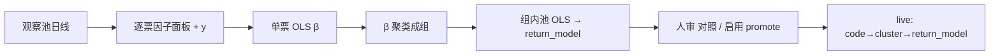
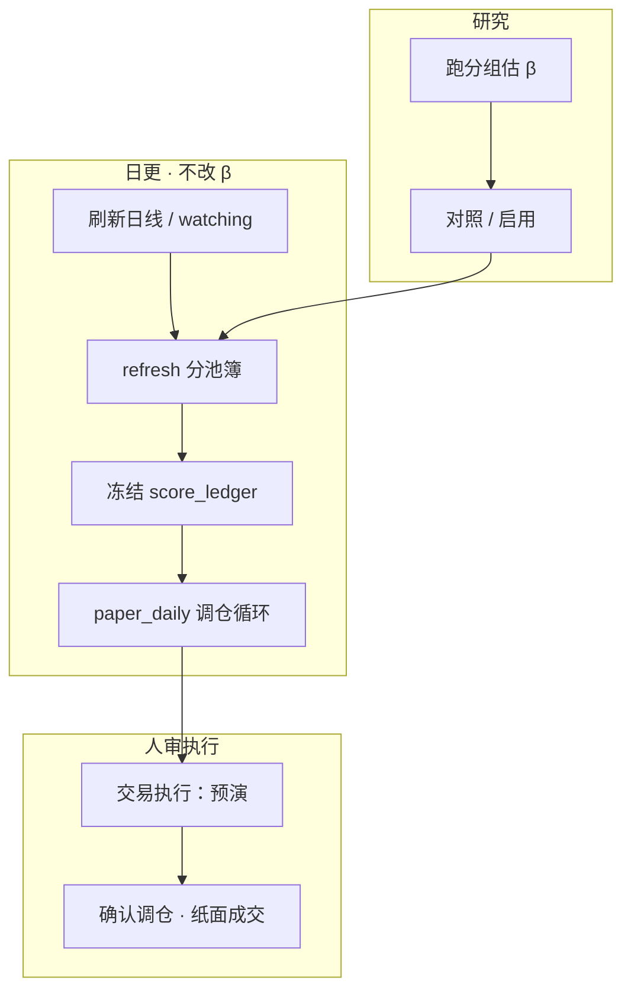

# predicted_score（ŷ）逻辑链路与执行链

[← 文档索引](README.md) · 产品主轴 [design-spine.md](design-spine.md) · 复盘细节 [score-review.md](score-review.md) · 运维定时 [quant-ops.md](quant-ops.md)

本文梳理 **训练 → 打分 → 回测 / 复盘 / 验证 → 纸面执行** 的同一套时间口径与产物流转。  
目标：任何人看到页面上的「评分 / score / ŷ」，都能回答「它在预测什么、该和谁对账、会不会自动改 β」。

---

## 1. 一句话主轴

```text
历史日线 → 因子 sub_scores(t)
         → OLS/Ridge 估 β（组 return_model）
         → ŷ = predicted_score(t)   # 预测未来 h 日收益（%）
         → 排序 / 门槛 / 调仓 / 冻结账本
         → 用 close[t+h]/close[t]-1 验证
```

生产选股真源是 **回归 ŷ（因子系数 β）**，不是启发式 0–100 分。  
`heuristic_score` 仅研究对照基线。

---

## 2. 统一契约（全链路共用）

### 2.1 决策日 `as_of` / \(t\)

站在交易日 \(t\) 打分时：只用 **\(t\) 及以前** 已完成的日线（及 PIT 财务等）算因子。  
\(t\) 日盘中若尚无当日完整 K 线，实际因子截止日通常是 **上一交易日 \(t-1\)**。

### 2.2 标签 \(y\)（训练与复盘同一公式）

\[
y = \bigl(\mathrm{close}[t+h] / \mathrm{close}[t] - 1\bigr) \times 100
\]

| 符号 | 含义 |
|------|------|
| \(t\) | 决策日（因子截止日） |
| \(h\) | `horizon_days`（前瞻持有期，交易日数） |
| \(y\) | 从 \(t\) 收到 \(t+h\) 收的简单收益（百分点） |

实现：`core/research/panel.py` · `build_y_spec`（`formula: close[t+h]/close[t]-1`）。

**不是**「决策日当天的涨跌幅」\(\mathrm{close}[t]/\mathrm{close}[t-1]-1\)。

### 2.3 预测 ŷ

\[
\hat y = f(\text{sub\_scores}(t);\ \beta,\ \text{intercept},\ z\text{-规则})
\]

写入 / 展示字段多为 `predicted_score` / `score`（收益分，单位 %）。  
方向命中：\(\mathrm{sign}(\hat y)=\mathrm{sign}(y)\)（\(|\hat y|<0.05\%\) 视为无方向，见复盘）。

### 2.4 `horizon_days` 默认（易混）

| 来源 | 常见默认 | 用途 |
|------|----------|------|
| `signal_config.scoring.horizon_days` | **3** | 配置契约；多数 API / 复盘 UI 兜底 |
| 研究枢纽「持有期」`#quant-horizon` | **1** | **跑分组 / TopK 回测** 读页面时 |
| 昨日复盘 Horizon 下拉 | **3**（可选 1） | 对账标签长度 |

**原则**：估 β、打 ŷ、复盘 \(r_h\)、回测持有期应使用**同一 \(h\)**；改 UI 持有期后需重跑分组并 promote，再谈 live 一致性。

---

## 3. 训练链：从日线到组 β



| 步骤 | 入口 | 产物 | 是否自动每日跑 |
|------|------|------|----------------|
| 跑分组 | 研究枢纽「跑分组」；进页**恢复**上次落盘（不重算） | 组表 + `return_model.coefficients` + `cluster_last_report.json` | **否**（非 cron） |
| 对照 / 启用 | 枢纽 promote | `data/live/cluster_weights_*.json` | 否（人审） |
| 健康 / 陈旧 | `cluster_scoring.refit_max_age_days`（默认 14）等 | 建议重估；可 auto demote active→shadow | 日更只检查，**不重估 β** |

要点：

- **β 不会在固定钟点自动更新**；`paper_daily` / `daily_quant` 不跑 OLS 分组。
- 收盘后刷新日线（约 15:05+，实务常 16:30–17:00）再跑分组，最新 K 线可含**当日**；但训练样本仍受 \(h\) 约束：最后一条训练决策日 ≈ 最新 bar 再往前 \(h\) 日。
- **auto-k**：中心 \(k_0\approx n/5\)（夹 4～10）。**定组 β / 选 k 组池 / holdout 重拟合**共用宇宙日历切分（主切点约前 70%）。邻域 \(\{k_0-1,k_0,k_0+1\}\) × 层次 complete/average + kmeans 等配方；有日历时再加 **~55% 切点**各自前段 β 重聚类，按 **多折均值 `partition_loss`**（尾段有符号 ŷ IC↑ / 前段重拟合误差↓；重拟合失败不计分）选优，ΔOOS 过门作辅。**交付标签取主切点**；组池 `return_model` 仍用**全样本**重估。大宇宙（≥40）跳过多折打分。报告：`k_selection`（含 `expanding_score` / `expanding_folds`）与 `walk_forward`。手动 `n_clusters` 不搜邻域，但定组 β 同样走前段。
- **贪心换组**：定组后（≤24 票、有日历切分）按 holdout `partition_loss` 有限轮试换（`cluster_greedy_refine`；最多 2 轮 / ≤80 次评估）。接受的 swap **改写交付标签**；全样本组池仍后置重估。报告字段 `greedy_refine`。大宇宙跳过。完整 `objective_partition` 贪心仍为研究试点。
- **`partition_loss` 口径**：默认 **有符号 IC**（`ic_use_abs=False`，与 live 选 k 一致；|IC| 会把反向 ŷ 评成「好」）。单票组计入质量先验，避免踢成单票「眼不见为净」；无可用模型 / holdout 重拟合失败的多票组须带 `fit_ok=False`（含 live 贪心 `cluster_greedy_refine`），另计 `penalty_unusable`。`penalty_singleton` 按**票数占比**；`singleton_count` 仍是单票**组数**（展示勿混）。β 异质踢出同时看相对 |Δβ|/scale 与绝对阈值。
- **扩展窗审计**：在 train 分位约 55% / 70% 两折各自前段 β **重聚类** + 尾段评分（`walk_forward.expanding`）；记相邻折标签稳定度。只读诊断，**不改**交付标签；大宇宙跳过。
- **标签对齐**：跑分组结束时若存在 live `cluster_weights`，按 code 重叠最大化把新 `cluster_id` / `G*` 对齐到上一版（Hungarian；无 scipy 则贪心），报告字段 `label_alignment`（含 `stability`）。未匹配的新组分配新 id。
- **软异质**：多票组先等权池 OLS 得组 β，再按单票 max\|Δβ\| 降样本权（\(w=1/(1+(Δ/0.25)^2)\)，下限 0.2）重拟合；**不拆组**。组字段 `soft_hetero` / `member_beta_gaps[].soft_weight`。
- **研究区持久化**：成功分组始终写 `data/live/cluster_last_report.json`（并更新指纹缓存）。刷新进页 `GET .../last-report` 恢复同一分区（顺序：last_report → 指纹缓存 → `cluster_weights_draft`）；仅点「跑分组」才重算。勾选刷新日线时也会覆盖指纹缓存，避免旧分区残留。概览「全局 IC / 方向命中 / 因子摘要」来自全样本因子与 ŷ 复盘，**不是**组内 β 表。

相关实现：`quant/research/factor_ols_clusters.py` · `quant/research/partition_loss.py` · `quant/research/cluster_wf_audit.py` · `quant/research/cluster_greedy_refine.py` · `core/signal/cluster_live.py` · `core/signal/return_score.py`。

---

## 4. 预估 / 打分链（live）

```text
日线窗口(≤t) → sub_scores
             → 查 code 的 return_model（组 β，active 时）
             → predicted_score ŷ%
             → min_predicted_score / 分池簿 / stance
```

| 场景 | 行为 |
|------|------|
| 数据中心 / 交易执行表 | `score_stock` 同源展示 ŷ；**涨跌幅列为当日行情**，与 ŷ **不同口径** |
| 分池簿刷新 | `refresh_cluster_book_daily`：用**已有 β** 重打截面，不改系数 |
| 纸面预演 / 确认调仓 | 读当前 live ŷ 排序与门槛，不训练 |

配置门：`scoring.rank_mode=predicted_score` · `min_predicted_score` · `cluster_scoring.mode`（off / shadow / active）。

---

## 5. 回测链（TopK 历史）

入口：研究枢纽 TopK 回测 · `backtest_topk_equal_weight`。

与契约对齐的部分：

- 每个调仓日 \(t\)：仅用到 \(t\) 的窗口打分；
- 标签 / 持有长度用同一 `horizon_days`；
- walk-forward 拟合时，训练 \(y\) 仍是 \(\mathrm{close}[t+h]/\mathrm{close}[t]-1\)。

与复盘的差异（执行假设）：

| | 昨日复盘 | TopK 回测（默认） |
|--|----------|------------------|
| 验证对象 | 单票 ŷ 方向 vs \(r_h\) | 组合 TopK 净值 / 交易 |
| 成交 | 概念上 close→close 标签 | 默认 `execution_mode=next_open`（信号日收盘决策，**次日开盘**成交） |
| β | 冻结账本当时的 ŷ | 可注入 live 组 β，或回测内 walk-forward 重拟合 |

UI 横轴说明（TopK）：权益曲线常标在持有期**结束日**；解读时勿与「决策日」混为一谈。

---

## 6. 复盘链（昨日复盘 / 账本）

详见 [score-review.md](score-review.md)（覆盖范围、薄样本、日线前置以该页为准）。

```text
分池簿 book ŷ → 冻结 score_ledger/YYYYMMDD.json
              → 回填 r_h = close[as_of+h]/close[as_of]-1
              → 方向命中 · 散点 · 错票归因 · 命中率序列
```

**宇宙**：默认只冻 / 复盘 **`cluster_book.book`**（入选截断后的名单），**不含** `scored_all`、**不含**纸面持仓。  
目的是检验 **簿的合理性**（选股截断 OOS）；持仓 Realization 走纸面归因轨，勿与簿命中率混算。

### 6.1 两种常见「正确对账」例子（\(h=1\)）

| 何时算分 | 因子截止（决策日） | 应对齐的实现 |
|----------|-------------------|--------------|
| \(T\) 日 17:00 后（已有 \(T\) 收） | \(t=T\) | \(T\!\to\!T\!+\!1\) 收盘收益 ≈ **\(T\!+\!1\) 日涨跌** |
| \(T\) 日 10:00（通常无 \(T\) 日线） | \(t=T\!-\!1\) | \(T\!-\!1\!\to\!T\) ≈ **\(T\) 日收盘涨跌** |

日历上「在 \(T\) 日点冻结」≠ 决策日一定是 \(T\)：应对齐 **因子实际截止日**。  
冻结写入已走 `resolve_freeze_as_of`：按本地日线末根推断截止日，禁止「会话日标签 + 昨收因子」；会话日账本在复盘 chip 标未到期。  
\(T\) 日闭市前拉日线，可靠末根多为 \(T\!-\!1\)；完整 \(T\) 日 K 线须收盘后再拉。刚冻的会话日账本在 as_of+\(h\) 日线未到前会报 **薄样本**——应选更早决策日，而非指望「再刷一次日线」变出未来收盘。

### 6.2 单票时间线

冻结 ŷ 曲线的横轴日期 = **决策日 `as_of`**（账本文件日）。  
与「日涨跌%」同图叠放时：只能看形态；**准确度**须把 ŷ 与错开 \(h\) 后的实现收益比。

---

## 7. 验证链（不止复盘）

| 层级 | 做什么 | 典型出口 |
|------|--------|----------|
| 样本内 / 组 OOS | 跑分组附带组门禁、ΔOOS 等 | 枢纽分组卡 |
| 截面 IC | 决策日 ŷ 与 \(r_h\) 的截面相关 | 池 IC / 研究臂 |
| 账本复盘 | 冻结 ŷ vs 实现 \(r_h\) 方向命中 | 昨日复盘 |
| TopK 回测 | 历史组合可交易性（成本、成交模式） | `/replay` · portfolio-backtest |
| Live 健康 | 映射年龄、滚动 ŷ IC、覆盖率 | `assess_cluster_live_health`；可 demote |
| 成熟闸门 | 研究→纸面准入软硬项 | `maturity_gate` |

**错误验证**：在交易执行 / 数据中心用「当日 score vs 当日涨跌」当准确度——口径错（且动量因子易造成假相关）。

---

## 8. 执行链（纸面，非实盘）



推荐工作日节奏（见 [quant-ops.md](quant-ops.md)）：

| 时刻 | 任务 | 改 β？ |
|------|------|--------|
| ~16:30 | advisor / paper 相关 | 否 |
| ~16:35 | `paper_daily` | 否（可 demote + 刷新簿 + 账本） |
| ~17:00 | `daily_quant` 日报等 | 否 |
| 人择时 | 跑分组 → promote | **是** |

纸面规则读 `paper.json` + live ŷ；**不代客实盘下单**（N6 另议）。

成交语义（研究 vs 纸面）若要严格 close-close 或 close→次日开，应在策略 / 回测 `execution_mode` 显式约定；默认回测偏 `next_open`。

---

## 9. 端到端对照表

| 环节 | 输入截止 | 输出 | 验证标签 |
|------|----------|------|----------|
| 跑分组 / 估 β | 面板日线（含 PIT） | `return_model` β | 样本内 / 组 OOS（研究） |
| live 打分 | 决策日 \(t\) 因子 | ŷ% | —（预测） |
| 冻结账本 | 选定 `as_of`（对齐因子截止） | **簿** `book` → ledger 行 | 待 \(h\) 日后回填；会话日未到期则薄样本 |
| 昨日复盘 | 已冻结簿 ŷ | 命中 / 归因（检验簿合理性） | \(r_h\) close→close；不含持仓并集 |
| TopK 回测 | 历史各 \(t\) | 组合曲线 | 持有期收益（+ 成交假设） |
| 纸面调仓 | 当日可得 ŷ（可补持仓分） | 持仓变动 | 事后用纸面归因 / 净值，非簿命中率 |

---

## 10. 常见误读（速查）

1. **「score 预测当天涨跌」** — 仅当 \(h=1\) 且决策日是昨收时，才近似「今天相对昨收」；默认配置 \(h=3\) 时预测的是 **未来 3 日累计**。  
2. **「每天定时更新 β」** — 没有；日更只重打分 / 调仓 / 冻结。  
3. **「表上 score 和涨跌并排 = 验证」** — 仅直觉；严谨验证用复盘错开 \(h\)。  
4. **「冻结日 = 决策日」** — 冻结已按因子截止解析；历史错标的会话日账本可删，UI 会标未到期。  
5. **「回测 = 复盘」** — 标签同源，组合截断与默认次日开盘不同。

---

## 11. 用模拟反馈提升预估准确性（算法视角）

对齐北极星三项：**纸面风险调整收益 × 迭代速度 × 回测–纸面拟合度**。  
监督主链仍是「历史因子 → \(y=r_h\)」；模拟交易累积的是 **第二层数据**：\(\hat y\) vs 实现、对/错工况、以及**交易动作后果**（换手、成本、拦截）。二者用途不同，不可混成「用成交价再训一遍 β」就完事。

### 11.1 先分清两类样本

| 数据 | 内容 | 主要服务 |
|------|------|----------|
| **A. 预测–实现账本** | `score_ledger` + `outcomes`：\(\hat y\)、\(r_h\)、`sign_hit`、因子/行业/分组归因 | **抬 ŷ 校准与选股区分度**（IC / 偏差） |
| **B. 纸面决策轨迹** | 预演→确认、持仓、成本、风控拦截、净值曲线 | **抬交易策略与 Realization**（能否落地、是否过拟合回测） |

A 改进「估得准」；B 改进「做得对」。北极星乘积两者都要。

### 11.2 推荐算法阶梯（由稳到激进）

**L0 — 监控门禁（已有骨架，先用满）**

- 滚动 ŷ IC / 命中率破线 → demote（停用陈旧 β），强制重跑分组。  
- 作用：防止「继续用错模型」；本身不提高 β 精度，但保护纸面夏普。

**L1 — 残差驱动的重估与加权（优先落地）**

把每条账本行看成 OOS 样本：\(e = r_h - \hat y\)（或方向错记为 1）。

1. **加权再拟合**：下次跑分组 / Ridge 时，对近期或高 \(|e|\) 样本提权（或对命中样本降权防过拟合噪声）。  
2. **分层重估**：按 `factor_blame` / 行业 / 组 / regime 切片，只对「系统性偏差」切片缩短 `refit` 周期或单独估 β。  
3. **校准层（isotonic / 分段线性）**：在 \(\hat y\) 之上学 \(g(\hat y)\approx\mathbb{E}[r_h\mid\hat y]\)，不改因子结构，专治「方向对但幅度飘」。  
   - 服务选股排序时可用 \(g(\hat y)\)；promote 仍冻结可审计映射。

**L2 — 工况门控（何时信模型）**

用「准 / 不准」标签训一个 **可交易过滤器**（仍用 \(t\) 前可见特征）：

- 输入：截面离散度、组内同质度、regime、波动、覆盖率、映射年龄…  
- 输出：\(p(\text{sign\_hit}\mid \cdot)\) 或「本期是否允许 active」。  
- 决策：\(p\) 低 → shadow / 降仓 / 提高 `min_predicted_score`，而不是硬改 β。  

这直接抬 **条件准确率** 与纸面回撤控制，符合「影响估计 + 风控」双轨。

**L3 — 交易策略层学习（用 B 类轨迹）**

ŷ 准 ≠ 赚得到。用纸面轨迹优化 **Policy 参数**（持有期、TopK、门槛、换手惩罚、执行模式 close vs next_open）：

- 目标：滚动夏普 / 卡玛，约束回撤与成本（与北极星分子同构）。  
- 方法：网格 / 贝叶斯搜索 + walk-forward；或离线策略评估（IPS）——**先不要上在线 RL**。  
- 与 [rl-layer.md](rl-layer.md) 一致：纸面是 Environment；今日 Policy 仍须可审计、人审 promote。

**L4 — 表示 / 模型升级（样本够再做）**

- 组内非线性、多任务（同时估 \(r_h\) 与 hit 概率）、或研究轨 NN——**不得直连生产 score**，须过 OOS + 纸面拟合门禁后人审。  
- 避免用「同一段已交易路径」无隔离地刷参（泄漏 Realization）。

### 11.3 闭环怎么接现有执行链

```text
日更冻结 ŷ → h 日后回填 outcomes
    → 聚合：IC · 命中率 · 残差分层 · fit-gap
    → 触发：demote / 建议重估 / 校准层更新 / 门槛建议
    → 人审 promote → 下一期纸面
    → 北极星：纸面夏普 · TTM · 回测–纸面 Corr/TE
```

验收仍看三项乘积，而不是单看样本内 \(R^2\)。

### 11.4 算法禁忌

1. **用未错开 \(h\) 的同日涨跌当标签再训** — 破坏因果链。  
2. **把纸面成交价当 \(y\) 重拟合 β** — 混入执行/滑点/人选股偏差，估的不再是「截面相对吸引力」。  
3. **无 OOS 的在线自动改权** — 违反「配置只经人审」；衰减应用 demote + 建议，而非静默写盘。  
4. **只优化命中率忽略组合** — 命中↑但换手/回撤恶化会拖垮北极星。

### 11.5 与现行能力的落点

| 意图 | 已有 | 下一步算法增量 |
|------|------|----------------|
| 准不准可见 | ledger / outcomes / 复盘归因 | 残差面板 + 分层 IC 仪表 |
| 错了停手 | auto demote · refit 提示 | 工况门控 \(p(\text{hit})\) |
| 幅度校准 | — | \(g(\hat y)\) 校准层（研究→人审） |
| 交易参数 | TopK / rules / fit-gap | 纸面轨迹上的参数搜索 + Realization 约束 |
| 长期 Policy | rl-layer 仅映射 | 离线评估就绪后再谈 RL |

---

## 12. 关键代码与文档

| 主题 | 路径 |
|------|------|
| y 契约 | `core/research/beta_accuracy.py` · `core/research/panel.py` |
| 分组 OLS | `quant/research/factor_ols_clusters.py` · `quant/services/quant_service_factors.py` |
| live 映射 | `core/signal/cluster_live.py` · `core/signal/return_score.py` |
| 打分 | `core/signal/score_stock.py` · `cross_section_batch.py` |
| TopK | `core/backtest/topk_backtest.py` |
| 账本 / 复盘 | `core/score_ledger.py` · [score-review.md](score-review.md) |
| 配置 | `data/signal_config.json` → `scoring.horizon_days` / `cluster_scoring` |
| 日更 | `core/schedule_jobs.py` · [quant-ops.md](quant-ops.md) |
| 产品定位 | [design-spine.md](design-spine.md) · [quant-concepts.md](quant-concepts.md) |
| RL 边界 | [rl-layer.md](rl-layer.md) |
