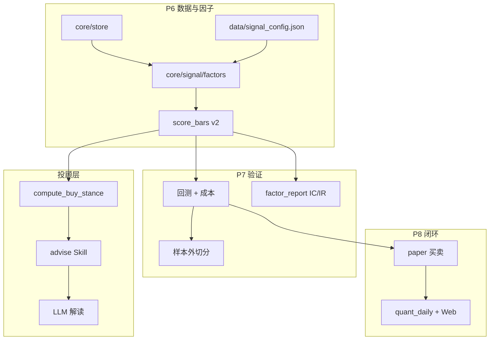

# 量化升级规划（P6～P93）· 历史归档

[← 文档索引](README.md)

> **文档角色（P94）**：本文是 **P 系列交付流水账 / 验收记录**，便于追溯「何时加了什么」。  
> **现行架构与运维真相**请优先读：  
> - [architecture.md](architecture.md) — 分层与模块边界  
> - [quant.md](quant.md) — 量化原理与纸面/回测语义  
> - [quant-ops.md](quant-ops.md) — 日常跑数与 CI  
> - [quant-summary.md](quant-summary.md) — 一页验收速查  
>
> 新功能请增量更新上述现行文档；不必再把本文当作「当前系统设计说明书」。

本文档记录 **P5 之后** 量化研究台的现状诊断、升级原则与分阶段路线图。原理与现有实现见 [quant.md](quant.md)；P4/P5 已落地项见 [roadmap.md](roadmap.md)。

---

## 现状诊断（P5 之后）

| 层级 | 现状 | 主要问题 |
|------|------|----------|
| **因子** | 4 个手工规则；RS 用当日涨跌占位 | 20% 权重信息弱；权重/阈值硬编码在 `scorer.py` |
| **数据** | 24h 本地缓存 + AkShare | live 可能 `quote_fallback`，回测用完整日线 → **结论不可比** |
| **验证** | 单票 walk-forward + `backtest_scan` | 无 train/OOS 切分；缺 IC/IR |
| **组合** | 纸面最多 5 仓、只买不卖 | 无组合回测、无成本/T+1、无卖出模拟 |
| **闭环** | stance 分档固定 | 未用历史胜率校准阈值 |
| **产品** | Web 净值曲线 | 缺因子归因、回测报告、纸面 vs 回测对照 |

**核心矛盾**：投顾层要求「可追溯、可解释」，量化层还缺「**可度量、可对比、可迭代**」基础设施。

---

## 升级原则

1. **一条计算链**：live `signal` / `advise` / `backtest` / `paper` 共用 `score_bars` + `compute_buy_stance`。
2. **LLM 只解读**：数值升级在 `core/`；`stance_label` 契约不变。
3. **先一致性、再复杂度**：先对齐 live/backtest 数据源，再扩展因子与组合。
4. **每阶段必有 eval**：扩展 `run_repro` / 单测；改 scorer 须跑 repro。
5. **继续不做**：实盘下单、保证收益、**黑盒 ML 荐股**（除非产品定位变更）。说明见 [quant.md · 为何不用拟合模型](quant.md#为何不用拟合模型线性回归--复杂模型)。

---

## 目标架构



---

## 分阶段路线图

### P6 — 因子与数据一致性

| ID | 交付 | 模块 | 状态 |
|----|------|------|------|
| P6.1 | 因子配置外置 | `data/signal_config.json` + `core/signal/config.py` | **已落地** |
| P6.2 | 真相对强弱 | `core/signal/factors/relative_strength.py` | **已落地** |
| P6.3 | 回测数据源对齐 | `backtest_signal_on_bars(data_mode=...)` | **已落地** |
| P6.4 | 因子归因 | `score_bars` → `factor_contrib` | **已落地** |
| P6.5 | 市场状态门控 | `core/signal/regime.py` | **已落地** |

**验收**：`run_repro` + 单测；live/backtest 在 `full` / `quote_fallback` 模式下分数差异可解释。

---

### P7 — 验证体系

| ID | 交付 | 模块 | 状态 |
|----|------|------|------|
| P7.1 | 时间序列切分 | `research/split.py` | **已落地** |
| P7.2 | IC/IR 报告 | `research/factor_report.py` | **已落地** |
| P7.3 | 组合指标聚合 | `core/backtest/topk_backtest.py` | **已落地** |
| P7.4 | 交易成本模型 | `core/backtest/costs.py` | **已落地** |
| P7.5 | OOS 参数扫描 | `scan_signal_parameters_oos` + CLI `--oos` | **已落地** |

**验收**：`backtest_scan --oos` 输出 train/valid/test 三组指标；禁止只报 train 最优。

---

### P8 — 纸面闭环与可视化

| ID | 交付 | 模块 | 状态 |
|----|------|------|------|
| P8.1 | 纸面卖出规则 | `core/paper.simulate_sells` + `paper_rules` | **已落地** |
| P8.2 | 纸面 vs 回测 | paper_vs_backtest | **已下线** |
| P8.3 | stance 阈值配置 | `signal_config.stance_thresholds` | **已落地** |
| P8.4 | Web/API | `/api/quant/*` + `services/quant_service.py` | **已落地** |
| P8.5 | 每日量化任务 | `daily_run --quant-report` | **已落地** |

---

### P9 — 研究台增强

| ID | 交付 | 模块 | 状态 |
|----|------|------|------|
| P9.1 | Watching 定义与刷新 | `data/watching.example.json` + `core/watching_store.py` + `research/watching_run.py` | **已落地** |
| P9.2 | 横截面排序 | `core/signal/cross_section.py` + `research/cross_section_run.py` | **已落地** |
| P9.3 | 多策略 registry | `core/backtest/strategies.py` + backtest Skill | **已落地** |
| P9.4 | 因子实验框架 | `core/signal/factor_registry.py` + `research/factor_experiment.py` | **已落地** |
| P9.5 | Web / daily 集成 | `/api/watching/*` + `/api/quant/*` + `daily_run` flags | **已落地** |

**验收**：`tests/test_watching.py`；`watching_run --init --refresh`；`cross_section_run`；`backtest` 可选 `signal_v1_conservative`。

**继续不做（现行）**：券商 OMS、自动实盘、保证收益。实盘交易待策略验证成熟后另立项 N6。

---

### P10 — 研究台 UI 与组合回测

| ID | 交付 | 模块 | 状态 |
|----|------|------|------|
| P10.1 | Web 量化面板 | `web/static/index.html` + `app.js` + `styles.css` | **已落地** |
| P10.2 | 组合横截面 TopK 回测 | `core/backtest/topk_backtest.py` + `research/portfolio_backtest_run.py` | **已落地** |
| P10.3 | IC 权重建议 | `core/signal/weight_suggest.py` | **已落地** |
| P10.4 | API + daily 集成 | `POST /api/quant/weight-suggest` · `POST /api/quant/portfolio-backtest` · `build_daily_report.weight_suggest` | **已落地** |

**验收**：Web「量化」按钮打开面板；`portfolio_backtest_run --json`；`tests/test_p10_quant.py`；`/api/quant/*` 单测。

**继续不做**：自动写 `signal_config.json`、多日复权净值曲线 UI（留待后续）。

---

### P11 — 可视化闭环与纸面调仓

| ID | 交付 | 模块 | 状态 |
|----|------|------|------|
| P11.1 | 组合回测净值曲线 | `backtest_topk_equal_weight` → `equity_curve` + Web canvas | **已落地** |
| P11.2 | 权重 diff 导出 | `format_weight_config_diff` + Web「导出 diff」 | **已落地** |
| P11.3 | 横截面纸面调仓 | `core/paper_rebalance.py` + `/api/paper/rebalance` + CLI | **已落地** |
| P11.4 | daily 集成 | `daily_run --paper-rebalance` | **已落地** |

**验收**：`tests/test_p11_quant.py`；Web 组合回测后显示净值曲线；权重 diff JSON 可下载；纸面调仓卖出非 TopK。

**继续不做**：自动合并权重到配置、真实券商调仓。

---

### P12 — 对照闭环与报告增强

| ID | 交付 | 模块 | 状态 |
|----|------|------|------|
| P12.1 | 纸面 vs 组合回测对照 | 已下线（口径不公平） | **已下线** |
| P12.2 | 权重 diff 预览表格 | Web `quant-weight-table` | **已落地** |
| P12.3 | daily 含 portfolio 摘要 | `build_daily_report.portfolio_backtest_summary` | **已落地** |
| P12.4 | CLI | paper_vs_portfolio_run | **已下线** |

**验收**：`tests/test_p12_quant.py`；「上次报告」含组合摘要曲线（纸面 vs TopK 对照已下线）。

**不做**：纸面 vs TopK 对照（口径不公平）；自动修正纸面持仓。

---

### P13 — 可视化对照与 AI 解读

| ID | 交付 | 模块 | 状态 |
|----|------|------|------|
| P13.1 | 双曲线叠加 UI | 纸面 vs TopK 对照 UI | **已下线** |
| P13.2 | LLM 量化报告解读 | `services/quant_interpret.py` + `POST /api/quant/interpret` | **已落地** |
| P13.3 | stance 阈值 OOS 建议 | `core/signal/threshold_suggest.py` + API/CLI | **已落地** |
| P13.4 | daily 集成 | `build_daily_report.threshold_suggest` | **已落地** |

**验收**：`tests/test_p13_quant.py`；「阈值」表格 + diff 导出；「AI 解读」（纸面 vs TopK 双曲线已下线）。

**继续不做**：自动写 stance_thresholds。

---

### P14 — Agent 工具化与导出

| ID | 交付 | 模块 | 状态 |
|----|------|------|------|
| P14.1 | quant Skill | `skills/quant/*` + registry + prompts 路由 | **已落地** |
| P14.2 | Markdown 导出 | `services/quant_report_export.py` + `/api/quant/export` + CLI | **已落地** |
| P14.3 | watching 聚合阈值 | `suggest_stance_thresholds_from_watching_oos` | **已落地** |
| P14.4 | Web 集成 | watching 阈值按钮 + 导出 Markdown | **已落地** |

**验收**：`tests/test_p14_quant.py`；`test_registry` 含 quant；Agent 可调 `quant(task=...)`。

**继续不做**：PDF 导出、quant Skill 自动写配置。

---

### P15 — Evals 与路由闭环

| ID | 交付 | 模块 | 状态 |
|----|------|------|------|
| P15.1 | golden quant case | `evals/golden_cases.json` · `quant_portfolio_backtest` | **已落地** |
| P15.2 | HTML 报告导出 | `render_quant_report_html` + `format=html` | **已落地** |
| P15.3 | quant 路由 hint | `routing.infer_quant_task` + `QUANT_HINT` + `prepare_tool_params` | **已落地** |
| P15.4 | mock 补丁 | `skills.common.history.fetch_daily_bars` 纳入 eval mock | **已落地** |

**验收**：`tests/test_p15_quant.py`；`run_checklist.py --mock` 含 quant case；12 条 golden cases。

**继续不做**：PDF 导出、Agent 自动写配置。

---

### P16 — 运维与产品化

| ID | 交付 | 模块 | 状态 |
|----|------|------|------|
| P16.1 | daily preset | `services/daily_presets.py` · `--preset advisor\|quant\|full` | **已落地** |
| P16.2 | 报告归档 | `QuantService.save_report_exports` → `data/reports/` | **已落地** |
| P16.3 | 任务状态 | `data/daily_last_run.json` · `GET /api/daily/last` | **已落地** |
| P16.4 | cron / launchd | `scripts/daily_*.sh` · `scripts/launchd/*.plist.example` | **已落地** |
| P16.5 | 运维文档 | `docs/quant-ops.md` · 文档索引更新 | **已落地** |

**验收**：`tests/test_p16_quant.py`；`GET /api/daily/presets`；`daily_run --preset quant` 写出 reports。

**继续不做**：PDF 导出、自动纸面调仓 preset、远端告警推送。

---

### P17 — 可观测性与报告索引

| ID | 交付 | 模块 | 状态 |
|----|------|------|------|
| P17.1 | watching 健康检查 | `core/watching_health.py` · `GET /api/watching/health` | **已落地** |
| P17.2 | 报告归档索引 | `services/quant_report_index.py` · `GET /api/quant/reports` | **已落地** |
| P17.3 | daily 健康聚合 | `services/daily_health.py` · `GET /api/daily/health` | **已落地** |
| P17.4 | daily 集成 | quant 相关 preset 追加 `watching_health` 步骤 | **已落地** |
| P17.5 | Web 运维面板 | 量化对话框「运维状态」+ 归档报告链接 | **已落地** |
| P17.6 | quant Skill | `quant(task=health)` + 路由 hint | **已落地** |

**验收**：`tests/test_p17_quant.py`；`/api/daily/health` 返回 daily + watching + reports 摘要。

**继续不做**：PDF 导出、远端 webhook 告警、自动修复 watching。

---

### P18 — Watching 编辑与 Eval 闭环

| ID | 交付 | 模块 | 状态 |
|----|------|------|------|
| P18.1 | watching 文件读写 | `GET /api/watching/file` · Web JSON 编辑器 | **已落地** |
| P18.2 | golden health case | `quant_health` · `mock quant_health` | **已落地** |
| P18.3 | cron 失败检查 | `research/daily_check.py` · `scripts/daily_check.sh` | **已落地** |
| P18.4 | 文档 | `quant-ops.md` · golden 13 cases | **已落地** |

**验收**：`tests/test_p18_quant.py`；`run_checklist.py --mock --case quant_health`；`daily_check.py` 对失败记录 exit 1。

**继续不做**：PDF 导出、远端 webhook、自动 merge sources 模板。

**golden cases**：14 条（含 quant_health · quant_weight_diff）。

---

### P19 — 信号配置可视与纸面 preset

| ID | 交付 | 模块 | 状态 |
|----|------|------|------|
| P19.1 | signal 配置只读 | `read_signal_config_file` · `GET /api/signal/config` | **已落地** |
| P19.2 | Web 配置预览 | 量化面板「信号配置（只读）」 | **已落地** |
| P19.3 | quant_paper preset | `daily_presets.quant_paper` · `scripts/daily_quant_paper.sh` | **已落地** |
| P19.4 | 文档 | `quant-ops.md` · preset 表更新 | **已落地** |

**验收**：`tests/test_p19_quant.py`；`daily_run --preset quant_paper` 含 `paper_rebalance` 步骤。

**继续不做**：Web 写 signal_config、自动 merge 权重/阈值 diff。

---

### P20 — Web 闭环与配置 Diff 预览

| ID | 交付 | 模块 | 状态 |
|----|------|------|------|
| P20.1 | diff 预览服务 | `services/signal_config_preview.py` · `GET /api/signal/config/diff-preview` | **已落地** |
| P20.2 | Web diff 预览 | 量化面板「预览 diff」表格 | **已落地** |
| P20.3 | Web quant_paper | 「量化+调仓」按钮 · preset `quant_paper` | **已落地** |
| P20.4 | golden weight diff | `quant_weight_diff` case（14 cases） | **已落地** |

**验收**：`tests/test_p20_quant.py`；`run_checklist.py --mock --case quant_weight_diff`。

**继续不做**：自动 merge diff 到 signal_config、Web 写配置。

---

### P21 — 上手整合与 Diff 导出包

| ID | 交付 | 模块 | 状态 |
|----|------|------|------|
| P21.1 | diff 合并包 | `export_config_diff_bundle` · `GET /api/signal/config/diff-export` | **已落地** |
| P21.2 | CLI 导出 | `research/signal_diff_export_run.py` | **已落地** |
| P21.3 | preset 校验 | `evals/preset_check.py` · `run_checklist.py --presets` | **已落地** |
| P21.4 | 量化初始化 | `scripts/setup_quant.sh` | **已落地** |
| P21.5 | Web 导出 | 「导出 diff 包」按钮 | **已落地** |
| P21.6 | 文档 | README · getting-started · quant-ops | **已落地** |

**验收**：`tests/test_p21_quant.py`；`run_checklist.py --mock --presets`；`bash scripts/setup_quant.sh`。

**继续不做**：自动 merge diff、Web 写 signal_config。

---

### P22 — CI 收尾与路线图总览

| ID | 交付 | 模块 | 状态 |
|----|------|------|------|
| P22.1 | 路线图总览 | `docs/quant-summary.md`（P6～P21 一页速查） | **已落地** |
| P22.2 | CI preset | `.github/workflows/investment-ci.yml` · `--mock --presets` | **已落地** |
| P22.3 | 本地 CI | `scripts/ci_quant.sh` | **已落地** |
| P22.4 | quant_paper 集成测 | `tests/test_p22_quant.py` · mock daily preset | **已落地** |
| P22.5 | preset CLI | `evals/run_preset_check.py` | **已落地** |

**验收**：`bash scripts/ci_quant.sh`；`python3 evals/run_preset_check.py`；P6～P22 文档索引完整。

**里程碑**：P6～P22 量化升级路线图 **全部落地**；后续新需求另开 P23+ 议题。

---

### P23 — Web 运维 preset 选择器 + Agent diff/preset 路由

| ID | 交付 | 模块 | 状态 |
|----|------|------|------|
| P23.1 | 运维 preset 下拉 | Web「运维状态」· `GET /api/daily/presets` 联动 | **已落地** |
| P23.2 | 一键 daily | Web「运行 daily」· 共用 `runDailyWithPreset` | **已落地** |
| P23.3 | golden 用例数 | `test_eval_service` / `test_web_api` → 14 cases | **已落地** |
| P23.4 | quant 新 task | `config_diff` · `daily_presets` · tool_config | **已落地** |
| P23.5 | 路由 hint | `infer_quant_task` · `QUANT_HINT` diff/preset 关键词 | **已落地** |
| P23.6 | 测试 | `tests/test_p23_quant.py` | **已落地** |

**验收**：`tests/test_p23_quant.py`；Web 运维区可选 preset 并运行 daily；Agent 问 diff/preset 自动路由。

**继续不做**：自动 merge diff、Web 写 signal_config、Agent 全量回归进 PR CI。

---

### P24 — 持仓/量化联动 + Agent 周末回归

| ID | 交付 | 模块 | 状态 |
|----|------|------|------|
| P24.1 | 联动摘要 | `services/portfolio_quant_bridge.py` · `GET /api/portfolio/quant-bridge` | **已落地** |
| P24.2 | Web 联动面板 | 持仓「打开量化/量化对照」· 量化「持仓联动」区 | **已落地** |
| P24.3 | quant task | `portfolio_bridge` · tool_config · 路由 hint | **已落地** |
| P24.4 | Agent 回归 CLI | `evals/run_agent_check.py` · `scripts/agent_regression.sh` | **已落地** |
| P24.5 | 测试 | `tests/test_p24_quant.py` | **已落地** |
| P24.6 | 文档 | quant-summary · quant-ops | **已落地** |

**验收**：`tests/test_p24_quant.py`；Web 持仓 → 量化对照；`python3 evals/run_agent_check.py`（需 API key）。

**继续不做**：Agent 回归进 PR CI、实盘下单、自动 sync portfolio→watching。

---

### P25 — Evals Web 增强 + golden portfolio_bridge

| ID | 交付 | 模块 | 状态 |
|----|------|------|------|
| P25.1 | eval 摘要 API | `GET /api/evals/summary` · preset · 上次结果 · CI 命令 | **已落地** |
| P25.2 | preset API | `GET /api/evals/presets` · `EvalService.with_presets` | **已落地** |
| P25.3 | Web 校验面板 | preset 勾选 ·「CI 同款」·「preset 校验」· 动态 case 数 | **已落地** |
| P25.4 | golden case | `quant_portfolio_bridge`（15 cases）· mock | **已落地** |
| P25.5 | 测试 | `tests/test_p25_quant.py` | **已落地** |
| P25.6 | 文档 | quant-upgrade · quant-summary | **已落地** |

**验收**：`tests/test_p25_quant.py`；Web「校验」→「CI 同款」通过；`python3 evals/run_checklist.py --mock --presets` 含 15 cases。

**继续不做**：Agent 回归进 Web 一键、PDF 导出、自动写 golden。

---

### P26 — Evals 路由可视化 + 报告分享链接

| ID | 交付 | 模块 | 状态 |
|----|------|------|------|
| P26.1 | 路由对照 API | `services/eval_routing_map.py` · `GET /api/evals/routing` | **已落地** |
| P26.2 | 报告 share_url | `quant_report_index.list_quant_reports` · `share_url` 字段 | **已落地** |
| P26.3 | Web 路由表 | 校验面板「路由对照表」· 刷新按钮 | **已落地** |
| P26.4 | Web 复制链接 | 量化运维「复制最新报告链接」· 归档项复制 | **已落地** |
| P26.5 | development.md | CI / eval / 量化 Web 说明同步 | **已落地** |
| P26.6 | 测试 | `tests/test_p26_quant.py` | **已落地** |

**验收**：`tests/test_p26_quant.py`；`GET /api/evals/routing` 全部 routing_expect OK；报告列表含 `share_url`。

**继续不做**：公网分享 / 鉴权链接、PDF、路由表写回 golden。

---

### P27 — 报告一页摘要 + Evals 路由跳转 + README 整合

| ID | 交付 | 模块 | 状态 |
|----|------|------|------|
| P27.1 | 一页摘要 | `build_report_executive_summary` · MD/HTML 顶部卡片 | **已落地** |
| P27.2 | 摘要 API | `GET /api/quant/export/summary` · export 返回 `executive_summary` | **已落地** |
| P27.3 | Evals 跳转 | 路由表点击 case → 选用例下拉 | **已落地** |
| P27.4 | README / docs | P6～P26 索引 · CI / Web 快速入口 | **已落地** |
| P27.5 | 测试 | `tests/test_p27_quant.py` | **已落地** |

**验收**：`tests/test_p27_quant.py`；导出 MD/HTML 含「一页摘要」；`GET /api/quant/export/summary`。

**继续不做**：PDF、LLM 自动生成摘要、公网分享。

---

### P28 — `quant/` 包：services + ops

| ID | 交付 | 模块 | 状态 |
|----|------|------|------|
| P28.1 | 独立包 | `quant/services/` · `quant/ops/` | **已落地** |
| P28.2 | 兼容 shim | `services/quant_*.py` · `services/daily_presets.py` 等 re-export | **已落地** |
| P28.3 | 引用迁移 | `web/app.py` · `skills/quant/engine.py` 改用 `quant.*` | **已落地** |
| P28.4 | 循环导入 | `quant/ops/__init__.py` 懒加载 `daily_health` | **已落地** |
| P28.5 | 测试 | `tests/test_p28_quant.py` | **已落地** |

**验收**：238 单测 OK；`services.*` 旧 import 仍可用；`QuantService` 从 `quant` 包导出。

**继续保留在 `core/`**：`score_bars` / `backtest`（投顾与量化共用）。

---

### P29 — `quant/research/` + CLI shim

| ID | 交付 | 模块 | 状态 |
|----|------|------|------|
| P29.1 | 研究模块 | `quant/research/factor_report.py` · `portfolio_data.py`（`paper_vs_*` 已下线） | **已落地** |
| P29.2 | 兼容 shim | `research/factor_report.py` 等 re-export | **已落地** |
| P29.3 | QuantService | 懒 import 改 `quant.research.*` | **已落地** |
| P29.4 | 测试 | `test_p12` patch 路径更新 | **已落地** |

**验收**：因子 IC / TopK 摘要经 `quant.research` 调用；`research/*_run.py` CLI 无需改路径。

---

### P30 — `quant/skill/` + 注册表

| ID | 交付 | 模块 | 状态 |
|----|------|------|------|
| P30.1 | Skill 实现 | `quant/skill/engine.py` · `handler.py` | **已落地** |
| P30.2 | 兼容 shim | `skills/quant/*` re-export | **已落地** |
| P30.3 | 注册表 | `advisor/registry.py` → `quant.skill.handler.QuantHandler` | **已落地** |
| P30.4 | 结构文档 | `docs/structure.md` · 本节目录演进 | **已落地** |

**验收**：Agent `quant(task=...)` 行为不变；golden 15 case + preset checklist 通过。

**继续不做**：删除 `services/` / `research/` / `skills/quant/` shim（下一大版本再议）。

---

### P31 — `quant/ops` 收尾：eval routing

| ID | 交付 | 模块 | 状态 |
|----|------|------|------|
| P31.1 | 路由对照 | `quant/ops/eval_routing_map.py` | **已落地** |
| P31.2 | 兼容 shim | `services/eval_routing_map.py` re-export | **已落地** |
| P31.3 | EvalService | `list_routing()` 改 `quant.ops.*` | **已落地** |
| P31.4 | mock 路径 | `evals/mock_context.py` patch `quant.services.*` | **已落地** |
| P31.5 | 测试 | `tests/test_p31_quant.py` | **已落地** |

**验收**：`GET /api/evals/routing` 行为不变；golden routing 全绿。

---

### P32 — 包结构 API + Web 运维展示

| ID | 交付 | 模块 | 状态 |
|----|------|------|------|
| P32.1 | 包 introspection | `quant/ops/package_info.py` | **已落地** |
| P32.2 | QuantService | `build_package_info()` | **已落地** |
| P32.3 | API | `GET /api/quant/package` | **已落地** |
| P32.4 | Web | 运维区展示 `quant/P28+` 模块树 | **已落地** |

**验收**：API 返回 subpackages / modules / shim_paths；Web 运维区可见模块摘要。

---

### P33 — CLI / daily canonical import + 文档

| ID | 交付 | 模块 | 状态 |
|----|------|------|------|
| P33.1 | research CLI | `quant_export_run` 等改 `quant.services` | **已落地** |
| P33.2 | daily 编排 | `daily_service` / `daily_run` 改 `quant.ops` | **已落地** |
| P33.3 | preset eval | `evals/preset_check.py` 改 `quant.ops` | **已落地** |
| P33.4 | 文档 | `quant-ops.md` · `quant-summary.md` · 本表 | **已落地** |

**验收**：CLI 与 daily 不再直接依赖 `services.quant_*` 实现；shim 仍供旧测试 import。

---

### P34 — 测试 canonical import 迁移

| ID | 交付 | 模块 | 状态 |
|----|------|------|------|
| P34.1 | 单测 import | `test_p13`～`p27` 改 `quant.*` | **已落地** |
| P34.2 | mock 路径 | patch 改 `quant.services.*` / `quant.ops.*` | **已落地** |
| P34.3 | 守卫测试 | `tests/test_p34_quant.py` AST 扫描 | **已落地** |
| P34.4 | shim 保留 | `test_p28` / `test_p31` 仍验 compat | **已落地** |

**验收**：247+ 单测 OK；除 shim 专项外，`test_p*_quant.py` 不再 `from services.quant_*`。

---

### P35 — Agent `package_info` task

| ID | 交付 | 模块 | 状态 |
|----|------|------|------|
| P35.1 | Skill task | `quant/skill/engine.py` · `package_info` | **已落地** |
| P35.2 | 路由 | `infer_quant_task` ·「包结构/模块树」 | **已落地** |
| P35.3 | tool_config | `skills/quant/tool_config.json` enum | **已落地** |
| P35.4 | 测试 | `tests/test_p35_quant.py` | **已落地** |

**验收**：`quant(task=package_info)` 返回 subpackages/modules；路由「quant 包结构」→ `package_info`。

**继续不做**：删除 shim 文件（P37+ 再议）。

---

### P36 — golden `quant_package_info`

| ID | 交付 | 模块 | 状态 |
|----|------|------|------|
| P36.1 | golden case | `evals/golden_cases.json` · `quant_package_info` | **已落地** |
| P36.2 | mock | `evals/mock_context.py` · `quant_package_info` | **已落地** |
| P36.3 | 路由校验 | routing_expect → `package_info` | **已落地** |
| P36.4 | 文档/脚本 | 16 cases · `agent_regression.sh` | **已落地** |
| P36.5 | 测试 | `tests/test_p36_quant.py` | **已落地** |

**验收**：`run_checklist.py --mock --presets` 含 16 cases；eval routing 表含 `quant_package_info` 且 ok。

---

### P37 — 量化专项 Agent 回归子集

| ID | 交付 | 模块 | 状态 |
|----|------|------|------|
| P37.1 | CLI 过滤 | `run_checklist.py` · `--quant-only` | **已落地** |
| P37.2 | Agent CLI | `run_agent_check.py` 透传 `--quant-only` | **已落地** |
| P37.3 | Shell | `scripts/agent_regression_quant.sh`（5 quant_* cases） | **已落地** |
| P37.4 | Evals API | `GET /api/evals/summary` · `checklist_quant` / `agent_weekend_quant` | **已落地** |
| P37.5 | 测试 | `tests/test_p37_quant.py` | **已落地** |

**验收**：`python3 evals/run_checklist.py --mock --quant-only` 只跑 5 个 quant_* case；preset 校验仍可通过 `--presets` 附带。

**继续不做**：删除 shim 文件（P39+ 再议）。

---

### P38 — Web「量化 CI 同款」

| ID | 交付 | 模块 | 状态 |
|----|------|------|------|
| P38.1 | API | `POST /api/evals/run` · `quant_only` 字段 | **已落地** |
| P38.2 | EvalService | `run()` / 后台任务支持 `quant_only` | **已落地** |
| P38.3 | Web UI | 校验面板 **「量化 CI 同款」** 按钮 | **已落地** |
| P38.4 | 摘要 | report 含 `quant_only` · summary `web_quant_ci` | **已落地** |
| P38.5 | 测试 | `tests/test_p38_quant.py` | **已落地** |

**验收**：Web 一键等价 `python3 evals/run_checklist.py --mock --quant-only --presets`（5 cases + preset）。

---

### P39 — 量化面板 CI 快捷 + shim import 守卫

| ID | 交付 | 模块 | 状态 |
|----|------|------|------|
| P39.1 | 量化面板 | 运维区 **「量化 CI」** 按钮 | **已落地** |
| P39.2 | JS 共用 | `postQuantCiEval()` · 校验面板复用 | **已落地** |
| P39.3 | import 审计 | `quant/ops/shim_audit.py` · `check_quant_imports.sh` | **已落地** |
| P39.4 | CI | `ci_quant.sh` 增加 import audit 步骤 | **已落地** |
| P39.5 | 测试 | `tests/test_p39_quant.py` | **已落地** |

**验收**：量化面板一键跑 quant CI；`bash scripts/check_quant_imports.sh` exit 0。

**继续不做**：删除 shim 文件本身（P40+ 再议）。

---

### P40 — GitHub Actions import 审计对齐

| ID | 交付 | 模块 | 状态 |
|----|------|------|------|
| P40.1 | Workflow | `.github/workflows/investment-ci.yml` · `check_quant_imports.sh` | **已落地** |
| P40.2 | 本地 CI | `ci_quant.sh` 注释与步骤顺序与 Actions 一致 | **已落地** |
| P40.3 | Eval summary | `ci_commands.github` 说明 PR CI 步骤 | **已落地** |
| P40.4 | 测试 | `tests/test_p40_quant.py` | **已落地** |
| P40.5 | 文档 | `quant-summary.md` · `development.md` | **已落地** |

**验收**：`.github/workflows/investment-ci.yml` 在单测后跑 import audit；`bash scripts/ci_quant.sh` 与 Actions 均含 audit 步骤。

**继续不做**：删除 shim 文件本身（P41+ 再议）。

---

### P41 — 移除 compat shim 文件

| ID | 交付 | 模块 | 状态 |
|----|------|------|------|
| P41.1 | 删除 shim | `services/quant_*` · `services/daily_*` · `services/eval_routing_map` 等 14 文件 | **已落地** |
| P41.2 | package_info | `shims_removed` · `removed_shim_paths` · 空 `shim_paths` | **已落地** |
| P41.3 | import 守卫 | `shim_audit` 收紧 allowlist | **已落地** |
| P41.4 | golden / 测试 | `quant_package_info` mock · `test_p41_quant.py` | **已落地** |
| P41.5 | 文档 | `quant-upgrade.md` · `structure.md` | **已落地** |

**验收**：14 个 shim 文件不存在；`bash scripts/check_quant_imports.sh` exit 0；`skills/quant/tool_config.json` 保留。

---

### P42 — 子目录 README + 覆盖索引

| ID | 交付 | 模块 | 状态 |
|----|------|------|------|
| P42.1 | 子目录 README | 各代码目录 `README.md`（37 处） | **已落地** |
| P42.2 | 索引 | `core/readme_index.py` · `REPO_README_DIRS` | **已落地** |
| P42.3 | API | `GET /api/readme-index` · `package_info.readme_index` | **已落地** |
| P42.4 | Web | 量化运维区展示 README 覆盖 | **已落地** |
| P42.5 | 测试 | `tests/test_p42_quant.py` | **已落地** |

**验收**：`build_readme_index()` 无 missing；单测守卫新增目录须同步 README。

---

### P43 — Web README 浏览 + 架构双向链接

| ID | 交付 | 模块 | 状态 |
|----|------|------|------|
| P43.1 | 内容 API | `GET /api/readme?dir=` · `read_repo_readme()` | **已落地** |
| P43.2 | 索引增强 | `readme_index.entries` · `doc_links` | **已落地** |
| P43.3 | Web 浏览 | 量化运维区 README 树 + 弹窗 Markdown 渲染 | **已落地** |
| P43.4 | 双向链接 | `architecture.md#子目录-readme-索引` · 各 README 回链 | **已落地** |
| P43.5 | 测试 | `tests/test_p43_quant.py` | **已落地** |

**验收**：Web 点击子目录可浏览 README；各目录 README 均含架构索引回链（`advisor/` 兼容包已删除）。

---

### P44 — Evals README 覆盖校验

| ID | 交付 | 模块 | 状态 |
|----|------|------|------|
| P44.1 | 校验模块 | `evals/readme_check.py` · `run_readme_check.py` | **已落地** |
| P44.2 | checklist | `--presets` 附带 README 覆盖 + 架构回链 | **已落地** |
| P44.3 | Eval API | `GET /api/evals/readme` · summary / run 含 `readme` | **已落地** |
| P44.4 | Web 校验面板 | README 树 · **「README 覆盖」** 按钮 | **已落地** |
| P44.5 | 测试 | `tests/test_p44_quant.py` | **已落地** |

**验收**：`python3 evals/run_readme_check.py` exit 0；CI 同款 `--mock --presets` 含 readme 校验。

---

### P45 — 因子库扩展（反转 + 流动性）

| ID | 交付 | 模块 | 状态 |
|----|------|------|------|
| P45.1 | 反转因子 | `core/signal/factors/reversal.py` | **已落地** |
| P45.2 | 流动性因子 | `core/signal/factors/liquidity.py` | **已落地** |
| P45.3 | Registry 统一 | `factor_registry.py` · `scorer.py` 走 registry | **已落地** |
| P45.4 | 配置权重 | `data/signal_config.json` 六因子权重 | **已落地** |
| P45.5 | IC 报告 | `factor_report.py` · `weight_suggest.py` 动态因子名 | **已落地** |
| P45.6 | 测试 | `tests/test_p45_quant.py` | **已落地** |

**验收**：`list_factors()` 返回 6 因子；`score_bars` 含 `reversal`/`liquidity` sub_scores；权重和为 1.0。

---

### P46 — 基本面因子（估值 + 质量）

| ID | 交付 | 模块 | 状态 |
|----|------|------|------|
| P46.1 | 估值因子 | `core/signal/factors/value.py` | **已落地** |
| P46.2 | 质量因子 | `core/signal/factors/quality.py` | **已落地** |
| P46.3 | 基本面桥接 | `fundamentals_bridge.py` · `score_stock` 可选拉取 | **已落地** |
| P46.4 | 配置 | `signal_config.json` 八因子权重 + `fundamentals` 段 | **已落地** |
| P46.5 | 测试 | `tests/test_p46_quant.py` | **已落地** |

**验收**：`list_factors()` 返回 8 因子；传入 `fundamentals` 时 `value`/`quality` sub_scores 非中性；缺数据时仍为 50 不阻断打分。

---

### P47 — 横截面因子中性化

| ID | 交付 | 模块 | 状态 |
|----|------|------|------|
| P47.1 | 中性化算法 | `core/signal/neutralize.py`（zscore / rank） | **已落地** |
| P47.2 | 横截面接入 | `cross_section.py` 重算 score + factor_contrib | **已落地** |
| P47.3 | 配置 | `signal_config.json` · `cross_section.neutralize` | **已落地** |
| P47.4 | 元数据 | `score_raw` / `sub_scores_raw` / `neutralization` | **已落地** |
| P47.5 | 测试 | `tests/test_p47_quant.py` | **已落地** |

**验收**：≥3 只候选时 `rank_cross_section` 返回 `neutralization.applied=true`；相对排序按截面超额而非绝对子分。

---

### P48 — 因子 IC 面板（8 因子 + 权重）

| ID | 交付 | 模块 | 状态 |
|----|------|------|------|
| P48.1 | 面板构建 | `core/signal/factor_panel.py` | **已落地** |
| P48.2 | API | `GET /api/quant/factor-panel` · `/api/quant/factors` 含 rows | **已落地** |
| P48.3 | 实验合并 | `run_factor_experiment` 返回 `panel` | **已落地** |
| P48.4 | Web 表格 | 量化弹窗自动加载 · IC 分析后刷新 | **已落地** |
| P48.5 | 测试 | `tests/test_p48_quant.py` | **已落地** |

**验收**：面板固定 8 行；权重合计 1.0；分析后 IC 列填充；横截面列表展示 `score_raw` 与中性化说明。

---

### P49 — 组合回测接入截面中性化

| ID | 交付 | 模块 | 状态 |
|----|------|------|------|
| P49.1 | 批量打分 | `core/signal/cross_section_batch.py` | **已落地** |
| P49.2 | 组合回测 | `backtest_topk_equal_weight` 调仓日中性化 | **已落地** |
| P49.3 | 策略标识 | `cross_section_topk_neutral` · `neutralized_rebalances` | **已落地** |
| P49.4 | Web | 组合回测摘要展示中性化次数 | **已落地** |
| P49.5 | 测试 | `tests/test_p49_quant.py` | **已落地** |

**验收**：默认 `neutralize=true` 与 live 横截面一致；`neutralize=false` 可对照绝对分策略。

---

### P50 — 基本面因子 IC 实验

| ID | 交付 | 模块 | 状态 |
|----|------|------|------|
| P50.1 | IC 实验 | `run_factor_experiment(..., fundamentals=)` | **已落地** |
| P50.2 | IC 报告 | `factor_report.py` 8 因子 + fundamentals | **已落地** |
| P50.3 | 配置 | `fundamentals.use_in_ic_experiment` | **已落地** |
| P50.4 | 服务 | `QuantService._experiment_fundamentals` | **已落地** |
| P50.5 | 测试 | `tests/test_p50_quant.py` | **已落地** |

**验收**：开启后 `fundamentals_used=true`；value/quality 参与 IC 样本；note 标明快照估值非 point-in-time。

---

### P51 — 组合回测 fundamentals 批量注入

| ID | 交付 | 模块 | 状态 |
|----|------|------|------|
| P51.1 | 批量拉取 | `fetch_fundamentals_batch` | **已落地** |
| P51.2 | 数据加载 | `quant/research/portfolio_data.py` | **已落地** |
| P51.3 | 回测接入 | `run_portfolio_backtest` · `fundamentals_by_code` | **已落地** |
| P51.4 | 配置 | `fundamentals.use_in_backtest` | **已落地** |
| P51.5 | 测试 | `tests/test_p51_quant.py` | **已落地** |

**验收**：组合回测 params 含 `fundamentals_count`；value/quality 子分在回测中可非 50。

---

### P52 — 中性化 vs 绝对分回测对照

| ID | 交付 | 模块 | 状态 |
|----|------|------|------|
| P52.1 | 对照模块 | `quant/research/portfolio_neutral_compare.py` | **已落地** |
| P52.2 | API | `POST /api/quant/portfolio-neutral-compare` | **已落地** |
| P52.3 | Web | 「中性化对照」双曲线 + Δ 累计收益 | **已落地** |
| P52.4 | 服务 | `QuantService.run_portfolio_neutral_compare` | **已落地** |
| P52.5 | 测试 | `tests/test_p52_quant.py` | **已落地** |

**验收**：同一 watching 返回 neutralized/absolute/delta/winner；Web 蓝=中性化 绿=绝对分。

---

### P53 — golden case `quant_portfolio_neutral_compare`

| ID | 交付 | 模块 | 状态 |
|----|------|------|------|
| P53.1 | golden case | `evals/golden_cases.json` · mock 离线 | **已落地** |
| P53.2 | quant task | `portfolio_neutral_compare` · routing | **已落地** |
| P53.3 | tool_config | `skills/quant/tool_config.json` enum | **已落地** |
| P53.4 | eval 路由 | `eval_routing_map` · `--quant-only` 6 cases | **已落地** |
| P53.5 | 测试 | `tests/test_p53_quant.py` | **已落地** |

**验收**：`run_checklist.py --mock --case quant_portfolio_neutral_compare` exit 0；routing `quant_task=portfolio_neutral_compare`。

---

### P54 — 量化日报嵌入中性化对照摘要

| ID | 交付 | 模块 | 状态 |
|----|------|------|------|
| P54.1 | 摘要函数 | `summarize_portfolio_neutral_compare` | **已落地** |
| P54.2 | daily 报告 | `build_daily_report.portfolio_neutral_compare_summary` | **已落地** |
| P54.3 | 导出/解读 | `quant_report_export` · `quant_interpret` 一页摘要 | **已落地** |
| P54.4 | Web | 加载 quant_daily 时展示 Δ 与 winner | **已落地** |
| P54.5 | 测试 | `tests/test_p54_quant.py` | **已落地** |

**验收**：`build_daily_report` 含 `portfolio_neutral_compare_summary`；Markdown/HTML 一页摘要含「中性化 vs 绝对分」。

---

### P55 — Agent golden 回归含 `quant_portfolio_neutral_compare`

| ID | 交付 | 模块 | 状态 |
|----|------|------|------|
| P55.1 | golden agent 短语 | `agent_must_contain` · 中性化/绝对分 | **已落地** |
| P55.2 | Agent 路由 hint | `advisor/prompts.py` · `portfolio_neutral_compare` | **已落地** |
| P55.3 | 回归脚本 | `agent_regression.sh`（17）· `agent_regression_quant.sh`（6） | **已落地** |
| P55.4 | 文档 | development · evals · quant-summary · 17 cases | **已落地** |
| P55.5 | 测试 | `tests/test_p55_quant.py` | **已落地** |

**验收**：`len(golden_cases)==17`；`--quant-only` 6 cases；prompts 含 `portfolio_neutral_compare`。

---

### P56 — quant daily preset 默认跑中性化对照

| ID | 交付 | 模块 | 状态 |
|----|------|------|------|
| P56.1 | preset flag | `portfolio_neutral_compare` · quant/full/quant_paper | **已落地** |
| P56.2 | daily 编排 | `DailyRunService` → `build_daily_report` | **已落地** |
| P56.3 | preset 校验 | `evals/preset_check.py` | **已落地** |
| P56.4 | API/CLI | `DailyRunRequest` · `daily_run.py --portfolio-neutral-compare` | **已落地** |
| P56.5 | step 元数据 | `neutral_compare_ok` · `neutral_compare_winner` | **已落地** |
| P56.6 | 测试 | `tests/test_p56_quant.py` | **已落地** |

**验收**：`resolve_daily_preset("quant").portfolio_neutral_compare==True`；`--preset quant` 日报 step 含中性化摘要状态。

---

### P57 — Agent prompts 全量 quant task 列表

| ID | 交付 | 模块 | 状态 |
|----|------|------|------|
| P57.1 | task 目录 | `QUANT_TASK_ROUTES` · `QUANT_TASK_ENUM` | **已落地** |
| P57.2 | SYSTEM_PROMPT | 13 task 与 engine/tool_config 对齐 | **已落地** |
| P57.3 | QUANT_HINT | 全 task 关键词 → task 映射 | **已落地** |
| P57.4 | routing 关键词 | `中性化` · `包结构` · `模块树` | **已落地** |
| P57.5 | 测试 | `tests/test_p57_quant.py` | **已落地** |

**验收**：`QUANT_TASK_ROUTES` 与 `AVAILABLE_TASKS` 一致；prompts 含全部 task 名。

---

### P58 — daily 导出中性化对照专节

| ID | 交付 | 模块 | 状态 |
|----|------|------|------|
| P58.1 | 专节 builder | `build_neutral_compare_export_section` | **已落地** |
| P58.2 | Markdown | `## 中性化对照专节` · Δ胜率/交易 | **已落地** |
| P58.3 | HTML | `#neutral-compare` · 对照表 | **已落地** |
| P58.4 | 测试 | `tests/test_p58_quant.py` | **已落地** |

**验收**：导出 MD/HTML 含「中性化对照专节」与 anchor `neutral-compare`。

---

### P59 — Web daily preset 展示 `portfolio_neutral_compare`

| ID | 交付 | 模块 | 状态 |
|----|------|------|------|
| P59.1 | 运维 UI | `#quant-ops-preset-flags` chip 列表 | **已落地** |
| P59.2 | preset 切换 | 下拉 change → 刷新 flags | **已落地** |
| P59.3 | 高亮 | `portfolio_neutral_compare` 绿色 chip | **已落地** |
| P59.4 | API | `GET /api/daily/presets` flags 含新键 | **已落地** |
| P59.5 | 测试 | `tests/test_p59_quant.py` | **已落地** |

**验收**：Web 运维区选 `quant` preset 可见「中性化对照」chip；advisor 无此 chip。

---

### P60 — golden case `quant_daily_neutral_section`

| ID | 交付 | 模块 | 状态 |
|----|------|------|------|
| P60.1 | golden case | `quant_daily_neutral_section` · `daily_summary` | **已落地** |
| P60.2 | routing | 日报/专节 → `daily_summary` | **已落地** |
| P60.3 | skill | `use_saved` · `include_portfolio_neutral_compare` | **已落地** |
| P60.4 | export 校验 | `build_neutral_compare_export_section` | **已落地** |
| P60.5 | 测试 | `tests/test_p60_quant.py` | **已落地** |

**验收**：`run_checklist.py --mock --case quant_daily_neutral_section` exit 0；导出 MD 含「中性化对照专节」。

---

### P61 — `interpret` 含中性化对照专节

| ID | 交付 | 模块 | 状态 |
|----|------|------|------|
| P61.1 | system prompt | `QUANT_INTERPRET_SYSTEM` 专节要点 | **已落地** |
| P61.2 | compact | 胜率 · note 字段 | **已落地** |
| P61.3 | interpret 构建 | 无 saved 时含 neutral compare | **已落地** |
| P61.4 | 测试 | `tests/test_p61_quant.py` | **已落地** |

**验收**：`compact_quant_report` 含 `neutralized_win_rate_pct`；LLM payload 含 `portfolio_neutral_compare_summary`。

---

### P62 — Web 量化面板中性化对照表

| ID | 交付 | 模块 | 状态 |
|----|------|------|------|
| P62.1 | DOM | `#quant-neutral-compare-table` | **已落地** |
| P62.2 | 渲染 | `renderNeutralCompareTable` · 上次报告/对照 API | **已落地** |
| P62.3 | 测试 | `tests/test_p62_quant.py` | **已落地** |

**验收**：加载 `quant_daily` 或点「中性化对照」后展示累计/胜率对照表。

---

### P63 — golden case `quant_interpret_neutral`

| ID | 交付 | 模块 | 状态 |
|----|------|------|------|
| P63.1 | golden case | `quant_interpret_neutral` · offline interpret | **已落地** |
| P63.2 | 规则解读 | `build_rule_based_interpret` | **已落地** |
| P63.3 | routing | 「解读+日报」→ `interpret` 优先 | **已落地** |
| P63.4 | skill | `offline: true` · `use_saved: false` | **已落地** |
| P63.5 | 测试 | `tests/test_p63_quant.py` | **已落地** |

**验收**：`run_checklist.py --mock --case quant_interpret_neutral` exit 0；`interpretation` 含「中性化对照」。

---

### P64 — Web「AI 解读」中性化 compact 摘要

| ID | 交付 | 模块 | 状态 |
|----|------|------|------|
| P64.1 | API 字段 | `neutral_compare_summary` · `neutral_compare_brief` | **已落地** |
| P64.2 | Web UI | `#quant-interpret-neutral` 对照表 | **已落地** |
| P64.3 | LLM 解读 | `_attach_neutral_fields` | **已落地** |
| P64.4 | 测试 | `tests/test_p64_quant.py` | **已落地** |

**验收**：`POST /api/quant/interpret` 返回 `neutral_compare_brief`；Web 解读区展示对照表。

---

### P65 — daily 导出 TOC `#neutral-compare` 锚点

| ID | 交付 | 模块 | 状态 |
|----|------|------|------|
| P65.1 | TOC builder | `build_report_export_toc` | **已落地** |
| P65.2 | Markdown | `## 目录` · 链接 neutral-compare | **已落地** |
| P65.3 | HTML | `<nav class="report-toc">` · `#neutral-compare` | **已落地** |
| P65.4 | 测试 | `tests/test_p65_quant.py` | **已落地** |

**验收**：导出 MD/HTML 顶部目录含「中性化对照专节 → #neutral-compare」。

---

### P66 — Agent golden `quant_interpret_neutral` 回归短语

| ID | 交付 | 模块 | 状态 |
|----|------|------|------|
| P66.1 | agent_must_contain | 中性化/对照/免责声明 | **已落地** |
| P66.2 | 离线解读对齐 | rule_based 含「中性化对照」 | **已落地** |
| P66.3 | 测试 | `tests/test_p66_quant.py` | **已落地** |

**验收**：`agent_regression_quant.sh` 跑 `quant_interpret_neutral` 时 Agent 须含中性化/对照短语。

---

### P67 — Web 导出预览 + TOC 导航

| ID | 交付 | 模块 | 状态 |
|----|------|------|------|
| P67.1 | API | `export_toc` 字段 · `GET /api/quant/export` | **已落地** |
| P67.2 | Web UI | 预览 Markdown/HTML · 目录锚点 | **已落地** |
| P67.3 | 锚点跳转 | `#neutral-compare` scroll | **已落地** |
| P67.4 | 测试 | `tests/test_p67_quant.py` | **已落地** |

**验收**：Web「预览 HTML」展示 TOC；点击「中性化对照专节」滚动到专节。

---

### P68 — `tool_config` 文档化 offline / 中性化参数

| ID | 交付 | 模块 | 状态 |
|----|------|------|------|
| P68.1 | schema | `offline` · `include_portfolio_neutral_compare` | **已落地** |
| P68.2 | README | `skills/quant/README.md` 参数表 | **已落地** |
| P68.3 | 测试 | `tests/test_p68_quant.py` | **已落地** |

**验收**：`tool_config.json` 含 `offline`；Engine `offline=true` 返回 `source=rule_based`。

---

### P69 — daily 完成后自动加载导出预览

| ID | 交付 | 模块 | 状态 |
|----|------|------|------|
| P69.1 | Web | `runDailyWithPreset` 后 `previewQuantExport("markdown")` | **已落地** |
| P69.2 | preset 过滤 | `quant` / `quant_paper` / `full` | **已落地** |
| P69.3 | 测试 | `tests/test_p69_quant.py` | **已落地** |

**验收**：Web 跑 quant preset daily 成功后，导出预览区自动展示 Markdown + TOC。

---

### P70 — API `offline` 解读参数

| ID | 交付 | 模块 | 状态 |
|----|------|------|------|
| P70.1 | Request | `QuantInterpretRequest.offline` | **已落地** |
| P70.2 | Service | `interpret_report(..., offline=True)` | **已落地** |
| P70.3 | 测试 | `tests/test_p70_quant.py` | **已落地** |

**验收**：`POST /api/quant/interpret` body `{ "offline": true }` 返回 `source=rule_based`。

---

### P71 — Web LLM 不可用时规则解读回退

| ID | 交付 | 模块 | 状态 |
|----|------|------|------|
| P71.1 | health 缓存 | `llmAvailable` · `/api/health` | **已落地** |
| P71.2 | 解读按钮 | 无 LLM 时 `offline: true` | **已落地** |
| P71.3 | UI 标记 | `【规则解读】` 前缀 | **已落地** |
| P71.4 | 测试 | `tests/test_p71_quant.py` | **已落地** |

**验收**：未配置 Key 时点击「AI 解读」仍返回规则解读 + 中性化对照。

---

### P72 — 文档同步（导出预览 / offline 解读 / evals）

| ID | 交付 | 模块 | 状态 |
|----|------|------|------|
| P72.1 | quant.md | Web 导出预览 · offline interpret | **已落地** |
| P72.2 | evals README | `quant_interpret_neutral` 回归说明 | **已落地** |
| P72.3 | quant-summary | P69～P72 速查 | **已落地** |
| P72.4 | 测试 | `tests/test_p72_quant.py` | **已落地** |

**验收**：文档与实现一致；evals README 说明 Agent 周末回归含 interpret neutral case。

---

### P73 — `quant.md` score 用途专节

| ID | 交付 | 模块 | 状态 |
|----|------|------|------|
| P73.1 | 文档 | `#### score 的用途` · 六大用途表 | **已落地** |
| P73.2 | 交叉链接 | ML 视角 · stance 第二层 | **已落地** |
| P73.3 | 测试 | `tests/test_p73_quant.py` | **已落地** |

**验收**：`quant.md` 说明 score 用于筛池/stance/回测/纸面/截面/研究，且不等于买入指令。

---

### P74 — Web 显式「规则解读」按钮

| ID | 交付 | 模块 | 状态 |
|----|------|------|------|
| P74.1 | UI | `#quant-interpret-offline` | **已落地** |
| P74.2 | JS | `runQuantInterpret({ forceOffline: true })` | **已落地** |
| P74.3 | 测试 | `tests/test_p74_quant.py` | **已落地** |

**验收**：Web 可强制 offline 解读，不依赖 LLM 是否可用。

---

### P75 — 日报一页摘要 score 统计

| ID | 交付 | 模块 | 状态 |
|----|------|------|------|
| P75.1 | 键兼容 | `ranking` / `ranked` / `top` | **已落地** |
| P75.2 | 摘要 | 横截面最高/中位 score | **已落地** |
| P75.3 | 测试 | `tests/test_p75_quant.py` | **已落地** |

**验收**：`build_report_executive_summary` 对 `cross_section.ranking` 输出 score 统计行。

---

### P76 — Agent score vs stance 提示

| ID | 交付 | 模块 | 状态 |
|----|------|------|------|
| P76.1 | prompts | `SCORE_STANCE_HINT` · SYSTEM_PROMPT | **已落地** |
| P76.2 | routing | 短线/score 问法注入 hint | **已落地** |
| P76.3 | 测试 | `tests/test_p76_quant.py` | **已落地** |

**验收**：用户问 score/观察池时 Agent 侧 hint 强调须用 `stance_label` 答能否买。

---

### P77 — 规则解读含横截面 score

| ID | 交付 | 模块 | 状态 |
|----|------|------|------|
| P77.1 | 摘要 | `summarize_cross_section_scores` | **已落地** |
| P77.2 | compact | `compact_quant_report` · cross_section | **已落地** |
| P77.3 | offline | `build_rule_based_interpret` score 行 | **已落地** |
| P77.4 | 测试 | `tests/test_p77_quant.py` | **已落地** |

**验收**：offline 解读含「横截面 score」与 Top1；注明不等于买入。

---

### P78 — golden `quant_cross_section_score`

| ID | 交付 | 模块 | 状态 |
|----|------|------|------|
| P78.1 | golden case | `cross_section` · `ranking.0.score` | **已落地** |
| P78.2 | agent_must_contain | score · 横截面 · 免责声明 | **已落地** |
| P78.3 | 计数 | 22 cases · 11 quant_* | **已落地** |
| P78.4 | 测试 | `tests/test_p78_quant.py` | **已落地** |

**验收**：`--quant-only` 含 `quant_cross_section_score`；mock 返回 ranking score。

---

### P79 — Web 横截面 score 表格

| ID | 交付 | 模块 | 状态 |
|----|------|------|------|
| P79.1 | UI | `#quant-cross-list` 表格 · score/raw | **已落地** |
| P79.2 | JS | `renderCrossSection` table | **已落地** |
| P79.3 | 测试 | `tests/test_p79_quant.py` | **已落地** |

**验收**：Web「排序」展示 score / score_raw 列。

---

### P80 — 导出横截面 score 专节

| ID | 交付 | 模块 | 状态 |
|----|------|------|------|
| P80.1 | 专节 | `build_cross_section_export_section` | **已落地** |
| P80.2 | TOC | `#cross-section` 锚点 | **已落地** |
| P80.3 | MD/HTML | 日报导出含 Top 列表 | **已落地** |
| P80.4 | 测试 | `tests/test_p80_quant.py` | **已落地** |

**验收**：导出 TOC 含「横截面 score → #cross-section」。

---

### P81 — `quant.md` 拟合模型策略说明

| ID | 交付 | 模块 | 状态 |
|----|------|------|------|
| P81.1 | 专节 | 为何不用 LR/GBDT/NN · 何时启用 | **已落地** |
| P81.2 | 对照表 | score vs 回归 vs stance | **已落地** |
| P81.3 | 测试 | `tests/test_p81_quant.py` | **已落地** |

**验收**：`quant.md` 含「为何不用拟合模型」与演进路径。

---

### P82 — 升级原则与文档交叉链接

| ID | 交付 | 模块 | 状态 |
|----|------|------|------|
| P82.1 | quant-upgrade | 原则 #5 链到 quant.md | **已落地** |
| P82.2 | quant-summary | P81 速查 | **已落地** |
| P82.3 | 测试 | `tests/test_p82_quant.py` | **已落地** |

**验收**：升级原则与 quant.md 专节双向可追溯。

---

### P83 — Agent「拟合模型/ML」问法 hint

| ID | 交付 | 模块 | 状态 |
|----|------|------|------|
| P83.1 | prompts | `MODEL_POLICY_HINT` | **已落地** |
| P83.2 | routing | 线性回归/机器学习问法注入 | **已落地** |
| P83.3 | 测试 | `tests/test_p83_quant.py` | **已落地** |

**验收**：用户问「为什么不用线性回归」时 Agent 侧 hint 强调规则 score + stance + 不黑盒荐股。

---

### P84 — Web 导出预览 TOC 跳转 `#cross-section`

| ID | 交付 | 模块 | 状态 |
|----|------|------|------|
| P84.1 | JS | Markdown 预览滚动到「横截面 score」 | **已落地** |
| P84.2 | 锚点 | 与 `#cross-section` TOC 对齐 | **已落地** |
| P84.3 | 测试 | `tests/test_p84_quant.py` | **已落地** |

**验收**：Markdown 导出预览点击 TOC「横截面 score」可定位专节。

---

### P85 — 工业因子分类对照文档

| ID | 交付 | 模块 | 状态 |
|----|------|------|------|
| P85.1 | quant.md | 「工业常见因子分类」专节 + 8 因子对照表 | **已落地** |
| P85.2 | 链接 | 与「为何不用拟合模型」「专业量化差距」交叉引用 | **已落地** |
| P85.3 | 测试 | `tests/test_p85_quant.py` | **已落地** |

---

### P86 — 因子面板 OLS 研究模块

| ID | 交付 | 模块 | 状态 |
|----|------|------|------|
| P86.1 | 研究 | `quant/research/factor_ols.py` | **已落地** |
| P86.2 | 服务 | `QuantService.run_factor_ols_experiment` · `quant(task=factor_ols)` | **已落地** |
| P86.3 | CLI | `research/factor_ols_run.py` | **已落地** |
| P86.4 | 测试 | `tests/test_p86_quant.py` | **已落地** |

**验收**：walk-forward OLS 返回 coefficients / R² / current_weights；**不自动写** `signal_config.json`。

---

### P87 — Golden `quant_model_policy` · `quant_factor_ols`

| ID | 交付 | 模块 | 状态 |
|----|------|------|------|
| P87.1 | golden | `quant_model_policy` · `quant_factor_ols` | **已落地** |
| P87.2 | 计数 | 22 cases · 11 quant_* | **已落地** |
| P87.3 | 测试 | `tests/test_p87_quant.py` | **已落地** |

---

### P88 — OLS 路由 · prompts · tool_config

| ID | 交付 | 模块 | 状态 |
|----|------|------|------|
| P88.1 | routing | `infer_quant_task` → `factor_ols` | **已落地** |
| P88.2 | prompts | `QUANT_TASK_ENUM` / `QUANT_TASK_ROUTES` | **已落地** |
| P88.3 | 测试 | `tests/test_p88_quant.py` | **已落地** |

---

### P89 — Web 因子 OLS 面板

| ID | 交付 | 模块 | 状态 |
|----|------|------|------|
| P89.1 | API | `POST /api/quant/factor-ols` | **已落地** |
| P89.2 | Web | `quant-ols-run` · OLS vs config 表格 | **已落地** |
| P89.3 | 测试 | `tests/test_p89_quant.py` | **已落地** |

---

### P90 — daily / 规则解读 OLS 摘要

| ID | 交付 | 模块 | 状态 |
|----|------|------|------|
| P90.1 | daily | `build_daily_report.factor_ols` | **已落地** |
| P90.2 | interpret | `summarize_factor_ols` · compact / offline | **已落地** |
| P90.3 | 测试 | `tests/test_p90_quant.py` | **已落地** |

---

### P91 — 导出 `#factor-ols` 专节

| ID | 交付 | 模块 | 状态 |
|----|------|------|------|
| P91.1 | export | `build_factor_ols_export_section` | **已落地** |
| P91.2 | TOC | 锚点 `factor-ols` · 预览跳转 | **已落地** |
| P91.3 | 测试 | `tests/test_p91_quant.py` | **已落地** |

---

### P92 — 文档同步

| ID | 交付 | 模块 | 状态 |
|----|------|------|------|
| P92.1 | quant-upgrade | P85–P91 交付记录 | **已落地** |
| P92.2 | quant-summary | P89–P91 速查 | **已落地** |
| P92.3 | 测试 | `tests/test_p92_quant.py` | **已落地** |

---

### P93 — 底仓做 T 模拟（日线代理）

| ID | 交付 | 模块 | 状态 |
|----|------|------|------|
| P93.1 | 核心 | `core/t0/` · 规则 / T+1 可卖 / 单日模拟 | **已落地** |
| P93.2 | 回测 | `backtest_t0_on_bars` · `quant/research/t0_backtest.py` | **已落地** |
| P93.3 | CLI | `research/t0_backtest_run.py` | **已落地** |
| P93.4 | 纸面 | `PaperService.simulate_t0` · `POST /api/paper/t0` | **已落地** |
| P93.5 | API/Skill | `POST /api/quant/t0-backtest` · `quant(task=t0_backtest)` | **已落地** |
| P93.6 | Web | 量化面板「做T回测 / 纸面做T」 | **已落地** |
| P93.7 | 测试 | `tests/test_p93_t0.py` | **已落地** |

**验收**：fixture 可跑出同日卖回；纸面默认预演；回测绑持仓；默认 trigger 成交 + optimistic 对照。**不接实盘。**

**继续不做**：分钟线路径、券商下单、保证做 T 盈利、无底仓裸 T。

**后续增强（已落地）**：振幅门禁 · ATR 动态阈值 · 正/反 T auto · 未回补敞口 PnL · 预演确认。

---

### P94 — 演进式拆分（非重写）

| ID | 交付 | 模块 | 状态 |
|----|------|------|------|
| P94.1 | QuantService | Mixin：`quant_service_{config,factors,portfolio,ops}.py` · 门面不变 | **已落地** |
| P94.2 | Web 路由 | `web/routers/*` · `deps.py` · `schemas.py` · URL 不变 | **已落地** |
| P94.3 | 前端模块 | `web/static/js/*`（chat/paper/quant/evals）· 行为不变 | **已落地** |
| P94.4 | 文档 | quant-upgrade 标为归档 · architecture/structure/README 现行入口 | **已落地** |
| P94.5 | 测试 | `tests/test_p94_quant.py` · Web API 单测跟 deps | **已落地** |

**原则**：只拆文件边界，不改对外契约；`QuantService` 方法名与 `/api/*` 路径保持稳定。

---

### P95 — Web 回测结果展示

| ID | 交付 | 模块 | 状态 |
|----|------|------|------|
| P95.1 | 组合回测指标卡 + 成交表 | `quant-bt-metrics` · `quant-bt-trades` · `trades_sample` 近 20 笔 | **已落地** |
| P95.2 | 做 T 回测指标卡 + 日明细 | `quant-t0-metrics` · `quant-t0-days` | **已落地** |
| P95.3 | 打开量化加载日报摘要 | `loadLastBacktestSnapshot` · `/api/quant/last` | **已落地** |
| P95.4 | 测试 | `tests/test_p95_p96_web.py` | **已落地** |

**验收**：Web「组合回测 / 做T回测」可见指标卡与明细表；日报摘要可预填曲线。

---

### P96 — 多页壳（对话 / 量化 / 纸面 / 持仓）

| ID | 交付 | 模块 | 状态 |
|----|------|------|------|
| P96.1 | HTML 组装 | `web/page_html.py` · `static/templates/*` · `static/partials/*` | **已落地** |
| P96.2 | 路由 | `GET /` · `/quant` · `/paper` · `/portfolio` | **已落地** |
| P96.3 | 顶栏导航 | 链接 + `active` · 窄屏「更多」菜单保留 | **已落地** |
| P96.4 | 页内 init | `app.js` 按 `data-page` 加载 · 弹窗兼容仍保留在对话页 | **已落地** |
| P96.5 | 测试 / 文档 | `tests/test_p95_p96_web.py` · 本文档 | **已落地** |

**验收**：可直接打开 `/quant` 看回测区；刷新不丢场景；API URL 不变。

**继续不做**：React 重写、独立 `/evals` 全页（校验仍对话页弹窗 / `?open=evals`）。

---

### P97 — 对话工作台：左 Agent / 右结果

| ID | 交付 | 模块 | 状态 |
|----|------|------|------|
| P97.1 | 左右分栏布局 | `templates/chat.html` · `.workspace` CSS | **已落地** |
| P97.2 | 右侧 Tab 嵌入 | 量化 / 持仓 / 纸面面板 +「回复」Tab | **已落地** |
| P97.3 | 顶栏切 Tab | `data-results-tab` · 窄屏抽屉 | **已落地** |
| P97.4 | 测试 / 文档 | `tests/test_p95_p96_web.py` · 本文档 | **已落地** |

**验收**：`/` 左侧对话、右侧默认定量；顶栏「持仓/纸面」切换右侧内容；`/quant` 等全页仍可用。

**继续不做（下一批可选）**：`/api/chat` 返回结构化 `artifacts`（工具 JSON 自动切 Tab）。

---

### P98 — Agent 对话驱动右侧结果

| ID | 交付 | 模块 | 状态 |
|----|------|------|------|
| P98.1 | artifacts 收集 | `advisor/artifacts.py` · `InvestmentAgent.last_artifacts` | **已落地** |
| P98.2 | Chat API | `artifacts` + `primary_tab` | **已落地** |
| P98.3 | 前端联动 | `applyChatArtifacts` 切 Tab · `applyQuantArtifact` 渲染 | **已落地** |
| P98.4 | 测试 | `tests/test_p98_artifacts.py` | **已落地** |

**映射**：`quant/backtest/signal`→量化 · `position/advise`→持仓 · 行情类→回复。

**验收**：问「组合回测」后右侧切到量化并展示指标；问「持仓怎么看」切到持仓并刷新。

---

## 优先级矩阵

| 优先级 | 项 |
|--------|-----|
| P0 | P6.3 数据源对齐、P6.2 真 RS |
| P1 | P6.1 配置外置、P7.1 OOS 切分 |
| P2 | P7.3/P7.4 组合与成本、P8.1 纸面卖出 |
| P3 | P7.2 IC/IR、P8.4 Web 面板 |
| P4 | P9 横截面 / 多策略 |
| P5 | P10 Web 量化面板 / 组合回测 / IC 权重建议 |
| P6 | P11 净值曲线 / 权重 diff / 纸面调仓 |
| P7 | P12 TopK 摘要 / 权重预览 / daily |
| P8 | P13 双曲线 / LLM 解读 / stance 阈值建议 |
| P9 | P14 quant Skill / Markdown 导出 / watching 阈值聚合 |
| P10 | P15 golden quant / HTML 导出 / 路由 hint |
| P11 | P16 preset / cron / 报告归档 / daily 状态 |
| P12 | P17 健康检查 / 报告索引 / 运维面板 |
| P13 | P18 watching 编辑 / golden health / cron 失败检查 |
| P14 | P19 signal 只读预览 / quant_paper preset |
| P15 | P20 diff 预览 / Web 量化+调仓 / golden weight diff |
| P16 | P21 diff 导出包 / setup_quant / preset 校验 |
| P17 | P22 CI 收尾 / quant-summary / quant_paper 集成测 |
| P18 | P23 Web preset 选择器 / quant config_diff / eval 14 cases |
| P19 | P24 持仓量化联动 / portfolio_bridge / Agent 周末回归 |
| P20 | P25 Evals Web 增强 / golden portfolio_bridge / preset API |
| P21 | P26 路由对照表 / 报告 share_url / development 同步 |
| P22 | P27 报告一页摘要 / eval 路由跳转 / README 整合 |
| P23 | P28 `quant/` 包 services+ops / 兼容 shim |
| P24 | P29 `quant/research/` 因子与对照模块 |
| P25 | P30 `quant/skill/` Agent Skill 归位 |
| P26 | P31 eval routing 归位 `quant/ops` |
| P27 | P32 包结构 API + Web 运维展示 |
| P28 | P33 CLI/daily canonical import + 文档 |
| P29 | P34 测试迁移 `quant.*` + AST 守卫 |
| P30 | P35 Agent `package_info` task + 路由 |
| P31 | P36 golden `quant_package_info` · 17 cases |
| P32 | P37 quant-only Agent 回归 · `--quant-only` |
| P33 | P38 Web「量化 CI 同款」· `POST /api/evals/run` quant_only |
| P34 | P39 量化面板 CI 快捷 · shim import 守卫 |
| P35 | P40 GitHub Actions import 审计 · CI 与本地对齐 |
| P36 | P41 移除 compat shim · `quant.*` 唯一路径 |
| P37 | P42 子目录 README · readme-index API |
| P38 | P43 Web README 浏览 · architecture 双向链接 |
| P39 | P44 Evals README 覆盖 · 校验面板 + CI presets |
| P40 | P45 因子扩展 · reversal/liquidity · registry 统一 |
| P41 | P46 基本面因子 · value/quality · fundamentals 桥接 |
| P42 | P47 横截面中性化 · zscore/rank · score_raw 对照 |
| P43 | P48 因子 IC 面板 · 8 因子表格 · Web 自动加载 |
| P44 | P49 组合回测 · 调仓日截面中性化 |
| P45 | P50 基本面 IC · fundamentals 注入实验/报告 |
| P46 | P51 组合回测 fundamentals 批量 · use_in_backtest |
| P47 | P52 中性化 vs 绝对分回测对照 · Web 双曲线 |
| P48 | P53 golden `quant_portfolio_neutral_compare` · quant task |
| P49 | P54 daily 中性化对照摘要 · 报告导出 |
| P50 | P55 Agent 回归 17 cases · neutral_compare golden |
| P51 | P56 daily preset · portfolio_neutral_compare 默认开启 |
| P52 | P57 Agent prompts 全量 quant task 列表 |
| P53 | P58 daily 导出中性化对照专节 |
| P54 | P59 Web preset flags · 中性化对照 chip |
| P55 | P60 golden `quant_daily_neutral_section` |
| P56 | P61 interpret 中性化专节 |
| P57 | P62 Web 中性化对照表 |
| P58 | P63 golden `quant_interpret_neutral` |
| P59 | P64 interpret Web 中性化摘要 |
| P60 | P65 导出 TOC · `#neutral-compare` |
| P61 | P66 Agent golden interpret 短语 |
| P62 | P67 Web 导出预览 TOC |
| P63 | P68 tool_config offline/中性化参数 |
| P64 | P69 daily 后自动导出预览 |
| P65 | P70 API offline interpret |
| P66 | P71 Web LLM 回退规则解读 |
| P67 | P72 文档同步 export/offline/evals |
| P68 | P73 score 用途文档 |
| P69 | P74 Web 规则解读按钮 |
| P70 | P75 日报 score 摘要 |
| P71 | P76 Agent score vs stance |
| P72 | P77 解读横截面 score |
| P73 | P78 golden cross_section score |
| P74 | P79 Web 横截面表格 |
| P75 | P80 导出 cross-section 专节 |
| P76 | P81 拟合模型策略文档 |
| P77 | P82 升级原则交叉链接 |
| P78 | P83 Agent ML/回归问法 hint |
| P79 | P84 导出预览 cross-section 跳转 |
| P80 | P85 工业因子分类文档 |
| P81 | P86 因子面板 OLS 研究 |
| P82 | P87 golden model_policy · factor_ols |
| P83 | P88 OLS 路由与 tool_config |
| P84 | P89 Web OLS 面板 |
| P85 | P90 daily/解读 OLS 摘要 |
| P86 | P91 导出 factor-ols 专节 |
| P87 | P92 文档同步 |
| P88 | P93 底仓做 T 模拟 |

---

## 目录演进（P28+）

```text
quant/                          # 量化研究台（P28+ canonical）
  __init__.py                   # 导出 QuantService
  services/                     # Web / daily / CLI 共用服务
    quant_service.py
    quant_report_export.py
    quant_report_index.py
    quant_interpret.py
    signal_config_preview.py
    portfolio_quant_bridge.py
  ops/                          # daily preset / 健康检查
    daily_presets.py
    daily_health.py
    eval_routing_map.py
    package_info.py
  research/                     # 因子 IC、TopK 摘要、OLS 实验（纯 Python）
    factor_report.py
    factor_ols.py
  skill/                        # Agent quant(task=...) 适配
    engine.py
    handler.py

core/signal/                    # 共享：live/backtest/paper 同一套 scorer
core/backtest/

services/                       # chat / paper / portfolio / daily（quant 见 quant/）
  daily_service.py
  ...

skills/quant/                   # tool_config.json + __init__ 重导出 QuantEngine

research/                       # 通用 CLI；quant 研究见 quant/research/
  daily_run.py
  split.py                      # core/backtest 亦用
  *_run.py                      # import quant.*

data/
  signal_config.json
  watching.example.json
  quant_daily.json          # 每日任务输出（运行时）
  daily_last_run.json       # 最近一次 daily 状态
  reports/                  # quant_daily_YYYYMMDD.{md,html}
  logs/                     # cron / launchd 日志（本地）

scripts/
  daily_advisor.sh
  daily_quant.sh
  daily_full.sh
  daily_quant_paper.sh
  daily_check.sh
  setup_quant.sh
  ci_quant.sh
  agent_regression.sh
  launchd/*.plist.example

research/
  daily_check.py
  signal_diff_export_run.py

evals/
  preset_check.py
  run_preset_check.py
  run_agent_check.py

docs/
  quant-summary.md          # P6～P21 一页总览
```

---

## 与投顾层衔接

| 用户问法 | 升级后能力 |
|----------|------------|
| 规则 historically 有效吗？ | OOS 回测 + IC；LLM 引用 `metrics.oos` |
| 为什么观望？ | `factor_contrib` + `regime` + stance reasons |
| 纸面是什么？ | 假钱模拟账户，非券商实盘 · [quant.md · 纸面是什么](quant.md#纸面是什么给小白) |
| 纸面表现？ | 模拟页净值、买卖流水、回撤 |
| 能不能买？ | 仍引用 `advise.stance_label` |
| 观察池从哪来？ | `watching.json` sources → refresh → 横截面 Top N |
| 哪套回测策略？ | `GET /api/quant/strategies` 或 backtest `strategy=` 参数 |
| 观察池组合 historically 如何？ | `portfolio_backtest_run` / Web「组合回测」 |
| 因子权重要不要调？ | `weight_suggest` / Web「分析」→ IC 权重建议（不自动改配置） |
| 权重怎么改配置？ | Web「导出 diff」→ `signal_config_weight_diff.json` 手动合并 |
| 纸面怎么跟横截面？ | `/api/paper/rebalance` 或 `paper_rebalance_run.py` |
| 观察池策略历史表现？ | 回溯页「组合回测」 / `portfolio_backtest_run` |
| 每日量化报告有什么？ | `quant_daily.json` 含 IC、权重建议、TopK 摘要 |
| 阈值要不要调？ | `threshold_suggest_run` / Web「阈值」→ OOS 建议（不自动改配置） |
| 报告看不懂？ | Web「AI 解读」或 `POST /api/quant/interpret` |
| Agent 怎么问量化？ | `quant(task=daily_summary\|portfolio_backtest\|...)` Skill |
| 报告怎么分享？ | Web「导出 Markdown」或 `quant_export_run.py` |
| 阈值看全池？ | Web「watching 阈值」或 `threshold_suggest use_watching=true` |
| 量化问题 Agent 怎么路由？ | `QUANT_HINT` + `quant(task=...)` 自动补全 |
| 报告 HTML？ | `GET /api/quant/export?format=html` 或 Web「导出 HTML」 |
| 量化运维是否正常？ | `GET /api/daily/health` 或 `quant(task=health)` |
| 历史报告在哪？ | `GET /api/quant/reports` · Web「运维状态」归档链接 |
| watching 有没有问题？ | `GET /api/watching/health` · daily 任务 `watching_health` 步骤 |
| 观察池 sources 怎么改？ | Web「编辑 watching.json」或 `PUT /api/watching/file` |
| cron 失败怎么告警？ | `bash scripts/daily_check.sh`（exit 1，配合 MAILTO） |
| 当前因子权重/阈值？ | Web「信号配置（只读）」或 `GET /api/signal/config/file` |
| 量化后纸面跟横截面？ | `--preset quant_paper` 或 `scripts/daily_quant_paper.sh` |
| diff 改配置前怎么预览？ | Web「预览 diff」或 `GET /api/signal/config/diff-preview` |
| Web 一键量化+调仓？ | 量化面板「量化+调仓」→ preset `quant_paper` |
| diff 怎么一次性下载？ | Web「导出 diff 包」或 `signal_diff_export_run.py` |
| 量化台怎么初始化？ | `bash scripts/setup_quant.sh` |
| 一页看清 P6～P21？ | [quant-summary.md](quant-summary.md) |
| 本地跑 CI 同款？ | `bash scripts/ci_quant.sh` |
| Web 怎么选 preset 跑 daily？ | 量化面板「运维状态」下拉 +「运行 daily」 |
| Agent 问 diff/preset？ | `quant(task=config_diff\|daily_presets)` 自动补全 |
| 持仓和量化怎么对照？ | Web 持仓「量化对照」或 `quant(task=portfolio_bridge)` |
| Agent 周末回归？ | `bash scripts/agent_regression.sh`（需 DOUBAO_API_KEY，不进 PR CI） |
| 量化 Agent 子集？ | `bash scripts/agent_regression_quant.sh` · `--quant-only`（11 quant_* cases） |
| Web 怎么跑 CI 同款 eval？ | 校验面板「CI 同款」（mock + presets） |
| Web 怎么跑量化 CI？ | 校验面板「量化 CI 同款」（11 quant_* + preset） |
| 因子 OLS 实验（研究）？ | Web「OLS 实验」· `POST /api/quant/factor-ols` · `quant(task=factor_ols)`（不写 config） |
| 底仓做 T（模拟）？ | Web「做T回测/纸面做T」· `POST /api/quant/t0-backtest` · `POST /api/paper/t0` · CLI `t0_backtest_run.py`（日线代理，非实盘） |
| golden 有多少 case？ | 22（含 11 个 quant_*）· `GET /api/evals/summary` |
| daily 后怎么看报告？ | Web quant preset 完成后自动加载 Markdown 导出预览 + TOC |
| 无 LLM 怎么解读？ | `POST /api/quant/interpret` · `{ "offline": true }` 或 Web 自动回退 |
| score 有什么用？ | 筛池/stance/回测/纸面/截面/研究；不等于买入 · [quant.md](quant.md#score-的用途) |
| 为什么不用线性回归/ML？ | 规则 score + stance；见 [quant.md · 拟合模型](quant.md#为何不用拟合模型线性回归--复杂模型) |
| routing 预期怎么看？ | Web 校验「路由对照表」或 `GET /api/evals/routing` |
| 量化报告怎么分享？ | 归档 `share_url` · Web「复制最新报告链接」 |
| 报告一页摘要？ | `GET /api/quant/export/summary` · MD/HTML 顶部「一页摘要」 |
| 校验路由怎么单 case 跑？ | Web 路由表点击 case id →「运行」 |
