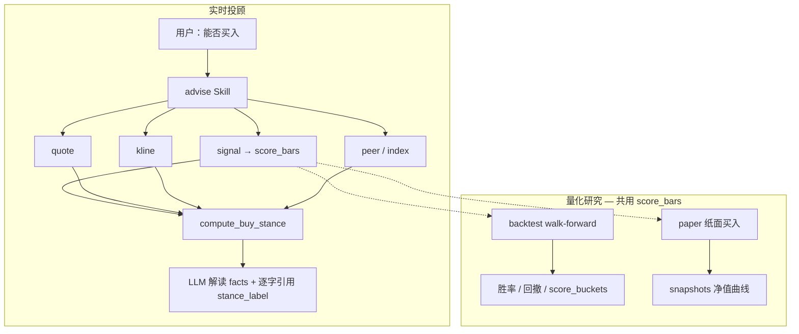
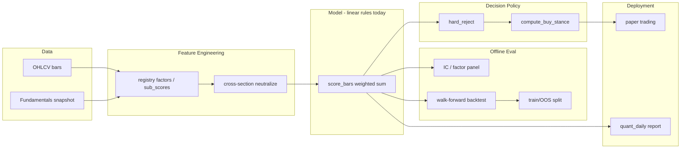
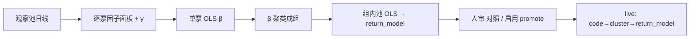
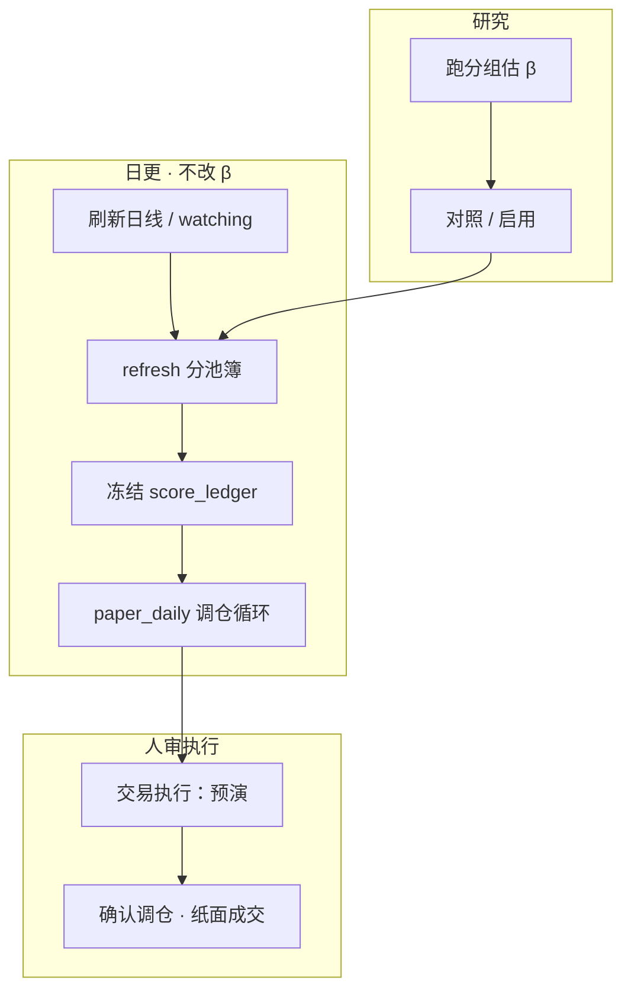

# 量化原理与实现逻辑

[← 文档索引](README.md) · **产品主轴**见 [design-spine.md](design-spine.md) · 入门名词见 **[§ 量化入门概念](#量化入门概念)** · **Web 面板用法**见 [量化研究台说明书](quant-ui.md) · 策略层抽象见 [architecture.md · 策略层](architecture.md#策略层)

本节说明本项目 **量化研究台** 的设计原理与代码实现路径：数字与结论由 **确定性 Python** 计算，LLM 只解读 JSON，**不得改写** `score` / `stance_label`。各阶段交付物见 [升级规划](design-spine.md#能力评估与升级规划路线图视角)；此处聚焦 **为什么这样设计** 与 **代码里怎么串**。

产品级「数据→信号→因子→倾向→动作」与两条轨，以 **[design-spine.md](design-spine.md)** 为准；本文展开因子权重、hard_reject、stance 阈值与纸面规则细节。

若从 **机器学习** 角度建立心智模型，可先读 [机器学习视角](#机器学习视角如何理解量化)，再对照下文各层实现。

### 总体架构：AI 编排层 vs 量化主轴

```text
┌─────────────────────────────────────────────────────────┐
│  AI 编排层（旁路：Agent 选工具 / 解释 facts）              │
│  · 「是否买入」须逐字引用 advise.stance_label             │
├─────────────────────────────────────────────────────────┤
│  量化主轴（core/backtest + core/signal + research CLI）   │
│  score_bars      → 0~100 短线分 + hard_reject            │
│  compute_buy_stance → 买/观望/试探（规则唯一结论）         │
│  backtest_signal → Walk-forward 历史验证                  │
│  paper           → 模拟持仓 + 净值 snapshots              │
│  store           → 日线本地缓存，保证 evals 可复现         │
└─────────────────────────────────────────────────────────┘
```

典型量化系统链路：**信号 → 回测 → 执行 → 监控**。  
本项目当前做到 **信号 → 回测 → 模拟账户交易**，定位为 **策略验证**；**现行不涉及真实账户交易、不代客下单、不接券商 API**。待策略在回测与纸面验证成熟后，再另立项支持实盘（N6）。产品边界见 [design-spine · 产品边界](design-spine.md#产品边界现行)。

**共享核心**：live 信号、`backtest`、模拟账本 **共用同一套 `score_bars()`**（`core/signal/scorer.py`）；`stance` 是在分数之上的 **第二层规则**；LLM **不在** 数值计算链中。

### 第一层：短线因子引擎（`score_bars`）

**模块**：`core/signal/scorer.py`  
**入口 Skill**：`signal`（观察池）  
**原子函数**：`score_bars(bars, horizon_days, quote?) → dict`

#### 输入 / 输出

| 输入 | 来源 |
|------|------|
| 日线 OHLCV | `skills/common/history.py` → AkShare；失败则 `quote_fallback` |
| 当日涨跌 | `quote.change_raw` 或 bar 推算 |

| 输出字段 | 含义 |
|----------|------|
| `score` | 0～100 综合分 |
| `hard_reject` | 是否硬拒绝（True 则不宜短线参与） |
| `reject_reason` | 硬拒绝原因 |
| `factors` | 动量、量比、ATR% 等子因子 |
| `invalidation` | 失效条件文案（约 -3% 参考位等） |
| `sub_scores` | 动量/量价/相对强弱/波动子分 |

#### 硬过滤（Hard Reject）

不满足时 **score=0 且 hard_reject=True**，不进入观察池排序：

| 条件 | 含义 |
|------|------|
| 日线不足（<2 根） | 无法计算 |
| 近 3 日涨幅 ≥ **15%** | 追高风险 |
| 近 3 日跌幅 ≤ **-12%** | 动能过弱 |

#### 因子加权（实现逻辑）

子分数各自映射到 0～100，再线性加权（权重见 `data/signal_config.json`；当前约 **20** 个注册因子）：

```text
score = 0.28×动量 + 0.20×量价 + 0.16×相对强弱 + 0.08×波动
      + 0.09×反转 + 0.09×流动性 + 0.06×估值 + 0.05×质量
```

| 因子 | 权重 | 实现要点 |
|------|------|----------|
| **动量** | 28% | `mom3`/`mom5` 涨跌幅；0～6% 温和上涨得分高；≥12% 过热降分 |
| **量价** | 20% | `volume_ratio`（近 3 日 / 近 10 日均量）；放量上涨加分，放量下跌扣分 |
| **相对强弱** | 16% | 相对指数超额；无指数时 fallback 到 `last_change` |
| **波动** | 7% | 近 5 日 ATR% 越高，`vol_penalty_score` 越低 |
| **反转** | 9% | 近 3 日 -8%～-2% 温和回调区加分（P45） |
| **流动性** | 9% | 成交额比 `turnover_ratio`（volume×close）（P45） |
| **估值** | 6% | PE/PB 适中区间；缺数据中性 50（P46） |
| **质量** | 5% | ROE / 盈利增速；缺数据中性 50（P46） |

#### score 的用途

`score` 是 **短线综合动能分（0～100）**，由配置因子加权得到；**不是**「会不会涨」的概率，也 **不是** 最终买卖指令。在全链路中的用途：

| 用途 | 模块 | 作用 |
|------|------|------|
| **观察池排序** | `signal` · `rank_candidates` | 过滤 `hard_reject` 与低分（默认 `min_score≥55`），按 score 降序取 Top N |
| **stance 初档** | `compute_buy_stance` | score 区间映射 avoid / wait / probe / buy_light，再经 K 线/peer/index 降档 |
| **回测入场** | `backtest_signal_on_bars` | `score≥min_score` 且非 hard_reject → 模拟买入持有 |
| **纸面跟单** | `core/paper.py` · `simulate_buys` | 观察池项 score 达门槛才纸面买入 |
| **横截面 / 组合** | `cross_section` · 组合回测 | 多股同日比相对强弱；调仓日可中性化后重算 score |
| **研究** | IC 面板 · `score_buckets` | 评估 score 与未来收益关系、分层胜率 |

**不是**：买入 guarantee；LLM 可改写数字；单票绝对真理（截面场景看 **相对排序**）。

ML 视角见 [机器学习视角 · 四件套对照](#四件套对照)。

#### 横截面中性化（P47）

单票 `score_bars` 仍用绝对子分；**watching 横截面排序**在 ≥3 只候选时，对各因子 `sub_scores` 做 **z-score**（或配置为 `rank`）映射回 0～100，再按权重重算 `score`。原始分保留在 `score_raw` / `sub_scores_raw`。配置见 `signal_config.json` → `cross_section.neutralize`。产品历史回测（`paper_replay`）不走这条组合 TopK 腿。

**IC 实验（P50）**：`value` / `quality` 可在 `fundamentals.use_in_ic_experiment=true` 时注入最新基本面快照；IC 仅供方向参考，非 point-in-time。

**组合回测（P51/P52）**：`use_in_backtest=true` 时批量注入基本面。中性化对照研究口已下线。

**量化日报**：主叙事为组ŷ / 簿 / OOS / 横截面 / rank_lots 历史回测。不再自动写入 `portfolio_neutral_compare_summary`。

#### 失效条件（Invalidation）

规则生成 **观察失效参考**，不是自动止损单：

- 最新收盘价 × (1 − 3%) 作为短线失效参考位
- 放量下跌且跌破近 3 日低点 → 降低关注优先级

#### 数据降级

日线拉取失败时 `history.quote_fallback` 构造伪 bar → `data_source=quote_fallback`。  
此时量比/ATR 信息变粗；下游 `compute_buy_stance` 会 **额外降档**，回复须标明「日线不完整」。

---

### 第二层：买卖 stance（`compute_buy_stance` + `advise`）

**模块**：`core/stance.py`（`compute_buy_stance`）、`skills/advise/engine.py`  
**Skill**：`advise` — 内部串联 `quote → signal → kline → peer/index`，输出 **唯一** 买卖结论。

`signal` 回答「短线动能强弱」；**「能不能买」** 由 stance 规则单独合成，LLM **只能引用** `stance_label` 原文。

#### 决策流程（确定性）

```text
1. quote 不可用           → insufficient（信息不足暂不建议操作）
2. signal hard_reject     → avoid（建议观望，暂不买入）
3. 无 score               → insufficient
4. 按 score 基础分档：
     <45  → avoid
     45~55 → wait
     55~68 → probe（建议逢低分批关注但暂不追入）
     ≥68  → buy_light（可考虑轻仓试探，非追涨）
5. 惩罚项：每项向更保守方向降 1 档（最多到 avoid）
     · 当日涨跌 ≤-5%（+2 档）或 ≤-3%（+1 档）
     · K 线 tags 含「大阴」「放量下跌」「破位」等
     · peer 相对同业「偏弱/最弱」
     · index 超额收益 ≤-2%
     · data_source=quote_fallback 或 kline depth=intraday_proxy
6. 输出 stance_code / stance_label / reasons / invalidation / confidence
```

| `stance_code` | `stance_label`（LLM 须逐字引用） |
|---------------|----------------------------------|
| `insufficient` | 信息不足暂不建议操作 |
| `avoid` / `wait` | 建议观望（暂不买入） |
| `probe` | 建议逢低分批关注但暂不追入 |
| `buy_light` | 可考虑轻仓试探（非追涨） |

**与「持仓加减仓」区分**：空仓/新标的「能不能买」→ `advise`；已有仓「减不减、止不止」→ `position` + `position_rules.json`。

---

### 第三层：历史回测（Walk-forward）

**模块**：`core/backtest/engine.py`（`backtest_signal_on_bars`）  
**Skill**：`backtest`（`strategy=signal_v1`）

#### 原理：避免前视偏差

对每个交易日 **T**（从 `min_history` 起至 `n - horizon_days`）：

```text
1. 取窗口 bars[start : T+1]（最多 max_window=30 根，仅用 T 及之前数据）
2. 用截至 T 的 quote 近似（mock change_raw）调用 score_bars()
3. 若 score ≥ min_score 且非 hard_reject：
     · 在 T 日收盘价 entry
     · 持有 horizon_days 后在收盘价 exit
     · 记录 return_pct
4. 默认 non-overlap：T 前进 horizon_days；overlap=True 时 T+1
5. 汇总 _trade_metrics → 胜率、均收益、累计、最大回撤、Sharpe 近似
```

这是 **事件研究 / 固定持有期回测**，不是连续调仓的组合模拟。

#### 基准与分层

| 块 | 函数 / 字段 | 含义 |
|----|-------------|------|
| 买入持有 | `benchmark.buy_hold_period_pct` | 回测区间整段持有收益 |
| 超额 | `excess_vs_buy_hold_pct` | 策略累计 − 买入持有 |
| 指数 | `index_period_pct` / `excess_avg_vs_index_pct` | 每笔同期指数收益（A→沪深300，港→恒生） |
| 分层 | `score_buckets` | 按入场 score（55-64 / 65-74 / 75+ / <55）看均收益与胜率 |

**参数扫描**：`research/backtest_scan.py` 对 `(horizon_days, min_score)` 网格搜索；**易过拟合**，须样本外验证。

#### 已知简化（解读时必须说明）

- 未含手续费、滑点、涨跌停、T+1
- live `signal` 可能 `quote_fallback`，回测用完整日线 → **数据源可能不一致**
- **研究结果 ≠ 实盘建议**

---

### 第四层：纸面账户（模拟执行）

**模块**：`core/paper.py` + CLI `research/paper_run.py` + Web `/api/paper*`  
**数据**：`data/paper.json`（由 `paper.example.json` 初始化，不入 git）

#### 纸面是什么？（给小白）

**一句话**：纸面 = 用**假钱**在电脑里练手的**模拟账户**，**不是**券商里的真实账户。本系统**只做模拟账户交易，用于研究**。

就像在本子上记账：「假如我买了茅台 100 股，现在赚多少」——钱不会真的进出，也不会真的下单。行情可以是网上拉的**真股价**，账户和成交是本地的**假账本**。

| | 真实账户（券商） | 纸面账户（本项目） |
|--|------------------|-------------------|
| 钱从哪来 | 银行卡里的钱 | 电脑里写的「虚拟资金」（如 10 万） |
| 买卖 | 真的成交、扣你的钱 | 只在 `paper.json` 里记一笔 |
| 涨跌 | 真影响你资产 | 只影响模拟净值曲线 |
| 风险 | 会亏真钱 | **不会亏真钱** |

**为什么要有纸面？**

1. **先验证想法**：规则、调仓、做 T 合不合理，先用假钱跑，再谈实盘。  
2. **和「回测」互补**：回测是对着历史 K 线一次性算「假如当时怎样」；纸面是持续存在的「假账户」，可以今天跑、明天再跑，像影子盘。  
3. **安全**：现行全程 **非实盘、不代客下单、不接券商 API**（策略验证阶段）。

**容易混淆的几点**

1. **纸面 ≠ 回测**：回测看历史（引擎内资金曲线，**不必**先有 `paper.json`）；纸面是一直活着的模拟账户。何时需要纸面见 [quant-concepts · 测试类型](quant.md#量化入门概念)。  
2. **纸面 ≠ 券商官方模拟盘**：券商模拟更接近真实交易系统；本项目纸面是自己算、自己记账，用来检验投顾/量化规则。  
3. **Watching 与纸面是测同一策略的两种方式**：研究池划定回溯「考试范围」，回测引擎交历史卷；纸面是假钱现场跟考。详见 [quant.md · 入门概念](quant.md#量化入门概念)。

**怎么用（概念流程）**

```text
初始化纸面 → 系统给一笔虚拟资金（Web「纸面」或 paper_run --init）
     ↓
观察页建仓 → 填每只买多少股，看清花费与剩余现金后确认（Web 唯一开仓入口）
     ↓
模拟页管理 → 加仓 / 减仓 / 清仓；跑观察池打分、记净值
     ↓
可选：按策略调仓 / 做 T
     ↓
看净值曲线与流水 —— 全是模拟账本
```

#### 仓位出处（谁做的决定）

每笔仓位记 `origin`，用来分清哪些是你的判断、哪些是规则的：

| `origin` | 来源 | 写入位置 |
|----------|------|----------|
| `manual` | 观察页建仓（`buy_codes_direct`）、手动加仓（`manual_buy`） | 持仓与成交记录 |
| `strategy` | 按策略调仓（`simulate_buys`） | 同上 |
| `mixed` | 手动建的仓后来被策略加过（`merge_origin`） | 持仓 |

早期记录没有该字段，Web 显示 `—`，不回填臆造值。这样「按策略调仓」可以保留，同时不破坏「模拟以人工为主」的口径。

#### 建仓预演（`plan_buy_codes`）

观察页建仓前先跑一次纯计算的预演：默认按**金额**（每只 2 万，可改）或**仓位%**反算股数，也可按股数 / `shares_by_code` / `amount_by_code` 覆盖。按现价算出每只买多少、合计花多少、建仓后剩多少现金，以及哪些因已持仓 / 取不到行情 / 现金不足买不进。预演标注 `cost_model: zero`（现价、零佣金/滑点/印花税），**不改账户**；`buy_codes_direct` 执行时复用同一份计划。

策略调仓：`POST /api/paper/run` 传 `dry_run=true` 出 `rebalance_report` + `cash_impact`（买入/卖出金额、净现金流、调仓后现金），确认后再正式跑。

#### 策略调仓 vs 底仓做 T

**一句话**：**调仓决定「持有什么」；做 T 决定在「已经持有的底仓上，今天要不要用波动多赚一点」。**

二者同属纸面 **ExecutionSpec**，但层级不同：横截面调仓 / `run_daily_cycle` = **组合配置（结构层）**；`overlays.t0` = **底仓上的日内 timing overlay（执行层）**。做 T **不是**独立选股 Alpha，而是在既定持仓上验 timing 规则。

| 维度 | 策略调仓 | 底仓做 T |
|------|----------|----------|
| 在问什么 | 持有什么、各占多少？ | 在既有底仓上，今天能否用日内波动做往返？ |
| 层级 | 主策略 · 截面 Alpha · 持仓结构 | Overlay · 不改变选股主线 |
| 信号头 | **ŷ_trade** 排序 + **ŷ_EOD** 买卖闸 + **ŷ_τ** 买入闸 | **v6 收盘带宽**：`ĉ=ĉ_τ`，破 `ĉ±δ` 涌现正/反 T；`y_path` 入场校验 |
| 决策频率 | 常按**日**（日更 / 手动预演→确认） | **每 5m 扫至 11:00**（Worker **5 分钟** tick） |
| 收益类型 | **持有期**相对收益 + 换仓带来的结构改善 | **round-trip 价差**（`t0_ratio` 可卖量上；非账户浮动盈亏） |
| 仓位出处 | `origin=strategy` | 做 T leg（`t0_batch` / 盘中落账明细） |
| 验证含义 | 规则能否驱动合理的持仓结构 | 在既定底仓上能否条件性增强 |

**常见误区**

- **调仓 ≠ 只赌明天涨**：含减仓、换弱留强、风控拦截；Alpha 假设偏**短～中持有期**，收益在日～周尺度累积，不是单根 K 线。
- **做 T ≠ 浮动盈亏**：是已实现 leg 价差；ŷ 门槛 / 带宽未破 / T+1 可卖量等门禁下，很多交易日 **0 成交**。
- **可独立也可耦合**：`coupling.t0_vs_stance` 默认 `independent`；也可配置为 `avoid` 时跳过做 T。

**ŷ_τ 是「重复使用」吗？**

**模型层共用、决策层不重复。** **ŷ_τ 头**（`tau_ridge`）产出的 **ŷ_τ**（预估 open→close）在调仓与做 T 都会用到，但回答的问题不同：

| | 策略调仓 | 底仓做 T（v6 收盘带宽） |
|--|----------|----------------------|
| **问什么** | 该不该**买/持/卖**、截面排第几 | 已有底仓今天 **正 T 还是反 T**、值不值得动 |
| **ŷ_trade** | **排序键** / 持有对比（`rank_key_for_item`） | **不参与** v6 估 `ĉ` / 选腿（仅复盘旁注） |
| **ŷ_EOD** | **买入 EOD 闸**（`eod_gate_score_for_item`） | **不参与** v6 估 `ĉ` / 选腿 |
| **ŷ_τ** | **买入 τ 闸**（`buy_passes_tau_gate`）+ 融合进 ŷ_trade | **`ĉ=ĉ_τ`**；破带后涌现方向（不再 `y_tau_map` 锁向） |
| **之后** | 换仓、权重、风控 | **触发根收盘**开第一腿；第二腿仍 5m 触价（调仓无此步） |

要点：

- **不是**把调仓用过的 τ 再抄一遍赚第二遍 Alpha；是 **同一预测头、两种决策接口**（结构层 vs timing overlay）。
- 做 T 默认 **`y_score_source=compute`**：开盘信息集（昨收因子 + 今开缺口）**即时重算** ŷ_τ 估 `ĉ=ĉ_τ`，不读冻结账本；与调仓扫池 **公式同源、时点可不同**。
- 上午刚通过 τ 买入闸的票，下午做 T 仍会重算 ŷ 问「今天怎么动底仓」；带宽未破或 \|y_τ\|/\|y_path\| 未过入场时 **0 成交** 也正常。
- 归因应分开：调仓 PnL（`origin=strategy`）vs 做 T leg（`t0_batch`）。双层 ŷ 契约见 [§2.5](quant.md#25-双层-predicted_scoreŷ_eod--ŷ_τ) · 实现 `core/signal/dual_score/` · `core/t0/close_band.py`。

**双层耦合（回测解读）**

做 T 与调仓 **不是** 两个正交、可简单叠加的 Alpha 源；解读合并 PnL 时需分层：

| 耦合点 | 说明 |
|--------|------|
| **资金回流** | 做 T leg 盈亏进入 `cash` / `shares_end` → 次日调仓的 equity、可用现金与回撤风控都会变。未回补敞口（`exposure_pnl`）也会进入净值。 |
| **选股域依赖** | 做 T 在调仓给的底仓上运行；振幅小、缺分钟、流动性差 → 门禁跳过或整手不足，做 T 有效 α 高度依赖调仓选股域质量。 |
| **成交口径** | 调仓预演/落账用实时 quote；做 T 回测默认 `fill_mode=trigger`（触价假设价）。两层 PnL 混看时，做 T 部分无法用真实 tick 成交验证。 |

系统通过 **每日重置研究现金**（`backtest.py` 日循环）与 **`dry_run` 预演** 部分缓解资金耦合；`coupling.t0_vs_stance=independent` 可跳过 stance 联动。可接受，但 **必须** 把 `origin=strategy` 与 `t0_batch` 分开归因，否则无法判断 α 来自截面选股还是日内振幅。

实现入口：`core/execution.resolve_effective_execution` · 调仓 `run_daily_cycle` / `POST /api/paper/run` · 做 T `core/t0/` · Web Follow 页。

#### 日循环（`run_daily_cycle`）

```text
watchlist
  → run_signal_scan()    # SignalHandler 对观察池打分，写 signal_log
  → simulate_buys()      # 可选：按 rules 纸面买入
  → mark_to_market()     # StockAPI 现价 → 市值 / 净值 / 盈亏%
  → append_snapshot()    # 写入 snapshots[]（Web Canvas 净值曲线，保留最近 120 条）
```

#### 纸面买入规则（`simulate_buys`）

| 规则键 | 默认 | 逻辑 |
|--------|------|------|
| `min_score` | 55 | 观察池项 score 不足则跳过 |
| `max_positions` | 20（短线）/ 15（保守） | 持仓数上限；与 StrategySpec `risk` / `paper_rules` 一致 |
| `position_pct` | 0.15 | 单票预算 ≈ 可用现金 × 15% |
| 硬拒绝 | — | `hard_reject=True` 不买 |
| 整手 | — | A 股按 100 股整数 |
| **T+1** | 结算锁 | 买入按批次 FIFO；**当日新买股不可卖**，下一交易日才计入可卖。加仓不把旧仓锁死。无批次的旧持仓视为已过 T+1。调仓/手动/止损/开盘成交/做 T 共用 `core/paper/tplus1.py` |
| **成交时点** | `next_open` | **盘中按现价成交**（连续竞价可买卖）；**收盘后**确认调仓只挂次日开盘单。与 T+1 批次锁独立。回测默认 `next_open` 仍是研究侧防未来函数，口径不同。 |

**非实盘、不代客下单**；可配合 cron 每日 `paper_run.py --run`。

#### 底仓做 T（模拟，P93）

**模块**：`core/t0/` · CLI `research/t0_backtest_run.py` · Web「预演做T / 确认做T / 做T回测」

| 要点 | 说明 |
|------|------|
| 目标 | **底仓 overlay**：在既定持仓上对可卖量做日内往返，验 timing 规则；**非**独立选股 Alpha（见上节对照表） |
| 语义 | A 股 **底仓做 T（T+1）**：**正 T** 先买后卖、**反 T** 先卖后买（枚举顺序，**不是**严格低吸高卖）。**选腿**仅看 **v6 收盘带宽**（收价破 `ĉ±δ`）；`ĉ=ĉ_τ`，**不做** dual_y 方向锁 / 前缀确认。禁卖当日新买股 |
| 选向 | **v6 收盘带宽**：每根用**截至该根前缀**的 ŷ_τ（标签仍 open→close）估 `ĉ=O×(1+y_τ/100)`，再映分钟；`r=(p/ĉ−1)%` 破带选向。默认 `r>δ→反T`，`r<−δ→正T`（`δ` 默认 3%）。**score 先验**（默认）：`s=clip(k·y_τ, ±α·δ)`，`upper=δ+s`，`lower=−δ+s`（`k` 默认 10；α∈[0.1, 1.0] 为 \|s\|/δ 上限，默认 1）。`off` 关平移（旧 `skip` 硬跳并入 score）。**门槛1 / 门槛2**（过任一已启用档即可）：每档 \|y_τ\| / \|y_path\| / \|R̂_τ\| 过入场 AND complexity/tpd 过上限（入场默认 0=关；complexity/tpd 默认 1≈关）。`y_enter_enabled` / `y_enter_alt_enabled` 关则该档不参与。\|y_path\|>`y_path_strong`（默认 5%）须与 y_τ 同号。截止 **11:00** 后不开 leg1；每轮默认 **40%**，累计至 **100%**。日分价空间与 S 门禁同前。 |
| 策略共用 | 多轮**共用一套**止损配方：冻结 leg2 触价、止损%（默认 1.2%）/ 延迟根 / 收盘确认、fill、午后追价。leg1 成交瞬间冻结方向与 leg2（反T=`ĉ−δ`，正T=`ĉ+δ`）；之后新 `ĉ` 不影响本轮。**午后追价允许在冻结带基础上改触发价**（执行降级，不是改 ĉ） |
| 动仓 | 每轮 **日初可卖 × t0_round_ratio（默认 40%）**；累计不超过 `t0_max_position_pct`（默认 100%）；`t0_slots_max_rounds` 默认 5 |
| 目标价 | **leg2 = 冻结对侧带**（优先于 τ 出场闸）；止损 / 中点追价 / EOD 仍挂 leg1；**追价可在冻结带上调整触发价**，新估 `ĉ` 不改本轮 |
| 成交 | 默认 **`fill_mode=trigger`**；leg1 为触发根**收盘价** |
| 门禁 | 每根：至少一源估出 `ĉ`；破带才开仓；11:00 后只收第二腿 |
| 路径 | 各轮触发根开第一腿后**按同一套止损/第二腿公式**挂在本轮成交价上（止损默认 1.2%、延迟 1 根、收盘确认）。多轮可同时 `after_leg1`；任一轮未平则调仓跳过卖出 |
| 风控 | **`y_block_tau_nowcast_sign`**（默认**开**）：nc **入场** `y_nc_enter`（默认 0.01%）+ **强同 τ** `y_nc_strong`（默认 0.2%）；**`y_nowcast_oc_gate=false`** 时比 nc 昨收口径；**`t0_pm_chase_interval_min`** 默认 5 |
| 纸面 | `POST /api/paper/t0` 默认 **dry_run 预演**，`confirm=true` 才写账 |
| 自动落账 | Follow Worker · **5m 盯盘触达即落账**（交易时段 **5 分钟**轮询 + 分钟缓存，不再日终整段回放） |
| 手动补跑 | Follow「手动预演 / 手动落账」· `POST /api/paper/t0`（预演 dry_run / 确认 confirm） |
| 回测 | 与纸面同一引擎：默认 **v6 多轮收盘带宽**（每 5m 可触发第一腿 + 共用止损/第二腿）；**仅 5m 第一触达**（缺分钟日跳过）；**已删除日线模拟**；默认绑模拟持仓；**日初可卖=日初总持仓**（简化 T+1；合并/顺序落账按 sellable 约束）；dual_y 按 `dual_score_window` 决定是否 fuse ŷ_τ（`eod_next` 不 fuse）；ATR 仅用 T−1 及更早；**默认 CostPort 研究费率**（禁隐式零成本）；分钟未齐至 14:55 **不强平**（`incomplete_session`）；齐窗 `eod_cover` **用末根 5m 收价，不用日线收盘**；`y_score_source` 强制 `compute`；开盘 hydrate / 批量算分 **`use_minute_tau=False`**，各轮触发前再因果重算 ŷ。汇总按槽位分向记账；**同日正+反记为多轮日**（正/反日不再重叠双计）；合并日带敞口 PnL |
| 边界 | **不接实盘**；不做日线 high/low 顺序猜测；不改变 `advice.stance_label`；正/反 T **PnL 基数**分别为卖出/买入名义（汇总 long_pnl/reverse_pnl 口径略异，量级通常很小） |

##### 正T / 反T 选腿（v6 收盘带宽）

A 股 T+1 下 **正 T = 先买后卖**，**反 T = 先卖后买**（腿顺序，非低吸高卖）。**选正/反 T** 仅由收盘带宽（破带即开；不经 dual_y 方向锁）：

| 条件 | 涌现方向 | 第一腿 |
|------|----------|--------|
| 5m **收价 C**（本根分钟 close，**非**日线收盘）> `ĉ + δ` | 反 T（先卖） | 触发根收盘卖 |
| 5m **收价 C** < `ĉ − δ` | 正 T（先买） | 触发根收盘买 |
| 收价在带内或缺 `ĉ` | — | 本轮跳过 |

破带比较 **r = (5m收价 C / Ĉ − 1)%**；表中 O/L/H/C 均为触发根 5m OHLC；**C 为本根收价，非日线收**。

`ĉ` = **ĉ_τ** = 日开 × (1+y_τ/100)（**该根前缀因果 ŷ_τ**：开盘 Z + ≤该根分钟，与研究枢纽 OC 头同口径），再经 **S=O_d/O_m** **映到分钟**作为收盘目标价；\|S−1\| 超阈跳过；`δ = O_m × t0_close_band_delta_pct / 100`。path **不进** `ĉ`。破带后过 **已启用的门槛1 或 门槛2**（每档 \|y_τ\| / \|y_path\| / \|R̂_τ\| 入场 AND complexity/tpd 风险）。与 `y_τ` 均**每根前缀**重算。截止 **11:00** 后不开 leg1；每轮 **40%** 至满仓上限。

侧向配置后缀同枚举（`*_buy_then_sell` / `*_sell_then_buy`）。旧 `long_t`/`reverse_t`、阴阳占比 / 复合确认 / 环境闸 / 固定前缀 / 四轮确认钟键已下线，加载时丢弃。

```bash
python3 research/t0_backtest_run.py --code 茅台 --json
# 或 quant(task=t0_backtest) / POST /api/quant/t0-backtest / POST /api/paper/t0
```

---

### 第五层：数据缓存与可复现（`core/store.py`）

数据层全景（采集 / 清洗 / 存储 / 服务 / 监控、PIT 边界、演进）见 **[architecture.md · 数据层](architecture.md#数据层)**。本节只记日线缓存与可复现。

**路径**：`data/store/daily/{CN|HK|US}/{code}.json`（不入 git）

```text
fetch_daily_bars()
  → 命中缓存且未过期（默认 24h）→ 读本地
  → 否则 AkShare 拉取 → 写入 + quality 标记（good / thin / empty）
```

**evals**：`evals/run_repro.py` 对 `score_bars` / `backtest_signal` **双跑 SHA256 指纹**；改 scorer 或回测逻辑后应先跑 repro + 单测。

---

### 全链路串联



**Agent 典型问法对照**：

| 用户意图 | 主要模块 | 输出 |
|----------|----------|------|
| 短线评分 / 观察池 | `signal` → `score_bars` | `observation_pool` |
| 能否买入 | `advise` → `compute_buy_stance` | `stance_label` + `facts` |
| 规则历史表现 | `backtest` → `backtest_signal_on_bars` | `metrics` + `benchmark` |
| 模拟跟单净值 | `paper` → `run_daily_cycle` | `snapshots` / Web 曲线 |

---

### 机器学习视角：如何理解量化

**一句话**：量化 ≈ 在金融市场里做 **有监督 / 排序学习**——用历史数据构造特征（因子），预测未来收益或相对排名，用回测做离线评估，再把得分映射成交易规则。本项目当前是 **手工特征 + 线性加权 + 规则决策层**（尚未端到端深度学习），但 ML 的完整问题框架已经具备。

#### 四件套对照

| ML 概念 | 量化含义 | 本项目对应 |
|---------|----------|------------|
| **样本** | 每个 (股票, 日期) 一条观测 | 日线 bar；watching 中某只股票在某交易日 |
| **特征 X** | 因子 | 动量、量比、RS、反转、PE、ROE 等 `sub_scores` |
| **标签 y** | 未来收益 | 持有 `horizon_days` 后的涨跌（回测中计算） |
| **模型 f(X)** | 打分函数 | `score_bars()` 的加权求和 |
| **评估指标** | 预测质量 | IC / IR、胜率、夏普、最大回撤 |
| **推理** | 实盘打分 | live `signal`、观察池排序 |
| **部署** | 执行 | 纸面 `paper`（不接券商 OMS） |

#### 因子 = 特征工程

配置因子加权（registry 白名单，当前约 20 个）：

```text
score = 0.28×动量 + 0.20×量价 + … + 0.05×质量
```

在 ML 术语下：

- **手工特征**：每个因子是人类设计的变换（`mom3`、`volume_ratio`、ATR% 等）
- **线性模型**：权重在 `data/signal_config.json`，相当于 `w·x`
- **隐含非线性**：因子内部的分段规则（如「涨 6% 高分、涨 12% 降分」）类似树模型的阈值

常见演进路径：规则因子（baseline）→ IC 调权 → GBDT / 线性模型学组合 → 序列深度模型。**本项目刻意保留可解释 baseline**，与 ML 里「先 logistic 再试 deep」同一思路。

#### 横截面 = 排序学习（Learning to Rank）

单票 `score_bars` 输出 **绝对分**；watching 多股同日比较，本质是：**给定截面特征，谁未来相对更好？**

| LTR 范式 | 量化场景 |
|----------|----------|
| Pointwise | 每只股独立预测未来收益（回归） |
| Pairwise | 两两比较相对强弱 |
| Listwise | TopK 组合整体收益（列表优化） |

**横截面中性化**（`core/signal/neutralize.py`，P47）在 ML 视角是 **去掉共同因子 / 组内标准化**：

- 对各 `sub_scores` 做 z-score 或 rank，再重算 `score`
- 类似按日 batch normalization，学 **相对 alpha** 而非跟大盘同涨同跌的 **beta**
- 「中性化 vs 绝对分回测对照」（P52）≈ 比较 **是否做 feature normalization 能提升排序质量**

#### IC / IR = 特征—标签相关性

| 量化 | ML 类比 |
|------|---------|
| **IC**（因子与未来收益相关） | 特征与标签相关强度 |
| **IC 不稳定** | 协变量漂移（covariate shift / 非平稳） |
| **IR** = mean(IC) / std(IC) | 跨期信号信噪比 |

`research/factor_report.py` / Web 因子 IC 面板用于 **权重建议**，但 **不自动写** `signal_config.json`——等价于 ML 里看 feature importance 后 **人工** 决定是否改生产配置。

#### 回测 = 带时间约束的离线评估

Walk-forward（第三层）≈ **时间序列交叉验证**，而非 random K-fold：

| 普通 ML CV | 量化回测 |
|-----------|---------|
| 样本常假设 i.i.d. | 金融序列 **非平稳、自相关** |
| 可 shuffle 验证集 | **必须按时间切**（见 `research/split.py` OOS） |
| accuracy / F1 | PnL、回撤、换手、成本 |
| 过拟合 → 验证掉点 | 过拟合 → **回测很美、样本外很差** |

回测模拟的是 **策略 PnL 路径**，更接近 **offline policy evaluation**（强化学习术语），而非单纯「分类准确率」。Policy / Reward / Environment 与本仓库边界见 [architecture.md · RL 视角](architecture.md#强化学习rl视角)。

#### stance / hard_reject = 决策层（非模型本体）

```text
模型输出（score）  →  业务规则（阈值、拒识、合规）  →  最终动作（stance）
```

| 组件 | ML 类比 |
|------|---------|
| `score_bars` | 回归 / 排序模型输出 |
| `hard_reject` | reject option / 拒识 |
| `compute_buy_stance` | 阈值策略 → 离散动作 {avoid, wait, probe, buy_light} |
| LLM 解读 | **与 serving 分离** 的可解释层，不得改写数值 |

#### 量化 vs 经典 ML 项目的差异

1. **标签噪声大**：短期收益接近随机，需 IC、组合统计，不能只看单次 accuracy。
2. **非平稳**：有效因子会失效 → OOS、rolling IC、`regime` 门控（`core/signal/regime.py`）。
3. **泄露风险**：前视偏差、 survivorship bias、非 point-in-time 基本面 → ML 里的 **label / train-serve leakage**（本项目基本面 IC 实验已注明非 point-in-time）。
4. **目标不仅是预测**：最终优化 **收益 − 成本 − 回撤**，常拆成 预测 → 组合优化 → 执行 三段（组合回测、成本模型见 P7+）。
5. **执行层**：预测正确但成交价不对也无效（纸面模拟 ≠ 真实 OMS）。

#### ML 流程对照本仓库



#### 代码路径 → ML 术语速查

| 用户 / 研究问题 | 代码路径 | ML 术语 |
|----------------|----------|---------|
| 单票短线分 | `score_stock` · `ReturnScoreModel`（`score_bars`→sub_scores） | 特征 → 拟合线性 ŷ |
| 观察池 Top N | `core/signal/cross_section.py` | 截面排序 / LTR |
| 去市场共同因子 | `core/signal/neutralize.py` | 组内标准化 |
| 因子有效性 | `research/factor_report.py` | feature–label 相关 / IC |
| 样本外 | `research/split.py` | time-based holdout |
| 历史策略表现 | `core/backtest/engine.py` | offline eval / backtest |
| 能否买入 | `core/stance.py` · `compute_buy_stance` | 阈值策略 / 动作空间 |
| 纸面跟单 | `core/paper.py` | shadow deployment |

#### 心智模型（三句话）

1. **因子 = 特征；score = 回归 ŷ（因子系数 β）；回测 = 带时间约束的 offline eval。**
2. **横截面中性化 = 去掉市场共同因子，学相对排序而不是绝对水平。**
3. **IC / OOS / 纸面 = 量化里的 train/val/test + shadow deployment，用来对抗过拟合与非平稳。**

更复杂模型（GBDT / 序列等）仍属可选演进；现行已默认用 **线性回归收益分**。见下节。

#### 选股真源：线性回归因子系数（规则分已退役）

**人工预定的规则分退出；全面拥抱数据驱动的回归模型。** 现阶段用 **线性回归（OLS / 可选 Ridge）**；线性系数 β 即 **可正可负的系数权重**。

```text
score_bars → sub_scores（特征）
ŷ = α + Σ βᵢ · zᵢ     # ReturnScoreModel → predicted_score = 选股真源
```

训练 / 打分 / 回测 / 复盘 / 纸面执行的时间口径与产物流转见 **[quant.md · ŷ 全链路](quant.md#predicted_scoreŷ全链路)**。

| 层级 | 现在是什么 | 不是什么 |
|------|------------|----------|
| **score** | 组/全局 `ReturnScoreModel` 的 ŷ（`predicted_score`） | 人工 `weights` 加权的规则综合分 |
| **因子系数 β** | z 上 ŷ% 斜率，**可正可负** | 和为 1 的非负混合权 |
| **stance** | 仍基于分数阈值 / 策略层 | 分类器直接输出「买/卖」 |
| **promote** | 人审冻结 `return_model`；**不**自动写 `signal_config.weights` | 静默 overwrite 生产配置 |

`score_bars` 仍算因子与 `sub_scores`（ŷ 输入）；其内部加权总分**不**再挂 `heuristic_score`，也不驱动选股。无模型时 `score` 为空。

**仍刻意不做的**：GBDT / 神经网络 end-to-end 荐股；黑盒直接改 `stance_label`；自动写盘。原因未变——可解释、审计、PIT/数据质量、OOS 与成本约束。复杂模型须 eval 证明增量后再人审 artifact。

**演进路径**：

```text
规则 score（已退役）→ 线性回归 ŷ（现行）→ GBDT blend → 序列模型（需 eval 证明增量）
```

工业级因子库规模见 [与专业量化系统的差距](#与专业量化系统的差距)；工业常见 **候选因子数百～数千、生产 alpha 几十级**，与是否使用拟合模型是正交问题。分类对照见 [工业常见因子分类](#工业常见因子分类对照本仓库)。

---

#### 工业常见因子分类（对照本仓库）

工业量化通常把 **alpha 因子**（选股/排序）与 **risk 因子**（Barra 风格：行业、规模、价值、动量等暴露）分开维护；候选库可达 **数百～数千**，经 IC/IR、相关性去冗、样本外验证后，生产 alpha 常见 **几十级**。下表为常见分类与本项目 **规则因子库（约 20）** 的对照（非 exhaustive）：

| 类别 | 工业常见示例 | 本项目 |
|------|-------------|--------|
| 价量 / 微观结构 | 换手率、Amihud、买卖价差、订单不平衡 | `volume_price`、`liquidity`、`amihud`；`money_flow`（OHLCV **proxy**，真净流入可注入） |
| 动量 / 趋势 | 1/3/12 月收益、52 周高点距离、均线斜率 | `momentum`、`ma_slope`、`technical_pattern`、`weekly_confirm`、`idio_momentum` |
| 反转 | 短期反转、隔夜反转 | `reversal`、`gap_risk` |
| 波动 / 风险 | 历史波动、Beta、下行波动、ATR | `volatility` |
| 基本面价值 | EP/BP/CFP、盈利收益率 | `value`、`earnings_yield`（PIT `as_of` 可用） |
| 基本面质量 / 成长 | ROE、毛利率、增速 | `quality`（ROE）、`growth`、`dividend`、`size` |
| 另类 / 事件 | 舆情、供应链、卫星、ESG | `alt_sentiment`（标题词表；小权重） |
| 风险模型（Barra） | 行业/国家/风格暴露、特异收益 | 横截面 **z-score** + **industry/size residual**（默认开） |

**规模对照**：工业 **候选 >> 生产**；本项目固定 **registry 白名单 + 配置权重**，IC / 截面相关 / `factor_ols` 仅供 **研究对比**，不自动扩库或写配置。

研究向 OLS 实验（对比 `signal_config.weights`，不写生产配置）：

```bash
python3 research/factor_ols_run.py --code 茅台 --json
# 或 Agent / quant(task=factor_ols)
```

---

### 代码模块索引

| 职责 | 路径 |
|------|------|
| 因子打分 | `core/signal/scorer.py` — `score_bars` |
| 模拟账本 | `core/paper.py` — 读写 `paper.json`（对话 position 默认） |
| 单票评分 | `core/signal/score_stock.py` — Signal/Position 共用 |
| 事实采集 | `core/facts.py` — `collect_stock_facts` |
| 买卖管线 | `core/advise.py` — `evaluate_buy_advice` |
| 买卖 stance | `core/stance.py` — `compute_buy_stance` |
| 持仓 + stance | `core/position.py` — `attach_stance_to_advice`（position 参数 `include_stance`） |
| Walk-forward 回测 | `core/backtest/engine.py` |
| 参数扫描 | `research/backtest_scan.py` |
| 日线缓存 | `core/store.py` |
| 纸面账户 | `core/paper.py` |
| 底仓做 T | `core/t0/` — 仅 5m 第一触达（回测/纸面预演；缺分钟跳过；已删除日线模拟） |
| 信号可复现 evals | `evals/run_repro.py` + `evals/repro_fixtures.json` |
| Agent 约束 | `agent/prompts.py` — `BUY_QUESTION_HINT`；`agent.py` 注入买入提示 |
| 因子配置 | `data/signal_config.json` + `core/signal/config.py` |
| 因子子模块 | `core/signal/factors/*` |
| 市场门控 | `core/signal/regime.py` |
| 成本模型 | `core/backtest/costs.py` |
| IC 报告 | `research/factor_report.py` |
| OLS 实验 | `quant/research/factor_ols.py` · `research/factor_ols_run.py` |
| OOS 切分 | `research/split.py` |
| 报告导出预览 | `quant/services/quant_report_export.py` — Web daily 后自动 Markdown 导出预览 + TOC |
| 规则 / LLM 解读 | `quant/services/quant_interpret.py` — `offline: true` → `source=rule_based` |

### 回测成本 / 撮合方法论脚注（V1）

| 项 | 本仓库做法 | 诚实边界 |
|----|------------|----------|
| 佣金 + 印花税 | `simple_cn`（默认进组合回测与纸面）；`cost_compare` 对照 `zero` | 非券商实时费率表 |
| 冲击 | `estimate_impact_cost` 按成交额/日均额近似 bps；验证报告可分列 | 非盘口冲击模型 |
| 撮合 | T+1 · 板别涨跌停近似 · 跌停延后卖（`skipped_limit*` / `exit_deferred`） | **非**交易所撮合引擎 |
| 回测–纸面落差 | `fit_gap` 启发式（成本 · 宇宙 · 频率 · 数据源）+ Corr/TE | 需真实日更样本才可解释 |
| 同策略对照 | 验证包导出须带 `cost_model` 版本；五问含成本假设 | 禁止口头归因「市场变了」而无结构字段 |

---

> **P6～P22 升级**详见 [quant-upgrade.md](archive/quant-upgrade.md)；一页总览见 [quant-summary.md](archive/quant-summary.md)；**日常运维与 preset**见 **[§ 量化运维](#量化运维)**。

---

### 与专业量化系统的差距

完整北极星定义见 **[design-spine · 产品北极星](design-spine.md#产品北极星)**；能力地图对照（专业栈 vs 本仓库采纳目标 vs 现状）见 **[能力地图](design-spine.md#能力地图六大模块)**（旧锚点仍可用）。下表为因子/信号层摘要：

| 维度 | 本项目 | 专业量化（能力地图对照） |
|------|--------|------------------------|
| 因子 | 规则因子 + IC 面板 + 横截面中性化（基本面非 point-in-time） | 大规模因子库 + point-in-time + 自动化 alpha 挖掘 |
| 信号 | 加权 + hard_reject + stance 降档 | 多策略组合、优化器 |
| 回测 | 单票/组合 + 成本/撮合近似 + 简化归因 | 事件驱动、冲击模型、完整 Brinson/因子归因 |
| 执行 | 纸面 JSON | OMS、券商 API |
| 风控 | 纸面止损/仓位上限 + 行业限额 + regime（详见 [architecture.md · 风控层](architecture.md#风控层)） | 实时止损、VaR、限额、多风险因子 |
| 决策 | stance 规则 + LLM 解读 | 纯代码为主 |


---

---

## 量化入门概念

[← 文档索引](README.md) · **产品主轴**见 [design-spine.md](design-spine.md) · 面板怎么用见 [Web 说明书](quant-ui.md) · 原理见 [量化原理](#量化原理与实现逻辑)

**产品聚焦**：① **观察**（长期名单）② **模拟**（假钱买卖）③ **回溯**（历史验证）——现行定位 = **策略验证**。  
**本质**：根据已发生、可审计的事实，估计对股票/组合的影响——见 [design-spine · 因果链](design-spine.md#因果链已发生--影响估计--动作)。  
逻辑链：**数据 → 信号(`score_bars`) → 因子 → 倾向(`stance_label`) → 动作**；两条轨见 [design-spine.md](design-spine.md)。

Web **主路径**：对话 · **观察** · **模拟** · **回溯**。纸面/策略/枢纽等仍有独立路由。  
策略图纸见 [策略层说明](architecture.md)。

**不是**自动实盘：现行不代客下单；纸面 / 做 T 均为模拟。待策略验证成熟后再评估实盘（N6）。

---

## 0. 主线

```text
观察（长期名单）  +  对话（解读）
        ↓
   ┌────┴────┐
回溯（历史回测）  模拟（假钱买卖）     ← 两种验证
        ↑
     纸面（假账配置，`/paper`）
```

| 页 | 回答什么 | 典型文件 / API |
|----|----------|----------------|
| **观察** | 长期看哪些票？ | `watching.json` |
| **对话** | 现在怎样 / 能不能买？ | Skills + Agent |
| **回溯** | 历史上这一局怎样？ | `portfolio-backtest` |
| **模拟** | 假钱买卖怎样？ | `/api/paper/*` |
| **纸面** | 假账规则与初始化 | `paper.json` |

AI 只解读数字，**不得改写** `score` / `stance_label`。

### 观察名单与纸面

| | 观察 / Watching | 纸面账户 |
|--|-----------------|----------|
| 角色 | 长期看的标的名单；也供回溯用 | 模拟页的**假账户**（假钱） |
| 配置页 | `/watching` | `/paper` |
| 实验页 | 被 `/replay` 读取 | 被 `/follow` 执行 |

一句话：观察里放几只票；对话做解读；回溯交历史卷；模拟用假钱买卖。

### 一只票的生命周期

```text
搜索发现 ──► 观察（只看） ──► 模拟持仓（有钱在里面） ──► 平仓（回到只看）
                 │                      │
            观察页建仓              模拟页加减仓 / 清仓
```

**观察页**是这条链路的总览与入口，**模拟页**是「有钱那段」的账本与管理。所以新仓只从观察页建，模拟页不设开仓入口。

### 出处：谁做的决定

每笔仓位都记录来源，方便回头分清哪些是自己的判断、哪些是规则的：

| 出处 | 怎么来的 |
|------|----------|
| **手动** | 观察页建仓，或模拟页持仓表加减仓 |
| **策略** | 模拟页「进阶 · 按策略调仓」由 signal 规则生成 |
| **手动+策略** | 手动建的仓后来被策略加过 |

原则：谁决定「买什么、买多少」，就归谁。你决定的走主路径，规则决定的收进进阶区并标出处。

---

## 1. 票从哪来

| 东西 | 回答什么 | 文件 |
|------|----------|------|
| **观察名单** | 长期看哪些？ | `watching.json` |
| **纸面** | 模拟假账户怎样？ | `paper.json` |
| **持仓** | 模拟仓 | `paper.json` |
| **策略** | 决策规则（进阶） | `signal_config.json` |

持仓**不是**观察名单；也不等于纸面。

---

## 2. 回溯 ≠ 模拟

| | 回溯 | 模拟 |
|--|------|------|
| 时间 | 对着历史 K 线一次推演 | 活着的假账本持续记账 |
| 页面 | `/replay` | `/follow` |
| 共用 | 同一套 `score_bars` / `stance` | 同左 |
| 是否要 `paper.json` | **否**（回测引擎自带资金曲线） | **是**（读写假账户） |

---

## 3. 测试类型：何时需要纸面？

并不是所有验证都要建「纸面账户」。是否模拟资金与持仓，取决于测试目的。

先分清两个词：

| 说法 | 含义 |
|------|------|
| **资金模拟（泛称）** | 回测/模拟里用假钱记账：进出、持仓、费用、净值 |
| **本仓库纸面 `paper.json`** | 模拟专用的持久假账本；**不等于**「只要算盈亏就必须先初始化纸面」 |

### 五类测试对照

| # | 类型 | 目的 | 要资金模拟？ | 要 `paper.json`？ | 本仓库落点 |
|---|------|------|--------------|-------------------|------------|
| 1 | **逻辑与信号** | 信号准不准、何时买卖 | 否 | 否 | `score_bars` / `signal` · `/strategy` · 信号时间列表 |
| 2 | **历史回测** | 历史盈亏与风险（回撤、夏普等） | **是**（引擎内记账） | **否** | `/replay` · `backtest` Skill · `core/backtest` |
| 3 | **模拟盘** | 实时（或按日）前瞻，减轻「未来函数」错觉 | **是** | **是** | `/paper` 配置 → `/follow` 跑一日/买入/调仓 |
| 4 | **压力 / 蒙特卡洛** | 极端滑点、乱序、高成本下会否爆仓 | 可选（情景参数） | 否 | **尚未落地**（远期） |
| 5 | **实盘对接** | 券商连通与真实成交 | 真实资金 | 否（真账户） | **现行不做**：策略验证成熟后另立项 N6 |

```text
只看信号准不准  ──►  不必纸面，也不必回测资金曲线
想看赚多少 / 风险  ──►  要资金模拟 → 走「回溯」（不必先建 paper.json）
想看从今往后跟得怎样 ──►  要 paper.json + 模拟
真刀真枪            ──►  本系统不做实盘
```

### 和主线怎么对齐

```text
信号测试（1）     ← 策略页 / signal · 无账户
      ↓
历史回测（2）     ← 回溯页 · 引擎内假钱 · 无 paper.json
      ↓
模拟盘（3）       ← 纸面初始化 + 模拟 · 有 paper.json
      ✕
实盘（5）         ← 明确不做
```

**适用节奏**：开发初期先做（1）；规则成型后做（2）；准备「当真用」前再跑一段时间（3）。（4）用于鲁棒性，当前缺口见 [roadmap](design-spine.md#能力评估与升级规划路线图视角)。

---

## 4. 涨跌归因与本系统边界（不强因子）

价格涨跌的本质是 **资金供求**：买盘多于卖盘则涨，反之则跌。驱动买卖决策的常见归因可粗分为三类：

| 归因 | 典型内容 | 时间尺度 |
|------|----------|----------|
| **基本面** | 业绩、行业景气、宏观利率/增长 | 偏长期价值 |
| **资金面 / 情绪面** | 机构与游资、北向、恐慌/狂热、消息刺激 | 偏中短期波动 |
| **技术面** | 趋势与形态、量价、均线突破 | 偏买卖点与短线动能 |

人类常看「逻辑与故事」；量化常看「数据与历史概率」，把归因写成可计算的 **因子**。但这不意味着本仓库要覆盖全部三类。

### 本仓库当前落点

| 归因 | 现状 | 说明 |
|------|------|------|
| 基本面 | **轻量** | `score_bars` 里估值/质量权重很小；基本面实验注明非严格 point-in-time |
| 资金 / 情绪 | **基本没有** | 无 Level-2、无主力/北向跟随；`news` 供对话解读，不进 stance 主算 |
| 技术面 | **主力** | 动量、量比、ATR、反转等 → 短线 `score` |

一句话：当前是 **短线技术面为主 + 轻量基本面的规则量化**，外加对话（可联网）解读；**不是**全市场基本面多因子，也 **不是** 高频资金微观结构。

### 明确边界：不强因子

- **不**把「涨跌归因完整」当成近期目标去堆新因子族。  
- 模拟页验证的是 **假钱纪律与记账**（你点买卖才成交），不是自动捕捉全部市场驱动。  
- 对话可帮你理解基本面/消息/情绪叙事；**数字结论仍只来自 Skill / `score` / `stance_label`**。  
- 量化资金在真实市场可能助涨助跌——本系统 **不参与、不代客下单**，纸面也不会后台自动买卖。

想改因子权重或做研究实验，走进阶页 `/strategy` · `/quant`；主路径仍是：观察 → 对话 → 模拟 → 回溯。

---

## 5. 推荐入门顺序

详细逐步说明见 **[quant-ui.md · 操作流程](quant-ui.md)**。

摘要：

1. `/watching` **观察**里放几只票。  
2. 对话做解读与问答。  
3. `/replay` **回溯**看历史（不必纸面）。  
4. `/paper` 初始化 → `/follow` **模拟**买卖几天。  

```bash
bash scripts/setup_quant.sh
# 或
python3 research/watching_run.py --init && python3 research/watching_run.py --refresh --sync-paper
python3 research/paper_run.py --init
```

---

## 6. 相关文档

| 文档 | 内容 |
|------|------|
| [Web 说明书](quant-ui.md) | 五页说明书 |
| [策略层说明](architecture.md) | 策略层与设计文档模板 |
| [architecture.md · 风控层](architecture.md#风控层) | 风控 · Alpha×Risk |
| [architecture.md · RL 视角](architecture.md#强化学习rl视角) | 强化学习视角（远期） |
| [architecture.md · 舆情层](architecture.md#舆情层) | 舆情 → 风险分（研究向） |
| [量化原理](#量化原理与实现逻辑) | 量化原理 |
| [architecture.md · 数据层](architecture.md#数据层) | 数据层与 PIT 边界 |
| [architecture.md](architecture.md) | 系统架构 |

---


---

## predicted_score（ŷ）全链路

[← 文档索引](README.md) · 产品主轴 [design-spine.md](design-spine.md) · 复盘细节 [quant.md · 复盘](quant.md#昨日复盘score-review) · 运维定时 [quant.md · 运维](quant.md#量化运维) · **盘中/实时增强** [quant.md · 盘中剩余收益头](quant.md#13-盘中剩余收益头intraday-residual方案) · **τ 契约与分组升级** [quant.md · τ 契约升级](quant.md#14-决策时刻-τ-契约--双层-predicted_score--分组目标升级)

本文梳理 **训练 → 打分 → 回测 / 复盘 / 验证 → 纸面执行** 的同一套时间口径与产物流转。  
目标：任何人看到页面上的「评分 / score / ŷ」，都能回答「它在预测什么、该和谁对账、会不会自动改 β」。

> **实时 / 主题日**：EOD ŷ 主轴不变；开盘缺口与剩余收益头见 [quant.md · 盘中剩余收益头](quant.md#13-盘中剩余收益头intraday-residual方案)。  
> **双层 predicted_score**：日线 ŷ_EOD + 当日 ŷ_τ 并存、分标签对账、决策层融合；见下文 **§2.5** 与 [quant.md · τ 契约升级 §9](quant.md#14-决策时刻-τ-契约--双层-predicted_score--分组目标升级)。  
> **契约缺口与升级**：现网 = EOD 选股 + 卖出保护，尚未完整实现「给定 τ → ℱ_τ → ŷ(τ)」进买卖；升级顺序见同专文。

---

## 1. 一句话主轴

```text
【层 1 · EOD】历史日线 → sub_scores(t) → 组 β → predicted_score (= ŷ_EOD)
         → 预测 close[t+h]/close[t]-1（现网 h=1）→ 主排序 / 买入门槛 / 账本

【层 2 · τ】  X_{T-1} + Z_≤τ → γ → predicted_score_tau (= ŷ_τ；旧 score_rem 仅兼容别名)
         → 预测 close[T]/price[τ]-1 → 展示 / 卖出 soft hold →（规划）买入闸
```

生产选股真源仍是 **层 1 回归 ŷ（因子系数 β）**，不是启发式 0–100 分。  
`heuristic_score` 仅研究对照基线。层 2 **不得**覆盖层 1 字段且不改标签混对账。

---

## 2. 统一契约（全链路共用）

### 2.1 决策日 `as_of` / \(t\)

站在交易日 \(t\) 打分时：只用 **\(t\) 及以前** 已完成的日线（及 PIT 财务等）算因子。  
\(t\) 日盘中若尚无当日完整 K 线，实际因子截止日通常是 **上一交易日 \(t-1\)**。

### 2.2 标签 \(y\)（训练与复盘同一公式）

\[
y = \bigl(\mathrm{close}[t+h] / \mathrm{close}[t] - 1\bigr) \times 100
\]

| 符号 | 含义 |
|------|------|
| \(t\) | 决策日（因子截止日） |
| \(h\) | `horizon_days`（前瞻持有期，交易日数） |
| \(y\) | 从 \(t\) 收到 \(t+h\) 收的简单收益（百分点） |

实现：`core/research/panel.py` · `build_y_spec`（`formula: close[t+h]/close[t]-1`）。

**不是**「决策日当天的涨跌幅」\(\mathrm{close}[t]/\mathrm{close}[t-1]-1\)。

### 2.3 预测 ŷ

\[
\hat y = f(\text{sub\_scores}(t);\ \beta,\ \text{intercept},\ z\text{-规则})
\]

写入 / 展示字段多为 `predicted_score` / `score`（收益分，单位 %）。  
方向命中：\(\mathrm{sign}(\hat y)=\mathrm{sign}(y)\)（\(|\hat y|<0.05\%\) 视为无方向，见复盘）。

### 2.4 `horizon_days` 默认（易混）

| 来源 | 常见默认 | 用途 |
|------|----------|------|
| `signal_config.scoring.horizon_days` | **1**（现网；曾长期为 3） | 配置契约；打分 / 复盘 / promote 校验 |
| 研究枢纽「持有期」`#quant-horizon` | **1** | **跑分组** 读页面时；产品 `/replay` 不读此项 |
| 昨日复盘 Horizon 下拉 | **1**（可选更长） | 对账标签长度 |

**原则**：估 β、打 ŷ、复盘 \(r_h\)、回测持有期应使用**同一 \(h\)**；改 UI 持有期后需重跑分组并 promote，再谈 live 一致性。

> **方法论**：日级趋势与做 T 方向采用 **多频率 · 多目标 · Ensemble/Bagging**，见 [design-spine · 预估方法论](design-spine.md#预估方法论)。

### 2.5 双层 predicted_score（ŷ_EOD + ŷ_τ）

产品契约要求「给定 τ、用 τ 前信息预测 τ 之后」。现网用 **两套预测** 逼近，而不是揉成一个 `score`：

| 层 | 字段 | 信息集 | 标签 \(y\) | 现网用途 | 规划用途 |
|----|------|--------|-----------|----------|----------|
| **EOD** | `predicted_score` / 表格 `score` | \(X_{\le T-1}\)（日线因子 × 组 β） | \(\mathrm{close}[t+h]/\mathrm{close}[t]-1\) | **入池门槛 · 账本主分** | 保持主轴直至 A3 |
| **τ** | `predicted_score_tau` | \(Z_{\le\tau}\)（缺口 / 广度 / 主题；可选分钟前缀） | 日线 \(\mathrm{close}[T]/\mathrm{open}[T]-1\)（特征可至 τ） | **买入闸 · ŷ_trade 融合 · 做 T 估 ĉ** | 与 ŷ_EOD_rem 正交融合 |

**命名**：对外统一 **\(y_\tau\) / ŷ_τ**。旧面板字段 `y_rem`、落盘别名 `score_rem` / `predicted_score_rem` 均等同 ŷ_τ，新代码写 `y_tau` / `predicted_score_tau`。勿再把「rem」当成第二个头；**ŷ_EOD_rem** 只是把 ŷ_EOD 映到剩余窗的派生量。标签口径统一为 **日线 open→close**；分钟模式只加 ≤τ 特征。

```text
ŷ_EOD     = f(X_{T-1}; β_cluster)                          # 组 β；标签 close[T]/close[T-1]−1（= 涨跌）
ŷ_τ       = g(Z_≤τ; γ)                                     # ŷ_τ 头；标签 close[T]/open[T]−1（日线）
ŷ_τ_CC    = 缺口 ∘ ŷ_τ                                     # 把开→收抬到现价对昨收；(1+缺口)(1+ŷ_τ)−1
ŷ_trade   = (w_eod·ŷ_EOD + w_τ·ŷ_τ_CC) / (w_eod+w_τ)      # 开盘排序 / 表列「评分」
残差         = ŷ_trade − 涨跌                                 # 与 trade / 涨跌同一口径
ŷ_EOD_rem = (1+ŷ_EOD/100)/(1+缺口/100)−1                   # 仅 y_state / cascade / nowcast 派生，不进 ŷ_trade
```

收盘后（`dual_score_window=eod_next`）：日线已完整；**表列 / 排序 ŷ_trade = ŷ_EOD**（剥离当日 ŷ_τ，避免 `缺口∘ŷ_τ≈今日涨跌` 泄漏进 T+1 决策）。τ 买入闸同样不吃当日 ŷ_τ；**nowcast 对照列仍吃 ŷ_τ**，不能塌成 ŷ_EOD。仅当 `nowcast.use_as_rank_key=true` 时，收盘后 nowcast 才退回 EOD。

**硬规则**

1. 两套字段并存；禁止用 τ 特征改写 `predicted_score` 却仍对账 EOD 标签。  
2. 复盘分别报 IC(ŷ_EOD, y_EOD) 与 IC(ŷ_τ, y_τ)；ŷ_τ 对账 **open→close**。  
3. **禁止** 把缺口折进 ŷ_EOD / 校准。EOD 已经在估涨跌（现价对昨收）；融合时把 **ŷ_τ 用缺口抬到昨收口径**，不要把 ŷ_EOD 映成 rem 再与 ŷ_τ 加权。  
4. **禁止** `ŷ_EOD_rem + ŷ_τ`：ŷ_τ 已是完整 OC 预估，再加 ŷ_EOD_rem 会双重计数。  
5. **两套模型独立训练、互不依赖**。EOD 不进 τ 的标签/特征；τ 不残差化 EOD。ŷ_EOD_rem 只是映射，不是第三套模型。权重只在决策时合成 ŷ_trade。  
6. **已知局限**：大跳空日 gap 信息可能在 ŷ_EOD（标签含隔夜）与 ŷ_τ（显式吃 gap）两端重叠；属信息相关而非训练耦合，权重可调。分钟特征含 `ret_open_to_tau` 时，OC 命中易被已实现段垫高——**τ 越晚 hit 通常越高**（见 OOS `by_tau`），应以各档 **IC** 而非总体 hit 做人审。  
7. **调仓 vs 做 T**：ŷ_τ **模型共用**，调仓侧为买入闸 + ŷ_trade 成分，做 T 侧为估 `ĉ` 的源之一 + 5m 破带执行；详见 [策略调仓 vs 底仓做 T · ŷ_τ 分工](quant.md#策略调仓-vs-底仓做-t)。

**Nowcast / Kalman（对照分）**

固定事件：终点钉在 T 收。内部状态是剩余收益 \(x(\tau)=\mathrm{close}[T]/\mathrm{price}[\tau]-1\)；**落盘 `predicted_score_nowcast` 抬回现价对昨收**，与 ŷ_trade / 涨跌同一口径：

\[
\hat y_{\mathrm{nowcast}}=(1-K)\,\hat y_{\mathrm{EOD}}+K\,(\text{缺口}\circ\hat y_\tau)
\]

观测是该 τ 的模型 ŷ，不是 T 收。顺序：EOD 先验 → open →（可选）分钟 τ。同一 ŷ_τ 只观测一次。表列「nowcast」与校准一样只做对照，不进排序/闸。

- \(Q\)：`nowcast.q_process`；主题日 / `|gap|≥gap_q_trigger_pct` 放大（`theme_q_boost` / `gap_q_boost`，上限 4×）。不要再叠一层时间衰减权。
- \(R\)：τ OOS `by_tau` → `by_theme`（当日 `theme_day`）→ `residual_var`。只用已落盘的前向 OOS，不用当日误差。
- **EOD 先验 \(P_0\)**：`nowcast.prior_var` → 分组 `mean_holdout_rmse²`（`cluster_last_report`）→ `dual_score.eod_residual_var`。
- **标签对齐**：分钟 as_of 时，ŷ_τ 为 open→close，把 ŷ_τ 几何映到剩余窗再进 blend / Kalman；仅当落盘模型仍是旧 `horizon_mode=tau_to_close` 时禁止再映（防双重扣减）。`enable_minute_tau` 或已有 `ret_open_to_tau` 时自动把当前分钟时钟并进滤波路径。
- 字段：`predicted_score_nowcast`（昨收口径）/ `nowcast_vs=prev_close` / `nowcast_as_of` / `nowcast_K` / `nowcast_x_prior`（昨收先验=ŷ_EOD）。**不覆盖** `predicted_score`。
- 排序：默认仍 ŷ_trade（blend）。仅当 `nowcast.use_as_rank_key=true` 才改 `rank_key`（A3 门禁）。
- 影子簿：刷簿即写 `cluster_book_nowcast_shadow.json`（不依赖 `nowcast.enabled`）；`meta.nordhaus_revision_slope` 为截面修正效率（接近 0 才考虑升主排序）。冻结账本同步 `{as_of}.nowcast_shadow.json`。枢纽 N3 验收条 / HTTP 已下线；库函数 `build_nowcast_shadow_review` 仍在。无快照时 Jaccard 按当日账本 Top-K(ŷ_nowcast) vs Top-K(ŷ) 估。
- `w_mode=kalman`：两点等价 Kalman 权（含同一套自适应 \(Q\)）；默认 `fixed`。
- 网格：`nowcast.taus` 允许 `eod|open|09:45|10:30|14:00`；默认 `eod|open`。分钟档不叠用（只取当前已到达档）。分钟 τ：**live** 调仓决策钟 `minute_tau_hm=10:30`（≈12×5m）；**训练**用变长前缀网格 `minute_tau_grid` 默认 `09:30|09:35|…|11:00` 每 5m 共享 β（非整根独立标签；09:30 无分钟前缀只留开盘 Z；不含 13:00 / 14:00；**做T执行 v6 收盘带宽**：每 5m 扫描至 11:00，收价破 ĉ±δ 开 leg1，path 不进 ĉ），仍依赖 `enable_minute_tau`。nowcast 网格不随做T槽位改。

**Y(τ) 高维状态（校验层）**

装配字段（不改 `predicted_score`）：`y_mu` / `y_sigma` / `y_disagree` / `y_check` / `eod_trust`（整包 `y_state`）。  
`y_check ∈ {ok, conflict, low_conf, missing_tau, single_head}`：用 EOD_rem 与 τ 的分歧/σ 决定**今日是否信任 EOD 去执行**。  
选股入池仍看 ŷ_EOD；`filter_buys`（默认开）时 conflict/missing_tau 拦新买；建簿 defer 优先 ok。`scale_weights`（默认开）时目标仓位 × `eod_trust`（不归一留现金）。路径段 `tau_to_close`：分钟特征优先，否则 ŷ_τ 标签代理。展示：tip +「歧/弱」角标。实现：`core/signal/y_state.py`。

实现：`core/signal/nowcast_kf.py`。

**融合阶梯（摘要）**

| 阶段 | 规则 |
|------|------|
| F0 / F1 / F2 把 ŷ_EOD 与 ŷ_τ 直接加权 | **已退役**（窗口不同） |
| 残差叠加 ŷ_EOD_rem+Δ | **已退役**（Δ 与 ŷ_τ 不是同一对象） |
| **正交加权（现网）** | 候选 := ŷ_EOD≥floor；排序 := ŷ_trade=w·ŷ_EOD+w·(缺口∘ŷ_τ)；另过 τ 闸 | **`fusion_mode=blend`** |
| A2 影子簿 | 同池按 ŷ_τ 另写 `cluster_book_tau_shadow.json`；jaccard/spearman vs EOD | **已落地**（`enable_tau_shadow_book`，默认开；不驱动买入） |
| A2 验收 | 账本 `*.tau_shadow.json` + `realized_tau`；HTTP `/tau-shadow` **已 stub** | **库保留 · 枢纽条已下线** |
| P0 Z 齐套 | 刷簿池截面 + tip 合并 `features_tau`；启用后轻量刷簿；`features_tau_fill` | **已落地** |
| P0 rem 满池 / 主题分层 OOS | `watching_limit` 默认 36；`oos.by_theme` | **已落地** |
| P1 分钟 τ | 研究轨 `enable_minute_tau` + `tau_hm`；`sector_ret_to_tau`；默认仍关 | **接线已落地**（人审开开关后训） |
| P2 融合补强 | `w_mode=theme_boost\|variance\|kalman`；`predicted_score_tau_cascade` 影子 | **研究轨已落地**（默认 `w_mode=fixed`） |
| **Nowcast / Kalman** | 顺序滤波 EOD→open→当前分钟 τ；自适应 \(Q\)；\(R\) 走 τ OOS 分层；Nordhaus 影子诊断 | **已落地**（默认 `taus=[eod,open]`；`use_as_rank_key=false`） |
| **校准层 g(ŷ)** | Isotonic 库仍在（`score_calibration.py`）。HTTP fit/persist **已 stub**（`deprecated: true`）。展示 overlay 已下线 | **库保留 · 入口已下线** |
| **Alpha/IC 补强** | 超额分账 · 主 IC=截面 Spearman · yhat/残差 y 研究开关 | **已接线**（见 [alpha-ic-strengthen.md](archive/alpha-ic-strengthen.md)；`yhat_residual`/`excess_mode` 默认关） |
| 分钟 τ 特征 | 缓存命中时写 `ret_open_to_tau` | **可选**（`enable_minute_tau`，默认关） |
| F3 以后 | 盘中窗以 ŷ_τ 为主（影子簿达标） | 未做 |
| P3 决策 bandit | 只学闸/听谁，不进 score | 未做 |

**研究枢纽 UI（信息架构）**：主路径「ŷ_EOD → ŷ_τ → IC → 交易执行」；ŷ_τ 为次级 CTA，不与「跑分组」并列主按钮；数据中心 / 交易执行表列 eod / trade / nowcast；残差 = ŷ_trade − 涨跌；eod 列 = ŷ_EOD；nowcast 列 = Kalman 权昨收口径对照，不进决策。训练：`POST /api/quant/tau-ridge` → `tau_ridge_model.json`（旧 `rem-ridge` / `rem_ridge_*` 兼容）。ŷ_τ 特征另含 PIT **`tau_lag1` / `tau_ma5`**（过去交易日真实 open→close，不含当日）。账本复盘页、τ/nowcast 单日验收条与校准 g(ŷ) 展示已下线（`score_ledger` IO / series 仍在；相关 HTTP 已 stub；`score_calibration.py` 库保留）。

建模、训练面板、OOS 与字段细节见 [quant.md · τ 契约升级 §9](quant.md#14-决策时刻-τ-契约--双层-predicted_score--分组目标升级)；盘中落地阶段见 [quant.md · 盘中剩余收益头](quant.md#13-盘中剩余收益头intraday-residual方案)。

### 2.6 预估周期：\(y_{\mathrm{EOD}}\) · \(y_\tau\) · \(y_{\mathrm{ON}}\)

团队约定用 **三个标签** 描述同一交易日上的价格路径；**open 锚链** 与 **close 锚的 EOD 轴** 并行，不是「EOD 输出喂给 τ 再喂给 ON」的串行模型链。

| 符号 | 定义（% 口径 ×100 同下） | 锚点 | 现网字段 / 状态 |
|------|---------------------------|------|-----------------|
| **\(y_{\mathrm{EOD}}(t)\)** | \(\mathrm{close}[t]/\mathrm{close}[t-1]-1\) | 收→收 | `predicted_score` · **已落地** |
| **\(y_\tau(t)\)** | \(\mathrm{close}[t]/\mathrm{open}[t]-1\) | 今开→今收 | `predicted_score_tau` · **已落地** |
| **\(y_{\mathrm{ON}}(t)\)** | \(\mathrm{open}[t]/\mathrm{open}[t-1]-1\) | 昨开→今开 | `predicted_score_on` · **已落地**（`on_ridge`） |

**open 锚周期（几何乘法，非加法）**

```text
open(t-1) ──y_ON(t)──► open(t) ──y_τ(t)──► close(t)
                              │
                              └── 在 t 日 τ 预估 y_ON(t+1)=open(t+1)/open(t)-1
                                  → 收盘前保守控「今开→明开」隔夜路径（风控，非主排序）
```

展开 \(y_{\mathrm{ON}}(t)\)（便于和已实现缺口区分）：

\[
\frac{\mathrm{open}[t]}{\mathrm{open}[t-1]}
= \underbrace{\frac{\mathrm{close}[t-1]}{\mathrm{open}[t-1]}}_{y_\tau(t-1)}
\times \underbrace{\frac{\mathrm{open}[t]}{\mathrm{close}[t-1]}}_{\text{收→开缺口}}
\]

故 **\(y_{\mathrm{ON}}\)** 含 **上一交易日开→收** 与 **昨夜收→今开**，**不等于** 纯隔夜缺口。

**与现网 `gap_pct` 勿混名**

| 量 | 公式 | 含义 |
|----|------|------|
| **`gap_pct`**（已实现） | \(\mathrm{open}[t]/\mathrm{close}[t-1]-1\) | 今开相对**昨收**；`gap_pct_from_quote_bars` |
| **\(y_{\mathrm{ON}}(t)\)**（规划标签） | \(\mathrm{open}[t]/\mathrm{open}[t-1]-1\) | 今开相对**昨开** |

旧文档 [intraday-residual-score.md §3 方案 C](quant.md#13-盘中剩余收益头intraday-residual方案) 曾写 \(\mathrm{open}/\mathrm{close}[T-1]\) 为「隔夜头」——**收→开缺口** 口径；与本节 **\(y_{\mathrm{ON}}=\mathrm{open}/\mathrm{open}\)** 不同，以本节为准。

**与 \(y_{\mathrm{EOD}}\) 的关系**

\[
\frac{\mathrm{close}[t]}{\mathrm{close}[t-1]}
= \frac{\mathrm{open}[t]}{\mathrm{close}[t-1]} \times \frac{\mathrm{close}[t]}{\mathrm{open}[t]}
\]

EOD 锚在 **收**，与 open 链 **并列**（选股主轴），不是 open 链的第三段输出。

**决策分工（规划 + 现网）**

| 时点 | 主用 y | 用途 |
|------|--------|------|
| 选股 / 入簿 / 收盘后挂次日单 | \(y_{\mathrm{EOD}}\) | 截面排序（现网） |
| 盘中（今开→今收） | \(y_\tau\) · ŷ_trade 融合 | 买入闸 · 调仓（现网） |
| **收盘前 τ** | **\(y_{\mathrm{ON}}(t+1)\)** 的预估 | **保守减仓、控今开→明开路径**（`predicted_score_on`；默认不进主排序） |

**硬规则（与 §2.5 一致并延伸）**

1. 三个 y **各用独立 `y_spec`、独立训练**；禁止写进同一 `predicted_score` 字段。  
2. **禁止**用 \(\mathrm{open}[t+1]/\mathrm{close}[t]-1\) 作盘中标签（依赖当日收盘，不满足收盘前风控）。盘中锚 **`open[t]`** 或 **`price[τ]`**，标签 **`open[t+1]/open[t]-1`**。  
3. \(y_{\mathrm{ON}}\) 规划为 **风控旁路**（缩仓 / 撤买单），**默认不进主排序**；落地前以 `gap_risk` · `event_prior` 作弱替代。  
4. 执行：收盘前减仓若要 **挡当夜隔夜**，须 **当日收盘前可成交**。纸面 `next_open`：**盘中按现价可成交**；**收盘后**只挂次日开盘，**挡不住当夜**。回测默认 `next_open` 仍是信号日收盘决策、次日开盘成交（见 [quant.md · 运维](quant.md#量化运维)）。

规划字段：`predicted_score_on` / `y_spec_on` / `data/live/on_ridge_model.json`；复盘 IC(\(\hat y_{\mathrm{ON}}, y_{\mathrm{ON}}\)) 与 open 链分段单独报。训练：`POST /api/quant/on-ridge`。

曾试过 ŷ_next（下一窗 VWAP）与 ŷ_r（\(C/C_r\)）作做 T 研究头；OOS 符号命中约 50%，已从枢纽下线，不进 T0 闸。

**做 T 曲折度头 \(y_{\mathrm{complexity}}\)**：独立 `y_spec`（禁止写入 `predicted_score` / `y_tau` / `y_path`）。标签 \(y_{\mathrm{complexity}}=1-D/L\in[0,1]\)：\(D=|C_{\mathrm{last}}-C_{\mathrm{first}}|\)（全日 5m 收价首末），\(L=\sum|\Delta C|\)（相邻 5m 路径长；午休跳空不计入）。0 = 直线，1 = 最折；**不是波动率**。特征=开盘 Z + 路径小包 + PIT `complexity_lag1`/`ma5` 与 `tpd_lag1`/`ma5`（与 \(y_{\mathrm{tpd}}\) 同 X，只换标签）。网格 `09:30…11:00`。OOS 按交易日 **90/10**，Spearman IC 与中位命中；过门后**全面板再拟合**写入 β。拟合 `POST /api/quant/cx-ridge`，落盘 `cx_ridge_model.json`。v6 入场：盘中前缀 \(\hat y_{\mathrm{complexity}}>y\_complexity\_max\)（0.00–1.00，默认 1.00≈关）则跳过；缺 ŷ_complexity 不挡。回测成交明细日级列显示 ŷ_complexity（label）（×100%）；实时做 T 表不显示全日 label。旧键 `y_cx` / `y_cx_max` / `cx_lag1` 仍可读。旧 ×100 模型预测会自动 /100。改特征后请重新拟合。

**做 T 转折点密度头 \(y_{\mathrm{tpd}}\)**：与曲折度**同一面板、同一套 X、同一 90/10 与全面板再拟合**，只换标签。\(y_{\mathrm{tpd}}\in[0,1]\)=连续 5m 段内方向反转次数/有效内点（午休跳空不计）。OOS 早盘 IC 高多半来自 `tpd_ma5` 票质；看 `OOS.by_tau` 的 09:30→11:00 斜率才是前缀增量。拟合 `POST /api/quant/tpd-ridge`，落盘 `tpd_ridge_model.json`。v6：\(\hat y_{\mathrm{tpd}}>y\_tpd\_max\)（默认 1.00≈关）则跳过。

**做 T 路径头 \(y_{\mathrm{path}}\)**：训练侧特征可与 \(y_\tau\) **对齐**（开盘 Z + 早盘前缀分钟小包），另加 PIT **`path_lag1` / `path_ma5`**（过去有 5m 的交易日真实极值序标签，不含当日）与 **`t_hi_frac` / `t_lo_frac`**。各轮触发前因果重算 ŷ（含 `sector_ret_to_tau`）；**仅 09:30 / 开盘信息集**允许无分钟小包并用开盘 Z 挂 ŷ_path（status=`open_z`）；**非 09:30** 前缀重算必须带出分钟小包，否则 `minute_data_missing`（数据缺失，不做腿）。有分钟前缀后再升为带小包的 path。训练默认 **多 τ 网格** `09:30|09:35|…|11:00` 每 5m 共享 β（同日标签=全日极值序，特征≤各 τ；09:30 无分钟前缀只留开盘 Z；不含 13:00 / 14:00；看 `OOS.by_tau`）；live 调仓决策钟默认 `10:30`。切分与全面板再拟合同 τ。标签：先 low→high 则 \((H-L)/\mathrm{ref}\%\)，先 high→low 则 \((L-H)/\mathrm{ref}\%\)。**v6 做 T 选腿**（收盘带宽）：每 5m 扫描至 **11:00**；\(\hat c=\hat c_\tau\)（开盘锚），**path 不进** \(\hat c\)（仅 \|y_path\| 入场 + \|y_path\|>`y_path_strong` 须同 τ）；\(\delta=\mathrm{open}\times t0\_close\_band\_delta\_pct/100\)；收价 \(>\hat c+\delta\) → 反T，\(<\hat c-\delta\) → 正T；带内或缺 \(\hat c\) → 跳过。第二腿冻结对侧带 `leg2_target` 优先于 τ 出场价闸；午后追价可改触发价。规划：`path_ridge_model.json`（β 与 τ 独立，因子键与多 τ 训法对齐）。改特征后请重新拟合。

---

## 3. 训练链：从日线到组 β



| 步骤 | 入口 | 产物 | 是否自动每日跑 |
|------|------|------|----------------|
| 跑分组 | 研究枢纽「跑分组」；进页**恢复**上次落盘（不重算） | 组表 + `return_model.coefficients` + `cluster_last_report.json` | **否**（非 cron） |
| 对照 / 启用 | 枢纽 promote | `data/live/cluster_weights_*.json` | 否（人审） |
| 健康 / 陈旧 | `cluster_scoring.refit_max_age_days`（默认 14）等 | 建议重估；可 auto demote active→shadow | 日更只检查，**不重估 β** |

要点：

- **β 不会在固定钟点自动更新**；`paper_daily` / `daily_quant` 不跑 OLS 分组。
- 收盘后刷新日线（约 15:05+，实务常 16:30–17:00）再跑分组，最新 K 线可含**当日**；但训练样本仍受 \(h\) 约束：最后一条训练决策日 ≈ 最新 bar 再往前 \(h\) 日。
- **auto-k**：中心 \(k_0\approx n/5\)（夹 4～10）。**定组 β / 选 k 组池 / holdout 重拟合**共用宇宙日历切分（主切点约前 70%）。邻域 \(\{k_0-1,k_0,k_0+1\}\) × 层次 complete/average + kmeans 等配方（**kmeans 同样超大组二分**，避免 30+ 只大团）；有日历时再加 **~55% 切点**各自前段 β 重聚类，按 **多折均值 `partition_loss`**（尾段有符号 ŷ IC↑ / 前段重拟合误差↓；重拟合失败不计分）选优。**辅门禁**：若存在 ΔOOS 过门（\(\ge -\)`oos_tol_pp`）的候选，淘汰更差的负 ΔOOS（避免 loss 略优但对照回测明显更差）。**交付标签取主切点**；组池 `return_model` 仍用**全样本**重估。大宇宙（≥40）跳过多折打分。报告：`k_selection`（含 `expanding_score` / `expanding_folds`）与 `walk_forward`。手动 `n_clusters` 不搜邻域，但定组 β 同样走前段。
- **贪心换组**：定组后（≤24 票、有日历切分）按 holdout `partition_loss` 有限轮试换（`cluster_greedy_refine`；最多 2 轮 / ≤80 次评估）。接受的 swap **改写交付标签**；全样本组池仍后置重估。报告字段 `greedy_refine`。大宇宙跳过。完整 `objective_partition` 贪心仍为研究试点。
- **`partition_loss` 口径**：默认 **有符号 IC**（`ic_use_abs=False`，与 live 选 k 一致；|IC| 会把反向 ŷ 评成「好」）。IC 项按 ``ic_ref_scale``（默认 0.05）放大到与 (1−R²) 同量级后再乘 ``w_ic``（默认 1.0），避免典型 |IC|≪0.1 被 R² 淹没。失衡罚阈值 ``1.5×ideal``（原 2×）。单票组计入质量先验（``singleton_prior_r2≈0.05``），结构 ``lambda_singleton`` 下调以免双重最重罚；无可用模型 / holdout 重拟合失败的多票组须带 `fit_ok=False`（含 live 贪心 `cluster_greedy_refine`），另计 `penalty_unusable`。`penalty_singleton` 按**票数占比**；`singleton_count` 仍是单票**组数**（展示勿混）。β 异质踢出同时看相对 |Δβ|/scale 与绝对阈值。
- **研究轨 `objective_partition`**：默认 holdout 评估 + ``auto_k_candidates`` 邻域候选；**不进** promote。生产仍走 `_select_clustered_by_delta_oos` + `light_greedy_swap_refine`。
- **扩展窗审计**：在 train 分位约 55% / 70% 两折各自前段 β **重聚类** + 尾段评分（`walk_forward.expanding`）；记相邻折标签稳定度。只读诊断，**不改**交付标签；大宇宙跳过。
- **标签对齐**：跑分组结束时若存在 live `cluster_weights`，按 code 重叠最大化把新 `cluster_id` / `G*` 对齐到上一版（Hungarian；无 scipy 则贪心），报告字段 `label_alignment`（含 `stability`）。未匹配的新组分配新 id。
- **软异质**：多票组先等权池 OLS 得组 β，再按单票 max\|Δβ\| 降样本权（\(w=1/(1+(Δ/0.25)^2)\)，下限 0.2）重拟合；**不拆组**。组字段 `soft_hetero` / `member_beta_gaps[].soft_weight`。
- **研究区持久化**：成功分组始终写 `data/live/cluster_last_report.json`（并更新指纹缓存）。刷新进页 `GET .../last-report` 恢复同一分区（顺序：last_report → 指纹缓存 → `cluster_weights_draft`）；仅点「跑分组」才重算。勾选刷新日线时也会覆盖指纹缓存，避免旧分区残留。概览「全局 IC / 方向命中 / 因子摘要」来自全样本因子与 ŷ 复盘，**不是**组内 β 表。

相关实现：`quant/research/factor_ols_clusters.py` · `quant/research/partition_loss.py` · `quant/research/cluster_wf_audit.py` · `quant/research/cluster_greedy_refine.py` · `core/signal/cluster/live.py` · `core/signal/return_score.py`。

---

## 4. 预估 / 打分链（live）

### 4.1 EOD 打分链（层 1 · 主轴）

```text
日线窗口(≤t) → sub_scores
             → 查 code 的 return_model（组 β，active 时）
             → predicted_score ŷ%
             → min_predicted_score / 分池簿 / stance
```

| 场景 | 行为 |
|------|------|
| 数据中心 / 交易执行表 | `score_stock` 同源展示 ŷ；**涨跌幅列为当日行情**，与 ŷ **不同口径** |
| 分池簿刷新 | `refresh_cluster_book_daily`：用**已有 β** 重打截面，不改系数 |
| 纸面预演 / 确认调仓 | 读当前 live ŷ 排序与门槛，不训练 |

配置门：`scoring.rank_mode=predicted_score` · `min_predicted_score` · `cluster_scoring.mode`（off / shadow / active）。

### 4.2 τ 打分链（层 2 · 残差头挂载）

`score_stock` 在写完 EOD ŷ 后，**追加** τ 层字段（不改 `predicted_score` / `score` 主值）：

```text
score_stock(code) 续——
  → gap_pct = gap_pct_from_quote_bars(quote, bars)       # 开盘缺口%
  → sector_gap_breadth：刷簿由 rank_cluster_pools 批量注入；单票缺省时用活跃簿宇宙（与做 T 同构），勿默认当 z=0
  → yclose_loc / mom3_pct：昨 K 位置 + 近 3 日动量（开盘可得）
  → feats = {gap_pct, sector_gap_breadth, theme_day, yclose_loc, mom3_pct, …}  # τ 头仅 Z
  → enable_minute_tau：≤τ 分钟小包（默认 10:30）+ 板块开→τ 截面 sector_ret_to_tau
  → tau_yhat = predict_tau_from_features(feats)           # tau_ridge 模型预测 ŷ_τ
  → ep = build_event_prior_from_quote(…)                  # 事件先验（soft hold / warn）
  → apply_tau_score_fields(signal_item, tau_yhat, gap_pct, feats, ep, …)
```

`apply_tau_score_fields` 写入的双层契约字段（`dual_score.py`）：

| 字段 | 值 | 说明 |
|------|----|------|
| `predicted_score_eod` | = `predicted_score` | EOD 原值备份 |
| `predicted_score_eod_rem` | (1+ŷ_EOD)/(1+缺口)−1 | 派生对照（y_state / nowcast）；**不进** ŷ_trade |
| `predicted_score_tau_delta` | 旧残差头 Δ | 仅兼容；现网 τ 头直接出 ŷ_τ |
| `predicted_score_tau` | ŷ_τ 头 | close[T]/open[T]−1 |
| `score_rem` / `predicted_score_rem` | = ŷ_τ | **已废弃写入语义**；仍双写/可读，等同 `predicted_score_tau` |
| `as_of_tau` | `"open"` 或 `"09:45"` | τ 时刻 |
| `y_spec_tau` | `{formula, tau, unit, note}` | τ 标签规范 |
| `features_tau` | gap/theme/breadth 快照 | τ 特征留痕 |
| `gap_pct` / `realized_t1_to_tau` | 缺口 / 昨收→τ | 已实现 |
| `predicted_score_blend` | ŷ_trade | 盘中：w·ŷ_EOD + w·(缺口∘ŷ_τ)；**收盘后 eod_next：= ŷ_EOD** |
| `predicted_score_nowcast` | ŷ_nowcast | Kalman 权昨收口径对照；表列「nowcast」，不进决策 |
| `nowcast_vs` | `prev_close` | 落盘口径；缺缺口时可能为 `open` |
| `dual_score_fusion` | `"blend"` | 正交加权 |

### 4.3 ON 打分链（层 3 · 隔夜缺口，风控旁路）

`score_stock` / `attach_dual_score_pit` 在 τ 字段之后 **追加** ŷ_ON（不改 `predicted_score` / `predicted_score_blend`）：

```text
score_stock(code) 续——
  → on_feats = build_on_features_from_quote_bars(quote, bars)   # ret_oc / ret_cc / y_on_today + Z
  → on_yhat = predict_on_from_features(on_feats)                 # on_ridge 模型
  → apply_on_score_fields(signal_item, on_yhat, on_feats, …)
```

| 字段 | 值 | 说明 |
|------|----|------|
| `predicted_score_on` | ŷ_ON | **open[T+1]/close[T]−1**（决策锚 close[T]，真实隔夜缺口） |
| `y_spec_on` | `{formula, anchor, unit}` | ON 标签规范 |
| `features_on` | ret_oc / gap / ret_cc / … | T-1 已实现路径 + 今开 gap 快照 |

训练：`POST /api/quant/on-ridge` → `on_ridge_model.json`（人审 persist）。**默认不进主排序**；收盘前减仓策略后续接线。

### 4.4 双层完整调用链

```text
【训练层】
  factor_ols_clusters → return_model (β_cluster) → promote → cluster_weights.json
  tau_ridge           → tau_model    (γ)         → promote → tau_ridge_model.json  # 旧 rem_ridge_* 可读+双写
  on_ridge            → on_model     (ζ)         → promote → on_ridge_model.json

【Live 打分层】
  score_stock(code)
    ├── sub_scores (日线因子×30+) → return_model.predict() → predicted_score / score (ŷ_EOD)
            └── gap_pct + theme_day + sector_breadth + (ret_open_to_tau)
                    → tau_model.predict() → ŷ_τ
                    → apply_tau_score_fields() 写入 predicted_score_tau（兼写 score_rem）/ blend / features_tau

【建簿层】
  cluster_rank.rank_cluster_pools()
    ├── ŷ_EOD ≥ min_predicted_score → eligible
    ├── rank_key=predicted_score_blend（ŷ_trade）
    ├── 全局排序 → max_names 截断 → book → cluster_book.json
    └── A2：同 eligible 按 ŷ_τ 重排 → tau_shadow_book → cluster_book_tau_shadow.json

【执行层（纸面调仓）】
  paper_rebalance.rebalance_with_rules()
    ├── 候选：ŷ_EOD ≥ min_score
    └── F1 闸：buy_passes_tau_gate() → ŷ_τ ≥ min_predicted_score_tau → 否则 risk_budget_skips

【复盘层】
  score_ledger 冻结 ŷ_EOD + ŷ_τ
    → h 日后回填 realized (y_EOD) + realized_tau (y_τ)
    → 分别报 IC / 方向命中 / 错票归因（库函数；枢纽单日验收条已下线）
```

### 4.4 F1 买入闸门（纸面执行）

`paper_rebalance` 在候选过 EOD 门槛后，再过 ŷ_τ 闸（`dual_score.buy_passes_tau_gate`）：

| 条件 | 行为 |
|------|------|
| `fusion_mode=f0` | 直接放行（τ 闸关闭） |
| `y_tau is None` 且 `block_buy_if_tau_missing=False`（默认） | 放行（ŷ_τ 模型/特征缺失不硬卡） |
| `y_tau is None` 且 `block_buy_if_tau_missing=True` | 拦截（"ŷ_τ 缺失（dual_score 硬闸）"） |
| `y_tau < min_predicted_score_tau` | 拦截（"ŷ_τ=X.XXX% < min_predicted_score_tau(Y)"）；**冻结降级**：候选池无人过基线且 `tau_freeze_breakglass` 时临时用 `min_predicted_score_tau_relax`（预演标「τ 试验档」） |
| `y_tau ≥ min_predicted_score_tau` | 放行 |

### 4.5 A2 影子簿（同池 ŷ_τ 重排对照）

刷簿时**额外**写 `cluster_book_tau_shadow.json`（不驱动 execution / 纸面买入）：

- 同 EOD 入池集合（eligible），按 `predicted_score_tau` 降序截断 → tau_shadow_book
- 缺失 ŷ_τ 的票排末尾，计入 `missing_tau_count`
- 与 EOD 主簿对照：`jaccard`（代码重叠）、`spearman_shared`（共享代码秩相关）、`only_eod` / `only_tau`
- 验收：库函数 `build_tau_shadow_review`（枢纽条 / HTTP 已下线）

---

## 5. 回测链（paper_replay / rank_lots）

入口：历史回测页 / 日报轻量摘要 · `backtest_paper_replay`  
（Web：`run_portfolio_backtest`；日报：`summarize_portfolio_backtest`）。

产品回测与 live Follow 同一套 **rank_lots**：每个交易日 09:30 用 y_fuse / y_on 排序，按手数开/加/清仓。  
`topk_research`（`backtest_topk_equal_weight`）只作研究探针（组 OOS / 权建议 OOS / 分池合成对照），**不进 `/replay`**。中性化对照研究口与 lookback×K 参数网格已下线。

成功回测落盘 `data/last_portfolio_backtest.json`。打开 `/replay` 时 `GET /api/quant/last-portfolio-backtest` 恢复 KPI / 净值 / 成交账，**不重跑**；点「跑回测」才重算。日报摘要仍走 `summarize_portfolio_backtest`，不覆盖这份落盘。

### 5.1 分数口径（历史 vs live）

| 项 | 历史 paper_replay（本页 / 日报） | Live 纸面调仓 |
|--|--|--|
| 选股排序键 | **y_fuse / y_on**（09:30 ranking） | 同左 |
| 宇宙 | 全部观察池（开加只受现金地板） | 每天开/加受策略 `max_positions` |
| 手数 | 回测 1000 / 2000 股 | live 100 / 200 股 |
| 成交 | 开盘 rank_lots；T+1；现金地板 | 同规则，账本为 `paper.json` |

与契约对齐的部分：

- 每个交易日 \(t\)：仅用到 \(t\) 开盘可得信息打分；
- ŷ 标签窗口仍是 `scoring.horizon_days`（打分 / 复盘），与 rank_lots **无持有期截断**（持仓直到 ranking&lt;0）；
- 日报 **含成本**，lookback 默认 30（可选 30/60/90）；对齐 `/replay` 的 α / rank入场 / rank强；
- 大宇宙先扫本地缓存再截断，避免 `watching[:40]` 丢掉后面有日线的票。

与复盘的差异（执行假设）：

| | 昨日复盘 | paper_replay（默认） |
|--|----------|------------------|
| 验证对象 | 单票 ŷ 方向 vs \(r_h\) | 组合 rank_lots 净值 / 成交账 |
| 成交 | 概念上 close→close 标签 | 每个交易日 09:30 开盘手数 |
| 排序 | 账本冻结 ŷ | y_fuse / y_on ranking |

UI 横轴：权益/日收益按**交易日**；解读时勿与「ŷ 决策日」混为一谈。

---

## 6. 复盘链（昨日复盘 / 账本）

详见 [quant.md · 复盘](quant.md#昨日复盘score-review)（覆盖范围、薄样本、日线前置以该页为准）。

```text
分池 scored_all（优先）→ 冻结 score_ledger/YYYYMMDD.json（行带 in_book）
                       → 回填 r_h = close[as_of+h]/close[as_of]-1
                       → 复盘默认滤簿 · 校准用全量
```

**宇宙**：冻结优先 **`cluster_book.scored_all`**（打分宇宙），回退 `book`。复盘默认 **`in_book`**；校准 Isotonic 用账本**全量行**，以覆盖负 ŷ / 门槛下。不含纸面持仓并集。

目的拆分：复盘检验 **簿的合理性**；校准学 **全轴 g(ŷ)**。持仓 Realization 走纸面归因轨。

### 6.1 两种常见「正确对账」例子（\(h=1\)）

| 何时算分 | 因子截止（决策日） | 应对齐的实现 |
|----------|-------------------|--------------|
| \(T\) 日 17:00 后（已有 \(T\) 收） | \(t=T\) | \(T\!\to\!T\!+\!1\) 收盘收益 ≈ **\(T\!+\!1\) 日涨跌** |
| \(T\) 日 10:00（通常无 \(T\) 日线） | \(t=T\!-\!1\) | \(T\!-\!1\!\to\!T\) ≈ **\(T\) 日收盘涨跌** |

日历上「在 \(T\) 日点冻结」≠ 决策日一定是 \(T\)：应对齐 **因子实际截止日**。  
冻结写入已走 `resolve_freeze_as_of`：按本地日线末根推断截止日，禁止「会话日标签 + 昨收因子」；会话日账本在复盘 chip 标未到期。  
\(T\) 日闭市前拉日线，可靠末根多为 \(T\!-\!1\)；完整 \(T\) 日 K 线须收盘后再拉。刚冻的会话日账本在 as_of+\(h\) 日线未到前会报 **薄样本**——应选更早决策日，而非指望「再刷一次日线」变出未来收盘。

### 6.2 单票时间线

冻结 ŷ 曲线的横轴日期 = **决策日 `as_of`**（账本文件日）。  
与「日涨跌%」同图叠放时：只能看形态；**准确度**须把 ŷ 与错开 \(h\) 后的实现收益比。

---

## 7. 验证链（不止复盘）

| 层级 | 做什么 | 典型出口 |
|------|--------|----------|
| 样本内 / 组 OOS | 跑分组附带组门禁、ΔOOS 等 | 枢纽分组卡 |
| 截面 IC | 决策日 ŷ 与 \(r_h\) 的截面相关 | 池 IC / 研究臂 |
| 账本复盘 | 冻结 ŷ vs 实现 \(r_h\) 方向命中 | 昨日复盘 |
| paper_replay | 历史组合可交易性（rank_lots、成本、T+1） | `/replay` · portfolio-backtest |
| Live 健康 | 映射年龄、滚动 ŷ IC、覆盖率 | `assess_cluster_live_health`；可 demote |
| 成熟闸门 | 研究→纸面准入软硬项 | `maturity_gate` |

**错误验证**：在交易执行 / 数据中心用「当日 score vs 当日涨跌」当准确度——口径错（且动量因子易造成假相关）。

---

## 8. 执行链（纸面，非实盘）



推荐工作日节奏（见 [quant.md · 运维](quant.md#量化运维)）：

| 时刻 | 任务 | 改 β？ |
|------|------|--------|
| ~16:30 | advisor / paper 相关 | 否 |
| ~16:35 | `paper_daily` | 否（可 demote + 刷新簿 + 账本） |
| ~17:00 | `daily_quant` 日报等 | 否 |
| 人择时 | 跑分组 → promote | **是** |

纸面规则读 `paper.json` + live ŷ；**不代客实盘下单**（N6 另议）。

成交语义（研究 vs 纸面）若要严格 close-close 或 close→次日开，应在策略 / 回测 `execution_mode` 显式约定；默认回测偏 `next_open`。

---

## 9. 端到端对照表

| 环节 | 输入截止 | 输出 | 验证标签 |
|------|----------|------|----------|
| 跑分组 / 估 β | 面板日线（含 PIT） | `return_model` β | 样本内 / 组 OOS（研究） |
| live 打分 | 决策日 \(t\) 因子 | ŷ% | —（预测） |
| 冻结账本 | 选定 `as_of`（对齐因子截止） | **宇宙** `scored_all`（优先）→ ledger；行带 `in_book` | 校准用全量；复盘默认簿；待 \(h\) 日后回填 |
| 昨日复盘 | 已冻结簿 ŷ | 命中 / 归因（检验簿合理性） | \(r_h\) close→close；不含持仓并集 |
| paper_replay | 历史各 \(t\) 开盘 | 组合曲线 / 成交账 | rank_lots 日收益 |
| 纸面调仓 | 当日可得 ŷ（可补持仓分） | 持仓变动 | 事后用纸面归因 / 净值，非簿命中率 |

---

## 10. 常见误读（速查）

1. **「score 预测当天涨跌」** — 仅当 \(h=1\) 且决策日是昨收时，才近似「今天相对昨收」；若配置仍为 \(h=3\) 则预测的是 **未来 3 日累计**（现网默认已对齐 \(h=1\)）。  
2. **「每天定时更新 β」** — 没有；日更只重打分 / 调仓 / 冻结。  
3. **「表上 score 和涨跌并排 = 验证」** — 仅直觉；严谨验证用复盘错开 \(h\)。  
4. **「冻结日 = 决策日」** — 冻结已按因子截止解析；历史错标的会话日账本可删，UI 会标未到期。  
5. **「回测 = 复盘」** — 标签同源，组合截断与默认次日开盘不同。

---

## 11. 用模拟反馈提升预估准确性（算法视角）

对齐北极星三项：**纸面风险调整收益 × 迭代速度 × 回测–纸面拟合度**。  
监督主链仍是「历史因子 → \(y=r_h\)」；模拟交易累积的是 **第二层数据**：\(\hat y\) vs 实现、对/错工况、以及**交易动作后果**（换手、成本、拦截）。二者用途不同，不可混成「用成交价再训一遍 β」就完事。

### 11.1 先分清两类样本

| 数据 | 内容 | 主要服务 |
|------|------|----------|
| **A. 预测–实现账本** | `score_ledger` + `outcomes`：\(\hat y\)、\(r_h\)、`sign_hit`、因子/行业/分组归因 | **抬 ŷ 校准与选股区分度**（IC / 偏差） |
| **B. 纸面决策轨迹** | 预演→确认、持仓、成本、风控拦截、净值曲线 | **抬交易策略与 Realization**（能否落地、是否过拟合回测） |

A 改进「估得准」；B 改进「做得对」。北极星乘积两者都要。

### 11.2 推荐算法阶梯（由稳到激进）

**L0 — 监控门禁（已有骨架，先用满）**

- 滚动 ŷ IC / 命中率破线 → demote（停用陈旧 β），强制重跑分组。  
- 作用：防止「继续用错模型」；本身不提高 β 精度，但保护纸面夏普。

**L1 — 残差驱动的重估与加权（优先落地）**

把每条账本行看成 OOS 样本：\(e = r_h - \hat y\)（或方向错记为 1）。

1. **加权再拟合**：下次跑分组 / Ridge 时，对近期或高 \(|e|\) 样本提权（或对命中样本降权防过拟合噪声）。  
2. **分层重估**：按 `factor_blame` / 行业 / 组 / regime 切片，只对「系统性偏差」切片缩短 `refit` 周期或单独估 β。  
3. **校准层（isotonic / 分段线性）**：在 \(\hat y\) 之上学 \(g(\hat y)\approx\mathbb{E}[r_h\mid\hat y]\)，不改因子结构，专治「方向对但幅度飘」。  
   - 实现：`core/signal/score_calibration.py`。**研究枢纽与 HTTP fit/persist 已下线**（返回 `deprecated`）。库函数仍可供单测。  
   - **EOD 样本（默认）**：与分组同源——观察池 ∪ `scored_all`、日线滚动 `collect_subscore_forward_panel`、live 组/全局 β 打出历史 ŷ，对齐同一前瞻收益。  
   - **τ 样本（默认）**：与 ŷ_τ 拟合同源——`build_tau_panels_from_bars(tau_hm=open)` + live τ β，对齐 open→close。  
   - 仅 `sample_source=auto` 且 panel 不足时回退账本；默认 `panel` 不静默缩样本。  
   - **展示 overlay 已下线**（观察池 / 持仓 / 回测不再挂 g(ŷ)）。排序键、τ 买入闸、分池入簿门槛仍读原始 ŷ。

**L2 — 工况门控（何时信模型）**

用「准 / 不准」标签训一个 **可交易过滤器**（仍用 \(t\) 前可见特征）：

- 输入：截面离散度、组内同质度、regime、波动、覆盖率、映射年龄…  
- 输出：\(p(\text{sign\_hit}\mid \cdot)\) 或「本期是否允许 active」。  
- 决策：\(p\) 低 → shadow / 降仓 / 提高 `min_predicted_score`，而不是硬改 β。  

这直接抬 **条件准确率** 与纸面回撤控制，符合「影响估计 + 风控」双轨。

**L3 — 交易策略层学习（用 B 类轨迹）**

ŷ 准 ≠ 赚得到。用纸面轨迹优化 **Policy 参数**（持有期、TopK、门槛、换手惩罚、执行模式 close vs next_open）：

- 目标：滚动夏普 / 卡玛，约束回撤与成本（与北极星分子同构）。  
- 方法：网格 / 贝叶斯搜索 + walk-forward；或离线策略评估（IPS）——**先不要上在线 RL**。  
- 与 [architecture.md · RL 视角](architecture.md#强化学习rl视角) 一致：纸面是 Environment；今日 Policy 仍须可审计、人审 promote。

**L4 — 表示 / 模型升级（样本够再做）**

- 组内非线性、多任务（同时估 \(r_h\) 与 hit 概率）、或研究轨 NN——**不得直连生产 score**，须过 OOS + 纸面拟合门禁后人审。  
- 避免用「同一段已交易路径」无隔离地刷参（泄漏 Realization）。

### 11.3 闭环怎么接现有执行链

```text
日更冻结 ŷ → h 日后回填 outcomes
    → 聚合：IC · 命中率 · 残差分层 · fit-gap
    → 触发：demote / 建议重估 / 校准层更新 / 门槛建议
    → 人审 promote → 下一期纸面
    → 北极星：纸面夏普 · TTM · 回测–纸面 Corr/TE
```

验收仍看三项乘积，而不是单看样本内 \(R^2\)。

### 11.4 算法禁忌

1. **用未错开 \(h\) 的同日涨跌当标签再训** — 破坏因果链。  
2. **把纸面成交价当 \(y\) 重拟合 β** — 混入执行/滑点/人选股偏差，估的不再是「截面相对吸引力」。  
3. **无 OOS 的在线自动改权** — 违反「配置只经人审」；衰减应用 demote + 建议，而非静默写盘。  
4. **只优化命中率忽略组合** — 命中↑但换手/回撤恶化会拖垮北极星。

### 11.5 与现行能力的落点

| 意图 | 已有 | 下一步算法增量 |
|------|------|----------------|
| 准不准可见 | ledger / outcomes / 复盘归因 | 残差面板 + 分层 IC 仪表 |
| 错了停手 | auto demote · refit 提示 | 工况门控 \(p(\text{hit})\) |
| 幅度校准 | — | \(g(\hat y)\) 校准层（研究→人审） |
| 交易参数 | rank_lots / rules / fit-gap | 纸面轨迹上的参数搜索 + Realization 约束 |
| 长期 Policy | rl-layer 仅映射 | 离线评估就绪后再谈 RL |

---

## 12. 关键代码与文档

| 主题 | 路径 |
|------|------|
| y 契约 | `core/research/beta_accuracy.py` · `core/research/panel.py` |
| 分组 OLS | `quant/research/factor_ols_clusters.py` · `quant/services/quant_service_factors.py` |
| live 映射 | `core/signal/cluster/live.py` · `core/signal/return_score.py` |
| 打分（EOD） | **`core/signal_service.py`**（门面）· `core/signal/service.py` · `score_stock.py` · `cross_section_batch.py` |
| **SignalService 收口** | **SS encapsulate + E1～E5**：信封/门禁 · tip/观察/Skill/脚本/研究 · `book_fields` · BookResult 拷贝戳章 · metrics→DQ/日更 · 买入 production ŷ 闸 · 框架锁 |
| **双层 ŷ 契约 / 融合** | **`core/signal/dual_score/`**（F1 闸 · blend · shadow book · 字段写入） |
| **τ 头训练 / 预测** | **`core/research/tau_ridge.py`**（`fit_tau_ridge_report` · `predict_tau_from_features`）；`rem_*` 为兼容别名 |
| **τ 打分挂载** | **`core/signal/score_stock.py` § R3/A1 段**（apply_tau_score_fields 调用） |
| **分池簿 + τ 影子簿** | **`core/signal/cluster/rank.py`**（rank_cluster_pools · build_tau_shadow_book） |
| **F1 买入闸（纸面）** | **`core/paper_rebalance.py`**（buy_passes_tau_gate 调用） |
| **账本 / 复盘（双层）** | `core/score_ledger.py`（ŷ_EOD + ŷ_τ 分标签冻结/回填）· [quant.md · 复盘](quant.md#昨日复盘score-review) |
| 产品回测 | `core/backtest/paper_replay.py` |
| TopK（研究探针） | `core/backtest/topk_backtest.py` |
| 配置 | `data/signal_config.json` → `scoring.horizon_days` / `cluster_scoring` / `dual_score` |
| 日更 | `core/schedule_jobs.py` · [quant.md · 运维](quant.md#量化运维) |
| 测试 | `tests/test_dual_score.py` · `tests/test_rem_ridge.py`（覆盖 `tau_*` 与 `rem_*` 别名）· `tests/test_score_ledger.py` |
| 产品定位 | [design-spine.md](design-spine.md) · [quant.md · 入门概念](quant.md#量化入门概念) |
| RL 边界 | [architecture.md · RL 视角](architecture.md#强化学习rl视角) |

---

## 13. 盘中剩余收益头（Intraday Residual）方案

## 量化运维

定时任务、preset 组合、报告归档与任务状态查询。

---

## 每日 preset

| preset | 说明 | 包含步骤 |
|--------|------|----------|
| `advisor` | 投顾日常（工作日收盘后） | 纸面观察池 · eval mock |
| `quant` | 量化研究 | watching 刷新 · sync watchlist · 横截面 · quant 日报 · 导出 md/html |
| `quant_paper` | 量化 + 纸面调仓 | 同上 + `paper_rebalance`（显式 opt-in，非实盘） |
| `full` | 全量 | advisor + quant（不含纸面调仓与 Agent 回归） |

**CLI**：

```bash
cd investment
python3 research/daily_run.py --preset advisor --json
python3 research/daily_run.py --preset quant --json
python3 research/daily_run.py --preset quant_paper --json
python3 research/daily_run.py --preset full --json
```

**Shell 封装**（供 cron / launchd）：

```bash
bash scripts/daily_advisor.sh
bash scripts/daily_quant.sh
bash scripts/daily_quant_paper.sh
bash scripts/daily_full.sh
bash scripts/daily_paper.sh   # P2 / N5：paper_daily（五问 + DecisionRecord + 衰减告警）
```

环境变量（`daily_paper.sh`）：

| 变量 | 默认 | 说明 |
|------|------|------|
| `PAPER_DAILY_SIMULATE_BUY` | `0` | `1` 时日更模拟买入 |
| `PAPER_DAILY_STRATEGY` | `short` | 策略 ID |

**Web / API**：

- `GET /api/daily/presets` — 列出 preset 与 flags
- `POST /api/daily/run` — body 可传 `{ "preset": "quant" }`；显式 flag 会覆盖 preset 对应项
- `GET /api/daily/last` — 上次任务摘要（`data/daily_last_run.json`）
- `POST /api/schedule/run` — `{ "kind": "paper_daily", "strategy": "short", "simulate_buy": false }`
- `GET /api/schedule/last` — 上次调度摘要（`data/schedule_last_run.json`，含五问字段）

量化面板 **「每日量化」** 按钮等价于 `preset: "quant"`。平台页 **「运行纸面日更」** / 模拟页 **「纸面日更」** 等价于 `kind: "paper_daily"`。

**P2 演示闭环**：纸面日更告警 → 平台/模拟「从告警生成建议」→ 策略页人审 **promote** → 再回测/纸面。

**P23 运维区**：打开量化面板 →「运维状态」→ 下拉选择 `advisor` / `quant` / `full` / `quant_paper` → **「运行 daily」**（与底部快捷按钮共用同一 API）。

---

## cron（Linux / macOS）

工作日 16:30 跑投顾日常：

```cron
30 16 * * 1-5 cd /path/to/investment && bash scripts/daily_advisor.sh >> data/logs/daily-advisor.log 2>&1
```

工作日 17:00 跑量化：

```cron
0 17 * * 1-5 cd /path/to/investment && bash scripts/daily_quant.sh >> data/logs/daily-quant.log 2>&1
```

工作日 16:35 跑纸面日更（P2）：

```cron
35 16 * * 1-5 cd /path/to/investment && bash scripts/daily_paper.sh >> data/logs/paper-daily.log 2>&1
```

可选周末 Agent 回归（需 `DOUBAO_API_KEY`）：

```cron
0 10 * * 6 cd /path/to/investment && python3 research/daily_run.py --eval-agent --json
```

---

## launchd（macOS）

1. 复制并编辑 `scripts/launchd/*.plist.example`，将 `CHANGE_ME` 替换为项目绝对路径
2. `mkdir -p data/logs`
3. `launchctl load ~/Library/LaunchAgents/com.investment.daily-advisor.plist`

---

## 报告归档

| 文件 | 说明 |
|------|------|
| `data/quant_daily.json` | 最新量化日报 JSON（API `/api/quant/last`） |
| `data/last_portfolio_backtest.json` | 最近一次 `/replay` 产品回测（刷新恢复，不重跑） |
| `data/reports/quant_daily_YYYYMMDD.md` | preset quant/full 自动导出 Markdown |
| `data/reports/quant_daily_YYYYMMDD.html` | 同上 HTML |
| `data/daily_last_run.json` | 最近一次 daily 任务状态 |

手动导出：

```bash
python3 research/quant_export_run.py --format html -o data/reports/manual.html
```

---

## 前置条件

| 任务 | 需要先 |
|------|--------|
| `advisor` / `full` 纸面步骤 | `python3 research/paper_run.py --init` 或 Web「纸面」初始化 |
| `quant` / `full` watching | 复制 `data/watching.example.json` → `data/watching.json` 并配置 sources |

失败时 CLI 退出码为 `1`，JSON 中 `failures` 列出原因；Web 返回 HTTP 422 与同样结构。

---

## 健康检查与报告索引（P17）

| API | 说明 |
|-----|------|
| `GET /api/daily/health` | 聚合 daily 上次运行 + watching 健康 + 最近归档报告 |
| `GET /api/watching/health` | watchlist 数量、stale、issues/warnings |
| `GET /api/quant/reports` | 列出 `data/reports/quant_daily_*.md/html` |
| `GET /api/quant/reports/{filename}` | 读取单个归档报告 |

Agent：`quant(task=health)` · `quant(task=package_info)` 查看包模块树。量化 preset 跑完后会追加 `watching_health` 步骤（watchlist 为空等会记为失败）。

Web 量化面板 **「运维状态」** 区可 **「量化 CI」**（10 quant_* + preset）、**运行 daily**、复制报告链接；包模块树见 `GET /api/quant/package`。

Agent：`quant(task=daily_presets)` 列出 preset；`quant(task=config_diff)` 预览 signal_config diff；`quant(task=portfolio_bridge)` 汇总持仓/纸面/量化联动。

归档报告含 `share_url`（如 `/api/quant/reports/quant_daily_YYYYMMDD.html`）；Web 运维区可 **复制链接**。导出 MD/HTML 顶部含 **一页摘要**（`GET /api/quant/export/summary`）。

### 持仓 ↔ 量化联动（P24）

| 入口 | 说明 |
|------|------|
| Web 持仓 ·「打开量化」 | 关闭持仓弹窗，打开量化面板并加载联动摘要 |
| Web · 持仓联动 | `GET /api/portfolio/quant-bridge`（只读：模拟持仓 ↔ 观察重叠） |
| Agent | `quant(task=portfolio_bridge)` |

### Agent 周末回归（P24，可选）

需 `DOUBAO_API_KEY`，**不**加入 `ci_quant.sh` / PR CI：

```bash
bash scripts/agent_regression.sh
bash scripts/agent_regression_quant.sh
python3 evals/run_agent_check.py --case quant_portfolio_backtest
python3 evals/run_agent_check.py --quant-only --presets
python3 evals/run_checklist.py --mock --quant-only --presets
```

---

## Watching 编辑（P18）

Web 量化面板 **「编辑 watching.json」** 可修改 `sources` / `max_size` / `watchlist`（保存后不会自动 refresh，需点「刷新」）。

| API | 说明 |
|-----|------|
| `GET /api/watching/file` | 读取完整 watching JSON |
| `PUT /api/watching/file` | 保存并校验（与 portfolio 编辑同类） |

---

## Cron 失败检查（P18）

任务跑完后可用本地脚本判断是否应告警（非远端 webhook）：

```bash
# 量化 daily 后检查
bash scripts/daily_quant.sh && bash scripts/daily_check.sh

# 严格模式：尚无 daily 记录也视为失败
python3 research/daily_check.py --require-run --json
```

配合 crontab `MAILTO=you@example.com` 时，`daily_check.sh` exit 1 会触发邮件。

---

## 信号配置（P19）

Web 量化面板 **「信号配置（只读）」** 展示当前 `signal_config.json` 合并后的权重、stance 阈值与 rank 参数。

| API | 说明 |
|-----|------|
| `GET /api/signal/config` | 完整元信息 + merged config |
| `GET /api/signal/config/file` | 同上（Web 编辑器只读预览） |

**不提供 PUT**：权重/阈值调整仍通过 IC/OOS 建议 → 导出 diff → 手动合并 `signal_config.json`。

### Diff 预览（P20）

| API | 说明 |
|-----|------|
| `GET /api/signal/config/diff-preview` | 合并 quant_daily 中权重/阈值 diff（或即时计算） |

Web **diff 预览 / 导出包按钮已下线**（研究枢纽不再挂「预览 diff」）。API 仍可用：`GET /api/signal/config/diff-preview`、`GET /api/signal/config/diff-export`。日报 preset `quant_paper` 仍走 `POST /api/daily/run`。

### 一键初始化（P21）

```bash
bash scripts/setup_quant.sh
```

### Diff 导出包

```bash
python3 research/signal_diff_export_run.py --fresh -o data/reports/signal_config_diff_bundle.json
curl -s 'localhost:8000/api/signal/config/diff-export?use_saved=true'
```

`merged_patch` 须手动合并到 `signal_config.json`，系统不会自动写盘。

---

## 相关文档

- [量化原理](#量化原理与实现逻辑) — 量化原理；[机器学习视角](quant.md#机器学习视角如何理解量化)
- [quant-upgrade.md](archive/quant-upgrade.md) — P6～P33 升级与落地状态
- [design-spine.md · 路线图](design-spine.md#能力评估与升级规划路线图视角) — 投顾层 cron 说明

---

## 昨日复盘（Score Review）

[← 文档索引](README.md) · 全链路见 [quant.md · ŷ 全链路](quant.md#predicted_scoreŷ全链路)

**研究枢纽不再展示此页**（分池簿冻结已停用，复盘 UI 与 τ/nowcast 单日验收条已下线）。全量复盘 HTTP（`/score-review`、dates、hit-series、freeze、delete、stock-panel、outcomes fill、tau-shadow、nowcast-shadow）已 stub。账本 IO、日更 `fill_outcomes`、日报 `freeze_from_daily_report`、`score-ledger/series` 仍保留。库函数 `build_score_review` / `build_tau_shadow_review` 仍供日报 Y-check。校准 g(ŷ) 研究段同样已下线。

对账 **决策日 `as_of` 的 ŷ 方向** 与 **h 日实现收益**，解释错票（因子失效 / 个股特异 / 行业 / 分组）。不改权、不 promote。

---

## 1. 口径

| 符号 | 含义 |
|------|------|
| `as_of` | 打分决策日（站在哪一天预测；须对齐因子截止，见下） |
| \(h\) | `horizon_days`（默认 3，UI 可切 1；应与 live / 分组同一 \(h\)） |
| \(r_h\) | \((\mathrm{close}[as\_of+h] / \mathrm{close}[as\_of] - 1) \times 100\) |
| 方向命中 | \(\mathrm{sign}(\hat y)=\mathrm{sign}(r_h)\)；\(\lvert\hat y\rvert < 0.05\%\) → **无方向**（不计入命中分母的「有方向样本」） |

实现：`core/score_ledger.py` · `_realized_from_bars` / `build_score_review`。

---

## 2. 覆盖范围（账本宇宙 · 复盘簿内）

| 集合 | 是否进账本 | 是否进默认复盘 | 说明 |
|------|------------|----------------|------|
| `scored_all`（打分宇宙） | **是**（优先） | **否**（`in_book=false`） | 校准拟合用全量；含负 ŷ / 门槛下 |
| 分池簿 `book` | **是**（标记 `in_book`） | **是** | 簿 OOS 体检 |
| 无 `scored_all` 时仅 `book` | 回退 | 是 | 兼容旧书 |
| 纸面持仓 | **否** | **否** | Realization 另轨 |
| 观察池 watching | **否**（除非也在宇宙） | 仅当在簿内 | — |

冻结后：`n_universe ≈ |scored_all|`，复盘 `n_scored ≈ |book|`。旧账本无 `in_book` 时复盘仍用全文件行（当时即簿）。

**为何复盘仍滤簿**：簿复盘回答「选进来的对不对」；校准回答「任意 ŷ 的幅度映射」。二者同账本、分用途。

两类样本对照：

| 轨 | 数据 | 回答的问题 |
|----|------|------------|
| **A. 预测–实现账本** | `score_ledger` 全量 + outcomes | 校准 / 截面 IC；复盘 UI 默认簿切片 |
| **B. 纸面决策轨迹** | 持仓、调仓、成本、净值 | 做得对不对、能否落地 |

---

## 3. 冻结决策日与日线前置

### 3.1 `resolve_freeze_as_of`

- 默认对齐本地日线多数末根（`infer_feature_as_of`）或上一交易日。
- 请求的 `as_of` **晚于**因子截止 → **下调**到因子截止；禁止「会话日标签 + 昨收因子」。
- 会话日账本在 UI chip 标 **未到期**（`immature`）；复盘默认不选未到期日。

### 3.2 日线何时才有「今天」

A 股日线主源 `stock_zh_a_hist`：**当日收盘价请在收盘后获取**。

| 拉取时机 | 可靠末根 | 能否冻成会话日 \(T\) |
|----------|----------|----------------------|
| \(T\) 日闭市前 | 通常 **\(T\!-\!1\)** | 否（会 remap 到 \(T\!-\!1\)） |
| \(T\) 日收盘后（实务常 16:30–17:00+） | 可含 **\(T\)** | 是（本地 `date_max≥T`） |

注意：缓存未过期且条数够时，`bars_warmup` / 普通 `get_bars` 可能**不补**「缺今天这根」的缺口；收盘后若要用 \(T\) 冻账本，需确认宇宙 `date_max` 已到 \(T\)（必要时对末根偏旧的票强制增量补拉）。

### 3.3 薄样本（`data_thin`）

回填需要本地日线同时有 `close[as_of]` 与 `close[as_of+h]`。

- 刚冻的 **会话日** 账本：即使 h=1，也要等 **下一交易日收盘** 才能对账 → UI：`薄样本 N · as_of+h 日线未到，请选更早决策日`。
- h>1 全部薄样本时，后端可自动降到 **h=1** 再试（`horizon_fallback_from`）；若 h=1 仍薄，只能选更早决策日或等日线。
- 「刷新日线」解决的是**已到期**决策日缺 bar；**不能**让未到期的 as_of+h 提前出现。

---

## 4. 数据与写入

| 路径 | 内容 |
|------|------|
| `data/reports/score_ledger/YYYYMMDD.json` | 冻结 ŷ / top 因子分解 / sector / cluster（来源多为 `cluster_book`） |
| `data/reports/score_ledger/YYYYMMDD.outcomes.json` | `realized_h` / `sign_hit` / 薄样本缺失计数 |

写入触发：

1. **生成日报** → `freeze_from_daily_report`（EOD 快照；无 `book_top` / 横截面则跳过）
2. **纸面日更** `run_paper_daily` → `run_score_ledger_daily`（只回填到期决策日 realized；不再从分池簿冻结）

分池簿 `freeze_from_cluster_book` 与 UI「冻结打分」已下线。

---

## 5. API

仍可用：

- `GET /api/quant/score-ledger/series?code=` — 单票 ŷ 跨日（watching）

已 stub（`deprecated: true`，不再 404）：全量 `score-review`、dates、hit-series、stock-panel、freeze、delete、outcomes fill、`tau-shadow`、`nowcast-shadow`。库函数 `build_score_review` / `build_tau_shadow_review` / `hit_rate_series` / `stock_panel_series` / `delete_ledger` 仍在。

---

## 6. UI（研究枢纽）

- **ŷ_τ 卡**：拟合 / 启用 / 状态；单日 τ·nowcast 验收条已下线（系数表一行：y · OOS·τ 锚点 · 拟合 KPI）
- **IC 时序**：截面 IC · ŷ残差对照 · 超额标签对照
- **回测–纸面拟合**：`POST /api/ops/fit-gap` 常驻；启发式 hints + 同窗日 Diff

### ŷ 可视化（同轨）

| 面 | 内容 |
|----|------|
| 评分 tooltip | 因子 **贡献条**（∝\|β·z\|）+ 原拆解表 |
| `/watching` | 观察池 ŷ **直方图** + 买/持门槛竖线；点票看 **ŷ 时间线**（账本） |
| `/quant` 分组 | 组头 **ŷ strip**（组内排序分布） |
| `/replay` IC | **零轴**参考线 |

---

## 7. 运维速查

| 现象 | 含义 | 怎么做 |
|------|------|--------|
| 薄样本 = 账本只数，命中 — | as_of+h 日线未到（常为冻了今天） | 选更早决策日；或等下一交易日后再回填 |
| 冻今天被下调到昨天 | 本地无今日完整日线 | 收盘后刷日线再冻 |
| 账本行很多、复盘仍只有簿长 | 宇宙已冻；复盘滤 `in_book` | 正常；校准用全量 |
| 校准曲线仍无负半轴 | 旧账本尚为仅簿样本 | 重新「冻结打分」+ 回填后再「拟合校准」 |
| 持仓票不在复盘表 | 设计如此 | 用纸面持仓 / 归因看 Realization |
