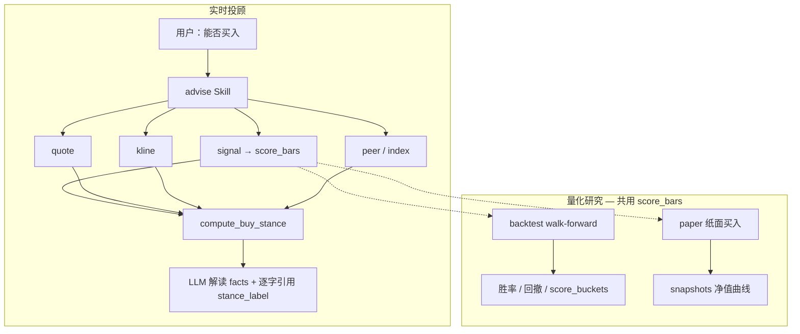
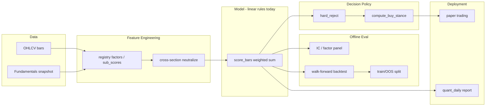

# 量化原理与实现逻辑

[← 文档索引](README.md) · **产品主轴**见 [design-spine.md](design-spine.md) · 入门名词见 [quant-concepts.md](quant-concepts.md) · **Web 面板用法**见 [量化研究台说明书](quant-ui.md) · 策略层抽象见 [strategy-layer.md](strategy-layer.md)

本节说明本项目 **量化研究台** 的设计原理与代码实现路径：数字与结论由 **确定性 Python** 计算，LLM 只解读 JSON，**不得改写** `score` / `stance_label`。各阶段交付物见 [升级规划](roadmap.md)；此处聚焦 **为什么这样设计** 与 **代码里怎么串**。

产品级「数据→信号→因子→倾向→动作」与两条轨，以 **[design-spine.md](design-spine.md)** 为准；本文展开因子权重、hard_reject、stance 阈值与纸面规则细节。

若从 **机器学习** 角度建立心智模型，可先读 [机器学习视角](#机器学习视角如何理解量化)，再对照下文各层实现。

### 总体架构：AI 编排层 vs 量化主轴

```text
┌─────────────────────────────────────────────────────────┐
│  AI 编排层（旁路：Agent 选工具 / 解释 facts）              │
│  · 「是否买入」须逐字引用 advise.stance_label             │
├─────────────────────────────────────────────────────────┤
│  量化主轴（core/backtest + core/signal + research CLI）   │
│  score_bars      → 0~100 短线分 + hard_reject            │
│  compute_buy_stance → 买/观望/试探（规则唯一结论）         │
│  backtest_signal → Walk-forward 历史验证                  │
│  paper           → 模拟持仓 + 净值 snapshots              │
│  store           → 日线本地缓存，保证 evals 可复现         │
└─────────────────────────────────────────────────────────┘
```

典型量化系统链路：**信号 → 回测 → 执行 → 监控**。  
本项目当前做到 **信号 → 回测 → 模拟账户交易**，定位为 **策略验证**；**现行不涉及真实账户交易、不代客下单、不接券商 API**。待策略在回测与纸面验证成熟后，再另立项支持实盘（N6）。产品边界见 [design-spine · 产品边界](design-spine.md#产品边界现行)。

**共享核心**：live 信号、`backtest`、模拟账本 **共用同一套 `score_bars()`**（`core/signal/scorer.py`）；`stance` 是在分数之上的 **第二层规则**；LLM **不在** 数值计算链中。

### 第一层：短线因子引擎（`score_bars`）

**模块**：`core/signal/scorer.py`  
**入口 Skill**：`signal`（观察池）  
**原子函数**：`score_bars(bars, horizon_days, quote?) → dict`

#### 输入 / 输出

| 输入 | 来源 |
|------|------|
| 日线 OHLCV | `skills/common/history.py` → AkShare；失败则 `quote_fallback` |
| 当日涨跌 | `quote.change_raw` 或 bar 推算 |

| 输出字段 | 含义 |
|----------|------|
| `score` | 0～100 综合分 |
| `hard_reject` | 是否硬拒绝（True 则不宜短线参与） |
| `reject_reason` | 硬拒绝原因 |
| `factors` | 动量、量比、ATR% 等子因子 |
| `invalidation` | 失效条件文案（约 -3% 参考位等） |
| `sub_scores` | 动量/量价/相对强弱/波动子分 |

#### 硬过滤（Hard Reject）

不满足时 **score=0 且 hard_reject=True**，不进入观察池排序：

| 条件 | 含义 |
|------|------|
| 日线不足（<2 根） | 无法计算 |
| 近 3 日涨幅 ≥ **15%** | 追高风险 |
| 近 3 日跌幅 ≤ **-12%** | 动能过弱 |

#### 因子加权（实现逻辑）

子分数各自映射到 0～100，再线性加权（权重见 `data/signal_config.json`；当前约 **20** 个注册因子）：

```text
score = 0.28×动量 + 0.20×量价 + 0.16×相对强弱 + 0.08×波动
      + 0.09×反转 + 0.09×流动性 + 0.06×估值 + 0.05×质量
```

| 因子 | 权重 | 实现要点 |
|------|------|----------|
| **动量** | 28% | `mom3`/`mom5` 涨跌幅；0～6% 温和上涨得分高；≥12% 过热降分 |
| **量价** | 20% | `volume_ratio`（近 3 日 / 近 10 日均量）；放量上涨加分，放量下跌扣分 |
| **相对强弱** | 16% | 相对指数超额；无指数时 fallback 到 `last_change` |
| **波动** | 7% | 近 5 日 ATR% 越高，`vol_penalty_score` 越低 |
| **反转** | 9% | 近 3 日 -8%～-2% 温和回调区加分（P45） |
| **流动性** | 9% | 成交额比 `turnover_ratio`（volume×close）（P45） |
| **估值** | 6% | PE/PB 适中区间；缺数据中性 50（P46） |
| **质量** | 5% | ROE / 盈利增速；缺数据中性 50（P46） |

#### score 的用途

`score` 是 **短线综合动能分（0～100）**，由配置因子加权得到；**不是**「会不会涨」的概率，也 **不是** 最终买卖指令。在全链路中的用途：

| 用途 | 模块 | 作用 |
|------|------|------|
| **观察池排序** | `signal` · `rank_candidates` | 过滤 `hard_reject` 与低分（默认 `min_score≥55`），按 score 降序取 Top N |
| **stance 初档** | `compute_buy_stance` | score 区间映射 avoid / wait / probe / buy_light，再经 K 线/peer/index 降档 |
| **回测入场** | `backtest_signal_on_bars` | `score≥min_score` 且非 hard_reject → 模拟买入持有 |
| **纸面跟单** | `core/paper.py` · `simulate_buys` | 观察池项 score 达门槛才纸面买入 |
| **横截面 / 组合** | `cross_section` · 组合回测 | 多股同日比相对强弱；调仓日可中性化后重算 score |
| **研究** | IC 面板 · `score_buckets` | 评估 score 与未来收益关系、分层胜率 |

**不是**：买入 guarantee；LLM 可改写数字；单票绝对真理（截面场景看 **相对排序**）。

ML 视角见 [机器学习视角 · 四件套对照](#四件套对照)。

#### 横截面中性化（P47）

单票 `score_bars` 仍用绝对子分；**watching 横截面排序**与**组合 TopK 回测**在 ≥3 只候选/调仓日时，对各因子 `sub_scores` 做 **z-score**（或配置为 `rank`）映射回 0～100，再按权重重算 `score`。原始分保留在 `score_raw` / `sub_scores_raw`。配置见 `signal_config.json` → `cross_section.neutralize`。

**IC 实验（P50）**：`value` / `quality` 可在 `fundamentals.use_in_ic_experiment=true` 时注入最新基本面快照；IC 仅供方向参考，非 point-in-time。

**组合回测（P51/P52）**：`use_in_backtest=true` 时批量注入基本面；Web「中性化对照」同一 watching 对比 neutralized vs absolute 累计收益。

**量化日报（P54）**：`build_daily_report` 自动生成 `portfolio_neutral_compare_summary`（winner / Δ累计 / 解读），写入 Markdown/HTML 一页摘要。

#### 失效条件（Invalidation）

规则生成 **观察失效参考**，不是自动止损单：

- 最新收盘价 × (1 − 3%) 作为短线失效参考位
- 放量下跌且跌破近 3 日低点 → 降低关注优先级

#### 数据降级

日线拉取失败时 `history.quote_fallback` 构造伪 bar → `data_source=quote_fallback`。  
此时量比/ATR 信息变粗；下游 `compute_buy_stance` 会 **额外降档**，回复须标明「日线不完整」。

---

### 第二层：买卖 stance（`compute_buy_stance` + `advise`）

**模块**：`core/stance.py`（`compute_buy_stance`）、`skills/advise/engine.py`  
**Skill**：`advise` — 内部串联 `quote → signal → kline → peer/index`，输出 **唯一** 买卖结论。

`signal` 回答「短线动能强弱」；**「能不能买」** 由 stance 规则单独合成，LLM **只能引用** `stance_label` 原文。

#### 决策流程（确定性）

```text
1. quote 不可用           → insufficient（信息不足暂不建议操作）
2. signal hard_reject     → avoid（建议观望，暂不买入）
3. 无 score               → insufficient
4. 按 score 基础分档：
     <45  → avoid
     45~55 → wait
     55~68 → probe（建议逢低分批关注但暂不追入）
     ≥68  → buy_light（可考虑轻仓试探，非追涨）
5. 惩罚项：每项向更保守方向降 1 档（最多到 avoid）
     · 当日涨跌 ≤-5%（+2 档）或 ≤-3%（+1 档）
     · K 线 tags 含「大阴」「放量下跌」「破位」等
     · peer 相对同业「偏弱/最弱」
     · index 超额收益 ≤-2%
     · data_source=quote_fallback 或 kline depth=intraday_proxy
6. 输出 stance_code / stance_label / reasons / invalidation / confidence
```

| `stance_code` | `stance_label`（LLM 须逐字引用） |
|---------------|----------------------------------|
| `insufficient` | 信息不足暂不建议操作 |
| `avoid` / `wait` | 建议观望（暂不买入） |
| `probe` | 建议逢低分批关注但暂不追入 |
| `buy_light` | 可考虑轻仓试探（非追涨） |

**与「持仓加减仓」区分**：空仓/新标的「能不能买」→ `advise`；已有仓「减不减、止不止」→ `position` + `position_rules.json`。

---

### 第三层：历史回测（Walk-forward）

**模块**：`core/backtest/engine.py`（`backtest_signal_on_bars`）  
**Skill**：`backtest`（`strategy=signal_v1`）

#### 原理：避免前视偏差

对每个交易日 **T**（从 `min_history` 起至 `n - horizon_days`）：

```text
1. 取窗口 bars[start : T+1]（最多 max_window=30 根，仅用 T 及之前数据）
2. 用截至 T 的 quote 近似（mock change_raw）调用 score_bars()
3. 若 score ≥ min_score 且非 hard_reject：
     · 在 T 日收盘价 entry
     · 持有 horizon_days 后在收盘价 exit
     · 记录 return_pct
4. 默认 non-overlap：T 前进 horizon_days；overlap=True 时 T+1
5. 汇总 _trade_metrics → 胜率、均收益、累计、最大回撤、Sharpe 近似
```

这是 **事件研究 / 固定持有期回测**，不是连续调仓的组合模拟。

#### 基准与分层

| 块 | 函数 / 字段 | 含义 |
|----|-------------|------|
| 买入持有 | `benchmark.buy_hold_period_pct` | 回测区间整段持有收益 |
| 超额 | `excess_vs_buy_hold_pct` | 策略累计 − 买入持有 |
| 指数 | `index_period_pct` / `excess_avg_vs_index_pct` | 每笔同期指数收益（A→沪深300，港→恒生） |
| 分层 | `score_buckets` | 按入场 score（55-64 / 65-74 / 75+ / <55）看均收益与胜率 |

**参数扫描**：`research/backtest_scan.py` 对 `(horizon_days, min_score)` 网格搜索；**易过拟合**，须样本外验证。

#### 已知简化（解读时必须说明）

- 未含手续费、滑点、涨跌停、T+1
- live `signal` 可能 `quote_fallback`，回测用完整日线 → **数据源可能不一致**
- **研究结果 ≠ 实盘建议**

---

### 第四层：纸面账户（模拟执行）

**模块**：`core/paper.py` + CLI `research/paper_run.py` + Web `/api/paper*`  
**数据**：`data/paper.json`（由 `paper.example.json` 初始化，不入 git）

#### 纸面是什么？（给小白）

**一句话**：纸面 = 用**假钱**在电脑里练手的**模拟账户**，**不是**券商里的真实账户。本系统**只做模拟账户交易，用于研究**。

就像在本子上记账：「假如我买了茅台 100 股，现在赚多少」——钱不会真的进出，也不会真的下单。行情可以是网上拉的**真股价**，账户和成交是本地的**假账本**。

| | 真实账户（券商） | 纸面账户（本项目） |
|--|------------------|-------------------|
| 钱从哪来 | 银行卡里的钱 | 电脑里写的「虚拟资金」（如 10 万） |
| 买卖 | 真的成交、扣你的钱 | 只在 `paper.json` 里记一笔 |
| 涨跌 | 真影响你资产 | 只影响模拟净值曲线 |
| 风险 | 会亏真钱 | **不会亏真钱** |

**为什么要有纸面？**

1. **先验证想法**：规则、调仓、做 T 合不合理，先用假钱跑，再谈实盘。  
2. **和「回测」互补**：回测是对着历史 K 线一次性算「假如当时怎样」；纸面是持续存在的「假账户」，可以今天跑、明天再跑，像影子盘。  
3. **安全**：现行全程 **非实盘、不代客下单、不接券商 API**（策略验证阶段）。

**容易混淆的几点**

1. **纸面 ≠ 回测**：回测看历史（引擎内资金曲线，**不必**先有 `paper.json`）；纸面是一直活着的模拟账户。何时需要纸面见 [quant-concepts · 测试类型](quant-concepts.md#3-测试类型何时需要纸面)。  
2. **纸面 ≠ 券商官方模拟盘**：券商模拟更接近真实交易系统；本项目纸面是自己算、自己记账，用来检验投顾/量化规则。  
3. **Watching 与纸面是测同一策略的两种方式**：研究池划定回溯「考试范围」，回测引擎交历史卷；纸面是假钱现场跟考。详见 [quant-concepts.md](quant-concepts.md#watching-与纸面测同一策略的两种方式)。

**怎么用（概念流程）**

```text
初始化纸面 → 系统给一笔虚拟资金（Web「纸面」或 paper_run --init）
     ↓
观察页建仓 → 填每只买多少股，看清花费与剩余现金后确认（Web 唯一开仓入口）
     ↓
模拟页管理 → 加仓 / 减仓 / 清仓；跑观察池打分、记净值
     ↓
可选：按策略调仓 / 做 T
     ↓
看净值曲线与流水 —— 全是模拟账本
```

#### 仓位出处（谁做的决定）

每笔仓位记 `origin`，用来分清哪些是你的判断、哪些是规则的：

| `origin` | 来源 | 写入位置 |
|----------|------|----------|
| `manual` | 观察页建仓（`buy_codes_direct`）、手动加仓（`manual_buy`） | 持仓与成交记录 |
| `strategy` | 按策略调仓（`simulate_buys`） | 同上 |
| `mixed` | 手动建的仓后来被策略加过（`merge_origin`） | 持仓 |

早期记录没有该字段，Web 显示 `—`，不回填臆造值。这样「按策略调仓」可以保留，同时不破坏「模拟以人工为主」的口径。

#### 建仓预演（`plan_buy_codes`）

观察页建仓前先跑一次纯计算的预演：默认按**金额**（每只 2 万，可改）或**仓位%**反算股数，也可按股数 / `shares_by_code` / `amount_by_code` 覆盖。按现价算出每只买多少、合计花多少、建仓后剩多少现金，以及哪些因已持仓 / 取不到行情 / 现金不足买不进。预演标注 `cost_model: zero`（现价、零佣金/滑点/印花税），**不改账户**；`buy_codes_direct` 执行时复用同一份计划。

策略调仓：`POST /api/paper/run` 传 `dry_run=true` 出 `rebalance_report` + `cash_impact`（买入/卖出金额、净现金流、调仓后现金），确认后再正式跑。

#### 日循环（`run_daily_cycle`）

```text
watchlist
  → run_signal_scan()    # SignalHandler 对观察池打分，写 signal_log
  → simulate_buys()      # 可选：按 rules 纸面买入
  → mark_to_market()     # StockAPI 现价 → 市值 / 净值 / 盈亏%
  → append_snapshot()    # 写入 snapshots[]（Web Canvas 净值曲线，保留最近 120 条）
```

#### 纸面买入规则（`simulate_buys`）

| 规则键 | 默认 | 逻辑 |
|--------|------|------|
| `min_score` | 55 | 观察池项 score 不足则跳过 |
| `max_positions` | 20（短线）/ 15（保守） | 持仓数上限；与 StrategySpec `risk` / `paper_rules` 一致 |
| `position_pct` | 0.15 | 单票预算 ≈ 可用现金 × 15% |
| 硬拒绝 | — | `hard_reject=True` 不买 |
| 整手 | — | A 股按 100 股整数 |

**非实盘、不代客下单**；可配合 cron 每日 `paper_run.py --run`。

#### 底仓做 T（模拟，P93）

**模块**：`core/t0/` · CLI `research/t0_backtest_run.py` · Web「预演做T / 确认做T / 做T回测」

| 要点 | 说明 |
|------|------|
| 语义 | A 股 **底仓做 T（T+1）**：正 T 先卖后买；`direction=auto` 时可反 T（先买后卖） |
| 成交 | 默认 **`fill_mode=trigger`**（偏保守）；回测附带 optimistic 上界对照 |
| 门禁 | 振幅不足 / 一字板跳过；阈值可按 ATR% 放大 |
| 纸面 | `POST /api/paper/t0` 默认 **dry_run 预演**，`confirm=true` 才写账 |
| 回测 | 默认 **绑模拟持仓**（可选选中单票）；不再写死茅台 |
| 边界 | **不接实盘**；日线代理非分钟路径；不改变 `advise.stance_label` |

```bash
python3 research/t0_backtest_run.py --code 茅台 --json
# 或 quant(task=t0_backtest) / POST /api/quant/t0-backtest / POST /api/paper/t0
```

---

### 第五层：数据缓存与可复现（`core/store.py`）

数据层全景（采集 / 清洗 / 存储 / 服务 / 监控、PIT 边界、演进）见 **[data-layer.md](data-layer.md)**。本节只记日线缓存与可复现。

**路径**：`data/store/daily/{CN|HK|US}/{code}.json`（不入 git）

```text
fetch_daily_bars()
  → 命中缓存且未过期（默认 24h）→ 读本地
  → 否则 AkShare 拉取 → 写入 + quality 标记（good / thin / empty）
```

**evals**：`evals/run_repro.py` 对 `score_bars` / `backtest_signal` **双跑 SHA256 指纹**；改 scorer 或回测逻辑后应先跑 repro + 单测。

---

### 全链路串联



**Agent 典型问法对照**：

| 用户意图 | 主要模块 | 输出 |
|----------|----------|------|
| 短线评分 / 观察池 | `signal` → `score_bars` | `observation_pool` |
| 能否买入 | `advise` → `compute_buy_stance` | `stance_label` + `facts` |
| 规则历史表现 | `backtest` → `backtest_signal_on_bars` | `metrics` + `benchmark` |
| 模拟跟单净值 | `paper` → `run_daily_cycle` | `snapshots` / Web 曲线 |

---

### 机器学习视角：如何理解量化

**一句话**：量化 ≈ 在金融市场里做 **有监督 / 排序学习**——用历史数据构造特征（因子），预测未来收益或相对排名，用回测做离线评估，再把得分映射成交易规则。本项目当前是 **手工特征 + 线性加权 + 规则决策层**（尚未端到端深度学习），但 ML 的完整问题框架已经具备。

#### 四件套对照

| ML 概念 | 量化含义 | 本项目对应 |
|---------|----------|------------|
| **样本** | 每个 (股票, 日期) 一条观测 | 日线 bar；watching 中某只股票在某交易日 |
| **特征 X** | 因子 | 动量、量比、RS、反转、PE、ROE 等 `sub_scores` |
| **标签 y** | 未来收益 | 持有 `horizon_days` 后的涨跌（回测中计算） |
| **模型 f(X)** | 打分函数 | `score_bars()` 的加权求和 |
| **评估指标** | 预测质量 | IC / IR、胜率、夏普、最大回撤 |
| **推理** | 实盘打分 | live `signal`、观察池排序 |
| **部署** | 执行 | 纸面 `paper`（不接券商 OMS） |

#### 因子 = 特征工程

配置因子加权（registry 白名单，当前约 20 个）：

```text
score = 0.28×动量 + 0.20×量价 + … + 0.05×质量
```

在 ML 术语下：

- **手工特征**：每个因子是人类设计的变换（`mom3`、`volume_ratio`、ATR% 等）
- **线性模型**：权重在 `data/signal_config.json`，相当于 `w·x`
- **隐含非线性**：因子内部的分段规则（如「涨 6% 高分、涨 12% 降分」）类似树模型的阈值

常见演进路径：规则因子（baseline）→ IC 调权 → GBDT / 线性模型学组合 → 序列深度模型。**本项目刻意保留可解释 baseline**，与 ML 里「先 logistic 再试 deep」同一思路。

#### 横截面 = 排序学习（Learning to Rank）

单票 `score_bars` 输出 **绝对分**；watching 多股同日比较，本质是：**给定截面特征，谁未来相对更好？**

| LTR 范式 | 量化场景 |
|----------|----------|
| Pointwise | 每只股独立预测未来收益（回归） |
| Pairwise | 两两比较相对强弱 |
| Listwise | TopK 组合整体收益（列表优化） |

**横截面中性化**（`core/signal/neutralize.py`，P47）在 ML 视角是 **去掉共同因子 / 组内标准化**：

- 对各 `sub_scores` 做 z-score 或 rank，再重算 `score`
- 类似按日 batch normalization，学 **相对 alpha** 而非跟大盘同涨同跌的 **beta**
- 「中性化 vs 绝对分回测对照」（P52）≈ 比较 **是否做 feature normalization 能提升排序质量**

#### IC / IR = 特征—标签相关性

| 量化 | ML 类比 |
|------|---------|
| **IC**（因子与未来收益相关） | 特征与标签相关强度 |
| **IC 不稳定** | 协变量漂移（covariate shift / 非平稳） |
| **IR** = mean(IC) / std(IC) | 跨期信号信噪比 |

`research/factor_report.py` / Web 因子 IC 面板用于 **权重建议**，但 **不自动写** `signal_config.json`——等价于 ML 里看 feature importance 后 **人工** 决定是否改生产配置。

#### 回测 = 带时间约束的离线评估

Walk-forward（第三层）≈ **时间序列交叉验证**，而非 random K-fold：

| 普通 ML CV | 量化回测 |
|-----------|---------|
| 样本常假设 i.i.d. | 金融序列 **非平稳、自相关** |
| 可 shuffle 验证集 | **必须按时间切**（见 `research/split.py` OOS） |
| accuracy / F1 | PnL、回撤、换手、成本 |
| 过拟合 → 验证掉点 | 过拟合 → **回测很美、样本外很差** |

回测模拟的是 **策略 PnL 路径**，更接近 **offline policy evaluation**（强化学习术语），而非单纯「分类准确率」。Policy / Reward / Environment 与本仓库边界见 [rl-layer.md](rl-layer.md)。

#### stance / hard_reject = 决策层（非模型本体）

```text
模型输出（score）  →  业务规则（阈值、拒识、合规）  →  最终动作（stance）
```

| 组件 | ML 类比 |
|------|---------|
| `score_bars` | 回归 / 排序模型输出 |
| `hard_reject` | reject option / 拒识 |
| `compute_buy_stance` | 阈值策略 → 离散动作 {avoid, wait, probe, buy_light} |
| LLM 解读 | **与 serving 分离** 的可解释层，不得改写数值 |

#### 量化 vs 经典 ML 项目的差异

1. **标签噪声大**：短期收益接近随机，需 IC、组合统计，不能只看单次 accuracy。
2. **非平稳**：有效因子会失效 → OOS、rolling IC、`regime` 门控（`core/signal/regime.py`）。
3. **泄露风险**：前视偏差、 survivorship bias、非 point-in-time 基本面 → ML 里的 **label / train-serve leakage**（本项目基本面 IC 实验已注明非 point-in-time）。
4. **目标不仅是预测**：最终优化 **收益 − 成本 − 回撤**，常拆成 预测 → 组合优化 → 执行 三段（组合回测、成本模型见 P7+）。
5. **执行层**：预测正确但成交价不对也无效（纸面模拟 ≠ 真实 OMS）。

#### ML 流程对照本仓库



#### 代码路径 → ML 术语速查

| 用户 / 研究问题 | 代码路径 | ML 术语 |
|----------------|----------|---------|
| 单票短线分 | `core/signal/scorer.py` · `score_bars` | 特征 → 线性模型输出 |
| 观察池 Top N | `core/signal/cross_section.py` | 截面排序 / LTR |
| 去市场共同因子 | `core/signal/neutralize.py` | 组内标准化 |
| 因子有效性 | `research/factor_report.py` | feature–label 相关 / IC |
| 样本外 | `research/split.py` | time-based holdout |
| 历史策略表现 | `core/backtest/engine.py` | offline eval / backtest |
| 能否买入 | `core/stance.py` · `compute_buy_stance` | 阈值策略 / 动作空间 |
| 纸面跟单 | `core/paper.py` | shadow deployment |

#### 心智模型（三句话）

1. **因子 = 特征；score = 模型输出；回测 = 带时间约束的 offline eval。**
2. **横截面中性化 = 去掉市场共同因子，学相对排序而不是绝对水平。**
3. **IC / OOS / 纸面 = 量化里的 train/val/test + shadow deployment，用来对抗过拟合与非平稳。**

更 ML 化的演进（未默认开启）：GBDT 学因子组合、序列模型吃 raw bars、组合层均值-方差优化——均可在现有 **特征 / 评估 / 部署分离** 架构上增量接入。详见 [为何不用拟合模型](#为何不用拟合模型线性回归--复杂模型)。

#### 为何不用拟合模型（线性回归 / 复杂模型）

当前 **生产决策链** 是：`score_bars`（固定权重线性加总）→ `compute_buy_stance`（阈值规则）→ LLM 只解读 JSON。**没有**用历史收益拟合 β 的 OLS/Ridge，也 **没有** GBDT/神经网络 end-to-end 荐股。

| 层级 | 现在是什么 | 不是什么 |
|------|------------|----------|
| **score** | 手工因子 + 配置权重加总 | 训练出来的 `y = Xβ + ε` |
| **stance** | 规则分档 + 降档 | 分类器/回归直接输出「买/卖」 |
| **IC/权重建议** | 评估与 diff 建议 | 自动 overwrite `signal_config.json` |

**刻意不用（现阶段）的主要原因**：

1. **产品契约**：「能否买」须 **逐字引用 `advise.stance_label`**；黑盒模型输出与合规话术难对齐（见 [quant-upgrade.md · 升级原则](quant-upgrade.md#升级原则)）。
2. **可解释与审计**：规则因子 + `factor_contrib` 可逐条说明；深度模型需额外 SHAP/版本治理。
3. **数据未就绪**：live 可能 `quote_fallback`、基本面为 **snapshot 非 point-in-time** → 拟合易 **前视偏差 / train-serve 不一致**。
4. **金融噪声与非平稳**：短期收益标签噪声大；有效因子会失效 → 需滚动 OOS + 监控，运维成本高。
5. **目标不仅是预测**：还要成本、换手、回撤；预测准 ≠ 赚钱。
6. **工程顺序**：路线图 **先一致性、再复杂度**——IC/OOS/TopK 回测基建先稳，再考虑拟合模型。

**与线性回归的关系**：`score` 在 **形式** 上像固定权重的线性组合，但 **权重不是**从截面回归估计的；工业上的截面回归还需 rolling train、PIT 面板、模型版本与 stance 映射，尚未默认开启。

**何时值得引入拟合模型**（未来可选，非 P6～P80 默认）：

| 前置条件 | 说明 |
|----------|------|
| live/backtest 同源 | 同一 bars、同一 fundamentals PIT |
| 自动化 OOS | 滚动 train → validate → 冻结 artifact |
| 决策仍分层 | 模型产出 **排序/score**，买卖仍走 stance 或显式策略层 |
| 人工上线 | 权重/模型 **不自动写** 生产配置 |
| 产品定位允许 | 从「规则投顾」扩展到「研究台 + 可选 model blend」 |

**演进路径（文档级，未默认实现）**：

```text
规则 score（当前）→ IC 调权 → 截面线性回归 score_ml → GBDT blend → 序列模型（需 eval 证明增量）
```

工业级因子库规模见 [与专业量化系统的差距](#与专业量化系统的差距)；工业常见 **候选因子数百～数千、生产 alpha 几十级**，与是否使用拟合模型是正交问题。分类对照见 [工业常见因子分类](#工业常见因子分类对照本仓库)。

---

#### 工业常见因子分类（对照本仓库）

工业量化通常把 **alpha 因子**（选股/排序）与 **risk 因子**（Barra 风格：行业、规模、价值、动量等暴露）分开维护；候选库可达 **数百～数千**，经 IC/IR、相关性去冗、样本外验证后，生产 alpha 常见 **几十级**。下表为常见分类与本项目 **规则因子库（约 20）** 的对照（非 exhaustive）：

| 类别 | 工业常见示例 | 本项目 |
|------|-------------|--------|
| 价量 / 微观结构 | 换手率、Amihud、买卖价差、订单不平衡 | `volume_price`、`liquidity`、`amihud`；`money_flow`（OHLCV **proxy**，真净流入可注入） |
| 动量 / 趋势 | 1/3/12 月收益、52 周高点距离、均线斜率 | `momentum`、`ma_slope`、`technical_pattern`、`weekly_confirm`、`idio_momentum` |
| 反转 | 短期反转、隔夜反转 | `reversal`、`gap_risk` |
| 波动 / 风险 | 历史波动、Beta、下行波动、ATR | `volatility` |
| 基本面价值 | EP/BP/CFP、盈利收益率 | `value`、`earnings_yield`（PIT `as_of` 可用） |
| 基本面质量 / 成长 | ROE、毛利率、增速 | `quality`（ROE）、`growth`、`dividend`、`size` |
| 另类 / 事件 | 舆情、供应链、卫星、ESG | `alt_sentiment`（标题词表；小权重） |
| 风险模型（Barra） | 行业/国家/风格暴露、特异收益 | 横截面 **z-score** + **industry/size residual**（默认开） |

**规模对照**：工业 **候选 >> 生产**；本项目固定 **registry 白名单 + 配置权重**，IC / 截面相关 / `factor_ols` 仅供 **研究对比**，不自动扩库或写配置。

研究向 OLS 实验（对比 `signal_config.weights`，不写生产配置）：

```bash
python3 research/factor_ols_run.py --code 茅台 --json
# 或 Agent / quant(task=factor_ols)
```

---

### 代码模块索引

| 职责 | 路径 |
|------|------|
| 因子打分 | `core/signal/scorer.py` — `score_bars` |
| 模拟账本 | `core/paper.py` — 读写 `paper.json`（对话 position 默认） |
| 单票评分 | `core/signal/score_stock.py` — Signal/Position 共用 |
| 事实采集 | `core/facts.py` — `collect_stock_facts` |
| 买卖管线 | `core/advise.py` — `evaluate_buy_advice` |
| 买卖 stance | `core/stance.py` — `compute_buy_stance` |
| 持仓 + stance | `core/position.py` — `attach_stance_to_advice`（position 参数 `include_stance`） |
| Walk-forward 回测 | `core/backtest/engine.py` |
| 参数扫描 | `research/backtest_scan.py` |
| 日线缓存 | `core/store.py` |
| 纸面账户 | `core/paper.py` |
| 底仓做 T | `core/t0/` — 日线代理模拟 |
| 信号可复现 evals | `evals/run_repro.py` + `evals/repro_fixtures.json` |
| Agent 约束 | `agent/prompts.py` — `BUY_QUESTION_HINT`；`agent.py` 注入买入提示 |
| 因子配置 | `data/signal_config.json` + `core/signal/config.py` |
| 因子子模块 | `core/signal/factors/*` |
| 市场门控 | `core/signal/regime.py` |
| 成本模型 | `core/backtest/costs.py` |
| IC 报告 | `research/factor_report.py` |
| OLS 实验 | `quant/research/factor_ols.py` · `research/factor_ols_run.py` |
| OOS 切分 | `research/split.py` |
| 报告导出预览 | `quant/services/quant_report_export.py` — Web daily 后自动 Markdown 导出预览 + TOC |
| 规则 / LLM 解读 | `quant/services/quant_interpret.py` — `offline: true` → `source=rule_based` |

### 回测成本 / 撮合方法论脚注（V1）

| 项 | 本仓库做法 | 诚实边界 |
|----|------------|----------|
| 佣金 + 印花税 | `simple_cn`（默认进组合回测与纸面）；`cost_compare` 对照 `zero` | 非券商实时费率表 |
| 冲击 | `estimate_impact_cost` 按成交额/日均额近似 bps；验证报告可分列 | 非盘口冲击模型 |
| 撮合 | T+1 · 板别涨跌停近似 · 跌停延后卖（`skipped_limit*` / `exit_deferred`） | **非**交易所撮合引擎 |
| 回测–纸面落差 | `fit_gap` 启发式（成本 · 宇宙 · 频率 · 数据源）+ Corr/TE | 需真实日更样本才可解释 |
| 同策略对照 | 验证包导出须带 `cost_model` 版本；五问含成本假设 | 禁止口头归因「市场变了」而无结构字段 |

---

> **P6～P22 升级**详见 [quant-upgrade.md](quant-upgrade.md)；一页总览见 [quant-summary.md](quant-summary.md)；定时任务见 [quant-ops.md](quant-ops.md)。

---

### 与专业量化系统的差距

完整北极星定义见 **[design-spine · 产品北极星](design-spine.md#产品北极星)**；能力地图对照（专业栈 vs 本仓库采纳目标 vs 现状）见 **[能力地图](design-spine.md#能力地图六大模块)**（旧锚点仍可用）。下表为因子/信号层摘要：

| 维度 | 本项目 | 专业量化（能力地图对照） |
|------|--------|------------------------|
| 因子 | 规则因子 + IC 面板 + 横截面中性化（基本面非 point-in-time） | 大规模因子库 + point-in-time + 自动化 alpha 挖掘 |
| 信号 | 加权 + hard_reject + stance 降档 | 多策略组合、优化器 |
| 回测 | 单票/组合 + 成本/撮合近似 + 简化归因 | 事件驱动、冲击模型、完整 Brinson/因子归因 |
| 执行 | 纸面 JSON | OMS、券商 API |
| 风控 | 纸面止损/仓位上限 + 行业限额 + regime（详见 [risk-layer.md](risk-layer.md)） | 实时止损、VaR、限额、多风险因子 |
| 决策 | stance 规则 + LLM 解读 | 纯代码为主 |


---
