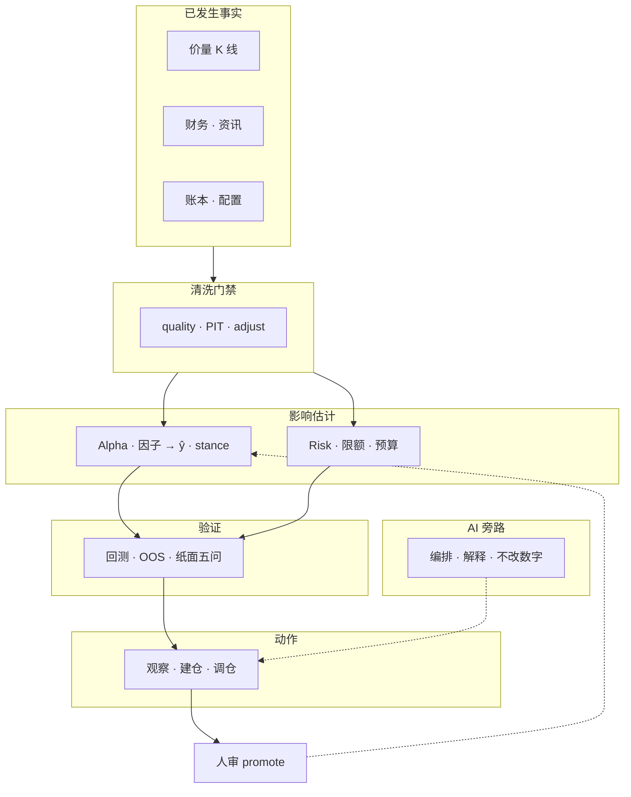
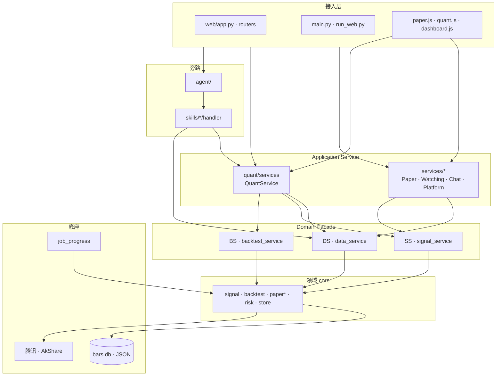

# 系统架构文档

[← 文档索引](README.md) · 产品主轴见 [design-spine](design-spine.md) · 命名约定见 [architecture · Service 命名约定](architecture.md#service-命名约定) · 目录树见 [structure](structure.md)

**版本**：2026-08-22  
**定位**：本地 **策略验证** 单体（量化研究 + 模拟账本 + AI 编排）；不接实盘 OMS。

---

## 1. 系统定位

| 做 | 不做 |
|----|------|
| 观察名单、历史回测、纸面模拟买卖与调仓 | 真实券商下单、代客交易 |
| 用真实行情做研究与盯市 | 保证收益、持牌投顾 |
| AI 编排与解释（不改数字） | 微服务 / Redis / 全站 SPA |

**产品主路径**：观察 → 模拟（纸面）→ 回溯（研究台）。对外称「模拟」，内部 canonical 名 `paper`。

**因果主轴**（业务）：

```text
已发生事实 → 清洗门禁 → Alpha/Risk 估计 → 验证（回测·纸面）→ 动作 → 人审 promote
```

**工程主轴**（实现）：

```text
接入 → Application Service → Domain Facade（DS/SS/BS）→ core → 存储 / 外部源
旁路：Agent → Skills → 同上门面（LLM 只解释，不改 score/stance）
```

---

## 2. 架构图

### 2.1 业务逻辑框架



### 2.2 系统工程分层



### 2.3 请求主路径

```text
① 纸面 / 观察
   UI → /api/paper|watching → PaperService / WatchingService
        → DS + SS + core.paper* → bars.db / paper.json

② 量化研究台
   UI → /api/quant/* → QuantService (Mixin)
        → DS / SS / BS + quant/research → Job 轮询

③ AI 对话
   Chat → Agent (FC≤5) → Skill handler → DS/SS/BS/QS
        → 自然语言解释（不改 score / stance_label）
```

### 2.4 两类 Service（命名）

| 文档叫法 | 代码落点 | 职责 |
|----------|----------|------|
| **Application Service** | `services/*` · `QuantService` | 用例组装；Web/CLI API 边界 |
| **Domain Facade** | `core/data_service` · `signal_service` · `backtest_service` | DS 读 / SS 分 / BS 回测；单一领域出口 |

详见 [architecture · Service 命名约定](architecture.md#service-命名约定)。

---

## 3. 分层模块说明与代码组成

### 3.1 接入层（Access）

**功能**：HTTP/CLI/WebSocket 入口；页面路由；静态资源；请求校验与依赖注入。

| 组件 | 路径 | 说明 |
|------|------|------|
| Web 应用 | `web/app.py` | FastAPI 主应用，挂载 routers |
| 启动 | `run_web.py` | Uvicorn 启动 |
| CLI | `main.py` | 命令行对话与研究入口 |
| 路由 | `web/routers/` | 按域拆分 API（见下表） |
| 页面拼装 | `web/page_html.py` | 服务端 HTML 模板 |
| 前端编排 | `web/static/js/` | 原生 JS 模块（无 Node 构建） |
| Schema | `web/schemas/` | Pydantic 请求/响应模型 |
| 依赖 | `web/deps.py` | 服务实例注入 |

**Routers 组成**：

| Router | 路径 | 主要 API 前缀 |
|--------|------|---------------|
| `meta` | `web/routers/meta.py` | 健康、版本、静态元数据 |
| `chat` | `web/routers/chat.py` | `/api/chat` 会话 |
| `paper` | `web/routers/paper.py` | `/api/paper` 模拟账本 |
| `watching` | `web/routers/watching.py` | `/api/watching` 观察池 |
| `strategy` | `web/routers/strategy.py` | 策略配置 |
| `daily` | `web/routers/daily.py` | `/api/daily` 日报编排 |
| `quant` | `web/routers/quant.py` | `/api/quant` 研究台主路由 |
| `quant_config` | `web/routers/quant_config.py` | 信号/策略配置 |
| `quant_research` | `web/routers/quant_research.py` | 因子/OLS/截面研究 |
| `quant_cluster` | `web/routers/quant_cluster.py` | 分组/簇池 |
| `quant_backtest` | `web/routers/quant_backtest.py` | TopK/组合回测 |
| `quant_score` | `web/routers/quant_score.py` | 打分预览 |
| `quant_dashboard` | `web/routers/quant_dashboard.py` | 研究台仪表盘 |
| `evals` | `web/routers/evals.py` | Golden eval |
| `platform` | `web/routers/platform.py` | Job/Memory/Decision 等平台 API |
| `live_ws` | `web/routers/live_ws.py` | WebSocket `/ws/live` |

**前端主模块**：

| 文件 | 职责 |
|------|------|
| `paper.js` | 模拟页总编排（子模块在 `paper/`） |
| `quant.js` | 研究台总编排（子模块在 `quant/`） |
| `dashboard.js` + `dashboard_api.js` | 首页仪表盘 |
| `chat.js` | 对话 UI |
| `watching_table_island.js` | 观察池表格岛 |
| `api_client.js` | 统一 fetch 封装 |
| `live_ws.js` | 实时推送 |

---

### 3.2 Application Service 层

**功能**：把多个领域能力组装成**产品用例**；对上稳定 API，对下调 Domain Facade 与 core。

#### `services/` — 产品闭环

| 模块 | 路径 | 功能 |
|------|------|------|
| PaperService | `paper_service.py` + `paper_account.py` / `paper_jobs.py` / `paper_trades.py` / `paper_helpers.py` | 纸面账户、买卖、调仓 Job、策略晋升 |
| WatchingService | `watching_service.py` | 观察名单 CRUD、建仓入口 |
| ChatService | `chat_service.py` | Web/CLI 会话、Agent 调用 |
| DailyService | `daily_service.py` | 每日任务（纸面 + eval + 量化） |
| EvalService | `eval_service.py` | Golden eval 运行 |
| PlatformService | `platform_service.py` | Job / Memory / Decision / Feedback / Schedule / Prefill |
| position_stance | `position_stance.py` | 持仓 stance 摘要 |

#### `quant/services/` — 研究台

| 模块 | 路径 | 功能 |
|------|------|------|
| QuantService | `quant_service.py` | Mixin 门面入口 |
| Config | `quant_service_config.py` | 策略/信号配置列表 |
| Follow | `quant_service_follow.py` | ① 模拟（T0 研究；执行归 PaperService） |
| Replay | `quant_service_replay.py` | ② 回溯（TopK 回测、中性化对照） |
| Compare | `quant_service_compare.py` | ③ 持仓联动摘要 |
| Factors | `quant_service_factors.py` | 因子面板、IC、OLS、截面 |
| Ops | `quant_service_ops.py` | 日报、导出、解读、watching 运维 |
| Portfolio | `quant_service_portfolio.py` | 组合回溯兼容入口 |
| 报告 | `quant_report_export.py` · `quant_report_index.py` · `quant_interpret.py` | Markdown/HTML 导出、归档、LLM 解读 |
| 桥接 | `portfolio_quant_bridge.py` · `signal_config_preview.py` · `action_map.py` | 持仓↔量化联动、配置 diff 预览、动作映射 |

---

### 3.3 Agent 与 Skills（旁路）

**功能**：自然语言意图 → 选工具 → 调 handler → 拿 JSON 事实 → LLM 组织话术。**不得改写** `score` / `stance_label`。

#### `agent/`

| 模块 | 路径 | 功能 |
|------|------|------|
| Agent | `agent.py` | 多轮 Function Calling（≤5 轮） |
| LLM | `llm_client.py` | 通义千问 HTTP 客户端 |
| Prompts | `prompts.py` | 系统提示、免责声明 |
| Registry | `registry.py` | 工具注册与 handler 查找 |
| Routing | `routing.py` | 参数准备、结果 enrich |
| Contracts | `contracts.py` | SkillHandler 协议 |

#### `skills/` — 13 个 Agent 工具

| Skill | 路径 | 功能 |
|-------|------|------|
| quote | `skills/quote/` | 实时行情（腾讯 qt） |
| compare | `skills/compare/` | 多股对比 |
| screen | `skills/screen/` | A 股条件选股 |
| signal | `skills/signal/` | 短线观察池打分 |
| backtest | `skills/backtest/` | 信号规则回测 |
| quant | `skills/quant/` | 量化研究台（委托 QuantService） |
| kline | `skills/kline/` | 日 K 形态 |
| fundamentals | `skills/fundamentals/` | 基本面 |
| news | `skills/news/` | 资讯标题 |
| advise | `skills/advise/` | 买卖倾向建议 |
| position | `skills/position/` | 持仓查询 |
| peer | `skills/peer/` | 同业对比 |
| index | `skills/index/` | 指数行情 |

**支撑模块**：

| 模块 | 路径 | 功能 |
|------|------|------|
| ports_bind | `skills/ports_bind.py` | 行情/信号适配器注入 core.ports |
| common | `skills/common/` | `quote_api` · `history` · AkShare 锁 |
| 引擎（非 FC 工具） | `macro/` · `announcement/` · `market_sentiment/` | 宏观/公告/情绪，供 core 或研究调用 |

---

### 3.4 Domain Facade 层（DS / SS / BS）

**功能**：领域能力的**唯一对外出口**；封装质量门禁、信封类型、生产/研究双轨。

| 门面 | 模块路径 | 实现包 | 主要 API |
|------|----------|--------|----------|
| **DS** | `core/data_service.py` | `core/data/` | `get_quote` · `get_bars` · `bars_and_source` · `summarize_data_quality` |
| **SS** | `core/signal_service.py` | `core/signal/` | `score_one` · `rank_cross_section` · `rank_cluster_pools` |
| **BS** | `core/backtest_service.py` | `core/backtest/` | `run_topk` · `run_signal_backtest` |

**端口与绑定**：

```text
DS → core/ports/market.py → skills/ports_bind.py → skills/common/
SS → core/signal/service.py → scorer · factors · config · gate
BS → core/backtest/service.py → engine · topk_backtest · topk_weights
```

---

### 3.5 领域层 `core/`

**功能**：确定性业务逻辑；**无 LLM、无 HTTP Handler**。live / 回测 / 纸面共用同一套规则。

#### 信号与打分 `core/signal/`

| 子模块 | 功能 |
|--------|------|
| `service.py` | SignalService 实现 |
| `scorer.py` · `score_stock.py` | 单票打分主路径 |
| `factors/` | 价值、动量、波动、股息等因子 |
| `config.py` | `signal_config` 读写 |
| `gate.py` | ŷ 生产门禁、scale 推断 |
| `cross_section_batch.py` | 截面批量 |
| `cluster_live_audit.py` | 分组 live 审计 |

#### 回测 `core/backtest/`

| 子模块 | 功能 |
|--------|------|
| `service.py` | BacktestService 实现 |
| `engine.py` | 回测引擎 |
| `topk_backtest.py` | TopK 等权/加权回测 |
| `topk_weights.py` | 权重计算（按用例拆分） |
| `matching.py` | 成交撮合规则 |
| `strategies/` | 策略模板 |

#### 纸面模拟 `core/paper*.py`

| 模块 | 功能 |
|------|------|
| `paper.py` | 账本 IO、五问、signal_scan |
| `paper_exec.py` | 盯市、手动买卖 |
| `paper_cycle.py` | 调仓日循环 |
| `paper_rebalance*.py` | 调仓编排、匹配、门禁、预取 |
| `paper_sizing.py` · `paper_costs.py` | 仓位与成本 |
| `paper_open_fill.py` | 开仓成交 |

#### 风控 `core/risk/`

| 模块 | 功能 |
|------|------|
| `checks.py` | 调仓前门禁 |
| `budget.py` · `exposure.py` | 风险预算与敞口 |

#### 观察与策略

| 模块 | 功能 |
|------|------|
| `watching_store.py` · `watching_insights.py` · `watching_health.py` | 观察池存储与健康 |
| `stance.py` · `advise.py` · `position.py` | 倾向与建议 |
| `strategy.py` · `strategy_monitor.py` | 策略定义与监控 |
| `north_star.py` · `north_star_pro.py` | 北极星指标 |

#### 数据与存储

| 模块 | 功能 |
|------|------|
| `store.py` | 缓存读写；`INVESTMENT_BARS_BACKEND=sqlite\|json` |
| `store_bars_sqlite.py` | 日线/分钟线 SQLite WAL |
| `data/service.py` · `data/gate.py` | MarketDataService 与质量门禁 |
| `data_pit.py` · `data_coverage.py` · `data_quality_center.py` | PIT、覆盖率、质量中心 |
| `paths.py` · `env.py` | 路径与环境变量 |

#### 平台与运行时

| 模块 | 功能 |
|------|------|
| `job_progress.py` | 统一 Job 槽（paper · ols · chat · …） |
| `schedule_jobs.py` | 定时任务 |
| `decision_record.py` · `memory_store.py` · `feedback_suggest.py` | D 轨平台能力 |
| `observation.py` · `order_prefill.py` | 观察记录、订单预填 |

#### 研究内核（core 侧）

| 模块 | 功能 |
|------|------|
| `core/research/` | OLS fit、walk-forward、rem 头等研究算法 |
| `t0/` | 做 T 回测内核 |

---

### 3.6 量化研究 `quant/`

**功能**：研究台专属逻辑、报告、Agent quant Skill；**不替代** core 真相源。

| 目录 | 组成 | 功能 |
|------|------|------|
| `quant/services/` | 见 §3.2 | Application Service |
| `quant/research/` | `factor_ols_clusters.py` · `cluster_*.py` · `portfolio_*.py` · `t0_backtest.py` | 因子 OLS、分组、组合对照 |
| `quant/ops/` | daily preset、健康检查 | 运维脚本支撑 |
| `quant/skill/` | `engine.py` + handler | Agent `quant(task=...)` 引擎 |

---

### 3.7 研究 CLI `research/`

**功能**：薄命令行入口；逻辑在 `core/` / `quant/research/`；读数经 DS。

| 示例脚本 | 功能 |
|----------|------|
| `cross_section_run.py` | 截面排序导出 |
| `portfolio_backtest_run.py` | 组合回测 CLI |
| `t0_backtest_run.py` | 做 T 回测 CLI |
| `quant_export_run.py` | 量化报告导出 |
| `cache_cli.py` | 缓存管理（含 `--clear`） |

---

### 3.8 数据与持久化 `data/`

| 类型 | 路径 | 内容 |
|------|------|------|
| 模拟账本 | `data/paper.json` | 持仓、资金、流水 |
| 观察池 | `data/watching.json` | 观察名单 |
| 信号配置 | `data/signal_config.json` | 因子权重、阈值 |
| 行情缓存 | `data/store/bars.db`（默认）或 `data/store/daily/` | SQLite WAL 或 JSON |
| Job 状态 | `data/jobs/*.json` | 长任务进度与结果 |
| 决策/记忆 | `data/decisions.jsonl` · `data/memory.json` | 平台 D 轨 |
| 报告 | `data/reports/` | 量化日报归档 |
| 配置备份 | `data/config_backups/` | signal_config 历史 |

环境变量：`INVESTMENT_STORE_DIR` · `INVESTMENT_BARS_BACKEND`。见 [data-layer](data-layer.md) · [sqlite-migration](sqlite-migration.md)。

---

### 3.9 质量保障

| 目录 | 功能 |
|------|------|
| `tests/` | `unittest` 回归（store · job · backtest · quant · web API …） |
| `evals/` | Golden 用例与 repro 脚本 |
| `scripts/` | 迁移、日报 shell、launchd 示例 |

---

## 4. 模块依赖规则

```text
允许：
  routers → Application Service → Domain Facade → core → store/ports
  Agent → Skills → Application Service 或 Domain Facade
  core 内部模块互调

禁止：
  core import web / agent / llm
  router 直接 import core 深层实现（应经 Service/Facade）
  LLM 改写 score / stance_label 或静默写 signal_config
  Application Service 绕过 DS/SS/BS 直碰 store（读口由 DS 封装）
```

---

## 5. 技术栈摘要

| 层 | 选型 |
|----|------|
| 后端 | Python 3.10+ · FastAPI · Uvicorn |
| 前端 | 原生 HTML/CSS/JS（ES modules）· Lightweight Charts |
| AI | 通义千问（DashScope HTTP）· 自研 Agent + Skills |
| 行情 | 腾讯 qt · AkShare · pandas |
| 存储 | JSON 账本/配置 · SQLite WAL（bars 默认） |
| 任务 | 进程内 Job 槽 + JSON 落盘；AkShare ProcessPool |

---

## 6. 入口与验收

| 入口 | 命令 / URL |
|------|-------------|
| Web | `python run_web.py` → `http://127.0.0.1:8000` |
| CLI | `python main.py` |
| 单元测试 | `cd investment && python3 -m unittest discover -s tests` |
| 工程轨验收 | `python3 -m unittest tests.test_store tests.test_a2_job_runtime tests.test_a3_backtest_service` |

---

## 7. 相关文档

| 文档 | 内容 |
|------|------|
| [design-spine.md](design-spine.md) | 产品因果链、北极星、能力地图 |
| [architecture.md](architecture.md) | 控制论视角、金字塔、技术栈详表 |
| [structure.md](structure.md) | 目录树与 Canonical 入口 |
| [data-layer.md](data-layer.md) | 存储选型与 DataService 契约 |
| [quant.md](quant.md) | 量化因子、IC、OLS 细节 |
| [quant-ui.md](quant-ui.md) | Web 主路径与 UI 契约 |
| [framework-review.md](framework-review.md) | 工程债与合理性分析 |
| [architecture-upgrade-a.md](architecture-upgrade-a.md) | 工程结构轨 A0–A4 |

---

## 8. 架构图（ASCII 速查）

```text
                    ┌─────────────────────────────────────┐
                    │  Web / CLI / WS（接入）              │
                    └──────────────┬──────────────────────┘
                                   │
           ┌───────────────────────┼───────────────────────┐
           ▼                       ▼                       ▼
   ┌───────────────┐      ┌───────────────┐      ┌───────────────┐
   │ services/*    │      │ QuantService  │      │ Agent+Skills  │
   │ Application   │      │ Application   │      │ （旁路）       │
   └───────┬───────┘      └───────┬───────┘      └───────┬───────┘
           │                      │                      │
           └──────────────────────┼──────────────────────┘
                                  ▼
                    ┌─────────────────────────────────────┐
                    │  DS · SS · BS（Domain Facade）       │
                    └──────────────┬──────────────────────┘
                                   ▼
                    ┌─────────────────────────────────────┐
                    │  core（signal · backtest · paper · risk）│
                    └──────────────┬──────────────────────┘
                          ┌────────┴────────┐
                          ▼                 ▼
                   bars.db / JSON      腾讯 / AkShare
```
