# 架构总览

[← 文档索引](README.md) · 架构图与命名约定见下文；目录结构见 [§ 代码目录结构](#代码目录结构)；依赖边界见 [§ 六边形架构](#六边形架构ports--adapters)

### 定位

QuantLab 是 **量化研究与模拟交易系统**（CLI + Web + 研究台），融合 **AI** 做意图理解、工具编排与结果解释：核心是信号评分、策略规则、回测与**模拟账户**；大模型不替代领域计算。  
**不是**持牌投资顾问产品；**现行定位 = 策略验证**（研究台 + 模拟账户），**不涉及真实账户交易、不代客下单**；模拟盈亏**不保证收益**。待策略验证成熟后再评估实盘（N6）。产品边界见 [design-spine · 产品边界](design-spine.md#产品边界现行)。

**产品核心设计主轴**（现行逻辑链 + **[产品北极星](design-spine.md#产品北极星)** + [能力地图](design-spine.md#能力地图六大模块)）见 **[design-spine.md](design-spine.md)**。下文控制论与工程分层是实现结构；产品叙事以设计主轴为准。运行时选型见 **[技术栈](#技术栈)**。

### 设计原则

1. **事实与结论分离**：价格、评分、财务字段只来自 Skill / `core` JSON；LLM 在事实之上组织解释与编排，不得编造数字。  
2. **工具即边界**：每个能力对应一个 `skills/<name>/` + `tool_config.json`，由 Function Calling 暴露。  
3. **可组合**：复杂问题靠多轮/多工具串联（如 `quote + kline + signal`），话术须与工具事实一致。  
4. **可降级**：日线失败时 `quote_fallback` / `depth=intraday_proxy`，且须在回复中标明「日线不完整」；港股基本面尽量给 PE/市值，失败则写清缺口。  
5. **深度分析模式**：问「分析 / 能否买入」时 prompts 要求多层结构（K 线/动能/相对强弱/基本面资讯/情景），篇幅放宽至约 700～1100 字。买入依据详见下文 **「判断是否买入的依据是什么」**。  
6. **风险披露**：提示词要求附带风险声明 + Agent 自动补 `DISCLAIMER`；禁止保证收益与代客下单。

### 控制论视角：感知–决策–执行–反馈闭环

剥离业务细节后，本系统可抽象为 **Agent 闭环**：感知外部状态 → 推理决策 → 调用工具执行 → 用结果反馈改进。  
工程上的「接入 / 编排 / Skill / 领域」分层是**实现结构**；下图是**控制论结构**——两者对照，不互相替代。

**抽象回路**

```text
Input (State) → Policy (Model) → Action (Tool) → Reward (Feedback) → Update (Learning)
```

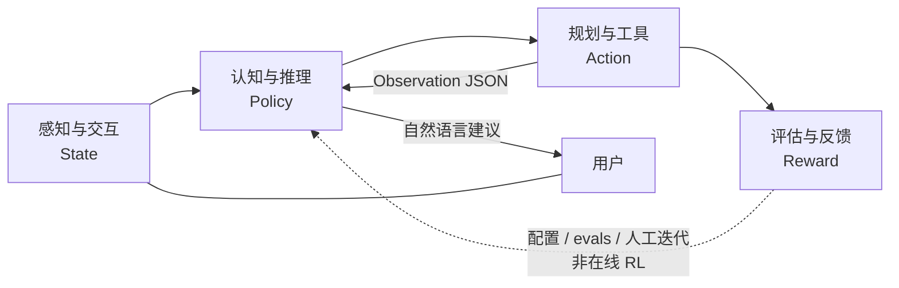

| 逻辑层 | 职责（抽象） | 本仓库落点 | 成熟度 |
|--------|--------------|------------|--------|
| **感知与交互** | 降低信息熵：自然语言 → 意图；行情/财报/资讯 → 可计算结构 | Web/CLI 接入；`skills/quote|fundamentals|news|…`；会话与右侧结果面板 | **强**：异构接入 + Skill JSON 标准化。弱：完整知识图谱、真多模态 |
| **认知与推理** | 高维模式映射：上下文、拆解子任务、解释策略与回测结果 | `agent/agent.py` · `prompts.py` · `llm_client.py` · 多轮 Function Calling | **强**：意图与编排。弱：显式长短期记忆库、可审计因果图 |
| **规划与工具** | 能力原子化：高层目标 → Skill 调用链 | `agent/registry` · `skills/*/tool_config.json` · Handler → `core/` / engine | **最扎实**：与原则「工具即边界」一致 |
| **评估与反馈** | 用结果校正策略：回测指标、仿真、回归校验 | `core/backtest` · 纸面账户 · `evals/` 黄金用例 · 量化报告 | **半闭环**：有仿真与 checklist；**不是**在线 RL 自动调权 |

**与工程分层的对照**

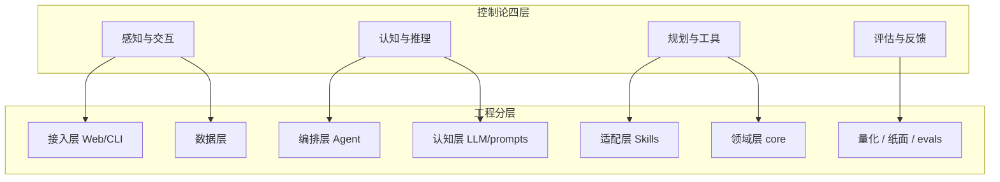

**本仓库特有的硬边界（迁移到其它垂直域时也应保留）**

1. **事实与建议分离**：价格、评分、财务等数字只来自 Skill / `core` JSON；LLM 只在事实之上组织建议，不得编造。  
2. **执行不含实盘下单**：Action 止于查询、规则建议、回测与纸面仿真；Reward 用于研究与产品迭代，不驱动自动成交。  
3. **Update 当前以人审为主**：改 `signal_config` / 规则 / prompts、跑 evals 与纸面，而不是把盈亏直接 backprop 进模型权重。  
   骨架 API 见路线图 **D1–D6**（`/api/jobs` · `/api/memory` · `/api/decisions` · `/api/feedback/suggest` · `/api/schedule/run` · `/api/orders/prefill`）。

该抽象同样适用于「数据分析 + 辅助决策」类垂直域（医疗、法律等）：换的是领域 Skill 与评估指标，闭环形态不变。实现扩展时优先新增原子工具与评估用例，而不是把逻辑堆进 Prompt。

### 产品视角：四层金字塔与决策链路

控制论四层回答「智能体如何闭环」；本节回答「**量化交易产品**如何分层、覆盖哪些能力、代码如何抽象」。与 [design-spine.md · 路线图](design-spine.md#能力评估与升级规划路线图视角) 的能力画像对照阅读：下文 **已落地** 表示仓库内可用，**规划中** 表示目标形态而非现状。

产品本质与模块级因果链（已发生 → 影响估计 → 验证 → 动作）见 **[design-spine · 因果链](design-spine.md#因果链已发生--影响估计--动作)**。

#### 1. 四层金字塔（数据 / 认知 / 决策 / 反馈）

数据、决策与执行解耦；自下而上为能力依赖方向。

```text
            ┌─────────────────────┐
            │  反馈进化层          │  回测·纸面·evals·（远期 RL）
            ├─────────────────────┤
            │  决策执行层          │  stance / 持仓规则 / 纸面·做 T（非实盘）
            ├─────────────────────┤
            │  认知推理层          │  LLM + Agent 编排 + 规则引擎
            ├─────────────────────┤
            │  数据感知层          │  Skills + AkShare / 行情 / 本地 JSON
            └─────────────────────┘
```

| 金字塔层 | 产品含义 | 与控制论 / 工程对照 | 本仓库现状 |
|----------|----------|---------------------|------------|
| **数据感知** | 眼睛与耳朵：行情、财务、宏观、资讯等接入与清洗 | 感知层；数据层 + Skills | **已落地**：日线/现货、基本面、资讯标题等。弱：Tick 全量、宏观全集、社交舆情、完整研报 |
| **认知推理** | 大脑：清洗、情感/事件理解、逻辑推演 | 认知层；LLM + prompts | **已落地**：NL 意图与策略结果解释。弱：显式「公司–行业–产业链」知识图谱 |
| **决策执行** | 中枢：策略 + 风控 → 交易倾向信号 | 规划层 + 领域 `stance` / `position` | **已落地**：买入/观望/减仓等**建议倾向**、纸面与模拟做 T。**不做**：对接券商实盘下单 |
| **反馈进化** | 自我迭代：结果回写策略 | 评估层 | **半闭环**：回测指标、纸面净值、黄金用例。弱：在线 RL 自动调参（概念见 [component/rl.md · RL 视角](component/rl.md#强化学习rl视角)） |

#### 2. 核心功能模块（盘前 → 盘后）

| 模块 | 说明 | 状态 |
|------|------|------|
| 智能选股与筛选 | 自然语言多条件（如 ROE / 股价区间） | **已落地**（`screen` + Agent） |
| 市场搜索与资讯解读 | 公告/资讯检索与影响提炼 | **部分**：`news` 标题摘要；全文研报深度解读弱 |
| 财务数据深度解读 | 报表整合、多维对比 | **部分**：`fundamentals` / `peer`；三大报表完整 decodification 弱 |
| 实时行情与异动提醒 | 条件触发（涨幅、MACD 等）推送 | **规划中**（当前为问答拉取，非推送观察） |
| 智能复盘与归因 | 涨停逻辑、板块轮动、持仓归因 | **部分**：持仓建议 + 量化/纸面复盘；自动盘后归因弱 |

#### 3. 核心代码抽象（Memory · Tool · LLM · Agent）

面向对象落点（Python）：

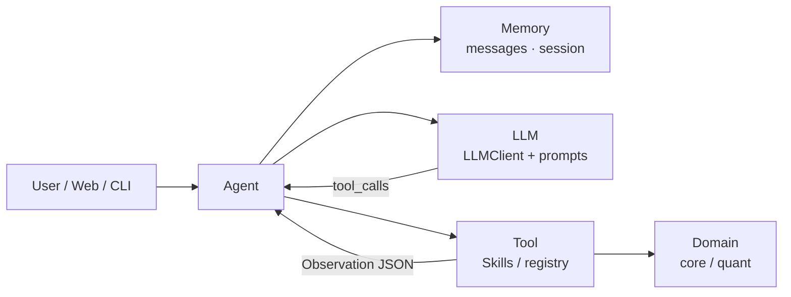

| 组件 | 职责 | 本仓库类 / 模块 |
|------|------|-----------------|
| **Memory** | 短期对话上下文；长期偏好（风格） | 短期：`messages` 多轮；会话 id（Web）。长期偏好：**弱**（多为配置文件，非独立 Memory 服务） |
| **Tool** | 外部能力原子化 | `skills/*/handler.py` + `tool_config.json`；量化门面 `quant/services` |
| **LLM** | 理解指令、选择工具、组织建议 | `agent/llm_client.py` · `prompts.py` |
| **Agent** | 编排感知–决策–执行循环 | `agent/agent.py`（多轮 FC，有轮次上限） |

#### 4. 对已选 n 只股票的决策链路

目标闭环（产品叙述）与实现边界：

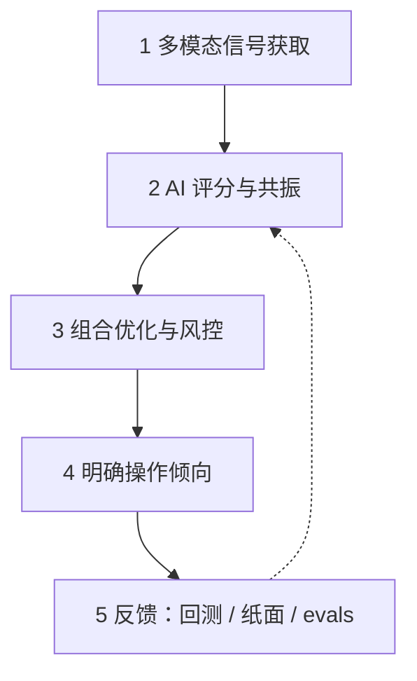

1. **感知**：量价 / 事件 / 资金流等信号。  
   - **已落地**：日线与现货、短线 `signal` 因子、资讯标题、部分资金相关字段（视数据源）。  
   - **规划中**：稳定 Tick 流、北向/主力资金全覆盖、事件 NLP 流水线。  
2. **认知评分**：多因子融合与交叉验证（技术 + 资金 + 舆情共振）。  
   - **已落地**：因子权重、横截面 TopK、stance 标签、LLM 综合叙述。  
3. **组合与风控**：仓位、单票/行业限额、动态止盈止损。  
   - **部分**：持仓规则与集中度提示、纸面调仓；ATR 自适应与完整三重风控引擎仍弱。  
4. **执行输出**：买入/卖出/加减仓/做 T 等**可理解指令**。  
   - **已落地**：自然语言建议 + 纸面/模拟做 T。  
   - **永不默认开通**：券商密码核验与资金划拨由官方 App 人工确认——见下节「非交易指令通道」。

#### 5. 开发落地与合规红线

与当前演进方式一致（详见 [design-spine.md · 路线图](design-spine.md#能力评估与升级规划路线图视角)）：

1. **从单点 Tool 做起**：先跑通单一 Skill（抓数 → JSON → 摘要），再挂上 Agent。  
2. **本地 Agent 串联**：对话驱动多工具工作流，而不是先上大而全中台。  
3. **非交易指令通道（强制）**：AI 只做语义识别、研究结论与订单**预填建议**；涉及真实交易时，跳转官方券商 App，由人工二次确认。本仓库现行定位为 **策略验证（量化研究 + 模拟账本 + AI 编排）**，**不代客下单**；实盘待验证成熟后另立项。

### 分层架构（工程实现）

```text
┌─────────────────────────────────────────────────────────┐
│  接入层    main.py / run_web.py / web/app.py + routers/  │
├─────────────────────────────────────────────────────────┤
│  应用服务  services/* · quant/services（Application Service）│
├─────────────────────────────────────────────────────────┤
│  编排层    agent/agent.py · routing.py · registry    │
├─────────────────────────────────────────────────────────┤
│  认知层    llm_client.py + prompts.py                    │
├─────────────────────────────────────────────────────────┤
│  适配层    skills/*/handler.py（薄包装，委托 engine/core）│
├─────────────────────────────────────────────────────────┤
│  领域层    core/（门面 DS·SS·BS + facts · paper · risk） │
├─────────────────────────────────────────────────────────┤
│  端口层    core/ports/ + core/data/ports.py（契约，无 I/O） │
├─────────────────────────────────────────────────────────┤
│  数据层    adapters/* · AkShare/腾讯 · data/*.json         │
└─────────────────────────────────────────────────────────┘
```

分层回答「从上到下谁调用谁」；**依赖方向**（领域不绑死行情源）见 [§ 六边形架构（Ports & Adapters）](#六边形架构ports--adapters)。

### Service 命名约定

代码里大量 `*Service` **不是微服务**，而是分层里的**稳定入口**。口语与文档固定两套叫法，**文件名暂不 rename**（避免 patch 路径与 import 大面积抖动）。

| 叫法 | 代码落点 | 职责 | 典型入口 |
|------|----------|------|----------|
| **Application Service**（应用服务） | `services/*` · `quant/services/` | Web/CLI **用例组装**；编排多步业务、定 API 边界 | `PaperService` · `WatchingService` · `QuantService` |
| **Domain Facade**（领域门面） | `core/data/facade` · `signal_service` · `backtest_service` | **单一领域能力**的统一出口；委托 `core/data` · `signal` · `backtest` | DS · SS · BS（`get_bars` · `score_one` · `run_topk` 研究探针；产品回测走 `paper_replay`） |

**原则**

1. 只有「给 router / CLI / Agent 用的**用例入口**」在文档里称 **Application Service**。  
2. `core` 里的读口 / 打分 / 回测在文档里称 **Domain Facade**（口语 **DS / SS / BS**），与业务服务**不同层**。  
3. `QuantService` 是研究台 **Application Service**，向下调 DS/SS/BS，**不替代**领域门面。  
4. 纯函数、helpers、engine **不要**叫 Service。  
5. **新代码**：`services/` 与 `quant/services/` 可继续 `XxxService`；`core` 新门面优先包入口（`core.data` / `get_default_*()`），少再造并列 `XxxService` 文件名。

详见 [§ 代码目录结构](#代码目录结构) · [services/README.md](../services/README.md)。

### 设计模式

本仓库用一套**轻量、可测试**的结构性模式组织代码，避免重型框架。核心模式、意图与代码落点如下：

| 模式 | 意图 | 典型落点 |
|------|------|----------|
| **Facade（门面）** | 一领域封成单一稳定入口，业务只认门面 | DS `core/data/facade.py` · SS `core/signal_service.py` · BS `core/backtest_service.py` |
| **Port & Adapter + DI**（六边形） | `core/ports/` 定出站契约，`adapters/` 供实现；`bind.py` 显式注入，测试可 `set_adapter` 替换 | `core/ports/{market,registry,signal}.py` · `core/data/ports.py` · `adapters/bind.py` |
| **Strategy + Specification** | 同接口多实现；用 `StrategySpec` 数据对象描述策略（draft→staging→active），改策略即改数据 | `core/strategy.py` · `core/signal/factors/score_*.py` · `meta/spec.py` |
| **Skill 体系：Protocol + Registry + Template Method** | `Protocol` 定接口 · 注册表按名查找 · 基类固定流程子类覆写 `handle`；替代继承树 | `agent/contracts.py` · `agent/registry.py` · `agent/skills/base.py` |
| **Repository（仓储）** | 封装持久化，领域层不直连介质 | `core/store.py`（JSON）· `core/store_bars_sqlite.py`（WAL）· `core/paper/ledger.py` |
| **Observer / Event** | 解耦状态变更与通知，多订阅者 | WebSocket `/ws/live` · Job 进度事件 · LLM 流式回调 |

**设计选择**：门面薄、核心纯（计算保持纯函数，便于 evals 回归）；注册表+协议替代继承树，新增技能/因子只注册不改既有代码（开闭原则）。新功能接入见 [§ 如何扩展](#如何扩展)。

### 六边形架构（Ports & Adapters）

分层图是纵向切片（接入 → 编排 → 领域 → 数据）。本仓库出站 I/O 另按 **六边形 / Ports & Adapters** 组织：**领域在中心**，只依赖自己定义的端口；Web、CLI、Agent 与 AkShare/腾讯都是可替换的适配器。换数据源或 mock 测试时改 adapter，不改 `core/signal` / `core/paper`。

分层图里的「适配层 `skills/`」是 **入站**（把 LLM 工具调用翻成领域调用），**不是** `adapters/` 出站包；两套「adapter」不要混读。

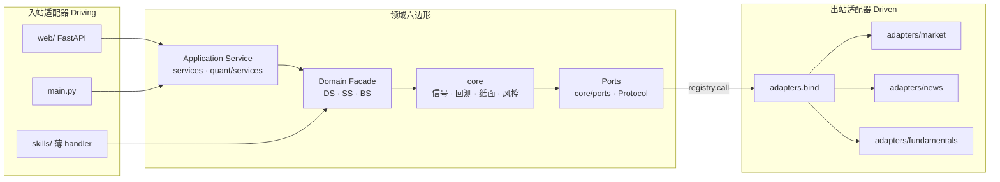

| 角色 | 含义 | 本仓库落点 |
|------|------|------------|
| **领域（六边形内部）** | 确定性计算与账本；**不** import HTTP / LLM / AkShare | `core/`（signal · backtest · paper · risk · facts） |
| **入站适配器** | 把外部请求翻成领域调用 | `web/` · `main.py` · `skills/*/handler.py`（Agent 工具，不是行情 fetch） |
| **出站端口（Port）** | 领域需要的能力契约：`query_quote`、`fetch_daily_bars`、`fetch_minute_bars` 等 | `core/ports/market.py` · `signal.py`；类型化 `Protocol` 在 `core/data/ports.py`（`QuotePort` · `BarsPort` · …） |
| **出站适配器（Adapter）** | 真正打外部源 / 落盘 | `adapters/market/` · `news/` · `fundamentals/` · `screen/` · `sentiment/` 等 |
| **绑定（DI）** | 把实现登记到注册表；首次调用 `ensure_bound()` lazy import，避免 `core` 硬依赖 `adapters` | `adapters/bind.py` → `core.ports.registry.set_adapter` |
| **领域门面** | 业务读数走 DS，不在业务里直调 ports（DS-E5） | `core/data/facade.py` |

**调用链（出站）**

```text
Skill / Service / 研究 CLI
  → Domain Facade（优先 DS：get_quote / get_bars）
    → core/ports/market.py（query_quote · fetch_daily_bars · …）
      → registry.call(name) → ensure_bound()
        → adapters.bind.bind_market_adapters()
          → adapters.market.quote_api / history / minute_history / …
```

**硬边界（与框架债 O2 / H2 对齐）**

1. **`core/` 不硬 import `skills.*` 或 `adapters.*`**；唯一例外是 `core/ports/registry.py` 在 `ensure_bound()` 里 lazy import `adapters.bind`。  
2. **`adapters.bind` 只登记 `adapters.*`**，不再从 Skill 挂底层 fetch。Skills 只做 Agent 薄包装 + 兼容 re-export。  
3. **业务读行情经 DS**，禁止在 `core` 业务模块里直 `import` `ports.query_quote` / `fetch_daily_bars`（允许：`core/ports/*`、`core/data/`）。  
4. **单测替换实现**：`set_adapter("query_quote", fake_fn)` + `mark_bound()`，不必打 AkShare。见 `tests/test_framework_hardening.py`。

**与其它「Port」命名**：`core/backtest/cost_port.py`（CostPort）是费率权威源，不是出站 I/O 端口；撮合近似见 `core/backtest/matching`。新增外部数据源的步骤见 [§ 如何扩展 · 新增数据源](#新增数据源)。框架收口证据见 [internal/framework-review.md](internal/framework-review.md)。

## 技术栈

一句话：**Python 本地单体 + FastAPI Web + 原生前端 + 通义千问 Agent + JSON 落盘 + AkShare/腾讯行情**。面向策略验证（研究台 + 模拟账本）；AI 只编排与解释；刻意不做重型数仓与实盘中间件。

### 总览

| 层 | 选型 |
|----|------|
| **语言 / 运行时** | Python 3.9+（`pyproject.toml`：`>=3.10,<3.13`）；无 Node 构建管线 |
| **Web 后端** | FastAPI + Uvicorn；`httpx` / `requests` |
| **Web 前端** | 原生 HTML/CSS/JS（ES modules）；服务端拼页 `web/page_html.py` |
| **前端增强（CDN）** | Lightweight Charts · marked；局部 React 岛（非全站 SPA） |
| **AI** | 通义千问（DashScope，OpenAI 兼容 HTTP）；自定义 `Agent` + Skills |
| **行情 / 基本面** | 腾讯 qt（现价）· AkShare（日线/选股等）· pandas |
| **存储** | 配置/账本/流水：本地 JSON / JSONL；**日线/分钟线缓存**：默认 SQLite WAL（`QUANTLAB_BARS_BACKEND=sqlite\|json`）；见 [component/data.md · 数据层](component/data.md#数据层data-layer) · 存储选型 · [internal/sqlite-migration.md · SQLite 改造](internal/sqlite-migration.md#日分钟线缓存-sqlite-改造方案) · [internal/engineering-track.md · 工程结构轨](internal/engineering-track.md#工程结构轨a0a4) |
| **量化主轴** | Ridge β → **predicted_score（ŷ）** 选股；ML 旁路见 `research/ml/` |
| **任务 / 运维** | 进程内 `POST /api/schedule/run` + shell cron / launchd；`unittest` + `evals` |
| **部署形态** | 单机本地（默认 `127.0.0.1:8000`）；暂不接实盘 OMS |

### 分层与代码落点

```text
接入     CLI (main.py) · Web (run_web.py → FastAPI web/app.py)
应用服务 services/* · quant/services（Application Service）
编排     agent/（LLM Function Calling，最多 5 轮）
领域门面 core/*_service（DS · SS · BS）→ core/（信号 · 回测 · 纸面 · 风控）
端口     core/ports + adapters.bind（出站 I/O；见六边形）
能力     skills/*（13 工具，薄 handler）
数据     DS + AkShare/腾讯 + data/*.json · bars.db
前端     web/static（vanilla + CDN 图表）
```

### Python 依赖（`requirements.txt`）

| 类别 | 包 |
|------|-----|
| **业务** | `requests` · `akshare` · `pandas` · `python-dotenv` |
| **Web** | `fastapi` · `uvicorn[standard]` · `httpx` |
| **LLM** | 无官方 SDK；`agent/llm_client.py` 直接 HTTP 调 DashScope（`DASHSCOPE_*`） |

**未默认安装**：SQLAlchemy 等 ORM、React/Vite 工程、sklearn / torch（舆情或 ML 实验另装）、消息队列、Docker 编排。日线/分钟线缓存用标准库 `sqlite3`（见 `core/store_bars_sqlite.py`）。

### 前端细节

| 能力 | 实现 |
|------|------|
| 壳层 / 主路径 UI | Vanilla JS 分模块（`watching` / `paper` / `quant` …） |
| K 线 / 净值图 | TradingView **Lightweight Charts** 4.x（jsDelivr） |
| Markdown | **marked** |
| 大表 | 自研 `virtual_table.js`（可挂 React 岛根节点） |
| 实时推送 | FastAPI **WebSocket** `/ws/live` |
| **禁止项** | 全站 CRA / Ant Design Pro / 内嵌 Jupyter（见 [quant-ui-standard](quant-ui.md#web-ui-标准研究台)） |

### 数据与外部源

| 类型 | 技术 |
|------|------|
| 现价 | 腾讯行情 HTTP |
| 日线 / 选股 / 财务等 | AkShare（进程内 `ak_lock` 串行；研究台日 K **增量补齐**走 `ak_worker` 进程池并行） |
| 账户 · 配置 · 缓存 · 流水 | `data/` 下 JSON / JSONL |
| 统一读口 | `core/data/facade.py` |

### 测试与运维

| 项 | 入口 |
|----|------|
| 单测 | `python3 -m unittest discover -s tests -v` |
| 黄金路径 | `evals/run_checklist.py`（`--mock --presets` 与 CI 同款） |
| 本地 CI | `scripts/ci_quant.sh` |
| 日更 | `scripts/daily_*.sh` + cron / macOS launchd（[quant.md · 运维](quant.md#量化运维)） |

安装与环境变量见 [development.md · 快速上手](development.md#快速上手)；扩展 Skill / 限制见 [development.md](development.md)。

---

数据层五模块（采集 / 清洗 / 存储 / 服务 / 监控）与本仓库对照、演进约定见 **[component/data.md · 数据层](component/data.md#数据层data-layer)**（含 § 数据层 · 存储选型）。
策略层（选股择时 / 仓位 / 风控、输入输出、设计模板）见 **[component/strategy.md · 策略层](component/strategy.md#策略层strategy-layer)**。  
风控模型（风险因子、Alpha×Risk、演进）见 **[component/risk.md · 风控层](component/risk.md#风控模型risk-layer)**。  
强化学习视角（Policy/Reward ↔ 策略/风控；**未实现**在线 RL）见 **[component/rl.md · RL 视角](component/rl.md#强化学习rl视角)**。  
舆情/另类数据（新闻→风险分；当前仅标题 Skill）见 **[component/risk.md · 舆情层](component/risk.md#舆情与另类数据sentiment--alt-data)**。

**P94 演进（非重写）**：`QuantService` 拆为 config/factors/portfolio/ops Mixin，门面类名与方法不变；Web 路由按域拆到 `web/routers/*`，URL 不变。历史 P 总览见 [quant-summary.md](archive/quant-summary.md)。

产品流程（观察 · 模拟 · 回溯；观察≠模拟）：见 [quant-ui.md](quant-ui.md)。路由：`/watching` `/follow` `/replay`（`/paper` `/strategy` `/quant` 等仍可用）。见 `action_map.py`、`GET /api/quant/actions` 与 [quant.md · 入门概念](quant.md#量化入门概念)。

**观察池**（Watching）：用户维护的**候选股票宇宙**（静态名单和/或 `screen` 筛选），落盘 `data/watching.json`，页 `/watching`。划定打分、行情预热、横截面排序、调仓开加、回测宇宙的范围（上限 `WATCHING_MAX_SIZE`=500）；**不是**持仓、**不是**全市场。持仓在模拟账本 `paper.json`。选股链路：观察池 → `score_stock` → 横截面 Top N；建仓只从观察页进（见下「入口边界」）。做 T 不从池新开，只 overlay 已持底仓；分钟截面常为观察池 ∪ 持仓。

**入口边界**：观察页是唯一开仓入口（建仓前必过 `sync-paper/preview` 预演），模拟页只管已有仓位。凡「买什么、买多少」由规则决定的动作（按策略调仓）收进进阶区，并在持仓 `origin` 上标 `strategy` 与手动区分。做 T 为 **overlay**，不改变「持有什么」的主线；见 [quant.md · 策略调仓 vs 底仓做 T](quant.md#策略调仓-vs-底仓做-t)。

**命名约定**：产品对外统一称「模拟」/URL `/follow`；内部 canonical 仍为 `paper`（`paper.json`、`/api/paper`）。旧页 `/paper` 302 到 `/follow`。

**领域端口**：见 [§ 六边形架构](#六边形架构ports--adapters)。行情与信号经 `core/ports/` 进入账本；默认适配器由 `adapters.bind` 注入，单测可 `set_adapter` 替换。上层业务读数优先走 `core.data.facade`。框架梳理见 [internal/framework-review.md](internal/framework-review.md)。

**成交成本**：`paper.cost_model` 为 `zero` 或 `simple_cn`。费率权威源为 **CostPort**（`core/backtest/cost_port.py`）：纸面 `core/paper/costs`、回测 `costs`、辅助 `TransactionCostCalculator` 同源；组合回测含成本为换手计费（`cost_mode=turnover`）。建仓预演、手动买卖与策略调仓共用纸面路径。

**依赖方向（自顶向下）**：接入 → 服务 → 编排 → 适配 → 领域 → 数据。  
`core/` 不 import Handler/LLM；行情经 ports；`advise` 经 `core.facts` 直接调 engine，避免 Handler JSON 往返。

### 分层架构（组件详图）

**图 1 — 系统组件与数据流**

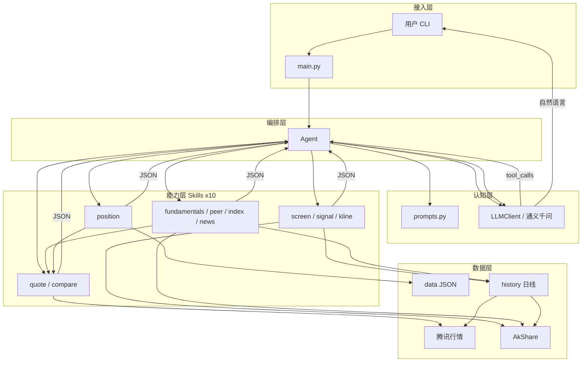

**图 2 — Agent 多轮调度（时序）**

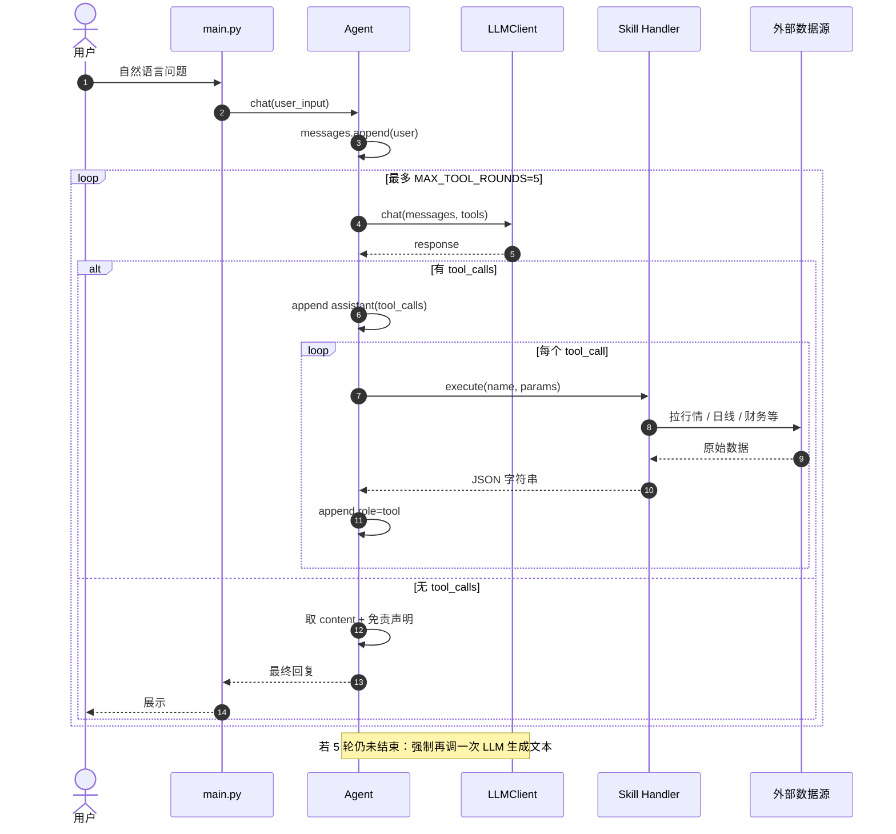

**图 3 — Skill 依赖与复用**

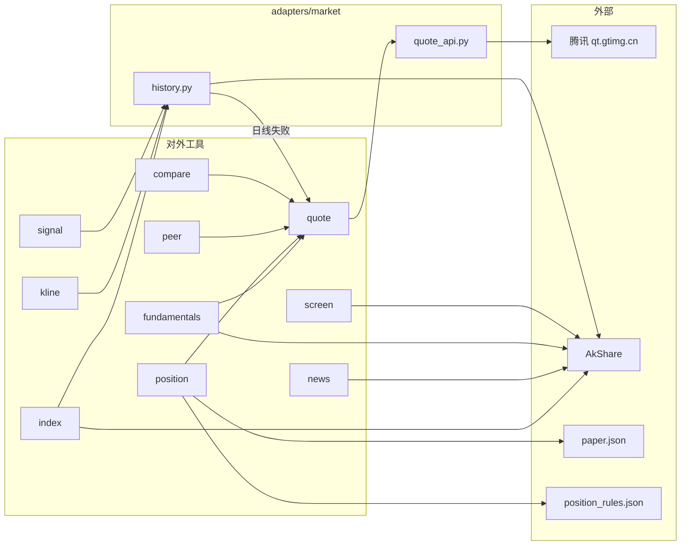

**图 4 — 典型工具链（意图 → Skills）**

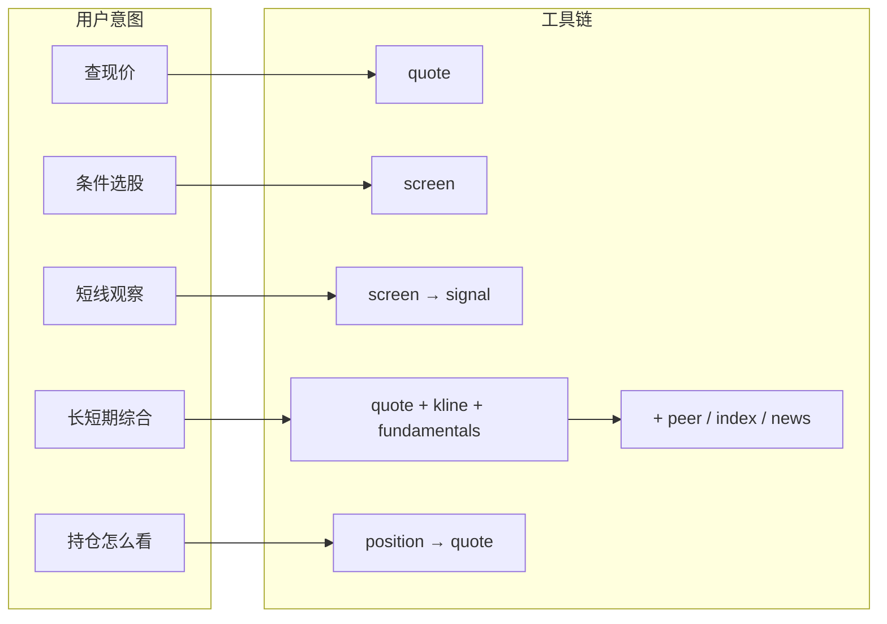

**图 5 — 单 Skill 内部结构**

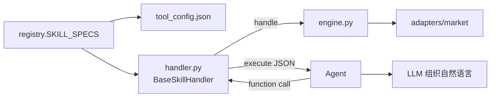

### 端到端请求生命周期

```text
1. main.py 加载 .env（dotenv 或内置解析）→ 构造 Agent
2. 用户输入 append 到 messages（role=user）
3. LLM + 全部 tool_config → 返回 content 或 tool_calls
4. 若有 tool_calls：
     - 保留 assistant（含 tool_calls）
     - handlers[name].execute → JSON 字符串
     - append role=tool（带 tool_call_id）
     - 回到步骤 3（最多 MAX_TOOL_ROUNDS=5）
5. 无 tool_calls：取最终 content
6. _ensure_disclaimer 按需追加免责声明
7. 返回用户；reset 清空历史（保留 system）
```

### 执行链路示例

下面用三个问法把「谁调用谁」串起来。核心约定不变：**选工具与写话术是 LLM；数字只来自 Skill / `adapters/market`。**

#### 例 1：单工具 —「茅台现价」

```text
用户 ──► main.py ──► Agent.chat("茅台现价")
```

| 步 | 谁 | 做什么 |
|----|-----|--------|
| 0 | 启动时 | `registry` 加载 10 个 `tool_config` + 创建 handlers，并校验 |
| 1 | Agent | `messages` 追加 `role=user` |
| 2 | LLM | 带着全部 tools 看问题 → 决定调 `quote` |
| 3 | Agent | 解析出 `{"name":"quote","parameters":{"stock_code":"茅台"}}` |
| 4 | Handler | `QuoteHandler.execute` → `handle` → `StockAPI.query("茅台")` |
| 5 | common | 映射「茅台」→ `sh600519`，打腾讯行情，返回 dict |
| 6 | Agent | JSON 以 `role=tool` 写回 `messages` |
| 7 | LLM | 再读历史，写出自然语言（价格等数字来自 JSON） |
| 8 | Agent | 补免责声明 → 返回用户 |

代码路径：

```text
agent.chat
  → llm.chat(messages, tools)
  → handlers["quote"].execute(...)
      → BaseSkillHandler.execute
      → QuoteHandler.handle
      → adapters.market.quote_api.StockAPI.query
  → llm.chat（无 tool_calls，出最终文本）
  → _ensure_disclaimer
```

一次典型的 `messages` 演变：

```text
[system] SYSTEM_PROMPT
[user] 茅台现价
[assistant] tool_calls: quote(stock_code=茅台)     ← LLM 第 1 轮
[tool] {"success":true,"price":"...","change":"...",...}
[assistant] 贵州茅台当前约 …（解读）              ← LLM 第 2 轮
           + 免责声明
```

#### 例 2：多工具 —「快手最近怎么看，长短期都说说」

LLM 常在一轮或两轮里串多个工具，例如：

```text
第 1 轮 LLM → tool_calls:
  quote(快手) + kline(快手) + signal([01024]) + fundamentals(快手)

第 2 轮 LLM → 无 tool_calls，综合 JSON 写回复
```

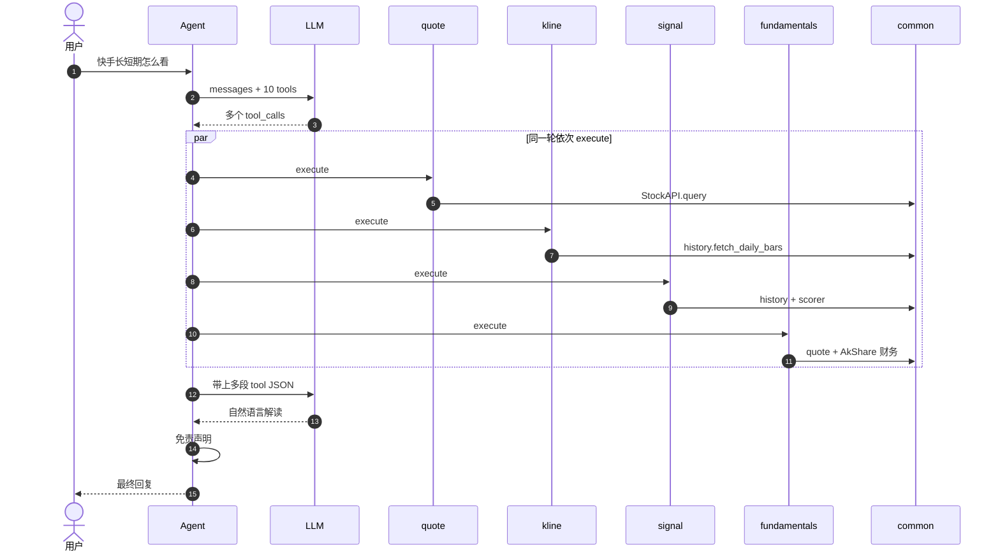

要点：

- **选工具的是 LLM**，不是关键词 if/else；由 `prompts` + `tool_config.description` 引导。
- **数字只出自 Skill / common**；LLM 组织「事实 → 观察 → 风险」。
- 同一轮可多个 `tool_calls`；若还要再查（如先 `screen` 再 `signal`），进入下一轮，最多 `MAX_TOOL_ROUNDS=5`。

#### 例 3：不走 Agent（路径 B，调试用）

只跑数据层，没有 LLM：

```bash
cd quantlab
python3 -c "from skills.quote.handler import QuoteHandler; print(QuoteHandler().execute({'parameters':{'stock_code':'茅台'}}))"
```

链路缩短为：

```text
脚本 → Handler.execute → handle → common/engine → JSON 打印
```

没有「选工具 / 写话术 / 免责声明」。完整对话请走路径 A：`python3 main.py`。

### 工具路由（谁决定调哪个 Skill）

**不是**关键词 if/else，而是：

| 要素 | 作用 |
|------|------|
| `tool_config.json` | 工具说明书（name/description/parameters） |
| `prompts.py` | 角色、路由偏好、用语与拒答边界 |
| LLM `tool_choice=auto` | 按用户语义选工具并填参 |

| 用户意图 | 典型工具链 |
|----------|------------|
| 查现价 | `quote` |
| 多票比价 | `compare` |
| 条件选股 | `screen` → 可选 `signal` |
| 短线观察 | `signal`（可先 `screen`） |
| K 线/阴线 | `kline`（常配 `quote`） |
| 长期/估值 | `fundamentals` + `kline`（可选 `peer`/`index`） |
| 同行 | `peer` |
| 相对大盘 | `index` |
| 新闻资讯 | `news` |
| 持仓怎么看 | `position`（文件或临时 `holdings`） |
| 综合长短期 | `quote` + `kline` + `fundamentals`（+ `signal`/`news`） |

### 接口设计

契约已落在代码：`agent/contracts.py`（Protocol + 基类）+ `agent/registry.py`（单一注册表 + 启动校验）。

#### 为何叫 `contracts.py`（而不是 `protocol.py`）

| 文件名 | 通常装什么 | 是否匹配现状 |
|--------|------------|--------------|
| `protocol.py` / `protocols.py` | 主要是 `typing.Protocol` | 不贴切：同文件还有 `BaseSkillHandler`、`dump_tool_result` |
| **`contracts.py`**（采用） | 跨层契约：接口 + 约定实现 + 序列化约定 | 匹配 |

说明：

- `SkillHandler(Protocol)` 只是契约的一部分；统一 `execute` → JSON 由 **`BaseSkillHandler`** 落实。
- 若命名为 `protocol.py`，容易误以为「只有类型协议、没有基类」。
- 若一定要强调 Protocol，更常见的是复数 `protocols.py`，且宜只放 Protocol，基类另拆——对当前体量属于过度拆分，故不采用。

结论：保持 `agent/contracts.py`；下文「接口 / 契约」均指此模块。

#### 总览

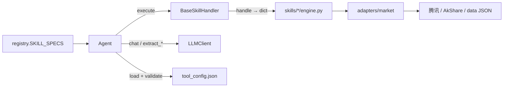

| 边界 | 代码位置 | 硬约束 |
|------|----------|--------|
| Skill Handler | `contracts.SkillHandler` + `BaseSkillHandler` | **硬**：启动 `isinstance` 校验；Agent 只调 `execute` |
| 注册表 | `registry.SKILL_SPECS` | **硬**：tools / handlers / `tool_config.name` 三者一致 |
| LLMClient | `llm_client.py` | Agent / main 依赖其方法表面 |
| Agent | `chat` / `reset` | 对外入口 |
| 日线 / 行情 | `adapters/market` | 字段约定 + 单测 |

#### 1. Skill Handler

```python
# agent/contracts.py
@runtime_checkable
class SkillHandler(Protocol):
    def execute(self, function_call: dict) -> str: ...

class BaseSkillHandler:
    def handle(self, params: dict) -> dict: ...
    def execute(self, function_call: dict) -> str:  # 统一 JSON + 异常包装
        ...
```

Agent 只调用：

```python
result: str = handler.execute({"name": tool_name, "parameters": params})
```

各 Skill：`class XxxHandler(BaseSkillHandler)`，实现 `handle`，设置 `error_prefix`。

#### 2. 单一注册表 + `tool_config.json`

```python
# agent/registry.py — 唯一事实源
SKILL_SPECS = (
    ("quote", QuoteHandler),
    ...
)
```

启动时 `load_tool_definitions()` + `validate_registry()`：

- 每个目录存在 `tool_config.json`，且 `config["name"] == 注册名`
- `handlers` / `tools` 集合与 `SKILL_SPECS` 一致
- 每个 handler 满足 `SkillHandler`（具备 `execute`）

#### 3. LLMClient（认知层表面）

实现：`agent/llm_client.py`。无接口类；Agent / `main.py` 依赖：

| 方法 | 用途 |
|------|------|
| `is_available() -> bool` | 启动探测 |
| `get_last_error() -> str \| None` | 失败原因（如模型 404） |
| `chat(messages, tools=None, enable_search=None) -> dict` | Chat Completions 原始响应（可带联网搜索） |
| `extract_function_calls(response) -> list` | 解析为 `[{id, name, parameters}, ...]` |
| `get_response_content(response) -> str` | 最终文本 |
| `get_assistant_message(response) -> dict` | 含 `tool_calls` 的 assistant 消息，原样写回历史 |

底层协议：`POST {DASHSCOPE_ENDPOINT}/chat/completions`（OpenAI 兼容，`tool_choice=auto`，可选 `enable_search`）。

#### 4. Agent

| 方法 | 约定 |
|------|------|
| `chat(user_input: str) -> str` | 多轮 tool loop + 免责声明兜底后的自然语言 |
| `reset()` | 清空历史，保留 `system`（`SYSTEM_PROMPT`） |

内部状态：`messages`（OpenAI 风格）、`tools`、`handlers`。

#### 5. 数据形状约定（软合约）

**工具结果 JSON**（Handler 返回值反序列化后）：

| 字段 | 约定 |
|------|------|
| `success` | 布尔；失败时为 `false` |
| `error` | 失败原因；禁止静默成功 + 空数据 |
| `note` | 可选；含免责 / 数据源说明等 |
| 业务字段 | 各 Skill 自定义；数字须来自真实取数 |

**日线 bar**（`adapters/market/history.py` → `normalize_bars`）：

```text
{date, open, high, low, close, volume}
```

`signal` / `kline` / `index` 复用此形状；日线失败时可 `quote_fallback`，结果中带 `data_source` 区分可信度。

**实时行情**（`adapters.market.quote_api.StockAPI`）：

| 要点 | 说明 |
|------|------|
| `resolve_symbol(raw) -> symbol \| None` | 名称/代码 → 腾讯符号 |
| `query(stock_code) -> dict` | `success` + `price` / `change_*` / `price_raw` 等 |
| 缓存 | 同 symbol 约 60s |

**日线**（`adapters.market.history` + `core/store.py`）：`normalize_bars` / `fetch_daily_bars`（24h 本地缓存） / `bars_from_quote_fallback`。完整数据层说明见 [component/data.md · 数据层](component/data.md#数据层data-layer)。

#### 6. Skill 目录与扩展步骤

| 文件 | 职责 |
|------|------|
| `tool_config.json` | 暴露给 LLM 的函数定义 |
| `handler.py` | `BaseSkillHandler` 子类，实现 `handle` |
| `engine.py` | 领域逻辑（可单测 mock） |
| 共享能力 | 放 `adapters/market/`，勿挂在某一 Skill 下 |

扩展时：

1. 新增 `skills/<name>/`（handler + engine + tool_config）  
2. 在 `registry.SKILL_SPECS` **只改一处**注册  
3. `prompts.py` 补路由说明  
4. `tests/` 离线单测（网络 mock）

#### 7. 刻意不做的抽象

- 不在 Agent 内做关键词硬路由（路由交给 LLM + tool_config）。  
- 不把「解读话术」做成 Skill（话术只在 LLM 侧）。  
- 不为数据源先上完整 Repository / 时序仓（MVP 以 `common` + `store` 足够）；选型与触发条件见 [component/data.md · 数据层](component/data.md#数据层data-layer) · 存储选型；演进见 § 数据层 · 演进。

### 能力分层（13 个工具）

| 层 | 工具 | 说明 |
|----|------|------|
| 行情基础 | `quote` `compare` | 现价与横向价格对比 |
| 选股/短线/回测 | `screen` `signal` `kline` `backtest` | 筛选、因子分、K 线、signal 历史回测 |
| 研究台编排 | `quant` | 量化研究台门面（IC / 组合回测 / 报告等） |
| 买卖结论 | `advise` | 规则 stance（quote+signal+kline+peer/index → stance_label） |
| 中长期研究 | `fundamentals` `peer` `index` `news` | 估值财务、同行、超额、资讯 |
| 组合动作 | `position` | 本地/临时持仓 + 可配置规则 |

共享模块：`adapters/market/history.py`、`adapters/market/quote_api.py`；领域量化引擎：`core/`（`stance` `backtest` `paper` / `paper_cycle` `store`）；CLI 包装：`research/`；研究库：`quant/research/`。框架债务见 [architecture.md · 框架梳理](architecture.md)。

### 关键模块职责

| 模块 | 职责 |
|------|------|
| `main.py` / `run_web.py` | 接入：CLI / Web 启动 |
| `services/*` | 会话、纸面账户等服务边界 |
| `core/*` | 领域：facts / advise / stance / store |
| `agent/routing.py` | 意图检测与 hint 注入 |
| `agent/registry.py` | Skill 注册（Handler 延迟加载） |
| `agent/agent.py` | 编排：tool loop、免责声明 |
| `agent/llm_client.py` | HTTP 调通义千问；解析 `tool_calls` |
| `agent/prompts.py` | 系统提示：角色、路由偏好、输出与合规边界 |
| `skills/*/handler.py` | 薄适配层 → engine / core |
| `adapters/market/` | 跨工具行情 / 日线 I/O |
| `data/*.json` | 持仓、纸面、规则配置 |

`prompts.py` 的角色、导出内容与 `tool_config.json` 分工见 [development.md · prompts 说明](development.md#promptspy-说明)。

### LLM 与配置

- 协议：`POST {DASHSCOPE_ENDPOINT}/chat/completions`（OpenAI 兼容）。
- 变量：`DASHSCOPE_API_KEY` / `DASHSCOPE_ENDPOINT` / `DASHSCOPE_MODEL`（默认 `qwen-plus`）；联网搜索见 `DASHSCOPE_ENABLE_SEARCH`。
- 无 LLM 时：可直接 `import skills.*.handler` 测数据层（见下文示例）。

### Token 消耗统计

通义千问非流式响应通常带 `usage`（`prompt_tokens` / `completion_tokens` / `total_tokens`，部分模型还有 `reasoning_tokens`）。系统已接入会话级累计：

| 层级 | 说明 |
|------|------|
| `LLMClient._record_usage` | 每次 `chat()` 解析并累加到 `session_usage` |
| `Agent.last_turn_usage` | **一轮用户问题**内全部 LLM 调用合计（含多轮 tool loop） |
| 每次回答正文末尾 | `chat()` 返回值自动附带本轮 + 会话累计（**不写入** `messages`，避免污染下一轮上下文） |
| CLI | 输入 `usage` / `tokens` 可再查；`reset` 清零 |

```text
（投顾正文…）

---
本轮 token：prompt=… completion=… total=… calls=2 ｜ 会话累计：…
```

`calls` 为该范围内 API 请求次数（一次问答常因 tool loop ≥ 2）。Skill 本地执行**不计** token。若响应无 `usage` 字段，计数为 0（不阻断对话）。

### 两种使用路径

| 路径 | 入口 | 需要 LLM | 产出 |
|------|------|----------|------|
| A. 完整 Agent | `python3 main.py` | 是 | 选工具 + 自然语言解读 |
| B. Skill 直调 | `python3 -c "from skills..."` | 否 | 仅 JSON 事实/规则结果 |

---


## 3. 分层模块说明与代码组成

### 3.1 接入层（Access）

**功能**：HTTP/CLI/WebSocket 入口；页面路由；静态资源；请求校验与依赖注入。

| 组件 | 路径 | 说明 |
|------|------|------|
| Web 应用 | `web/app.py` | FastAPI 主应用，挂载 routers |
| 启动 | `run_web.py` | Uvicorn 启动 |
| CLI | `main.py` | 命令行对话与研究入口 |
| 路由 | `web/routers/` | 按域拆分 API（见下表） |
| 页面拼装 | `web/page_html.py` | 服务端 HTML 模板 |
| 前端编排 | `web/static/js/` | 原生 JS 模块（无 Node 构建） |
| Schema | `web/schemas/` | Pydantic 请求/响应模型 |
| 依赖 | `web/deps.py` | 服务实例注入 |

**Routers 组成**：

| Router | 路径 | 主要 API 前缀 |
|--------|------|---------------|
| `meta` | `web/routers/meta.py` | 健康、版本、静态元数据 |
| `chat` | `web/routers/chat.py` | `/api/chat` 会话 |
| `paper` | `web/routers/paper.py` | `/api/paper` 模拟账本 |
| `watching` | `web/routers/watching.py` | `/api/watching` 观察池（候选宇宙 CRUD / 建仓入口） |
| `strategy` | `web/routers/strategy.py` | 策略配置 |
| `daily` | `web/routers/daily.py` | `/api/daily` 日报编排 |
| `quant` | `web/routers/quant.py` | `/api/quant` 研究台主路由 |
| `quant_config` | `web/routers/quant_config.py` | 信号/策略配置 |
| `quant_research` | `web/routers/quant_research.py` | 因子/OLS/截面研究 |
| `quant_cluster` | `web/routers/quant_cluster.py` | 日/分钟仓刷新（bars/minute）；分组 OLS/live 已退役（410） |
| `quant_backtest` | `web/routers/quant_backtest.py` | TopK/组合回测 |
| `quant_dashboard` | `web/routers/quant_dashboard.py` | 研究台仪表盘 |
| `evals` | `web/routers/evals.py` | Golden eval |
| `platform` | `web/routers/platform.py` | Job/Memory/Decision 等平台 API |
| `live_ws` | `web/routers/live_ws.py` | WebSocket `/ws/live` |

**前端主模块**：

| 文件 | 职责 |
|------|------|
| `paper.js` | 模拟页总编排（子模块在 `paper/`） |
| `quant.js` | 研究台总编排（子模块在 `quant/`） |
| `dashboard.js` + `dashboard_api.js` | 首页仪表盘 |
| `ai_drawer.js` | ⌘K 对话抽屉 |
| `watching_table_island.js` | 观察池表格岛 |
| `api_client.js` | 统一 fetch 封装 |
| `live_ws.js` | 实时推送 |

---

### 3.2 Application Service 层

**功能**：把多个领域能力组装成**产品用例**；对上稳定 API，对下调 Domain Facade 与 core。

#### `services/` — 产品闭环

| 模块 | 路径 | 功能 |
|------|------|------|
| PaperService | `paper_service.py` + `paper_account.py` / `paper_jobs.py` / `paper_trades.py` / `paper_helpers.py` | 纸面账户、买卖、调仓 Job、策略晋升 |
| WatchingService | `watching_service.py` | 观察池（候选宇宙）CRUD、建仓入口 |
| ChatService | `chat_service.py` | Web/CLI 会话、Agent 调用 |
| DailyService | `daily_service.py` | 每日任务（纸面 + eval + 量化） |
| EvalService | `eval_service.py` | Golden eval 运行 |
| PlatformService | `platform_service.py` | Job / Memory / Decision / Feedback / Schedule / Prefill |
| position_stance | `position_stance.py` | 持仓 stance 摘要 |

#### `quant/services/` — 研究台

| 模块 | 路径 | 功能 |
|------|------|------|
| QuantService | `quant_service.py` | Mixin 门面入口 |
| Config | `quant_service_config.py` | 策略/信号配置列表 |
| Follow | `quant_service_follow.py` | ① 模拟（T0 研究；执行归 PaperService） |
| Replay | `quant_service_replay.py` | ② 回溯（paper_replay / rank_lots） |
| Compare | `quant_service_compare.py` | ③ 持仓联动摘要 |
| Factors | `quant_service_factors.py` | 因子面板、IC、OLS、截面 |
| Ops | `quant_service_ops.py` | 日报、导出、解读、watching 运维 |
| Portfolio | `quant_service_portfolio.py` | 组合回溯兼容入口 |
| 报告 | `quant_report_export.py` · `quant_report_index.py` · `quant_interpret.py` | Markdown/HTML 导出、归档、LLM 解读 |
| 桥接 | `portfolio_quant_bridge.py` · `signal_config_preview.py` · `action_map.py` | 持仓↔量化联动、配置 diff 预览、动作映射 |

---

### 3.3 Agent 与 Skills（旁路）

**功能**：自然语言意图 → 选工具 → 调 handler → 拿 JSON 事实 → LLM 组织话术。**不得改写** `score` / `stance_label`。

#### `agent/`

| 模块 | 路径 | 功能 |
|------|------|------|
| Agent | `agent.py` | 多轮 Function Calling（≤5 轮） |
| LLM | `llm_client.py` | 通义千问 HTTP 客户端 |
| Prompts | `prompts.py` | 系统提示、免责声明 |
| Registry | `registry.py` | 工具注册与 handler 查找 |
| Routing | `routing.py` | 参数准备、结果 enrich |
| Contracts | `contracts.py` | SkillHandler 协议 |

#### `skills/` — 13 个 Agent 工具

| Skill | 路径 | 功能 |
|-------|------|------|
| quote | `skills/quote/` | 实时行情（腾讯 qt） |
| compare | `skills/compare/` | 多股对比 |
| screen | `skills/screen/` | A 股条件选股 |
| signal | `skills/signal/` | 短线观察池打分 |
| backtest | `skills/backtest/` | 信号规则回测 |
| quant | `skills/quant/` | 量化研究台（委托 QuantService） |
| kline | `skills/kline/` | 日 K 形态 |
| fundamentals | `skills/fundamentals/` | 基本面 |
| news | `skills/news/` | 资讯标题 |
| advise | `skills/advise/` | 买卖倾向建议 |
| position | `skills/position/` | 持仓查询 |
| peer | `skills/peer/` | 同业对比 |
| index | `skills/index/` | 指数行情 |

**支撑模块**：

| 模块 | 路径 | 功能 |
|------|------|------|
| ports_bind | `adapters/bind.py` | 行情/信号适配器注入 core.ports |
| common | `adapters/market/` | `quote_api` · `history` · AkShare 锁 |
| 引擎（非 FC 工具） | `macro/` · `announcement/` · `market_sentiment/` | 宏观/公告/情绪，供 core 或研究调用 |

---

### 3.4 Domain Facade 层（DS / SS / BS）

**功能**：领域能力的**唯一对外出口**；封装质量门禁、信封类型、生产/研究双轨。

| 门面 | 模块路径 | 实现包 | 主要 API |
|------|----------|--------|----------|
| **DS** | `core/data/facade.py` | `core/data/` | `get_quote` · `get_bars` · `bars_and_source` · `summarize_data_quality` |
| **SS** | `core/signal_service.py` | `core/signal/` | `score_one` · `rank_cross_section` |
| **BS** | `core/backtest_service.py` | `core/backtest/` | `run_topk`（研究探针，≠ 产品 `/replay`） · `run_signal_backtest` |

**端口与绑定**（模式说明见 [§ 六边形架构](#六边形架构ports--adapters)）：

```text
DS → core/ports/market.py → adapters/bind.py → adapters/market/
SS → core/signal/service.py → scorer · factors · config · gate
BS → core/backtest/service.py → engine · topk_backtest · topk_weights
```

---

### 3.5 领域层 `core/`

**功能**：确定性业务逻辑；**无 LLM、无 HTTP Handler**。live / 回测 / 纸面共用同一套规则。

#### 信号与打分 `core/signal/`

| 子模块 | 功能 |
|--------|------|
| `service.py` | SignalService 实现 |
| `scorer.py` · `score_stock.py` | 单票打分主路径 |
| `factors/` | 单因子 `score_*` 实现 |
| `factors/meta/` | 注册表、面板、IC/相关、健康、分类、系数、共线、风险归因 |
| `config.py` | `signal_config` 读写 |
| `gate.py` | ŷ 生产门禁、scale 推断 |
| `cross_section_batch.py` | 截面批量 |
| `dual_score/` | 双层 ŷ：融合、解析、τ/co 头、簿字段、影子簿、人审配置 |

#### 回测 `core/backtest/`

| 子模块 | 功能 |
|--------|------|
| `service.py` | BacktestService 实现 |
| `engine.py` | 单票 signal 回测 |
| `paper_replay.py` | 产品历史回测（rank_lots；含分票贡献） |
| `topk_backtest.py` | TopK 等权/加权回测（研究探针，≠ `/replay`） |
| `topk_weights.py` | 权重计算（按用例拆分） |
| `matching.py` | 成交撮合规则 |
| `strategies/` | 策略模板 |

#### 纸面模拟 `core/paper/`

| 模块 | 职责 |
|------|------|
| `ledger.py` | 账本 CRUD、锁、快照、操作日志 |
| `exec.py` · `cycle.py` | 盯市、买卖、日循环 |
| `costs.py` · `sizing.py` | 费用、手数 |
| `rebalance/` | 调仓编排、匹配、门禁、预取 |

#### 市场 `core/market/`

| 模块 | 职责 |
|------|------|
| `symbols.py` | A/H/US 代码解析 |
| `calendar.py` | 交易日历、停牌过滤 |
| `context.py` · `context_store.py` · `context_merge.py` | 宏观/情绪上下文 |
| `sentiment_prior.py` · `prior_policy.py` | 情绪 prior、买卖门禁 |

#### 风控 `core/risk/`

| 模块 | 功能 |
|------|------|
| `checks.py` | 调仓前门禁 |
| `budget.py` · `exposure.py` | 风险预算与敞口 |

#### 观察与策略

**观察池** = 候选宇宙，不是账本。存储/健康/洞察在 `core/watching/`；产品定义见上文。

| 模块 | 功能 |
|------|------|
| `core/watching/` | 观察池存储、健康检查、洞察缓存 |
| `stance.py` · `advise.py` · `position.py` | 倾向与建议 |
| `strategy.py` · `strategy_monitor.py` | 策略定义与监控 |
| `north_star.py` · `north_star_pro.py` | 北极星指标 |

#### 数据与存储

| 模块 | 功能 |
|------|------|
| `store.py` | 缓存读写；`QUANTLAB_BARS_BACKEND=sqlite\|json` |
| `store_bars_sqlite.py` | 日线/分钟线 SQLite WAL |
| `data/service.py` · `data/gate.py` | MarketDataService 与质量门禁 |
| `pit.py` · `coverage.py` · `quality_center.py` | PIT、覆盖率、质量中心 |
| `paths.py` · `env.py` | 路径与环境变量 |

#### 平台与运行时

| 模块 | 功能 |
|------|------|
| `job_progress.py` | 统一 Job 槽（paper · ols · chat · …） |
| `schedule_jobs.py` | 定时任务 |
| `decision_record.py` · `memory_store.py` · `feedback_suggest.py` | D 轨平台能力 |
| `observation.py` · `order_prefill.py` | 观察记录、订单预填 |

#### 研究内核（core 侧）

| 模块 | 功能 |
|------|------|
| `core/research/` | OLS fit、walk-forward、ŷ_τ 头（`tau_ridge`）等研究算法 |
| `t0/` | 做 T 回测内核 · `close_band` / `slots`（v6 收盘带宽）· `minute_path` · `intraday.py` · `auto_worker.py` |

---

### 3.6 量化研究 `quant/`

**功能**：研究台专属逻辑、报告、Agent quant Skill；**不替代** core 真相源。

| 目录 | 组成 | 功能 |
|------|------|------|
| `quant/services/` | 见 §3.2 | Application Service |
| `quant/research/` | `factor_ols.py` · `bars_*` / `minute_*` · `portfolio_*.py` · `t0_backtest.py` | 因子 OLS、观察池日/分钟仓、组合对照（**分组 OLS 已退役**） |
| `quant/ops/` | daily preset、健康检查 | 运维脚本支撑 |
| `quant/skill/` | `engine.py` + handler | Agent `quant(task=...)` 引擎 |

---

### 3.7 研究 CLI `research/`

**功能**：薄命令行入口；逻辑在 `core/` / `quant/research/`；读数经 DS。

| 示例脚本 | 功能 |
|----------|------|
| `cross_section_run.py` | 截面排序导出 |
| `t0_backtest_run.py` | 做 T 回测 CLI |

---

### 3.8 数据与持久化 `data/`

| 类型 | 路径 | 内容 |
|------|------|------|
| 模拟账本 | `data/paper.json` | 持仓、资金、流水 |
| 观察池 | `data/watching.json` | 候选股票宇宙（watchlist + sources）；≠ 持仓 |
| 信号配置 | `data/signal_config.json` | 因子权重、阈值 |
| 行情缓存 | `data/store/bars.db`（默认）或 `data/store/daily/` | SQLite WAL 或 JSON |
| Job 状态 | `data/jobs/*.json` | 长任务进度与结果 |
| 决策/记忆 | `data/decisions.jsonl` · `data/memory.json` | 平台 D 轨 |
| 报告 | `data/reports/` | 量化日报归档 |
| 回测快照 | `data/last_portfolio_backtest.json` · `data/last_t0_backtest.json` | `/replay` / `/follow` 刷新恢复，不重跑 |
| 配置备份 | `data/config_backups/` | signal_config 历史 |

环境变量：`QUANTLAB_STORE_DIR` · `QUANTLAB_BARS_BACKEND`。见 [data-layer](component/data.md#数据层data-layer) · [sqlite-migration](internal/sqlite-migration.md)。

---

### 3.9 质量保障

| 目录 | 功能 |
|------|------|
| `tests/` | `unittest` 回归（store · job · backtest · quant · web API …） |
| `evals/` | Golden 用例与 repro 脚本 |
| `scripts/` | 迁移、日报 shell、launchd 示例 |

---

## 4. 模块依赖规则

```text
允许：
  routers → Application Service → Domain Facade → core → ports → adapters
  Agent → Skills → Application Service 或 Domain Facade
  core 内部模块互调
  core/ports/registry 仅 lazy import adapters.bind

禁止：
  core 硬 import web / agent / llm / skills / adapters.*（除 registry lazy bind）
  router 直接 import core 深层实现（应经 Service/Facade）
  业务模块绕过 DS 直调 ports 读行情
  LLM 改写 score / stance_label 或静默写 signal_config
  Application Service 绕过 DS/SS/BS 直碰 store（读口由 DS 封装）
```

依赖倒置细则见 [§ 六边形架构](#六边形架构ports--adapters)。

---

## 代码目录结构

[← 文档索引](README.md) · 完整架构说明见 [architecture.md](architecture.md)

```
quantlab/
├── core/                        # 领域层（确定性逻辑，无 LLM/Handler）
│   ├── paths.py · env.py · numbers.py
│   ├── data/                    # facade · service · policy · pit · coverage · quality
│   ├── signal_service.py        # 上层打分口（ŷ 信封 / 生产门禁）
│   ├── store.py · store_bars_sqlite.py
│   ├── ports/                   # market · registry · signal（经 adapters.bind 注入）
│   ├── signal/                  # Service · scorer · factors · config · score_stock
│   ├── backtest/                # walk-forward · topk_backtest · strategies
│   ├── stance.py · advise.py · facts.py · position.py
│   ├── paper/                   # 账本 · exec · cycle · rebalance（`from core.paper import …`）
│   ├── market/                  # symbols · calendar · context
│   ├── watching/                # 观察池 store · health · insights
│   ├── t0/ · risk/ · research/  # T+0 · 风控门禁 · 研究模型
│   ├── job_progress.py · schedule_jobs.py · run_manifest.py
│   ├── decision_record.py · memory_store.py · feedback_suggest.py
│   ├── observation.py · order_prefill.py · alert_outbound.py
│   └── sentiment.py
├── adapters/                    # 出站 I/O（market / news / fundamentals / …）
│   └── bind.py                  # 默认实现登记到 core.ports
├── quant/                       # 量化研究台
│   ├── services/                # QuantService、报告、持仓联动
│   ├── ops/                     # daily preset、健康检查
│   ├── research/                # 因子 IC、TopK 摘要、中性化对照
│   └── skill/                   # Agent quant(task=...) 引擎与 Handler
├── services/                    # 应用服务
│   ├── paper_service.py         # PaperService 组装
│   ├── paper_account.py · paper_jobs.py · paper_trades.py · paper_helpers.py
│   ├── chat_service.py · daily_service.py · eval_service.py
│   └── watching_service.py · platform_service.py · position_stance.py
├── main.py                      # CLI
├── run_web.py                   # Web：uvicorn
├── web/
│   ├── app.py · deps.py · schemas.py
│   ├── routers/                 # chat · paper · watching · daily · quant* · strategy · …
│   └── static/js/               # paper/ · quant/ · watching_*
├── agent/                       # 编排层 + 认知层（正本）
├── skills/                      # Agent 工具（registry 13 个）；handler + shim
│   ├── quote/ compare/ screen/ signal/ backtest/ …
│   └── quant/                   # tool_config；实现在 quant/skill/
├── research/                    # 薄 CLI（逻辑在 core/quant；读数经 DataService）
├── scripts/                     # 日更 / 回归 / 对照
├── data/                        # JSON 状态 · store/ · jobs/paper.json
├── evals/ · tests/
└── docs/                        # 本目录
```

## 分层说明

| 层级 | 路径 | 职责 |
|------|------|------|
| **Domain Facade · DS** | `core/data/facade` → `core/ports` → `adapters.bind` | 读口；业务/Skill/研究统一质量契约 |
| **Domain Facade · SS** | `core/signal_service` → `core/signal/service` | 打分；纸面/量化/Skill 统一 ŷ 信封与生产门禁 |
| **Domain Facade · BS** | `core/backtest_service` → `core/backtest/service` | 回测信封；TopK / signal 回测 |
| 共享领域 | `core/signal` · `core/backtest` · `core/paper*` · `core/risk` | live / 回测 / 纸面同一套规则 |
| **Application Service** | `services/` | Web/CLI 用例；纸面拆 account/jobs/trades |
| **Application Service** | `quant/services/`（`QuantService`） | 研究台用例；向下调 DS/SS/BS |
| Agent 编排 | `agent/` · `skills/*` | LLM 路由、tool loop |

**命名**：文档里 **Application Service** = `services/*` 与 `QuantService`；**Domain Facade** = DS/SS/BS（`core/*_service.py`，文件名历史保留）。见 [§ Service 命名约定](#service-命名约定)。

## Canonical 入口速查

| 模块 | 路径 |
|------|------|
| DS（Domain Facade） | `core/data/facade.py` · `core/data/`（`MarketDataService` / Ports / 信封） |
| SS（Domain Facade） | `core/signal_service.py` · `core/signal/`（`SignalService` · `ScoreResult` · gate · metrics） |
| 行情端口 | `core/ports/market.py` · 绑定 `adapters/bind.py` |
| 因子打分 | `core/signal/scorer.py`（实现）· 出口经 SignalService |
| BS（Domain Facade） | `core/backtest_service.py` · `core/backtest/`（`BacktestService` · `engine`） |
| TopK 权重 | `core/backtest/topk_weights.py`（`topk_backtest` 再导出） |
| 纸面账本 | `core/paper/`（`ledger` · `exec` · `cycle` · `rebalance`） |
| 风控门禁 | `core/risk/checks.py` |
| QuantService（Application Service） | `quant/services/quant_service.py` |
| Agent quant Skill | `quant/skill/` · 注册 `skills/quant/` |
| 模拟账本 | `core/paper/`（`paper.json`）；对话 position 默认读此 |
| 观察池 | `core/watching/`（候选宇宙；`watching.json`） |
| 研究 CLI | `research/*.py` |
| Job 轮询 | `GET /api/jobs/{name}`（纸面兼容 `/api/paper/job`；Ridge 长拟合：`t30-ridge`…`t90-ridge` · `co-ridge`） |

命名约定：产品「模拟」/ `/follow` = 内部 `paper`。详见 [internal/framework-review.md · 框架梳理](internal/framework-review.md#代码框架梳理与合理性分析) · [本章](#架构总览)（含 [§ 技术栈](#技术栈)）。

---

## 组件文档导航

| 层 | 文档 | 内容 |
|----|------|------|
| 数据层 | [component/data.md](component/data.md) | 采集/清洗/存储/服务/监控五模块 · 分钟线采集架构 · 存储选型 · PIT 边界 |
| 策略层 | [component/strategy.md](component/strategy.md) | 选股/择时/仓位/风控 · 策略设计文档模板 · 默认短线策略 |
| 风控层 | [component/risk.md](component/risk.md) | Alpha×Risk 闭环 · 风控因子 · 舆情与另类数据 |
| RL 视角 | [component/rl.md](component/rl.md) | Policy/Reward/Env 映射 · 与现有栈衔接（远期） |
| 框架梳理 | [internal/framework-review.md](internal/framework-review.md) | 代码框架债务台账 · 已收口/设计保留/明确不做 |
| 工程结构轨 | [internal/engineering-track.md](internal/engineering-track.md) | A0–A4 契约冻结 → Bars SQLite → Job 硬化 → 门面 → 前端稳态 |
| SQLite 迁移 | [internal/sqlite-migration.md](internal/sqlite-migration.md) | 日线/分钟线缓存 SQLite WAL 改造方案（已落地 A1） |

---

## 端到端全链路架构图

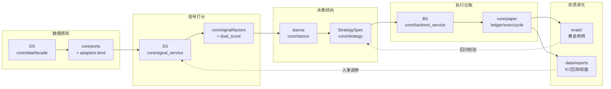

| 环节 | 输入 | 输出 | 关键约束 |
|------|------|------|----------|
| 数据感知 | 腾讯/AkShare 行情、本地缓存 | 标准化 OHLCV + quote | PIT（无未来函数）；5m 分钟线做 T |
| 信号打分 | bars + 因子配置 | `score` / `predicted_score(ŷ)` | 数字确定性计算；LLM 不改写 |
| 决策倾向 | score + 规则 | `stance_label` / 调仓意图 | 人工 promote；不静默改 weights |
| 执行记账 | 调仓意图 | 纸面成交 + 回测 PnL | 不代客下单；T+1 约束 |
| 反馈进化 | 回测/纸面/evals | IC/IR/回撤/有效率 | 人审为主，非在线 RL |

---

## 如何扩展

### 新增因子

1. 在 `core/signal/factors/` 下新增 `score_<name>.py`，实现纯函数 `score(bars, ctx) -> float`。
2. 在 `core/signal/factors/meta/registry.py` 注册因子名、分类、默认权重。
3. 若需横截面中性化，在 `factor_groups` 中配置行业/规模残差。
4. 在 `data/signal_config.json` 的 `weights` 中启用并设权重（或研究台因子面板勾选）。
5. 跑 `python3 -m unittest tests.test_signal -v` 验证；OOS IC 建议见 [quant.md](quant.md)。

### 新增策略

1. 先填 [component/strategy.md · 策略设计文档模板](component/strategy.md#策略设计文档模板填空)。
2. 在 `core/strategy.py` 的 `STRATEGY_SPECS` 新增规格（信号参数 / 纸面规则 / 风控限额 / 成本模型）。
3. 若需自定义调仓逻辑，扩展 `core/paper/rebalance/` 或 `core/backtest/strategies/`。
4. 通过 `POST /api/strategy/promote` 显式晋级（禁止静默覆盖生产配置）。
5. 用 `/replay` 跑历史回测 + `/follow` 跑模拟盘验证。

### 新增数据源

模式见 [§ 六边形架构](#六边形架构ports--adapters)：只加出站 adapter + 绑定，不改领域计算。

1. 在 `adapters/` 下新增拉取模块（如 `adapters/market/<source>.py`）。
2. 实现 `core/ports/` 中对应 Port 接口（`fetch_*` 签名与现有一致）；若 DS 要类型化契约，同步 `core/data/ports.py` 的 `Protocol`。
3. 在 `adapters/bind.py` 中绑定默认适配器；单测可 `set_adapter` 替换。
4. 数据经 `core/data/facade.py`（DS）统一读口对外，业务层不直连 adapter。
5. 若需缓存，复用 `core/store.py`（JSON）或 `core/store_bars_sqlite.py`（SQLite WAL）。

---

## 子目录 README 索引

各代码目录的 `README.md` 说明职责与入口。Web 量化面板 **运维状态 → 浏览子目录 README** 可在线阅读；API：`GET /api/readme?dir=<路径>`。

| 目录 | README |
|------|--------|
| `agent/` | [agent/README.md](../agent/README.md) |
| `core/` | [core/README.md](../core/README.md) |
| `data/` | [data/README.md](../data/README.md) |
| `data/reports/` | [data/reports/README.md](../data/reports/README.md) |
| `docs/` | [docs/README.md](../docs/README.md) |
| `evals/` | [evals/README.md](../evals/README.md) |
| `quant/` | [quant/README.md](../quant/README.md) |
| `quant/services/` | [quant/services/README.md](../quant/services/README.md) |
| `research/` | [research/README.md](../research/README.md) |
| `scripts/` | [scripts/README.md](../scripts/README.md) |
| `services/` | [services/README.md](../services/README.md) |
| `skills/` | [skills/README.md](../skills/README.md) |
| `adapters/market/` | [adapters/market/README.md](../adapters/market/README.md) |
| `tests/` | [tests/README.md](../tests/README.md) |
| `web/` | [web/README.md](../web/README.md) |
